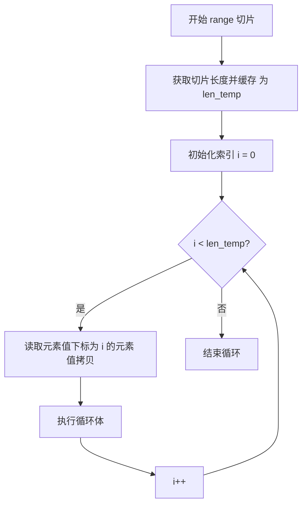
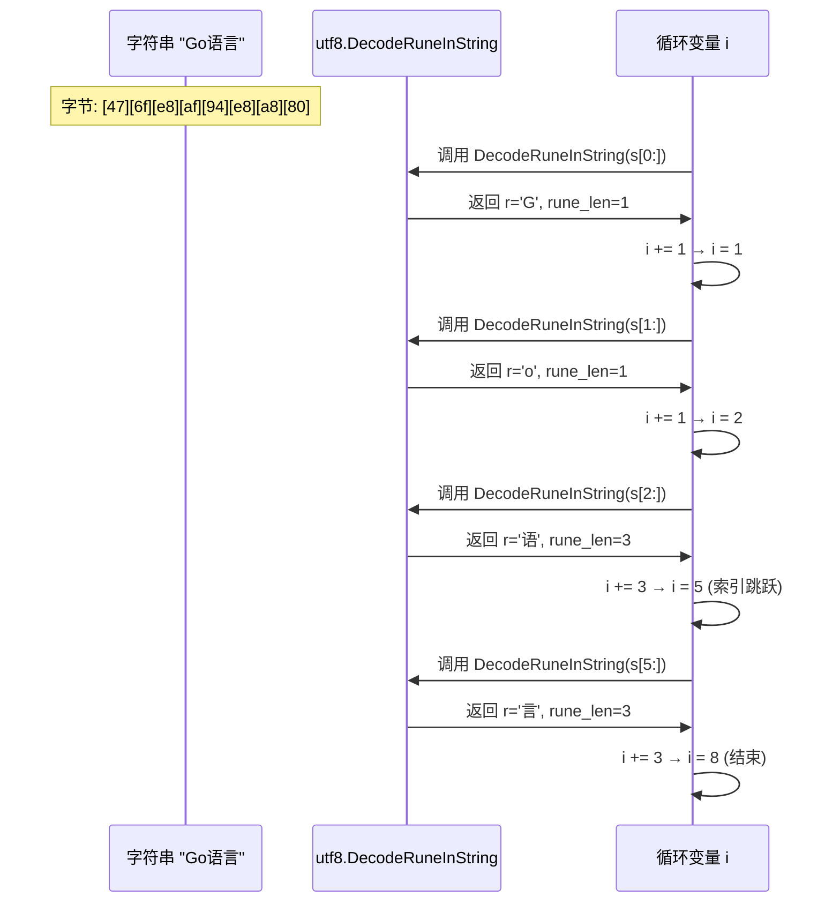
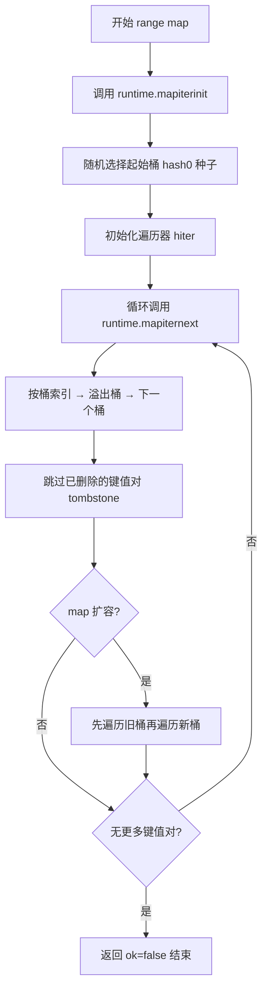
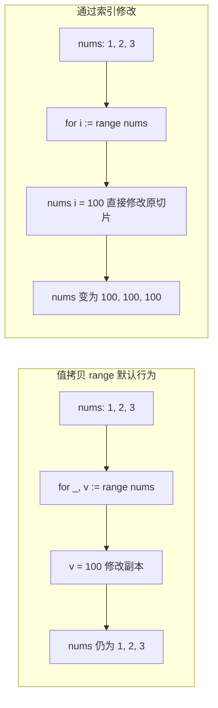

# Go 语言 range 关键字详解

Go 语言中的 `range` 关键字是**遍历可迭代数据结构**的核心语法，用于简化循环操作，支持遍历数组、切片、字符串、映射（map）、通道（channel）等类型。它会在每次迭代中返回一个或两个值（取决于遍历的类型），语法简洁且可读性高。

## 一、基本语法

`range` 通常配合 `for` 循环使用，格式为：

```go
for 变量1, 变量2 := range 可迭代对象 {
    // 循环体
}
```

- 若不需要某个返回值，可使用空白标识符 `_` 忽略
- 也可省略变量（仅遍历，不获取值）：`for range 可迭代对象 { ... }`

## 二、不同类型的遍历行为

### 1. 数组/切片（Array/Slice）

遍历数组/切片时，`range` 返回两个值：
- 第一个值：`索引`（int 类型）
- 第二个值：`对应索引的元素值`（副本，而非引用）

**示例**：

```go
package main

import "fmt"

func main() {
    nums := []int{10, 20, 30}
    
    // 遍历索引和值
    for i, v := range nums {
        fmt.Printf("索引：%d，值：%d\n", i, v)
    }
    
    // 仅遍历值（忽略索引）
    for _, v := range nums {
        fmt.Printf("值：%d\n", v)
    }
    
    // 仅遍历索引（忽略值）
    for i := range nums {
        fmt.Printf("索引：%d\n", i)
    }
    
    // 仅遍历（不获取索引/值）
    count := 0
    for range nums {
        count++
    }
    fmt.Printf("切片长度：%d\n", count) // 输出 3
}
```

**底层实现**：编译器将 `range` 转换为普通 for 循环，先缓存切片长度，再按索引遍历。



**注意**：
- 遍历切片时，`v` 是元素的副本，修改 `v` 不会改变原切片的元素
- 若遍历过程中切片扩容（底层数组替换），`range` 仍基于原切片的长度和数据遍历（因为 `range` 会先缓存切片的长度）

### 2. 字符串（string）

遍历字符串时，`range` 会按`Unicode 码点`遍历（而非字节），返回两个值：
- 第一个值：`字符的起始字节索引`（int 类型）
- 第二个值：`字符的 Unicode 码点`（rune 类型）

**示例**：

```go
package main

import "fmt"

func main() {
    str := "Go语言"
    
    // 遍历字符（处理中文等多字节字符）
    for i, c := range str {
        fmt.Printf("字节索引：%d，字符：%c（Unicode：%U）\n", i, c, c)
    }
    
    // 若直接按字节遍历（不用 range），会乱码（中文占3字节）
    for i := 0; i < len(str); i++ {
        fmt.Printf("字节索引：%d，字节值：%x\n", i, str[i])
    }
}
```

输出：

```
字节索引：0，字符：G（Unicode：U+0047）
字节索引：1，字符：o（Unicode：U+006F）
字节索引：2，字符：语（Unicode：U+8BED）
字节索引：5，字符：言（Unicode：U+8A00）
字节索引：0，字节值：47
字节索引：1，字节值：6f
字节索引：2，字节值：e8
字节索引：3，字节值：af
字节索引：4，字节值：94
字节索引：5，字节值：e8
字节索引：6，字节值：a8
字节索引：7，字节值：80
```

**底层实现**：调用 `utf8.DecodeRuneInString` 解码 UTF-8 字节序列，返回 Unicode 码点和字节长度。索引是字节位置，不是字符位置。



**注意**：
- 若字符串包含无效的 Unicode 字符，`range` 会返回 `U+FFFD`（替换字符），并跳过该字节

### 3. 映射（map）

遍历 map 时，`range` 返回两个值：
- 第一个值：`键`（key）
- 第二个值：`值`（value）

**示例**：

```go
package main

import "fmt"

func main() {
    user := map[string]int{
        "张三": 20,
        "李四": 25,
    }
    
    // 遍历键和值
    for k, v := range user {
        fmt.Printf("键：%s，值：%d\n", k, v)
    }
    
    // 仅遍历键
    for k := range user {
        fmt.Printf("键：%s\n", k)
    }
    
    // 仅遍历值
    for _, v := range user {
        fmt.Printf("值：%d\n", v)
    }
}
```

**底层实现**：调用 `runtime.mapiterinit` 初始化遍历器，然后循环调用 `runtime.mapiternext` 获取键值对。遍历顺序随机，每次运行可能不同。



**注意**：
- map 的遍历顺序是`随机的`（每次运行可能不同），Go 1.0+ 故意打乱顺序以避免依赖
- 遍历过程中可修改 map 的值，但新增/删除键可能导致遍历结果不确定
- 若 map 为 `nil`，`range` 不会触发循环（直接退出）

### 4. 通道（channel）

遍历 channel 时，`range` 仅返回`通道中的值`（无索引），且会一直阻塞直到通道关闭。

**示例**：

```go
package main

import "fmt"

func main() {
    ch := make(chan int, 2)
    ch <- 10
    ch <- 20
    close(ch) // 必须关闭通道，否则遍历会阻塞
    
    // 遍历通道值
    for v := range ch {
        fmt.Printf("通道值：%d\n", v)
    }
}
```

**注意**：
- 若通道未关闭，`range` 会一直等待接收值，导致 goroutine 泄漏
- 遍历 nil 通道会永久阻塞
- 通道遍历是`按发送顺序`接收值的

---

## 三、底层实现原理

Go 语言中 `range` 并非简单的语法糖，其底层由编译器（gc）和运行时（runtime）协同实现，不同可迭代类型的遍历逻辑差异较大，但核心是**编译器将 `range` 循环拆解为底层的基础循环逻辑 + 运行时辅助函数**（如 map/channel 遍历）。

### 1. 核心前提：编译器的"语法拆解"

`range` 是编译期特性，编译器会先将 `for ... range` 语句翻译成**普通的 for 循环 + 边界检查 + 数据读取逻辑**，而非运行时动态处理。

例如，对切片 `nums := []int{1,2,3}`，`for i, v := range nums` 会被编译器拆解为类似伪代码：

```go
// 编译器拆解后的等价逻辑
len_temp := len(nums) // 先缓存切片长度（遍历中切片扩容不影响）
i := 0
for i < len_temp {
    v := nums[i] // 拷贝元素值（所以v是副本）
    // 原循环体逻辑
    i++
}
```

关键点：
1. 遍历前会**缓存可迭代对象的长度/边界**（如切片 len、map 桶数量），遍历过程中对象的长度变化（如切片 append 扩容、map 新增键）不会影响遍历次数
2. 所有 `range` 最终都会被转为基于索引/指针的基础循环，无额外运行时开销（除 map/channel 需调用运行时函数）

### 2. 不同类型的 `range` 实现细节

#### 数组/切片：纯编译期拆解（无运行时依赖）

数组和切片的遍历是 `range` 最基础的实现，完全由编译器完成，无运行时函数调用。

**数组遍历**：
数组是值类型，编译器会优先优化：
- 若直接遍历数组（`for i, v := range arr`），编译器会先拷贝数组（值传递），再遍历拷贝后的数组（因此大数组直接遍历有性能损耗）
- 若遍历数组的切片视图（`for i, v := range arr[:]`），则跳过数组拷贝，直接遍历原数组的底层指针（推荐写法）

**切片遍历**：
切片是引用类型（底层是 `struct Slice{ptr *T, len int, cap int}`），遍历逻辑更高效：
- 编译器直接读取切片的 `ptr`（底层数组指针）、`len`（长度），无需拷贝切片
- 遍历中通过 `ptr + i` 计算元素地址，读取值（因此 `v` 是元素的副本，修改 `v` 不影响原切片）

#### 字符串：编译期 + Unicode 解码（运行时辅助函数）

字符串的遍历核心是**按 Unicode 码点解码**，而非按字节遍历，编译器会调用运行时函数 `runtime/rune.go` 中的 `utf8.DecodeRuneInString` 完成解码。

拆解后的逻辑（伪代码）：

```go
s := "Go语言"
len_temp := len(s)
i := 0
for i < len_temp {
    // 调用运行时函数解码 Unicode 字符
    r, rune_len := utf8.DecodeRuneInString(s[i:])
    // 原循环体中的 c = r，字节索引 = i
    i += rune_len // 跳过当前字符的字节数（如中文占3字节则+3）
}
```

关键点：
- 若字符是单字节（ASCII），`rune_len=1`，等价于字节遍历
- 若遇到无效 Unicode 字节序列，`r` 会被设为 `U+FFFD`（替换字符），`rune_len=1`（跳过无效字节）
- 字符串是不可变的，因此遍历中无需拷贝，直接读取原字符串的字节数组

#### Map：编译期 + 运行时桶遍历（核心依赖 runtime）

Map 的遍历是 `range` 中最复杂的实现，依赖运行时的 `map` 底层结构（哈希桶 + 溢出桶）和遍历辅助函数，核心逻辑在 `runtime/map.go` 中。

**Map 的底层结构回顾**：
Go 的 map 底层是 `hmap` 结构体，包含：
- `B`：哈希桶的数量（2^B 个桶）
- `buckets`：指向哈希桶数组的指针（每个桶是 `bmap` 结构体，存 8 个键值对）
- `oldbuckets`：扩容时的旧桶数组
- `hash0`：随机种子（决定遍历起始桶，导致遍历顺序随机）

**Map range 的核心步骤**：
编译器将 `for k, v := range m` 拆解为：

```go
// 1. 初始化遍历状态（调用 runtime.mapiterinit）
h := m // 取map的hmap指针
iter := runtime.mapiterinit(h) // 初始化遍历器，随机选起始桶

// 2. 循环遍历每个桶（调用 runtime.mapiternext）
for {
    k, v, ok := runtime.mapiternext(iter) // 读取下一个键值对
    if !ok { // 无更多键值对，退出循环
        break
    }
    // 原循环体逻辑（k、v 是当前键值对的拷贝）
}
```

**运行时核心函数解析**：
- `runtime.mapiterinit`：
  1. 若 map 为 `nil`，直接标记遍历结束
  2. 生成随机的 `hash0` 种子（决定遍历的起始桶，因此每次遍历顺序不同）
  3. 初始化遍历器 `hiter`（记录当前桶索引、溢出桶位置、已遍历的键值对数量）
- `runtime.mapiternext`：
  1. 按「桶索引 → 溢出桶 → 下一个桶」的顺序遍历
  2. 跳过已被删除的键值对（tombstone 标记）
  3. 若遍历中 map 扩容（oldbuckets 非空），会先遍历旧桶，再遍历新桶
  4. 无更多键值对时返回 `ok=false`

**关键特性的底层原因**：
- 遍历顺序随机：因为 `mapiterinit` 随机选择起始桶
- 遍历中修改值安全：键值对的内存地址固定（除非扩容），修改值只是修改内存内容
- 遍历中增/删键不确定：增键可能分配到未遍历的桶（会被遍历），删键会标记 tombstone（可能被跳过）

#### Channel：编译期 + 运行时通道操作（依赖 runtime/chan.go）

Channel 的遍历是「阻塞式接收值」的封装，编译器将 `for v := range ch` 拆解为调用运行时的通道接收函数 `runtime.chanrecv`。

**拆解后的核心逻辑（伪代码）**：

```go
// 遍历通道 ch
for {
    // 调用运行时函数接收通道值
    v, ok := runtime.chanrecv(ch, true) // true 表示阻塞接收
    if !ok { // 通道关闭且无值，退出循环
        break
    }
    // 原循环体逻辑
}
```

**运行时函数 `runtime.chanrecv` 的核心逻辑**：
1. 若通道有缓冲且缓冲区有值：直接从缓冲区取第一个值（FIFO 顺序）
2. 若通道无缓冲：阻塞等待发送方 goroutine 发送值（通过调度器挂起当前 goroutine）
3. 若通道已关闭且缓冲区为空：返回 `ok=false`，触发循环退出
4. 若通道是 `nil`：永久阻塞（goroutine 挂起，无唤醒条件）

**关键点**：
- 通道遍历无"长度缓存"：完全依赖通道的实时状态（发送/关闭）
- 遍历关闭的通道：仅读取缓冲区剩余值，读完后退出（不会阻塞）
- 无索引返回值：因为通道是单向的消息队列，仅需接收值，无需索引

### 3. 核心总结

| 类型       | 实现层级       | 核心依赖                     | 关键优化/特性                     |
|------------|----------------|------------------------------|-----------------------------------|
| 数组/切片  | 纯编译期       | 无（仅基础循环）             | 缓存长度，值拷贝                  |
| 字符串     | 编译期 + 运行时 | utf8.DecodeRuneInString       | 按 Unicode 解码，跳过无效字节     |
| Map        | 编译期 + 运行时 | mapiterinit/mapiternext       | 随机起始桶，跳过已删除键          |
| Channel    | 编译期 + 运行时 | chanrecv                     | 阻塞接收，FIFO 顺序，关闭后退出   |

### 4. 常见误区的底层原因

1. **切片遍历中修改 v 不影响原切片**：因为编译器拆解后 `v = nums[i]` 是值拷贝，而非引用
2. **map 遍历顺序随机**：`mapiterinit` 随机选择起始桶，而非按桶索引顺序
3. **range 遍历切片扩容不影响次数**：编译期已缓存 `len(nums)`，扩容仅改变切片的 cap 和底层指针，不影响缓存的 len
4. **遍历 nil map 不循环**：`mapiterinit` 检测到 hmap 指针为 nil，直接返回遍历结束

本质上，`range` 是 Go 编译器为简化遍历逻辑设计的"语法糖"，但底层完全复用了 Go 基础的内存操作（数组指针）、运行时结构（hmap/hchan）和调度逻辑（channel 阻塞），无额外抽象层开销。

---

## 四、易忽略的细节与边界场景

### 1. 易忽略的语法细节

#### 遍历"空值"的特殊行为

| 遍历对象                | range 行为                          | 示例                          |
|-------------------------|-------------------------------------|-------------------------------|
| nil 切片/数组           | 不触发循环（直接退出）              | `var s []int; for range s {}` |
| 空切片（len=0, cap>0）  | 不触发循环                          | `s := make([]int, 0, 10); for range s {}` |
| nil map                 | 不触发循环                          | `var m map[int]int; for range m {}` |
| 空 map（非 nil）        | 不触发循环                          | `m := make(map[int]int); for range m {}` |
| 关闭的空 channel        | 不触发循环                          | `ch := make(chan int); close(ch); for range ch {}` |
| nil channel             | 永久阻塞（goroutine 挂起）          | `var ch chan int; for range ch {}` |

#### 遍历"指针类型"的数组/切片

若遍历的是「数组指针」（`*[N]T`），`range` 会自动解引用，无需手动 `*arr`，且不会拷贝数组（性能最优）：

```go
package main

import "fmt"

func main() {
    arr := &[3]int{1, 2, 3} // 数组指针
    // 自动解引用，遍历原数组（无拷贝）
    for i, v := range arr {
        fmt.Printf("索引：%d，值：%d\n", i, v)
    }
}
```

这是编译器的语法糖：`range arr` 等价于 `range *arr`，但避免了数组拷贝（数组是值类型，直接遍历 `*arr` 也会拷贝，而遍历指针不会）。

#### 遍历中"重赋值迭代变量"不影响循环

`range` 的迭代变量（如 `i, v`）是**循环体外定义的单个变量**（编译器优化），每次循环仅覆盖值，而非重新声明。即使在循环体内修改迭代变量，也不会影响下一次迭代：

```go
nums := []int{1, 2, 3}
for i, v := range nums {
    i = 100 // 修改迭代变量i，不影响下一次循环的i（下一次仍为1、2）
    v = 200 // 修改v，不影响原切片
    fmt.Println(i, v) // 输出 100 200；100 200；100 200
}
fmt.Println(nums) // [1 2 3]
```

**坑点**：若在循环中捕获迭代变量（如 goroutine），会因变量复用导致所有 goroutine 共享最终值：

```go
// 错误示例：所有goroutine都打印 3（i的最终值）
nums := []int{1, 2, 3}
for i := range nums {
    go func() {
        fmt.Println(i)
    }()
}
time.Sleep(time.Second)

// 正确示例：传参捕获当前值
for i := range nums {
    go func(idx int) {
        fmt.Println(idx)
    }(i)
}
```

### 2. 性能相关的隐藏细节

#### 遍历大数组的最优写法

数组是值类型，直接 `for range arr` 会拷贝整个数组（性能极差），最优写法有两种：
- 遍历数组指针：`for range &arr`（编译器自动解引用，无拷贝）
- 遍历数组切片视图：`for range arr[:]`（切片是引用类型，仅拷贝切片头（ptr/len/cap），无数组拷贝）

#### 遍历 map 时的"提前退出"优化

`range map` 若在循环内 `break`，运行时会终止遍历，且不会遍历剩余桶（无额外开销）。但需注意：map 遍历的"进度"不会保留（下次遍历仍随机起始）。

#### 字符串遍历的性能取舍

- `range str` 按 Unicode 解码（调用 `utf8.DecodeRuneInString`），比直接按字节遍历（`for i := 0; i < len(str); i++`）慢，但能正确处理多字节字符
- 若确定字符串是纯 ASCII，直接按字节遍历更高效（避免解码开销）

### 3. 特殊场景的行为

#### 遍历"扩容中的切片"

`range` 会缓存切片的初始长度（`len`），即使遍历中切片扩容（底层数组替换），遍历次数仍以初始 `len` 为准，且遍历的是**原底层数组**的元素（扩容后的新元素不会被遍历）：

```go
nums := []int{1, 2, 3}
for i, v := range nums {
    if i == 0 {
        // 扩容：底层数组替换，len变为6
        nums = append(nums, 4, 5, 6)
    }
    fmt.Println(v) // 输出 1、2、3（仅遍历初始len=3的元素）
}
fmt.Println(nums) // [1 2 3 4 5 6]
```

#### 遍历"被修改的 map"

- **修改值**：安全，`mapiternext` 读取的是值的内存地址，修改值仅改变内存内容，不影响遍历
- **新增键**：新增的键可能被遍历到（若在未遍历的桶），也可能不被遍历到（若在已遍历的桶）
- **删除键**：已遍历的键不受影响，未遍历的键若被删除（tophash 置为 1），会被 `mapiternext` 跳过
- **清空 map**（`for k := range m { delete(m, k) }`）：可行，但遍历顺序随机，最终能清空所有键（因为每次删除后，`mapiternext` 仍会遍历剩余桶）

#### 遍历"带缓冲 channel"的顺序

`range channel` 严格按**发送顺序**接收值（FIFO），即使是带缓冲 channel，也会先读取最早发送的值，与缓冲大小无关：

```go
ch := make(chan int, 3)
ch <- 1
ch <- 2
ch <- 3
close(ch)
for v := range ch {
    fmt.Println(v) // 输出 1、2、3（严格FIFO）
}
```

---

## 五、常见注意事项与最佳实践

### 1. 值副本问题

遍历数组/切片时，`v` 是元素的副本，修改 `v` 不会影响原数据。若需修改原数据，应通过索引操作：

```go
nums := []int{1, 2, 3}
for i := range nums {
    nums[i] *= 2 // 正确：通过索引修改原切片
}
fmt.Println(nums) // [2 4 6]
```



### 2. 遍历 nil channel 导致 goroutine 泄漏

遍历 nil channel 会导致永久阻塞，进而引发 goroutine 泄漏：

```go
var ch chan int
// 以下代码会永久阻塞，导致 goroutine 泄漏
for v := range ch {
    fmt.Println(v)
}
```

**解决方案**：在使用 `range` 遍历 channel 前，确保 channel 已正确初始化或使用 select 语句处理：

```go
var ch chan int
select {
case v, ok := <-ch:
    if ok {
        fmt.Println(v)
    }
default:
    // channel 为 nil 或无数据时的处理
    fmt.Println("channel is nil or empty")
}
```

### 3. 遍历字符串时"索引跳跃"

遍历字符串时，索引会根据字符的字节长度"跳跃"，而非递增 1：

```go
str := "Go语言"
for i, c := range str {
    fmt.Printf("索引：%d，字符：%c\n", i, c)
}
// 输出：
// 索引：0，字符：G
// 索引：1，字符：o
// 索引：2，字符：语
// 索引：5，字符：言
// 注意：从索引 2 跳到 5（因为中文字符占 3 字节）
```

### 4. 遍历空对象

- 空切片/数组：`range` 不触发循环
- 空 map（非 nil）：`range` 不触发循环
- 关闭的空通道：`range` 不触发循环

### 3. 性能优化

- 遍历大数组时，建议遍历其切片（`range arr[:]`），避免数组拷贝（数组是值类型，直接遍历会拷贝整个数组）
- 遍历大 map 时，若只需键或只需值，使用单变量形式避免不必要的拷贝

### 4. break/continue

`range` 循环支持 `break`（终止循环）、`continue`（跳过当前迭代），与普通 for 循环一致。

---

## 五、进阶用法（实用但小众）

### 1. 用 `range` 实现"固定次数循环"

`range` 可以用于实现固定次数的循环，而不需要关心循环变量：

```go
// 固定循环 5 次
for range [5]struct{}{} {
    fmt.Println("Hello")
}

// 更简洁的写法（Go 1.22+）
for range 5 {
    fmt.Println("Hello")
}
```

这种写法在需要执行固定次数操作但不需要索引时非常有用，代码更简洁。

### 2. 遍历"结构体切片"时的指针优化

遍历结构体切片时，直接获取值会导致整个结构体的拷贝，对于大型结构体性能较差。可以通过获取指针来优化：

```go
type User struct {
    ID   int
    Name string
    // ... 很多字段
}

// 不推荐：每次循环都会拷贝整个 User 结构体
users := []User{{ID: 1, Name: "张三"}, {ID: 2, Name: "李四"}}
for _, user := range users {
    fmt.Println(user.Name) // 每次循环拷贝整个 User
}

// 推荐：使用指针避免拷贝
for i := range users {
    user := &users[i] // 获取指针，避免拷贝
    fmt.Println(user.Name)
}

// 或者直接存储指针切片
userPtrs := []*User{{ID: 1, Name: "张三"}, {ID: 2, Name: "李四"}}
for _, user := range userPtrs {
    fmt.Println(user.Name) // 直接使用指针，无拷贝
}
```

---

## 六、总结：容易遗漏的核心点

| 遍历类型   | 返回值1       | 返回值2       | 核心特点                     |
|------------|---------------|---------------|------------------------------|
| 数组/切片  | 索引（int）   | 元素值（副本） | 按索引遍历，长度固定         |
| 字符串     | 字节索引（int）| 字符（rune）  | 按 Unicode 码点遍历          |
| map        | 键（key）     | 值（value）   | 遍历顺序随机                 |
| channel    | 无            | 通道值        | 阻塞直到通道关闭，按发送顺序 |

`range` 是 Go 中简化遍历的核心语法，相比传统的 `for i := 0; i < len(arr); i++` 更简洁，且能适配多种数据结构，是 Go 编程中高频使用的特性。理解其底层实现和边界场景，有助于编写更高效、更可靠的 Go 代码。