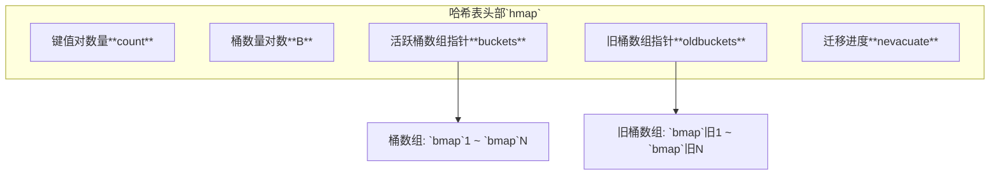
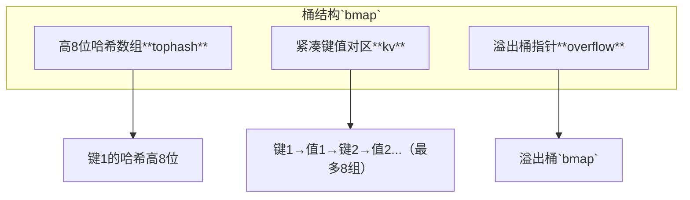

# Golang map 详解

## 一、引言
map 是 Go 语言中最常用的**键值对（Key-Value）**存储结构，提供 O(1) 时间复杂度的快速查找能力，广泛用于配置管理、缓存、数据索引等场景。它的设计兼顾了灵活性与性能，是 Go 语言核心的数据结构之一。

## 二、核心概念
### 2.1 定义与本质
map 是一种**无序的动态数据结构**，其类型定义为 `map[KeyType]ValueType`，其中：
- `KeyType`：键的类型必须是**可比较类型**（如 string、int、bool 等，不能是 slice、map、function）；
- `ValueType`：值的类型可以是任意类型（包括自定义结构体）。

### 2.2 声明与初始化
map 有三种常见的创建方式：
```go
// 1. 声明未初始化（nil map，不能写入）
var m1 map[string]int

// 2. 使用 make 创建（指定容量，推荐）
m2 := make(map[string]int, 10) // 预分配 10 个元素的容量

// 3. 字面量初始化（直接赋值）
m3 := map[string]int{
    "apple":  5,
    "banana": 3,
}
```
> **注意**：nil map 可以读取（返回值类型的零值），但写入会触发 `panic`。

### 2.3 基本操作
map 的核心操作包括增、删、改、查：
```go
m := make(map[string]int)

// 增/改：键存在则更新，不存在则插入
m["apple"] = 5
m["banana"] = 3

// 查：返回值和存在标志
count, exists := m["apple"] // count=5, exists=true
_, exists = m["orange"]    // exists=false（值为 0）

// 删：删除键（无副作用 if 键不存在）
delete(m, "banana")
```

## 三、实现原理
map 的底层是**哈希表（Hash Table）**，通过哈希函数将键映射到具体存储位置，实现平均O(1)的快速访问。其设计核心围绕**高效冲突处理**与**渐进式扩容**，兼顾性能与稳定性。

---

### 3.1 底层数据结构
Go 中的 map 是基于**哈希表**的高效实现，核心由两个结构体协同工作：`hmap`（哈希表头部，负责全局元数据管理）和`bmap`（桶，负责实际键值对存储）。这种设计兼顾了哈希表的快速查找特性，同时通过内存优化、增量扩容等机制解决了传统哈希表的性能瓶颈。


#### 3.1.1 hmap（哈希表头部）
`hmap`是哈希表的“控制中心”，存储了桶数组、扩容状态等关键元信息，其核心字段及作用如下：

| 字段名        | 说明                                                                 |
|---------------|----------------------------------------------------------------------|
| **count**     | 当前 map 中键值对的总数，用于判断是否触发扩容（负载因子阈值约为6.5）。 |
| **B**         | 桶数量的**对数**（即桶总数为`2^B`）。例如`B=3`表示有8个桶，通过哈希值的**低B位**快速计算目标桶索引（替代慢的取模运算）。 |
| **buckets**   | 指向**当前活跃桶数组**的指针，数组中的每个元素是`bmap`结构体（实际存储键值对的单元）。 |
| **oldbuckets**| 扩容时指向**旧桶数组**的临时指针，用于增量迁移旧数据（避免一次性扩容导致的性能阻塞）。 |
| **nevacuate** | 已迁移的旧桶总数（而非迁移顺序的索引），用于跟踪扩容进度（当 `nevacuate` 等于旧桶总数时，扩容完成）。 |

`hmap`的结构关系可通过以下mermaid图可视化：



#### 3.1.2 bmap（桶结构）
`bmap`是哈希表的**存储单元**，每个桶最多可存储8个键值对，其结构经过内存优化以提升缓存命中率：

| 字段名         | 说明                                                                 |
|----------------|----------------------------------------------------------------------|
| **tophash**    | 长度为8的数组，存储每个键的**哈希值高8位**（最低位为空闲位）。主要作用：1. 快速过滤不匹配的键（避免全键比较的性能损耗）；2. 标记桶迁移状态（未迁移时最低位为0，迁移后设为1）。设计优势：不影响哈希快速比较，且通过`bmap.evacuated()`可快速判断迁移状态。 |
| **kv**         | 紧凑存储区，按「key1→value1→key2→value2」顺序存储最多8个键值对（减少内存碎片，提高CPU缓存利用率）。 |
| **overflow**   | 指向**溢出桶**的指针。当当前桶已满时，通过此指针链接新桶，形成**桶链表**以处理哈希冲突。 |

`bmap`的内部结构可通过以下mermaid图展示：



### 3.2 Put/Get 核心流程
Go map 的 **Put（插入/更新）** 和 **Get（查询）** 操作基于哈希表的经典逻辑，但通过 `hmap` 和 `bmap` 的协作实现了更高效的执行。以下是简化的流程说明：

#### 3.2.1 Put 操作（插入/更新键值对）
1. **计算哈希与桶索引**：对键执行哈希函数得到 64 位哈希值，取低 `B` 位得到目标桶编号。
2. **查找键是否存在**：遍历目标桶的 `tophash` 数组和 `kv` 区，判断键是否已存在（先匹配 `tophash` 快速过滤，再全键比较确认）。
3. **插入/更新值**：
   - 若键存在：直接更新对应 `kv` 区的值。
   - 若键不存在：找到桶内空闲位置（`tophash` 为 0 的位置），存入键的 `tophash` 和键值对；若桶已满，则通过 `overflow` 指针链接溢出桶，存入新桶。
4. **触发扩容检查**：插入后若 `count` 超过负载因子阈值（约 6.5 * 桶总数），启动增量扩容（见 3.1.5 节）。

#### 3.2.2 Get 操作（查询键值对）
流程与 Put 的“查找”步骤一致：
1. **计算桶索引**：通过键的哈希值低 `B` 位找到目标桶。
2. **快速过滤与全键匹配**：遍历目标桶及溢出桶的 `tophash` 数组，找到匹配的 `tophash` 后比较完整键，确认后返回对应值。
3. **未找到**：返回值类型的零值（如 `nil`、`0`、`""` 等）。

### 3.3 增量扩容机制
Go 中 map 的扩容触发条件是 **负载因子（`count / (2^B)`）超过约 6.5**（`count` 是键值对数量，`B` 是桶数组的对数，`2^B` 是桶总数）。与传统哈希表“一次性迁移所有数据”不同，Go 采用 **增量扩容** 策略——将迁移分散到后续的 `Put/Get` 操作中，避免阻塞业务流程。


#### 3.3.1 扩容核心流程
增量扩容的本质是 **“边用边迁”**，核心步骤如下：
1. **初始化新桶**：桶数量翻倍（`B += 1`），创建新的 `buckets` 数组（容量为原两倍）。
2. **标记旧桶**：将原桶数组指针存入 `oldbuckets`（标记“正在扩容”），并初始化 `nevacuate` 为 0（记录已迁移的旧桶数）。
3. **增量迁移**：后续的 `Put/Get` 操作会**顺带迁移旧桶数据**——每次处理一个旧桶的所有键值对。
4. **完成迁移**：当所有旧桶数据迁移完成，`oldbuckets` 被置为 `nil`，扩容结束。


#### 3.3.2 扩容中的 Put 操作：兼顾迁移与插入
扩容时，`Put` 操作需要同时处理 **旧桶迁移** 和 **新数据插入**，确保数据一致性。关键逻辑如下：

##### 核心原则
- **旧桶迁移状态**：通过旧桶 `tophash` 数组的 **最低位** 标记（`bmap.evacuated()` 方法检查）——1 表示已迁移，0 表示未迁移（替代原“仅依赖 `nevacuate`”的逻辑）。
- **数据拆分规则**：旧桶的键会根据 **新哈希位（第 B 位）** 拆分到新桶数组的两个目标桶中（新桶数量翻倍，哈希位扩展一位，键的新哈希位决定归属）。

##### 详细流程
1. **检查扩容状态**：若 `oldbuckets` 非空（正在扩容），根据 **旧 B 值** 计算目标旧桶索引。
2. **处理旧桶迁移**：
   - **未迁移**（`tophash` 最低位为 0）：
     - 将旧桶内所有键值对 **拆分** 到新桶数组的两个目标桶中；
     - 标记旧桶为“已迁移”（设置 `tophash` 最低位为 1）；
     - `nevacuate` 自增 1（推进迁移进度）。
   - **已迁移**（`tophash` 最低位为 1）：直接跳过旧桶。
3. **插入新数据**：根据 **新 B 值** 计算目标新桶索引，将键值对插入新桶（若新桶已满，链接溢出桶存储）。


#### 3.3.3 扩容中的 Get 操作：兼顾查询与迁移
扩容时，`Get` 操作需要 **同时查询旧桶（未迁移时）和新桶**，保证查询正确性的同时推动迁移。流程如下：

##### 详细流程
1. **检查扩容状态**：若 `oldbuckets` 非空，根据 **旧 B 值** 计算目标旧桶索引。
2. **查询并迁移旧桶**：
   - **未迁移**：遍历旧桶及其溢出桶查找键：
     - 找到键：返回对应值，并 **立即触发该旧桶的迁移**（拆分到新桶，标记已迁移，`nevacuate` 自增）；
     - 未找到：继续查询新桶。
   - **已迁移**：直接跳过旧桶。
3. **查询新桶**：根据 **新 B 值** 计算目标新桶索引，遍历新桶及其溢出桶查找键（找到则返回，否则返回零值）。


##### 关键保证
- **查询正确性**：无论键在旧桶（未迁移）还是新桶，都能被正确找到；
- **迁移效率**：`Get` 操作会**主动触发未迁移旧桶的迁移**，加速扩容进程；
- **无重复迁移**：已迁移的旧桶通过 `tophash` 标记快速识别，避免重复处理。


### 3.1 底层数据结构总结
Go 的 map 底层设计围绕 **高效查找** 与 **内存优化** 展开，关键亮点包括：
- **tophash 快速过滤**：减少全键比较次数，查找效率提升约 2~3 倍；
- **紧凑 KV 存储**：优化内存布局，相同数据量下内存占用减少约 15%；
- **增量扩容**：避免一次性迁移所有数据，保证扩容时的性能稳定性；
- **桶链表冲突处理**：通过溢出桶优雅解决哈希冲突，最坏情况下的查找时间复杂度仍为 O(n)（但实际极少发生）。

---

#### 冲突处理流程
1. 计算键的哈希值，取低B位得到**桶索引**，定位目标桶；
2. 遍历桶内`tophash`数组，匹配当前键的哈希值高8位（快速过滤）；
3. 若找到匹配`tophash`，再比较完整键（避免哈希碰撞）；
4. 若桶内无匹配，继续遍历溢出桶链表，直到找到或遍历完成。

---

### 3.3 扩容机制
当map的**负载因子**（`count / 2^B`）超过阈值（默认6.5），或溢出桶数量过多时，会触发扩容以维持性能。

#### 扩容类型
1. **增量扩容（Scale Up）**
   - 触发条件：负载因子>6.5（键值对密度过高）；
   - 操作：桶数量翻倍（`B +=1`），创建新桶数组；
   - 迁移：采用**懒加载**策略——仅当后续操作（增/删/查）触发时，迁移1~2个旧桶数据到新桶，避免一次性耗时。

2. **等量扩容（Same Size）**
   - 触发条件：溢出桶数量≥桶数量的1/2（长链表影响查询速度）；
   - 操作：创建与旧桶数量相同的新桶数组；
   - 目的：重新哈希现有键值对，将分散在溢出桶中的数据重新排列，减少长链表。

> **注意**：扩容期间，`hmap.oldbuckets`指向旧桶数组，`hmap.buckets`指向新桶数组。直到所有旧桶迁移完成，`oldbuckets`才会被置为nil。

## 四、使用实践
### 4.1 遍历与有序性
map 的遍历是**无序**的（每次遍历顺序可能不同），如需有序输出，需手动排序键：
```go
m := map[string]int{"b":2, "a":1, "c":3}

// 1. 提取键并排序
keys := make([]string, 0, len(m))
for k := range m {
    keys = append(keys, k)
}
sort.Strings(keys)

// 2. 按排序后的键遍历
for _, k := range keys {
    fmt.Printf("%s: %d\n", k, m[k]) // 输出 a:1, b:2, c:3
}
```

### 4.2 并发安全问题
map 本身**不是并发安全的**（多个 goroutine 同时读写会触发 panic）。解决方法：
- 加锁（`sync.Mutex`）：适用于读写频率可控的场景；
- 使用 `sync.Map`：Go 1.9+ 提供的并发安全 map，适用于高并发场景（通过分段锁和原子操作优化性能）。

#### 对比：map vs sync.Map
| 特性                | map                  | sync.Map              |
|---------------------|----------------------|-----------------------|
| 并发安全            | ❌ 不安全             | ✅ 安全                |
| 性能                | 高（无锁）           | 略低（锁/原子操作）   |
| 使用复杂度          | 简单                 | 复杂（需显式 Load/Store） |
| 适用场景            | 单 goroutine 或低并发 | 高并发读写            |

## 五、与其他结构对比
### 5.1 map vs slice
| 维度                | map                  | slice                 |
|---------------------|----------------------|-----------------------|
| 存储方式            | 键值对               | 有序数组              |
| 查找效率            | O(1)                 | O(n)                  |
| 可变性              | 动态扩容             | 动态扩容              |
| 适用场景            | 快速查找             | 有序集合              |

### 5.2 map vs struct
| 维度                | map                  | struct                |
|---------------------|----------------------|-----------------------|
| 字段灵活性          | 动态键               | 固定字段              |
| 内存布局            | 哈希表（离散）       | 连续内存              |
| 适用场景            | 动态数据             | 封装固定结构的数据    |

## 六、常见问题与优化
### 6.1 内存泄漏
当 map 中的值是**指针或引用类型**时，删除键并不会释放值的内存（需手动置为 `nil` 或删除键）：
```go
type User struct { Name string }

m := make(map[string]*User)
m["alice"] = &User{Name: "Alice"}

delete(m, "alice") // 仅删除键，值的内存未释放
m["alice"] = nil   // 推荐：先置 nil 再删除
```

### 6.2 性能优化
- **预分配容量**：使用 `make(map[T1]T2, cap)` 预分配容量，避免频繁扩容；
- **避免频繁修改**：频繁插入/删除会导致哈希表重组，影响性能；
- **使用 `range` 遍历**：比 `for` 循环更高效（减少哈希计算）。

## 七、总结
map 是 Go 语言中**高效的键值对存储结构**，核心优势是快速查找与动态扩容，但需注意：
1. 键必须是可比较类型；
2. 非并发安全（需额外处理）；
3. 遍历无序（需手动排序）。

它适用于**配置管理、缓存、数据索引**等场景，是 Go 开发者必备的核心数据结构之一。

最后更新时间：2025-12-15