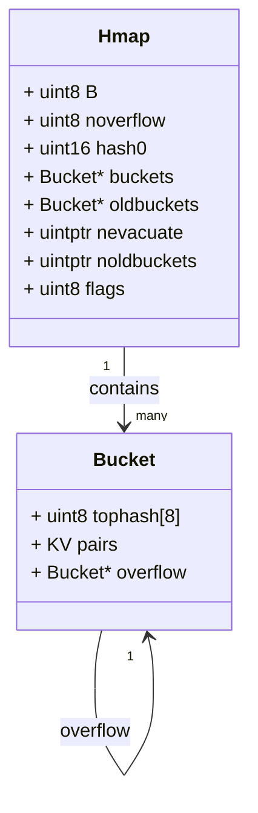
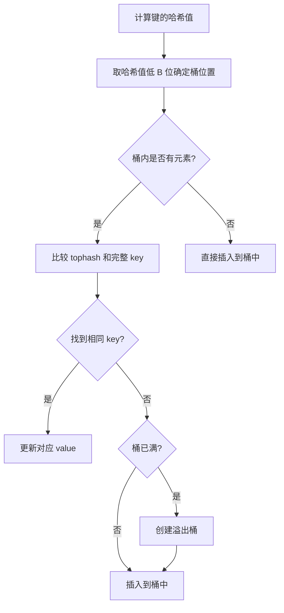
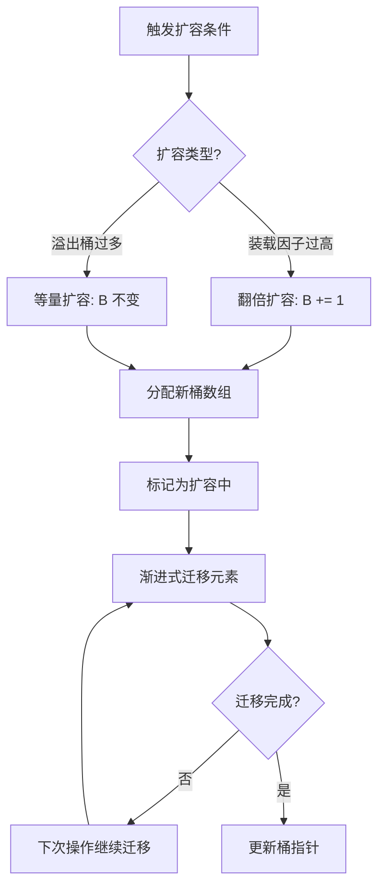
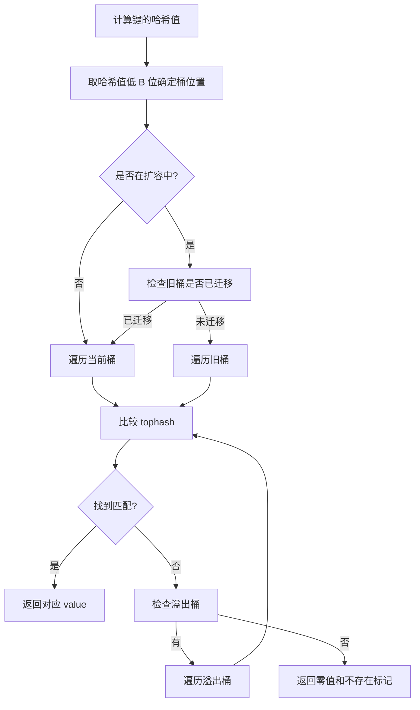

# Go Map 知识详解

## 1. 概述

Map 是 Go 语言中一种内置的**无序**键值对（key-value）数据结构，也称为关联数组或哈希表。它提供了高效的元素查找、插入和删除操作，是 Go 编程中最常用的数据结构之一。

## 2. 基本特性

- **无序性**：Map 中的元素是无序存储的，遍历顺序不固定
- **键唯一性**：每个键（key）在 Map 中必须唯一
- **动态扩容**：Map 会根据存储元素的数量自动扩容
- **引用类型**：Map 是引用类型，赋值和传递时共享底层数据

## 3. 声明、初始化与基本操作

```go
// 1. 声明 Map（初始值为 nil，无法直接使用）
var m1 map[string]int

// 2. 使用 make() 初始化
m2 := make(map[string]int)             // 初始化空 Map
m3 := make(map[string]int, 10)         // 初始化时指定容量（可选）

// 3. 使用字面量初始化
m4 := map[string]int{
    "apple":  1,
    "banana": 2,
    "cherry": 3,
}

// 4. 添加/修改元素
m4["date"] = 4           // 添加新元素
m4["apple"] = 10         // 修改已有元素

// 5. 获取元素
value := m4["apple"]      // 获取元素值（key 不存在时返回零值）

// 6. 检查 key 是否存在
if val, exists := m4["banana"]; exists {
    fmt.Printf("banana 的值: %d\n", val)
} else {
    fmt.Println("banana 不存在")
}

// 7. 删除元素
delete(m4, "cherry")       // 删除指定 key

// 8. 获取元素数量
count := len(m4)
fmt.Printf("Map 元素数量: %d\n", count)

// 9. 遍历键值对
fmt.Println("遍历所有键值对:")
for k, v := range m4 {
    fmt.Printf("%s: %d\n", k, v)
}

// 10. 只遍历键
fmt.Println("只遍历键:")
for k := range m4 {
    fmt.Println("键:", k)
}

// 11. 只遍历值
fmt.Println("只遍历值:")
for _, v := range m4 {
    fmt.Println("值:", v)
}

// 12. 常见操作技巧
// 12.1 将 Map 键转换为切片
keys := make([]string, 0, len(m4))
for k := range m4 {
    keys = append(keys, k)
}

// 12.2 将 Map 值转换为切片
values := make([]int, 0, len(m4))
for _, v := range m4 {
    values = append(values, v)
}

// 12.3 将 Map 键值对转换为切片
type KeyValue struct {
    Key   string
    Value int
}

kvPairs := make([]KeyValue, 0, len(m4))
for k, v := range m4 {
    kvPairs = append(kvPairs, KeyValue{Key: k, Value: v})
}

// 12.4 排序 Map（按键排序后遍历）
import "sort"

// 重新创建一个 Map 用于排序示例
m5 := map[string]int{
    "banana": 2,
    "apple":  1,
    "cherry": 3,
}

// 提取键并排序
sortedKeys := make([]string, 0, len(m5))
for k := range m5 {
    sortedKeys = append(sortedKeys, k)
}
sort.Strings(sortedKeys)

// 按排序后的键遍历 Map
fmt.Println("按排序后的键遍历 Map:")
for _, k := range sortedKeys {
    fmt.Printf("%s: %d\n", k, m5[k])
}

// 12.5 清空 Map
m4 = make(map[string]int)
```

> **注意**：
> - Map 遍历顺序是随机的，每次运行可能得到不同的结果
> - 当 key 不存在时，Map 会返回值类型的零值（如 int 返回 0，string 返回 ""）
> - 删除不存在的 key 不会报错
> - Go 中没有直接清空 Map 的方法，可以通过重新赋值一个新的 Map 实现
> - 初始化 Map 时指定合适的容量可以减少扩容操作，提高性能：
>   ```go
>   // 预估需要存储 1000 个元素
>   m := make(map[string]int, 1000)
>   ```
> - 频繁扩容会导致性能下降，应尽量避免

## 4. Key 类型限制

不是所有类型都可以作为 Map 的键，Go 中要求键类型必须是**可比较的（comparable）**类型。

### 4.1 Key 类型要求

**允许作为 Key 的类型：**
- 基本类型：`bool`、`int`、`int8`、`int16`、`int32`、`int64`、`uint`、`uint8`、`uint16`、`uint32`、`uint64`、`uintptr`、`float32`、`float64`、`complex64`、`complex128`、`string`
- 复合类型：`pointer`、`channel`、`interface{}`
- 结构体类型（如果所有字段都是可比较的）

**不允许作为 Key 的类型：**
- `slice`
- `map`
- `function`

### 4.2 特殊类型注意事项

**结构体作为 Key：** 结构体作为键时，需要确保所有字段都是可比较的类型，比较时会逐字段比较。

**浮点数作为 Key：** 浮点数由于精度问题可能导致意外行为，例如 0.1 + 0.2 不等于 0.3，应谨慎使用浮点数作为键。

### 4.3 键类型性能考量

选择合适的键类型可以提高哈希计算和比较的效率：

- **优先使用基本类型作为键**：如 `int`、`string` 等，这些类型的哈希计算和比较效率较高
- **避免使用复杂的结构体作为键**：结构体的比较需要逐字段比较，效率较低
- **谨慎使用浮点数作为键**：除了精度问题外，浮点数的哈希计算也相对较慢

## 5. Value 类型

Map 的值可以是任意类型，包括复合类型：
- 基本类型：`int`、`string`、`bool` 等
- 复合类型：`struct`、`slice`、`map` 等
- 接口类型：`interface{}`

## 6. Map 作为函数参数

Map 是引用类型，作为函数参数传递时，函数内部对 Map 的修改会影响原始 Map：

```go
func updateMap(m map[string]int) {
    m["apple"] = 100
}

func main() {
    m := map[string]int{"apple": 1}
    updateMap(m)
    fmt.Println(m["apple"]) // 输出: 100
}
```

## 7. Map 实现原理

### 7.1 底层结构

Go 中的 Map 采用**哈希查找表**实现，主要包含以下核心组件：



- **Hmap**：Map 的顶层结构，包含所有控制信息
  - `B`：桶数量的对数（桶数量为 2^B）
  - `buckets`：指向当前桶数组的指针
  - `oldbuckets`：扩容时指向旧桶数组的指针
  - `nevacuate`：渐进式扩容时已迁移的桶数量

- **Bucket**：存储键值对的基本单元
  - `tophash`：存储哈希值的高 8 位，用于快速比较
  - 每个桶可存储 8 个键值对
  - `overflow`：指向溢出桶的指针

### 7.2 哈希冲突解决

Go Map 使用**链式地址法**解决哈希冲突：



具体流程：
1. 对键进行哈希计算得到 64 位哈希值
2. 取哈希值的低 B 位确定桶的位置
3. 取哈希值的高 8 位作为 tophash 存储在桶中
4. 遍历桶内元素，比较 tophash 和完整 key
5. 若找到相同 key 则更新值，否则插入到桶或溢出桶中

### 7.3 扩容机制

Map 会在以下情况自动扩容：

1. **装载因子过高**：当元素数量超过桶数量的 6.5 倍时
2. **溢出桶过多**：当溢出桶数量过多导致性能下降时



扩容采用**渐进式**策略：
- 不会一次性迁移所有元素
- 在每次 Map 操作（put、delete、get）时迁移部分桶
- 迁移一个桶时会将该桶及其所有溢出桶的元素迁移到新桶

### 7.4 查找流程



## 8. 线程安全性

Go 的 Map **不是线程安全**的，并发读写可能导致程序崩溃。

### 8.1 线程安全解决方案

有三种主要方式实现线程安全的 Map：

1. **互斥锁（sync.Mutex）**：使用互斥锁保护 Map 的所有操作
2. **读写锁（sync.RWMutex）**：读操作使用读锁，写操作使用写锁，提高并发读性能
3. **sync.Map**：Go 1.9+ 提供的并发安全 Map 实现，适用于读多写少的场景

> **说明**：有关线程安全 Map 的详细实现和性能对比，将在后续专门文档中详细阐述。


## 9. 常见问题与注意事项（Q&A）

Q1: 什么是 nil Map？使用 nil Map 会发生什么？

A: nil Map 是指声明但未初始化的 Map。nil Map 可以读取（返回零值），但不能写入，尝试写入会导致运行时 panic：
```go
var m map[string]int
m["key"] = 1 // panic: assignment to entry in nil map
```

Q2: 为什么无法获取 Map 中元素的地址？

A: 因为 Map 会自动扩容并重新组织元素，元素的位置可能会发生变化，因此 Go 语言不允许获取 Map 中元素的地址：
```go
m := map[string]int{"key": 1}
// &m["key"] // 错误：cannot take address of m["key"]
```

Q3: Map 会导致内存泄漏吗？如何避免？

A: 如果 Map 中的值包含指向大量内存的指针，即使 Map 不再使用这些键值对，也需要显式删除它们以释放内存。Go 语言的垃圾回收器无法自动识别不再使用的 Map 值：
```go
// 显式删除不再使用的键值对
delete(m, "key")
```

Q4: Map 是线程安全的吗？如何实现线程安全的 Map？

A: Go 的原生 Map 不是线程安全的，并发读写会导致 panic。实现线程安全的 Map 有三种方式：使用互斥锁（sync.Mutex）、读写锁（sync.RWMutex）或 sync.Map（适用于读多写少的场景）。

Q5: Map 的遍历顺序是固定的吗？

A: 不是，Map 的遍历顺序是随机的，每次运行可能得到不同的结果。这是 Go 语言设计的一部分，旨在避免开发者依赖遍历顺序。

Q6: 如何检查 Map 中是否存在某个键？

A: 可以使用多返回值的方式检查键是否存在：
```go
if val, exists := m["key"]; exists {
    fmt.Println("键存在，值为:", val)
} else {
    fmt.Println("键不存在")
}
```

Q7: 如何高效地清空一个 Map？

A: Go 语言中没有直接清空 Map 的方法，可以通过重新赋值一个新的 Map 实现：
```go
// 清空 Map
m = make(map[string]int)
```

Q8: 使用浮点数作为 Map 的键需要注意什么？

A: 浮点数由于精度问题可能导致意外行为，例如 0.1 + 0.2 不等于 0.3，应谨慎使用浮点数作为键。


