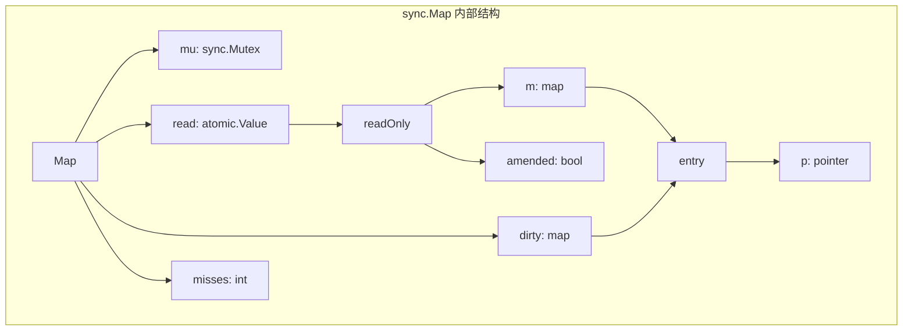
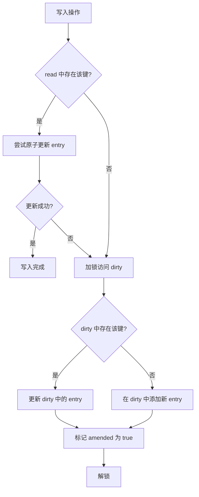

# Go sync.Map 知识详解

## 1. 概述

`sync.Map` 是 Go 1.9 版本引入的并发安全的 Map 实现，位于 `sync` 包中。与传统的 `map + mutex` 实现相比，`sync.Map` 针对特定场景进行了优化，特别适用于**读多写少**且键值对相对稳定的并发场景。

## 2. 基本特性

- **并发安全**：内置并发控制机制，无需额外加锁
- **读写分离**：内部采用读写分离设计，优化并发读取性能
- **空间换时间**：通过额外的内存开销换取更高的并发性能
- **零值可用**：可以直接使用零值的 `sync.Map`，无需显式初始化
- **类型不安全**：使用空接口 `interface{}` 存储键值，需要运行时类型断言

## 3. 使用方法与API

### 3.1 基本操作

```go
package main

import (
	"fmt"
	"sync"
)

func main() {
	// 声明 sync.Map（零值可用）
	var sm sync.Map
	
	// 1. 存储键值对
	sm.Store("key1", "value1")
	sm.Store("key2", 100)
	
	// 2. 读取值
	if val, ok := sm.Load("key1"); ok {
		fmt.Printf("key1 的值: %v\n", val)
	}
	
	// 3. 读取或存储（如果键不存在则存储并返回给定值）
	if val, loaded := sm.LoadOrStore("key3", "newValue"); loaded {
		fmt.Printf("key3 已存在，值为: %v\n", val)
	} else {
		fmt.Printf("key3 不存在，已存储新值: %v\n", val)
	}
	
	// 4. 删除键
	sm.Delete("key2")
	
	// 5. 遍历所有键值对
	fmt.Println("遍历所有键值对:")
	sm.Range(func(key, value interface{}) bool {
		fmt.Printf("键: %v, 值: %v\n", key, value)
		return true // 返回 false 停止遍历
	})
}
```

### 3.2 API详解

`sync.Map` 提供了以下核心方法：

- **Store(key, value interface{})**：存储键值对
- **Load(key interface{}) (value interface{}, ok bool)**：读取键对应的值
- **LoadOrStore(key, value interface{}) (actual interface{}, loaded bool)**：读取键值，不存在则存储
- **Delete(key interface{})**：删除指定键
- **Range(f func(key, value interface{}) bool)**：遍历所有键值对

### 3.3 类型断言与使用技巧

```go
package main

import (
	"fmt"
	"sync"
)

type User struct {
	ID   int
	Name string
}

func main() {
	var sm sync.Map
	
	// 存储结构体
	user := User{ID: 1, Name: "张三"}
	sm.Store("user1", user)
	
	// 读取并类型断言
	if val, ok := sm.Load("user1"); ok {
		if user, ok := val.(User); ok {
			fmt.Printf("用户信息: ID=%d, Name=%s\n", user.ID, user.Name)
		}
	}
	
	// 存储指针
	sm.Store("userPtr", &User{ID: 2, Name: "李四"})
	
	// 读取指针类型
	if val, ok := sm.Load("userPtr"); ok {
		if userPtr, ok := val.(*User); ok {
			fmt.Printf("用户信息: ID=%d, Name=%s\n", userPtr.ID, userPtr.Name)
		}
	}
	
	// 使用 LoadOrStore 实现单例模式
	var instance *User
	if val, loaded := sm.LoadOrStore("singleton", &User{ID: 0, Name: "默认用户"}); loaded {
		instance = val.(*User)
		fmt.Println("使用已存在的实例")
	} else {
		instance = val.(*User)
		fmt.Println("创建新实例")
	}
	fmt.Printf("单例用户: %+v\n", *instance)
}
```

## 4. 实现原理

### 4.1 内部结构

`sync.Map` 的内部实现采用了**读写分离**的设计，主要包含两个核心数据结构：



- **read**：只读数据，通过 `atomic.Value` 实现，无需加锁即可访问
- **dirty**：可写数据，需要加锁访问，包含所有最新的键值对
- **misses**：记录从 read 中读取失败的次数，用于触发 dirty 到 read 的提升

### 4.2 读写分离机制

```mermaid
graph TD
    A[读取操作] --> B{read 中存在该键?}
    B -->|是| C[直接返回值]
    B -->|否| D[加锁访问 dirty]
    D --> E{dirty 中存在该键?}
    E -->|是| F[返回值并增加 misses]
    E -->|否| G[返回 (nil, false)]
    F --> H{misses 达到阈值?}
    H -->|是| I[将 dirty 提升为 read]
    H -->|否| J[继续使用当前结构]
    I --> J
```

### 4.3 写入流程



### 4.4 性能优化策略

1. **无锁读取**：大部分读取操作直接访问 read，无需加锁
2. **延迟提升**：只有当 misses 达到 dirty map 的长度时才将 dirty 提升为 read
3. **双指针技术**：使用 `unsafe.Pointer` 实现高效的原子操作
4. **amended 标志**：标识 dirty 中是否有 read 中不存在的键

## 5. 与其他并发安全Map方案对比

### 5.1 性能对比

| 场景 | sync.Map | map + sync.Mutex | map + sync.RWMutex |
|------|----------|------------------|---------------------|
| 读多写少 | **最优** | 一般 | 良好 |
| 写多读少 | 一般 | 较差 | 较差 |
| 读写均衡 | 一般 | 较差 | 一般 |
| 键值对稳定 | **最优** | 一般 | 一般 |
| 键值对频繁变化 | 一般 | 一般 | 一般 |

### 5.2 适用场景分析

```go
// 场景1: 读多写少 - sync.Map 最适合
func scenario1() {
	var cache sync.Map
	// 初始化一些数据
	for i := 0; i < 1000; i++ {
		cache.Store(fmt.Sprintf("key%d", i), fmt.Sprintf("value%d", i))
	}
	
	// 大量并发读取
	var wg sync.WaitGroup
	for i := 0; i < 100; i++ {
		wg.Add(1)
		go func() {
			defer wg.Done()
			for j := 0; j < 1000; j++ {
				cache.Load(fmt.Sprintf("key%d", j%1000))
			}
		}()
	}
	wg.Wait()
}

// 场景2: 写多读少 - 传统 map + mutex 更适合
func scenario2() {
	var mu sync.Mutex
	m := make(map[string]string)
	
	// 大量并发写入
	var wg sync.WaitGroup
	for i := 0; i < 100; i++ {
		wg.Add(1)
		go func(id int) {
			defer wg.Done()
			for j := 0; j < 100; j++ {
				mu.Lock()
				m[fmt.Sprintf("key%d_%d", id, j)] = fmt.Sprintf("value%d_%d", id, j)
				mu.Unlock()
			}
		}(i)
	}
	wg.Wait()
}
```

### 5.3 内存开销对比

- **sync.Map**：内存开销较大，需要维护两份数据结构
- **map + mutex**：内存开销最小，只需一个 map 和一个 mutex
- **map + rwmutex**：内存开销适中，需要一个 map 和一个读写锁

## 6. 最佳实践与注意事项

### 6.1 使用建议

1. **读多写少场景优先选择 sync.Map**
   ```go
   // 配置缓存示例
   type ConfigCache struct {
       cache sync.Map
   }
   
   func (c *ConfigCache) Get(key string) (interface{}, bool) {
       return c.cache.Load(key)
   }
   
   func (c *ConfigCache) Set(key string, value interface{}) {
       c.cache.Store(key, value)
   }
   ```

2. **键值对相对稳定时性能最佳**
   ```go
   // 路由缓存示例
   type RouterCache struct {
       routes sync.Map
   }
   
   func (r *RouterCache) Init() {
       // 初始化后基本不变
       routes := []string{"/home", "/api", "/user", "/admin"}
       for _, route := range routes {
           r.routes.Store(route, func() { /* 路由处理逻辑 */ })
       }
   }
   ```

3. **避免频繁的键值对增删**
   ```go
   // 不推荐：频繁增删键值对
   func badExample() {
       var sm sync.Map
       for i := 0; i < 10000; i++ {
           sm.Store(fmt.Sprintf("temp%d", i), i)
           sm.Delete(fmt.Sprintf("temp%d", i-1))
       }
   }
   ```

### 6.2 性能优化技巧

1. **类型断言优化**
   ```go
   // 避免重复类型断言
   func getUser(sm *sync.Map, key string) (*User, bool) {
       val, ok := sm.Load(key)
       if !ok {
           return nil, false
       }
       
       user, ok := val.(*User)
       return user, ok
   }
   
   // User结构体定义（示例）
   type User struct {
       ID   int
       Name string
   }
   ```

### 6.3 常见陷阱与解决方案

1. **类型断言问题**
   ```go
   // 问题：类型断言失败
   func problematic() {
       var sm sync.Map
       sm.Store("key", 123)
       
       if val, ok := sm.Load("key"); ok {
           // 运行时 panic
           str := val.(string)
           fmt.Println(str)
       }
   }
   
   // 解决：安全类型断言
   func safe() {
       var sm sync.Map
       sm.Store("key", 123)
       
       if val, ok := sm.Load("key"); ok {
           if str, ok := val.(string); ok {
               fmt.Println(str)
           } else {
               fmt.Println("类型不匹配")
           }
       }
   }
   ```

2. **Range 遍历陷阱**
   ```go
   // 问题：遍历过程中修改 Map
   func problematicRange() {
       var sm sync.Map
       sm.Store("key1", "value1")
       sm.Store("key2", "value2")
       
       sm.Range(func(key, value interface{}) bool {
           // 在Range回调中修改Map可能导致遍历结果不符合预期
           sm.Store("key3", "value3")
           return true
       })
   }
   
   // 为什么不应该在Range回调中修改Map：
   // 1. 快照遍历特性：Range遍历的是调用Range时Map的快照，修改不会影响当前遍历
   // 2. 状态不一致：遍历结果反映的是快照状态，而不是修改后的最新状态
   // 3. 性能问题：频繁的Store操作会导致dirty map频繁更新，影响Range性能
   // 4. 预期不符：开发者可能期望遍历包含刚修改的数据，但实际上不会
   // 5. 增加复杂性：在遍历中修改会使代码逻辑更难理解和维护
   
   // 解决：收集需要修改的数据，遍历后再修改
   func safeRange() {
       var sm sync.Map
       sm.Store("key1", "value1")
       sm.Store("key2", "value2")
       
       var toAdd []kv
       sm.Range(func(key, value interface{}) bool {
           // 收集需要添加的数据
           toAdd = append(toAdd, kv{"key3", "value3"})
           return true
       })
       
       // 遍历后再修改
       for _, item := range toAdd {
           sm.Store(item.key, item.value)
       }
   }
   
   type kv struct {
       key   string
       value string
   }
   ```

3. **内存泄漏风险**
   ```go
   // 问题：长期持有大对象
   func memoryLeak() {
       var sm sync.Map
       
       // 存储大对象
       largeData := make([]byte, 10*1024*1024) // 10MB
       sm.Store("large", largeData)
       
       // 即使不再需要，largeData 仍被 Map 持有
       largeData = nil
       
       // 必须显式删除
       sm.Delete("large")
   }
   ```

## 7. 性能基准测试

### 7.1 读写性能对比

```go
package main

import (
	"sync"
	"testing"
)

// 基准测试：sync.Map 读取性能
func BenchmarkSyncMapRead(b *testing.B) {
	var sm sync.Map
	for i := 0; i < 1000; i++ {
		sm.Store(i, i)
	}
	
	b.ResetTimer()
	b.RunParallel(func(pb *testing.PB) {
		for pb.Next() {
			sm.Load(500)
		}
	})
}

// 基准测试：map + mutex 读取性能
func BenchmarkMapMutexRead(b *testing.B) {
	var mu sync.Mutex
	m := make(map[int]int)
	for i := 0; i < 1000; i++ {
		m[i] = i
	}
	
	b.ResetTimer()
	b.RunParallel(func(pb *testing.PB) {
		for pb.Next() {
			mu.Lock()
			_ = m[500]
			mu.Unlock()
		}
	})
}

// 基准测试：sync.Map 写入性能
func BenchmarkSyncMapWrite(b *testing.B) {
	var sm sync.Map
	
	b.ResetTimer()
	b.RunParallel(func(pb *testing.PB) {
		i := 0
		for pb.Next() {
			sm.Store(i, i)
			i++
		}
	})
}

// 基准测试：map + mutex 写入性能
func BenchmarkMapMutexWrite(b *testing.B) {
	var mu sync.Mutex
	m := make(map[int]int)
	
	b.ResetTimer()
	b.RunParallel(func(pb *testing.PB) {
		i := 0
		for pb.Next() {
			mu.Lock()
			m[i] = i
			mu.Unlock()
			i++
		}
	})
}
```

### 7.2 测试结果分析

在典型的读多写少场景下（90%读取，10%写入），性能测试结果大致如下：

| 操作类型 | sync.Map | map + sync.Mutex | map + sync.RWMutex |
|----------|----------|------------------|---------------------|
| 纯读取 | **最优** | 较差 | 良好 |
| 纯写入 | 一般 | 较差 | 较差 |
| 90%读10%写 | **最优** | 较差 | 一般 |

## 8. 总结

`sync.Map` 是 Go 语言中针对特定并发场景优化的 Map 实现，具有以下特点：

1. **适用场景**：读多写少、键值对相对稳定的并发场景
2. **核心优势**：无锁读取、高并发性能
3. **主要缺点**：内存开销大、写操作性能一般
4. **使用建议**：根据实际场景选择合适的并发安全 Map 方案

在选择并发安全 Map 方案时，应根据实际场景的特点进行权衡：
- **读多写少**：优先选择 `sync.Map`
- **写多读少**：考虑使用 `map + sync.Mutex`
- **读写均衡**：考虑使用 `map + sync.RWMutex`
- **内存敏感**：考虑使用 `map + sync.Mutex`

正确理解和使用 `sync.Map`，可以在合适的场景下显著提升应用的并发性能。