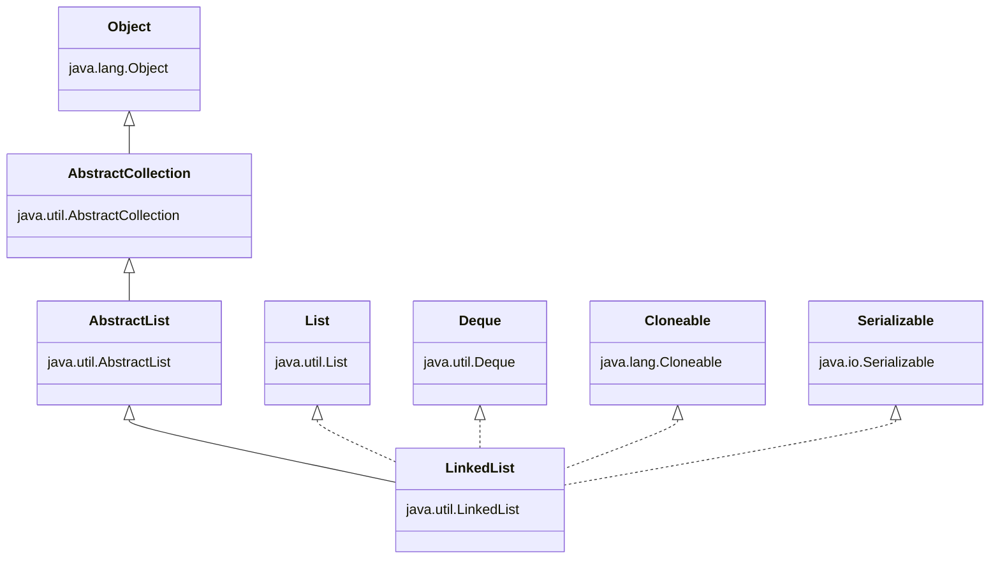

# LinkedList

## 一、基础认知

### 1.1 官方定义

LinkedList 是Java集合框架中`List`接口和`Deque`接口的实现类，基于**双向链表**数据结构实现，同时具备线性表和双端队列的特性。

### 1.2 核心结构

双向链表：每个节点（Node）包含三个部分：

- `prev`：指向前驱节点的引用

- `item`：存储当前节点的数据

- `next`：指向后继节点的引用

LinkedList 内部维护两个哨兵节点（头节点 head、尾节点 tail），简化边界操作，无需处理 null 指针问题。

**核心特点**：内存存储不连续，节点间通过引用关联，查询需整体遍历，增删效率高（尤其是首尾）。

### 1.3 类继承关系


关键实现接口：List<E>、Deque<E>、Cloneable、Serializable（支持克隆和序列化）

---

## 二、核心原理
### 2.1 线程安全性

LinkedList是**非线程安全**的集合类！

- 多线程环境下直接使用可能出现ConcurrentModificationException（并发修改异常）

- 解决方案：<br/>
    ① 手动加锁（synchronized/Lock）；<br/>
    ② 使用 Collections.synchronizedList() 包装；<br/>
    ③ 改用线程安全类 CopyOnWriteArrayList（增删效率低，按需选择）<br/>

### 2.2 序列化支持

实现Serializable接口，通过transient修饰head和tail节点，自定义writeObject()和readObject()方法实现序列化（避免序列化哨兵节点，仅序列化有效数据节点）。

---

## 三、常用API

### 3.1 初始化方法

```java

// 1. 空构造（常用）
LinkedList<String> list = new LinkedList<>();

// 2. 用已有的集合初始化
List<String> srcList = Arrays.asList("a", "b", "c");
LinkedList<String> list2 = new LinkedList<>(srcList);
```

### 3.2 增删操作（核心，分List和Deque视角）

#### 3.2.1 作为List的增删（指定位置/尾部）

```java

// 1. 尾部添加（常用）
list.add("a"); // 成功返回true
list.addLast("b"); // 等同于add()，Deque方法

// 2. 指定索引添加（效率低，需遍历到索引位置）
list.add(1, "c"); // 索引1处插入"c"，后续元素后移

// 3. 头部添加（Deque方法，效率高）
list.addFirst("d"); 

// 4. 删除操作
list.remove(2); // 删除索引2的元素，返回被删元素
list.remove("a"); // 删除第一个等于"a"的元素，返回boolean
list.removeFirst(); // 删除头部元素，返回被删元素
list.removeLast(); // 删除尾部元素，返回被删元素

// 5. 批量添加/删除
list.addAll(srcList); // 尾部批量添加
list.addAll(1, srcList); // 指定索引批量添加
list.clear(); // 清空所有元素
```

#### 3.2.2 作为Deque的操作（双端队列，支持栈/队列模式）

```java

// 队列模式（FIFO：先进先出）
list.offer("a"); // 尾部添加，队列满时返回false（区别于add抛异常）
list.poll(); // 头部删除并返回，空时返回null（区别于remove抛异常）
list.peek(); // 查看头部元素，空时返回null（区别于element抛异常）

// 栈模式（LIFO：后进先出）
list.push("a"); // 头部添加（等同于addFirst()）
list.pop(); // 头部删除（等同于removeFirst()）
list.peek(); // 查看头部元素（同队列）

// 双端操作（首尾均可增删）
list.offerFirst("a"); // 头部添加
list.offerLast("b"); // 尾部添加
list.pollFirst(); // 头部删除
list.pollLast(); // 尾部删除
list.peekFirst(); // 查看头部
list.peekLast(); // 查看尾部
```

### 3.3 查询操作（效率低，需注意）

```java

// 1. 获取指定索引元素（遍历链表，O(n)）
String elem = list.get(2); 
list.getFirst(); // 获取头部元素（O(1)）
list.getLast(); // 获取尾部元素（O(1)）

// 2. 查找元素位置
int index = list.indexOf("a"); // 从头部开始找，返回第一个匹配的索引，无则-1
int lastIndex = list.lastIndexOf("a"); // 从尾部开始找

// 3. 判断是否包含元素
boolean has = list.contains("a");

// 4. 获取集合大小
int size = list.size();
```

### 3.4 遍历操作（四种常用方式）

```java

// 1. 增强for循环（推荐，简洁）
for (String s : list) {
    System.out.println(s);
}

// 2. 迭代器（支持删除，避免并发修改异常）
Iterator<String> iter = list.iterator();
while (iter.hasNext()) {
    String s = iter.next();
    if ("a".equals(s)) {
        iter.remove(); // 迭代器删除，安全
    }
}

// 3. 普通for循环（不推荐，每次get(i)都遍历链表，O(n²)）
for (int i = 0; i < list.size(); i++) {
    System.out.println(list.get(i));
}

// 4. 降序迭代（Deque特性）
Iterator<String> descIter = list.descendingIterator();
while (descIter.hasNext()) {
    System.out.println(descIter.next());
}
```

**警告**：避免用普通for循环遍历LinkedList！每次get(i)都会从头部或尾部开始遍历（取较近的一端），遍历整个集合时间复杂度为O(n²)，效率极低。

---

## 四、常见问题与易错点

### 4.1 并发修改异常（ConcurrentModificationException）

**场景**：遍历集合时用集合自身的remove()方法删除元素（如增强for循环中调用list.remove()）。

**原因**：迭代器有modCount（修改次数）检查，集合自身修改会导致modCount变化，与迭代器的expectedModCount不一致。

**解决方案**：<br/>
  ① 用迭代器的remove()方法；<br/>
  ② 用普通for循环（不推荐，但可行）；<br/>
  ③ 用Stream的filter过滤（创建新集合）。<br/>

### 4.2 索引越界异常（IndexOutOfBoundsException）

**场景**：get(index)、add(index, elem) 时 index 为负数或 ≥ size。

**避免**：操作前先判断 index 范围，或用 size() 方法确认集合大小。

### 4.3 误用 LinkedList 做随机访问

**问题**：因 LinkedList 不支持随机访问，频繁调用 get(i) 会导致效率极低。

**替代方案**：需随机访问时改用 ArrayList；若必须用 LinkedList，可先转为数组（list.toArray()）再访问。

### 4.4 克隆特性

LinkedList 的 clone() 是**浅克隆**：仅复制链表结构，节点存储的对象引用不变（若对象是可变的，修改克隆后的集合会影响原集合）。

---

## 五、核心总结

- **结构**：双向链表，首尾操作 O(1)，随机访问 O(n)。

- **特性**：实现 List + Deque，支持队列/栈，非线程安全，浅克隆。

- **适用**：频繁增删（首尾最优），不适合随机访问。

- **避坑**：遍历用迭代器/增强for，避免并发修改；不做随机访问；多线程需同步。