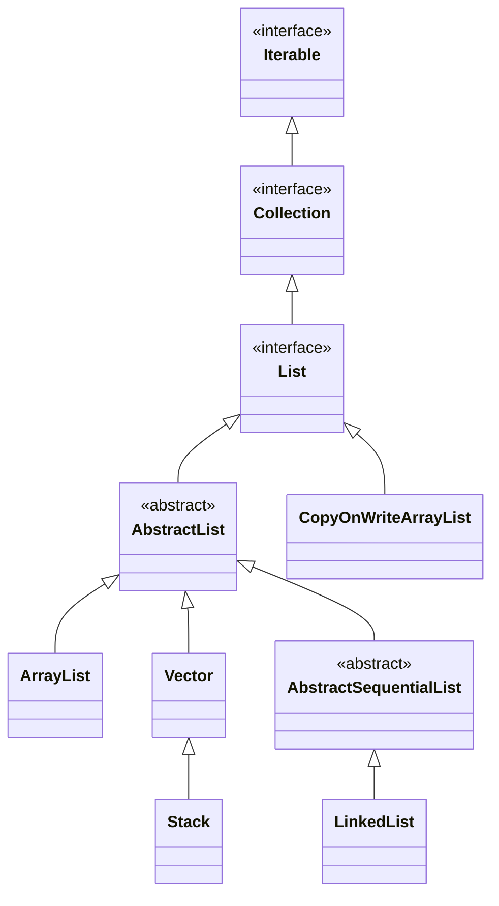

# Java List

## 定义与特性

List 接口继承自 Collection 接口，代表**有序的元素序列**。具有以下关键特性：
- **有序性**：元素按照插入顺序保持排列
- **可重复性**：允许存储重复元素
- **随机访问**：支持通过索引（0-based）直接访问元素
- **丰富的操作**：提供专门针对位置的插入、删除和查找方法

## 继承关系

以下是List接口的继承体系：



> **注意**：Stack已被弃用，推荐使用Deque接口的实现类（如ArrayDeque）替代。

## 核心方法

```java
// List特有操作（部分）
E get(int index);                    // 获取指定位置元素
E set(int index, E element);         // 设置指定位置元素
void add(int index, E element);      // 在指定位置插入元素
E remove(int index);                 // 删除指定位置元素
int indexOf(Object o);               // 返回元素首次出现位置
int lastIndexOf(Object o);           // 返回元素最后出现位置
ListIterator<E> listIterator();      // 获取列表迭代器
ListIterator<E> listIterator(int index); // 从指定位置开始的迭代器
List<E> subList(int fromIndex, int toIndex); // 获取子列表
```

## 主要实现类对比

| 比较维度 | **ArrayList** | **LinkedList** | **Vector** | **CopyOnWriteArrayList** |
|---------|-------------|--------------|----------|------------------------|
| 底层实现 | 动态数组 | 双向链表 | 动态数组 | 写时复制数组 |
| 核心特性 | 非线程安全 | 非线程安全 | 线程安全（已弃用） | 线程安全 |
| 读性能 | 高（O(1)） | 中（O(n)） | 中（同步开销） | 高（无锁） |
| 写性能 | 低-中（末尾O(1)，中间O(n)） | 高（O(1)定位后） | 低（同步+扩容） | 低（O(n)复制） |
| 一致性 | 无保证 | 无保证 | 强一致性 | 最终一致性 |
| 内存效率 | 中（可能有空余空间） | 低（每个节点额外开销） | 中（可能有空余空间） | 低（写操作占用双倍空间） |
| 扩容方式 | 1.5倍增长 | 无需扩容 | 2倍增长 | 无需扩容 |
| 适用场景 | 频繁随机访问，较少修改操作的场景 | 频繁插入删除，特别是首尾操作 | 频繁随机访问，较少修改操作的场景（不推荐） | 读多写少的并发环境 |