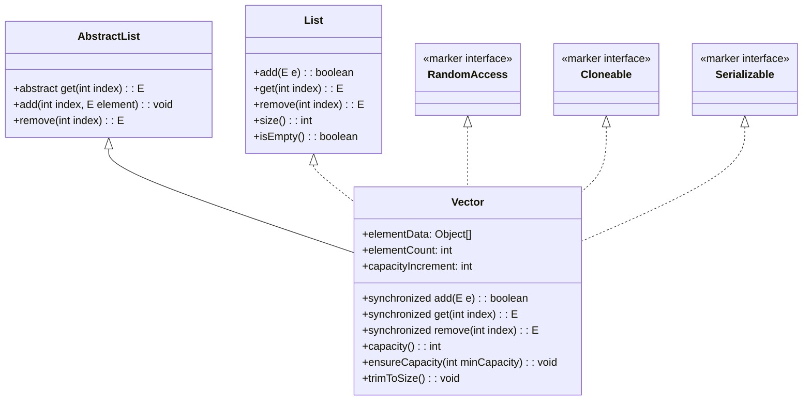

# Vector

## 一、 概述

### 1.1 基本定义

Vector 是 Java 集合框架中 `java.util` 包下的一个**动态数组容器**，诞生于 JDK 1.0，是早期集合框架的重要成员。其类继承与实现关系如下：


注：上述类图清晰展示了 Vector 的继承父类（AbstractList）、实现的接口及核心成员变量与方法，其中 RandomAccess、Cloneable、Serializable 为标记接口，仅用于标识类具备相应能力（随机访问、克隆、序列化）。

### 1.2 核心定位

Vector 本质是“可动态扩容的数组”，与 ArrayList 功能相似，但最大区别在于 **Vector 是线程安全的**——其核心方法（如 add、remove、get 等）都被 `synchronized` 关键字修饰，可在多线程环境中直接使用（但效率较低）。

## 二、核心特性

1. **线程安全**：核心方法加 `synchronized` 锁，多线程并发访问时能保证数据一致性，但会带来性能开销。

2. **动态扩容**：底层基于数组实现，当元素数量超过当前容量时，会自动扩容（默认扩容为原容量的 2 倍，也可指定扩容增量）。

3. **随机访问高效**：实现 `RandomAccess` 接口，支持通过索引快速访问元素（时间复杂度 O(1)）。

4. **元素有序可重复**：按插入顺序存储元素，允许存储重复元素，也支持 null 元素。

5. **遗留特性**：作为 JDK 1.0 遗留类，部分方法（如 `addElement()`、`elementAt()`）与集合框架规范方法（如 `add()`、`get()`）功能重复。

## 三、构造方法

Vector 提供 4 个构造方法，可根据需求指定初始容量、扩容增量或直接传入集合初始化：

1. **无参构造**：默认初始容量为 10，扩容增量为 0（即默认扩容为原容量 2 倍）
        `// 初始容量 10，扩容策略：原容量 * 2
Vector<String> vector = new Vector<>();`

2. **指定初始容量**：仅设置初始容量，扩容增量为 0
        `// 初始容量 20，扩容策略：原容量 * 2
Vector<String> vector = new Vector<>(20);`

3. **指定初始容量和扩容增量**：精确控制扩容规则
        `// 初始容量 10，扩容增量 5（满了之后每次加 5）
Vector<String> vector = new Vector<>(10, 5);`

4. **通过集合初始化**：将指定集合的元素导入 Vector
        `List<String> list = Arrays.asList("a", "b", "c");
// 初始元素为 list 的元素，容量为元素个数，扩容策略默认
Vector<String> vector = new Vector<>(list);`

## 四、核心方法使用

### 4.1 元素增删改查

```java

Vector<String> vector = new Vector<>();

// 1. 添加元素（推荐）
vector.add("Java");       // 末尾添加，返回 boolean
vector.add(1, "Python");  // 指定索引插入，索引越界抛 IndexOutOfBoundsException
vector.addAll(Arrays.asList("C++", "Go"));  // 批量添加集合元素

// 遗留添加方法
vector.addElement("JavaScript");  // 末尾添加，无返回值

// 2. 删除元素
vector.remove("Python");          // 删除指定元素，返回 boolean
vector.remove(2);                 // 删除指定索引元素，返回被删元素
vector.removeAll(Arrays.asList("C++"));  // 批量删除集合元素
vector.clear();                   // 清空所有元素

// 遗留删除方法
vector.removeElement("Go");       // 删除指定元素，返回 boolean
vector.removeAllElements();       // 清空所有元素（同 clear()）

// 3. 修改元素
vector.set(0, "Java SE");         // 修改指定索引元素，返回旧元素

// 4. 查询元素
String elem = vector.get(0);      // 获取指定索引元素，索引越界抛异常
boolean hasElem = vector.contains("Java");  // 判断是否包含指定元素
int index = vector.indexOf("Java");         // 获取元素第一次出现的索引，不存在返回 -1
int lastIndex = vector.lastIndexOf("Java"); // 获取元素最后一次出现的索引
int size = vector.size();                   // 获取元素个数
boolean isEmpty = vector.isEmpty();         // 判断是否为空
```

### 4.2 容量相关方法

```java

Vector<String> vector = new Vector<>(10, 5);

int capacity = vector.capacity();  // 获取当前容量（初始为 10）
vector.ensureCapacity(15);         // 确保容量至少为 15，不足则扩容
vector.trimToSize();               // 修剪容量为当前元素个数（减少内存占用）
```

### 4.3 遍历方式

Vector 支持多种遍历方式，推荐根据场景选择：

```java

Vector<String> vector = new Vector<>(Arrays.asList("a", "b", "c"));

// 1. 普通 for 循环（随机访问高效，推荐）
for (int i = 0; i < vector.size(); i++) {
    System.out.println(vector.get(i));
}

// 2. 增强 for 循环（简洁）
for (String s : vector) {
    System.out.println(s);
}

// 3. 迭代器（支持删除）
Iterator<String> iterator = vector.iterator();
while (iterator.hasNext()) {
    String s = iterator.next();
    if (s.equals("b")) {
        iterator.remove();  // 安全删除，避免 ConcurrentModificationException
    }
}

// 4. 遗留迭代器 Enumeration
Enumeration<String> enumeration = vector.elements();
while (enumeration.hasMoreElements()) {
    System.out.println(enumeration.nextElement());
}
```

## 五、底层原理

### 5.1 存储结构

Vector 底层基于 **Object 类型数组**存储元素，核心成员变量包括：

- `elementData`：存储元素的数组（transient 修饰，序列化时会特殊处理）；

- `elementCount`：当前实际元素个数；

- `capacityIncrement`：扩容增量（构造时指定，默认 0）。

### 5.2 扩容机制

当添加元素导致 `elementCount > elementData.length` 时，触发扩容，流程如下：

计算新容量：

- 若 `capacityIncrement > 0`：新容量 = 原容量 + 扩容增量；

- 若 `capacityIncrement ≤ 0`：新容量 = 原容量 * 2（默认策略）。

- `capacityIncrement` 构造时未指定则默认值为 0，且扩容过程中该值不会发生变化，始终以初始默认值（0）参与扩容计算。

检查新容量是否满足需求（若仍不足，直接使用当前元素个数 + 1 作为新容量）；

通过 `Arrays.copyOf()` 复制原数组到新数组，完成扩容。


      注意：扩容是耗时操作（数组复制），若能预估元素数量，建议初始化时指定合适的初始容量和扩容增量，减少扩容次数。
    

### 5.3 线程安全实现

Vector 的线程安全通过在核心方法上添加 `synchronized` 关键字实现，例如：

```java

public synchronized boolean add(E e) {
    modCount++;
    ensureCapacityHelper(elementCount + 1);
    elementData[elementCount++] = e;
    return true;
}
```

该实现为“方法级锁”，同一时间仅允许一个线程执行该方法，保证了多线程下的数据一致性，但锁粒度较粗，并发效率较低。

## 六、Vector 与 ArrayList 的对比

Vector 与 ArrayList 同为动态数组，功能高度相似，核心区别在于线程安全和扩容策略，对比表如下：

|对比项|Vector|ArrayList|
|---|---|---|
|线程安全|线程安全（synchronized 修饰方法）|线程不安全（需手动加锁或用 Collections.synchronizedList()）|
|扩容策略|默认原容量 * 2，可指定扩容增量|JDK 1.7+：原容量 * 1.5（位运算实现），不可指定增量|
|性能|并发效率低（锁开销）|效率高（无锁）|
|构造方法|支持指定扩容增量|不支持指定扩容增量|
|遗留方法|有（如 addElement()、elementAt()）|无（纯集合框架规范方法）|
## 七、优缺点与使用场景

### 7.1 优点

- 线程安全，可直接用于多线程环境，无需手动加锁；

- 支持随机访问，查询效率高；

- 扩容策略灵活，可指定增量减少扩容开销；

- 兼容性好，支持遗留方法，适配旧代码。

### 7.2 缺点

- 线程安全导致并发效率低，单线程环境下性能不如 ArrayList；

- 默认扩容为原容量 2 倍，可能造成内存浪费；

- 方法级锁粒度粗，多线程下竞争激烈时性能瓶颈明显。

### 7.3 适用场景

- 多线程环境下需要动态存储元素，且对并发效率要求不高的场景；

- 需要频繁通过索引查询元素，且元素数量波动较大的场景；

- 维护旧系统时，需兼容使用 Vector 遗留方法的代码。


      注意：若单线程环境或对并发效率要求高，优先使用 ArrayList + 手动锁（ReentrantLock）或 CopyOnWriteArrayList。
    

## 八、常见问题（FAQ）

1. **Q：Vector 可以存储 null 吗？**
A：可以，Vector 允许存储 null 元素，且可重复存储。

2. **Q：Vector 的 iterator 是线程安全的吗？**
A：不绝对。虽然 Vector 方法加锁，但迭代过程中若其他线程修改 Vector，仍可能抛出 ConcurrentModificationException。建议迭代时加锁，或使用 Collections.synchronizedList() 包装后迭代。

3. **Q：JDK 1.8 中 Vector 还有使用价值吗？**
A：有，但场景有限。多线程场景下更推荐 CopyOnWriteArrayList（读无锁，写有锁，适合读多写少），单线程场景用 ArrayList。仅在需兼容旧代码或简单多线程场景下使用 Vector。

4. **Q：Vector 的 trimToSize() 有什么用？**
A：将容量修剪为当前元素个数，释放多余内存，适合元素数量稳定后调用。

## 九、总结

Vector 是 Java 早期的动态数组容器，核心优势是线程安全，底层基于数组实现，支持随机访问和灵活扩容。但由于其方法级锁的实现导致并发效率较低，在现代开发中已逐渐被 ArrayList（单线程）和 CopyOnWriteArrayList（多线程）替代。掌握 Vector 的核心特性、底层原理及与其他容器的差异，能更合理地应对不同场景的开发需求。
> （注：文档部分内容可能由 AI 生成）