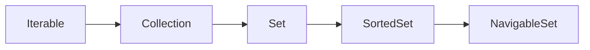

# Set

# 一、概述

## 1.1 定义

Set是Java集合框架（Collection Framework）中的重要接口，继承自`Collection`接口，用于存储**不重复的元素**。它不保证元素的存储顺序（部分实现类除外），也没有索引（无法通过下标访问元素）。

## 1.2 核心特性

- **元素唯一性**：这是Set最核心的特性，通过元素的`equals()`方法判断元素是否重复，若重复则无法添加（需配合`hashCode()`方法，后续详细说明）。

- **无索引**：不提供像List那样的`get(int index)`方法，无法通过下标直接访问元素，需通过迭代器（Iterator）或增强for循环遍历。

- **存储顺序不确定**：大部分实现类（如HashSet）不保证元素的插入顺序与遍历顺序一致；少数实现类（如TreeSet、LinkedHashSet）可保证特定顺序。

- **线程不安全**：所有常用实现类（HashSet、TreeSet等）均为线程不安全，多线程环境下需手动保证线程安全（如使用`Collections.synchronizedSet()`或ConcurrentSkipListSet）。

## 1.3 继承关系

Set接口位于Java集合框架中，其核心继承关系可通过以下图示清晰展示：

# 二、常用方法

## 2.1 元素操作方法

|方法签名|功能描述|关键说明|
|---|---|---|
|boolean add(E e)|向集合中添加指定元素|核心特性体现：若元素已存在（通过equals判断），则添加失败返回false；否则添加成功返回true|
|boolean remove(Object o)|从集合中移除指定元素|移除成功返回true；若集合中不存在该元素或元素为null（且集合不支持null）则返回false|
|boolean contains(Object o)|判断集合是否包含指定元素|判断依据为元素的equals方法，存在返回true，否则返回false|
|void clear()|清空集合中的所有元素|执行后集合size为0，注意与“集合引用置为null”区分|
## 2.2 集合状态查询方法

|方法签名|功能描述|返回值说明|
|---|---|---|
|int size()|获取集合中元素的个数|返回int类型数值，若元素数量超过Integer.MAX_VALUE，返回Integer.MAX_VALUE|
|boolean isEmpty()|判断集合是否为空|size() == 0时返回true，否则返回false，比直接调用size()更高效|
## 2.3 集合遍历与转换方法

|方法签名|功能描述|使用场景|
|---|---|---|
|Iterator<E> iterator()|获取集合的迭代器|遍历集合的基础方式，支持在遍历中通过iterator.remove()安全删除元素|
|Object[] toArray()|将集合转换为Object类型数组|需强制类型转换，灵活性较低，适合不确定元素类型的场景|
|<T> T[] toArray(T[] a)|将集合转换为指定类型的数组|推荐使用，无需强制类型转换，若传入数组长度不足会创建新数组，长度足够则复用|
|void forEach(Consumer<? super E> action)|Java 8+新增，遍历集合并执行指定操作|支持Lambda表达式，简化遍历代码，如set.forEach(System.out::println)|
## 2.4 集合间操作方法

|方法签名|功能描述|注意事项|
|---|---|---|
|boolean addAll(Collection<? extends E> c)|将指定集合中的所有元素添加到当前集合|仅添加当前集合中不存在的元素，添加成功（至少添加一个元素）返回true|
|boolean removeAll(Collection<?> c)|移除当前集合中与指定集合共有的所有元素|即“差集”操作，移除成功（至少移除一个元素）返回true|
|boolean retainAll(Collection<?> c)|保留当前集合中与指定集合共有的元素|即“交集”操作，修改成功（集合发生变化）返回true|
|boolean containsAll(Collection<?> c)|判断当前集合是否包含指定集合的所有元素|指定集合为空时返回true，需注意空集合的特殊处理|
# 三、Set 子接口补充说明

除了基础的Set接口外，Java还提供了两个常用的子接口，用于满足特定场景的需求。

## 3.1 SortedSet 接口

继承自Set接口，核心特性是“**元素可排序**”，即集合中的元素会按照指定的顺序（自然顺序或自定义比较器顺序）进行排列。其新增的核心方法包括：

- `E first()`：返回集合中的第一个元素（最小元素）

- `E last()`：返回集合中的最后一个元素（最大元素）

- `SortedSet<E> headSet(E toElement)`：返回小于指定元素的子集合

- `SortedSet<E> tailSet(E fromElement)`：返回大于等于指定元素的子集合

- `Comparator<? super E> comparator()`：返回用于排序的比较器，若为自然排序则返回null

## 3.2 NavigableSet 接口

继承自SortedSet接口，进一步增强了“导航”能力，提供了更多精准定位元素的方法，例如：

- `E lower(E e)`：返回小于指定元素的最大元素

- `E floor(E e)`：返回小于等于指定元素的最大元素

- `E ceiling(E e)`：返回大于等于指定元素的最小元素

- `E higher(E e)`：返回大于指定元素的最小元素

- `E pollFirst()`：移除并返回第一个元素

- `E pollLast()`：移除并返回最后一个元素

# 四、Set 接口使用注意事项

## 4.1 元素唯一性的核心保障

Set接口判断元素是否重复依赖`equals()`方法，但在实际实现中（如HashSet）会先通过`hashCode()`方法优化查找效率。因此，当自定义对象作为Set元素时，必须同时重写`equals()`和`hashCode()`方法，遵循“相等的对象必须有相等的hashCode，hashCode相等的对象不一定相等”的原则，否则会导致元素重复或查找失效。

## 4.2 遍历与删除的安全方式

直接使用增强for循环遍历Set时，若同时执行remove操作会抛出`ConcurrentModificationException`（快速失败机制）。安全的删除方式有两种：

1. 使用Iterator迭代器：通过`iterator.next()`获取元素后，调用`iterator.remove()`删除，可避免并发修改异常

2. 使用Java 8+的`removeIf(Predicate<? super E> filter)`方法：支持Lambda表达式，如`set.removeIf(e -> e == null)`

## 4.3 null元素的处理

Set接口本身并未禁止存储null元素，但不同实现类对null的支持不同：大部分实现类（如HashSet）允许存储一个null元素（因唯一性），而SortedSet/NavigableSet的实现类（如TreeSet）不支持null元素（排序时无法比较）。在使用前需明确实现类的null支持特性，避免抛出异常。
> （注：文档部分内容可能由 AI 生成）