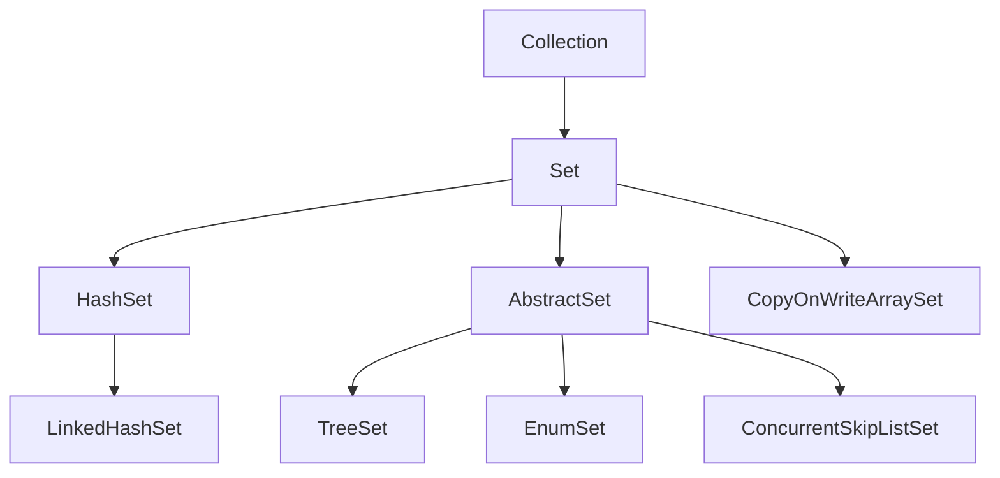

# Set 接口

## 一、概念与定位

Set 接口是 Java 集合框架中的重要接口，继承自 Collection 接口，代表一个**不包含重复元素**的集合。Set 接口的核心特性是**无序性**和**不可重复性**（具体实现类可能有所不同，如 TreeSet 是有序的）。

### 核心特性
- **不可重复性**：Set 中的元素不允许重复，这是其最基本的约束
- **无序性**：元素在 Set 中的存储位置通常不保证顺序（除有序实现外）
- **单值存储**：类似于数学中的集合概念，每个元素只能出现一次
- **null 元素支持**：大多数 Set 实现允许最多一个 null 元素

## 二、继承体系

Set 接口继承自 Collection 接口，主要实现类包括：

## 三、实现类比较

| 特性 | HashSet | LinkedHashSet | TreeSet | EnumSet | CopyOnWriteArraySet | ConcurrentSkipListSet |
|------|---------|---------------|---------|---------|---------------------|-----------------------|
| 底层实现 | HashMap（哈希表） | LinkedHashMap（链表+哈希表） | TreeMap（红黑树） | 位向量 | CopyOnWriteArrayList（数组） | 跳表 |
| 元素顺序 | 无序（哈希顺序） | 插入顺序 | 自然顺序或指定比较器 | 枚举声明顺序 | 插入顺序 | 自然顺序或指定比较器 |
| 时间复杂度 | 添加/删除/查询 O(1)（平均） | 添加/删除/查询 O(1)（平均） | 添加/删除/查询 O(log n) | 添加/删除/查询 O(1) | 添加 O(n)，查询 O(1) | 添加/删除/查询 O(log n) |
| null 值支持 | 允许一个 null | 允许一个 null | JDK 7+ 不允许 | 不允许 | 允许一个 null | 不允许 |
| 线程安全 | 否 | 否 | 否 | 否 | 是 | 是 |
| 内存开销 | 中 | 高（额外链表结构） | 高（红黑树结构） | 低（位向量） | 高（写时复制） | 高（跳表结构） |
| 适用场景 | 快速查找，不关心顺序 | 需要保持插入顺序的快速查找 | 需要排序或范围查询 | 枚举类型集合 | 读多写少的并发场景 | 高并发下的有序集合 |

## 四、Set 接口的常用方法

Set 接口继承了 Collection 接口的所有方法，并添加了一些特有方法（主要是对重复元素的处理）：

| 方法 | 描述 |
|------|------|
| boolean add(E e) | 如果集合中不存在指定元素，则添加该元素，返回 true |
| boolean addAll(Collection<? extends E> c) | 将指定集合中的所有元素添加到此集合中（不包含重复元素） |
| void clear() | 移除集合中的所有元素 |
| boolean contains(Object o) | 如果集合包含指定元素，则返回 true |
| boolean containsAll(Collection<?> c) | 如果集合包含指定集合的所有元素，则返回 true |
| boolean isEmpty() | 如果集合不包含元素，则返回 true |
| Iterator<E> iterator() | 返回此集合中元素的迭代器 |
| boolean remove(Object o) | 如果存在指定元素，则从集合中移除该元素 |
| boolean removeAll(Collection<?> c) | 移除集合中包含在指定集合中的所有元素 |
| boolean retainAll(Collection<?> c) | 仅保留集合中包含在指定集合中的元素 |
| int size() | 返回集合中的元素数量 |
| Object[] toArray() | 返回包含集合中所有元素的数组 |
| <T> T[] toArray(T[] a) | 返回包含集合中所有元素的指定类型数组 |
