# Java 集合框架

## 概述

Java 集合框架（Java Collections Framework）是 Java 提供的一套用于存储和操作对象集合的标准体系，它位于 `java.util` 包中。集合框架为开发者提供了统一的接口和实现，简化了数据结构的使用，提高了代码的可重用性和可维护性。


*Java 集合框架结构图*

## 核心接口与层次结构

Java 集合框架主要包含两大体系：Collection 和 Map。它们是整个集合框架的根基，提供了不同的数据组织和访问方式。

### 集合框架的骨架

```mermaid
flowchart TD
    A[接口 Iterable] --> B[接口 Collection]
    B --> C[接口 List]
    B --> D[接口 Set]
    B --> E[接口 Queue]
    B --> F[接口 Deque]
    
    G[接口 Map] --> H[接口 SortedMap]
    G --> I[接口 ConcurrentMap]
    
    C --> C1[ArrayList]
    C --> C2[LinkedList]
    C --> C3[Vector]
    C --> C4[CopyOnWriteArrayList]
    
    D --> D1[HashSet]
    D --> D2[LinkedHashSet]
    D --> D3[TreeSet]
    D --> D4[CopyOnWriteArraySet]
    
    E --> E1[PriorityQueue]
    E --> E2[ArrayBlockingQueue]
    
    F --> F1[LinkedList]
    F --> F2[ArrayDeque]
    F --> F3[LinkedBlockingDeque]
    
    G --> G1[HashMap]
    G --> G2[LinkedHashMap]
    G --> G3[Hashtable]
    G --> G4[WeakHashMap]
    G --> G5[IdentityHashMap]
    G --> G6[ConcurrentHashMap]
    
    H --> H1[TreeMap]
    
    I --> I1[ConcurrentHashMap]
    
    style A fill:#e1f5fe,stroke:#0288d1
    style B fill:#e1f5fe,stroke:#0288d1
    style G fill:#e1f5fe,stroke:#0288d1
```



## Collection 接口

Collection 接口是所有单列集合的父接口，它定义了操作单列集合的通用方法。

### 核心方法

```java
// 添加元素
boolean add(E e);
boolean addAll(Collection<? extends E> c);

// 删除元素
boolean remove(Object o);
boolean removeAll(Collection<?> c);
void clear();

// 判断
boolean contains(Object o);
boolean containsAll(Collection<?> c);
boolean isEmpty();

// 获取信息
int size();
Iterator<E> iterator();
Object[] toArray();
```

### Collection 的主要子接口

#### 1. List 接口

List 是一个有序的集合，可以包含重复元素。主要特点：
- 元素有序（插入顺序）
- 允许重复元素
- 支持通过索引访问元素
- 线程不安全（大部分实现）

**主要实现类**：
- `ArrayList`：基于动态数组实现，查询快，增删慢
- `LinkedList`：基于双向链表实现，查询慢，增删快
- `Vector`：线程安全的动态数组，已被 `ArrayList` 替代
- `CopyOnWriteArrayList`：线程安全的 ArrayList，适合读多写少场景

#### 2. Set 接口

Set 是一个不包含重复元素的集合。主要特点：
- 不允许重复元素
- 无序（HashSet）或有序（TreeSet、LinkedHashSet）
- 没有索引，不能通过索引访问元素

**主要实现类**：
- `HashSet`：基于哈希表实现，无序，查询速度快
- `LinkedHashSet`：继承自 HashSet，内部维护双向链表，保持插入顺序
- `TreeSet`：基于红黑树实现，元素自动排序
- `CopyOnWriteArraySet`：基于 CopyOnWriteArrayList 实现，线程安全

#### 3. Queue 接口

Queue 是队列数据结构，遵循先进先出（FIFO）原则。主要特点：
- 按照特定顺序处理元素（通常是 FIFO）
- 提供队列特定的操作方法

**主要实现类**：
- `PriorityQueue`：基于优先堆实现的无界队列，元素按优先级排序
- `ArrayBlockingQueue`：基于数组实现的有界阻塞队列

#### 4. Deque 接口

Deque 是双端队列，允许在两端插入和删除元素。

**主要实现类**：
- `ArrayDeque`：基于数组实现的双端队列
- `LinkedList`：既实现了 List 接口，也实现了 Deque 接口
- `LinkedBlockingDeque`：线程安全的双端阻塞队列

## Map 接口

Map 接口用于存储键值对（Key-Value）映射关系，每个键最多映射到一个值。

### 核心方法

```java
// 添加/更新映射
V put(K key, V value);
void putAll(Map<? extends K, ? extends V> m);

// 获取值
V get(Object key);
Set<K> keySet();
Collection<V> values();
Set<Map.Entry<K, V>> entrySet();

// 删除映射
V remove(Object key);
void clear();

// 判断
boolean containsKey(Object key);
boolean containsValue(Object value);
boolean isEmpty();
int size();
```

### Map 的主要实现类

#### 1. HashMap

基于哈希表实现的 Map，是最常用的 Map 实现。
- 线程不安全，性能较好
- 允许 null 键和 null 值
- 无序存储
- JDK 8 后引入红黑树优化大链表性能

#### 2. LinkedHashMap

继承自 HashMap，内部维护双向链表，保持插入顺序或访问顺序。
- 保持元素的插入顺序
- 性能略低于 HashMap
- 适用于需要保持顺序的场景

#### 3. TreeMap

基于红黑树实现的 Map，元素按键排序。
- 按键自然排序或定制排序
- 有序遍历
- 不允许 null 键（允许 null 值）

#### 4. Hashtable

古老的线程安全 Map 实现，已基本被 ConcurrentHashMap 替代。
- 线程安全（方法同步）
- 不允许 null 键和 null 值
- 性能较低

#### 5. ConcurrentHashMap

线程安全的 Map 实现，专为高并发场景设计。
- 高效的并发访问
- 分段锁或 CAS 算法实现线程安全
- 不允许 null 键和 null 值

#### 6. WeakHashMap

使用弱引用作为键的 Map，适合缓存场景。
- 键不再被其他引用引用时，可能被垃圾回收
- 用于实现内存敏感的缓存

## 集合框架的工具类

Java 提供了一些工具类来操作集合：

### 1. Collections

提供了操作集合的静态方法：

```java
// 排序
Collections.sort(list);
Collections.sort(list, comparator);

// 查找
Collections.binarySearch(list, key);
Collections.max(collection);
Collections.min(collection);

// 线程安全转换
List<E> synchronizedList = Collections.synchronizedList(list);
Map<K,V> synchronizedMap = Collections.synchronizedMap(map);

// 不可修改集合
List<E> unmodifiableList = Collections.unmodifiableList(list);
Set<E> unmodifiableSet = Collections.unmodifiableSet(set);
Map<K,V> unmodifiableMap = Collections.unmodifiableMap(map);

// 填充和替换
Collections.fill(list, obj);
Collections.replaceAll(list, oldVal, newVal);
```

### 2. Arrays

提供了数组相关的操作，包括数组转换为集合：

```java
// 数组转列表
List<String> list = Arrays.asList(array);

// 排序
Arrays.sort(array);

// 二分查找
Arrays.binarySearch(array, key);
```

## 集合类的比较与选择

| 集合类型 | 实现类 | 主要特点 | 适用场景 |
|---------|-------|---------|--------|
| List | ArrayList | 动态数组，查询快 | 频繁读取，少量插入删除 |
| List | LinkedList | 双向链表，增删快 | 频繁插入删除，队列操作 |
| Set | HashSet | 哈希表，无序，不重复 | 快速查找，去重 |
| Set | LinkedHashSet | 哈希表+链表，保持插入顺序 | 需要保持插入顺序的去重 |
| Set | TreeSet | 红黑树，有序 | 需要排序的场景 |
| Map | HashMap | 哈希表，键值对，性能高 | 普通键值对存储 |
| Map | LinkedHashMap | 哈希表+链表，保持顺序 | 需要保持插入/访问顺序 |
| Map | TreeMap | 红黑树，按键排序 | 需要按键排序的场景 |
| Map | ConcurrentHashMap | 并发安全，性能好 | 多线程环境 |

## 集合框架的性能考量

### 1. 时间复杂度

| 操作 | ArrayList | LinkedList | HashSet | TreeSet | HashMap | TreeMap |
|-----|----------|-----------|---------|---------|---------|--------|
| 读取元素 | O(1) | O(n) | O(1) | O(log n) | O(1) | O(log n) |
| 插入元素 | O(n) | O(1) | O(1) | O(log n) | O(1) | O(log n) |
| 删除元素 | O(n) | O(1) | O(1) | O(log n) | O(1) | O(log n) |
| 查找元素 | O(n) | O(n) | O(1) | O(log n) | O(1) | O(log n) |

### 2. 空间复杂度

- **ArrayList**：需要预留额外空间，空间复杂度 O(n)
- **LinkedList**：每个元素需要额外的前后指针，空间开销较大
- **HashSet/HashMap**：需要处理哈希冲突，可能有空桶，空间复杂度 O(n)
- **TreeSet/TreeMap**：每个节点需要额外的左右子节点指针，空间复杂度 O(n)

## 集合框架的使用建议

### 1. 选择合适的集合类型

- 根据数据是否需要排序选择：有序集合（List、TreeSet、TreeMap）或无序集合（HashSet、HashMap）
- 根据是否需要键值对映射选择：Collection 或 Map
- 根据线程安全需求选择：普通集合或并发安全集合

### 2. 性能优化

- 尽可能指定集合的初始容量，减少扩容开销
- 避免在循环中进行集合的删除或插入操作
- 合理使用迭代器进行遍历，避免使用索引遍历 LinkedList
- 优先使用线程安全的集合类，而非手动同步

### 3. 最佳实践

- **List**：读取多写少用 ArrayList，写多读少用 LinkedList
- **Set**：普通去重用 HashSet，需要顺序用 LinkedHashSet，需要排序用 TreeSet
- **Map**：普通场景用 HashMap，需要顺序用 LinkedHashMap，需要排序用 TreeMap，并发场景用 ConcurrentHashMap
- 集合转数组：使用集合的 toArray() 方法，避免类型转换问题

## 集合框架的扩展

### 1. Java 8 新特性

- **Stream API**：提供了声明式的数据处理方式
- **Lambda 表达式**：简化集合的遍历和操作
- **新的集合方法**：如 `forEach()`、`removeIf()` 等便捷方法

### 2. 并发集合

java.util.concurrent 包提供了多种线程安全的集合实现：
- ConcurrentHashMap
- CopyOnWriteArrayList
- CopyOnWriteArraySet
- ConcurrentLinkedQueue
- BlockingQueue 系列

## 总结

Java 集合框架是 Java 编程中非常重要的一部分，为开发者提供了丰富的数据结构和算法实现。掌握集合框架的使用，可以极大地提高开发效率和代码质量。在实际开发中，应根据具体需求选择合适的集合类型，并注意性能优化和最佳实践。

## 参考资料

- [Java 官方文档 - 集合框架](https://docs.oracle.com/javase/tutorial/collections/)
- [Java 集合框架详解](https://docs.oracle.com/javase/8/docs/api/java/util/Collection.html)
- [Java 并发集合文档](https://docs.oracle.com/javase/8/docs/api/java/util/concurrent/package-summary.html)