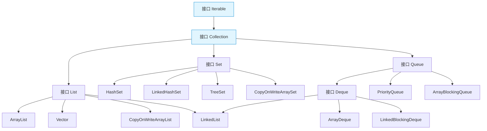
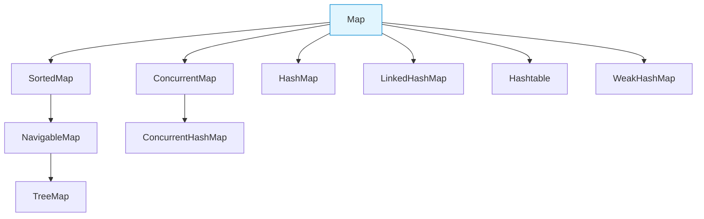

# 集合概览

# 一、概述

Java 集合框架（Java Collections Framework）是 Java 提供的一套用于存储和操作对象集合的标准体系，它位于 `java.util` 包中。集合框架为开发者提供了统一的接口和实现，简化了数据结构的使用，提高了代码的可重用性和可维护性。

# 二、Collection 体系

Collection 体系用于存储单列元素，所有实现类都遵循 Collection 接口定义的规范，主要包含 List、Set、Queue、Deque 等子接口。

## 2.1 List 接口

List 是一个有序的集合，可以包含重复元素，是日常开发中最常用的集合类型之一。

**主要特点**：

- 元素有序（严格遵循插入顺序）

- 允许存储重复元素

- 支持通过索引（下标）直接访问元素

**主要实现类**：

- `ArrayList`：基于动态数组实现，查询操作效率高（直接通过索引访问），增删操作效率低（需移动数组元素），是最常用的 List 实现类。

- `LinkedList`：基于双向链表实现，**同时实现了 List 接口和 Deque 接口**；作为 List 时支持索引访问和重复元素，作为 Deque 时支持双端操作，增删效率高但查询效率低。

- `Vector`：古老的动态数组实现，线程安全（方法加同步锁），但性能较低，目前已被 ArrayList 替代，仅在遗留系统中可能出现。

- `CopyOnWriteArrayList`：线程安全的 ArrayList 变体，采用“写时复制”机制，适合读多写少的并发场景，读操作无锁效率高。

## 2.2 Set 接口

Set 是一个不包含重复元素的集合，元素的存储顺序取决于具体实现类。

**主要特点**：

- 不允许存储重复元素（基于 equals() 和 hashCode() 方法判断）

- 存储顺序不固定（HashSet）或有序（TreeSet 按自然顺序、LinkedHashSet 按插入顺序）

- 没有索引，无法通过下标访问元素，只能通过迭代器遍历

**主要实现类**：

- `HashSet`：基于哈希表（HashMap 底层实现），存储无序，查询和增删效率高，是最常用的 Set 实现类。

- `LinkedHashSet`：继承自 HashSet，内部额外维护双向链表，可保持元素的插入顺序，性能略低于 HashSet。

- `TreeSet`：基于红黑树（TreeMap 底层实现），元素会按自然顺序或自定义比较器顺序排序，查询和增删效率为 O(log n)。

- `CopyOnWriteArraySet`：基于 CopyOnWriteArrayList 实现，线程安全，适合读多写少的并发场景，通过元素唯一性保证 Set 特性。

## 2.3 Queue 接口

Queue 是遵循“先进先出（FIFO）”原则的队列数据结构，主要用于存储待处理的元素序列。

**主要特点**：

- 默认遵循 FIFO 原则（优先级队列除外）

- 提供队列专用操作方法（如入队 offer()、出队 poll()、查看队首 peek() 等）

- 部分实现类支持阻塞操作（如 ArrayBlockingQueue）

**主要实现类**：

- `PriorityQueue`：基于优先堆实现的无界队列，元素按优先级排序（自然顺序或自定义比较器），不遵循 FIFO 原则。

- `ArrayBlockingQueue`：基于数组实现的有界阻塞队列，初始化时需指定容量，支持并发场景下的阻塞入队和出队。

## 2.4 Deque 接口

Deque 是“双端队列”（Double Ended Queue），允许在队列的两端进行插入和删除操作，兼具队列和栈的特性。

**主要特点**：

- 支持两端插入（addFirst()/addLast()）和删除（removeFirst()/removeLast()）操作

- 可作为栈使用（push() 入栈、pop() 出栈），也可作为队列使用

**主要实现类**：

- `ArrayDeque`：基于动态数组实现的双端队列，无容量限制（自动扩容），效率高于 LinkedList，是推荐的双端队列实现。

- `LinkedList`：基于双向链表实现，**核心实现 List 接口和 Deque 接口**，兼具 List 的有序可重复特性和 Deque 的双端操作能力，可灵活作为列表、队列或栈使用。

- `LinkedBlockingDeque`：基于链表实现的有界/无界阻塞双端队列，支持并发场景下的阻塞操作。

# 三、Map 体系

Map 体系用于存储键值对（Key-Value）映射关系，键具有唯一性，主要包含 SortedMap、ConcurrentMap 等子接口。

## 3.1 HashMap

基于哈希表（数组+链表+红黑树）实现的 Map，是日常开发中最常用的 Map 实现类。

**核心特点**：

- 线程不安全，并发场景下需手动同步或使用并发集合

- 允许存储 null 键和 null 值（仅允许一个 null 键）

- 元素存储无序（不保证插入顺序和遍历顺序一致）

- JDK 8 优化：当链表长度超过阈值（默认 8）时转为红黑树，提高查询效率

## 3.2 LinkedHashMap

继承自 HashMap，内部额外维护双向链表，用于记录元素的插入顺序或访问顺序。

**核心特点**：

- 保持元素的顺序（默认插入顺序，可通过构造函数指定为访问顺序）

- 查询、增删性能略低于 HashMap（需维护链表结构）

- 允许 null 键和 null 值，线程不安全

- 适合需要保留元素顺序的场景（如缓存的 LRU 策略可通过访问顺序实现）

## 3.3 TreeMap

基于红黑树实现的 Map，元素会按键（Key）的自然顺序或自定义比较器顺序排序。

**核心特点**：

- 按键有序（自然排序或自定义 Comparator 排序）

- 不允许 null 键（会抛出 NullPointerException），允许 null 值

- 查询、增删效率为 O(log n)，线程不安全

- 适合需要按键排序的场景（如排行榜、有序统计等）

## 3.4 Hashtable

古老的 Map 实现类，基于哈希表实现，是线程安全的，但目前已基本被 ConcurrentHashMap 替代。

**核心特点**：

- 线程安全（所有方法加 synchronized 锁），但并发性能低

- 不允许 null 键和 null 值（会抛出 NullPointerException）

- 元素存储无序，JDK 1.0 引入，目前仅在遗留系统中使用

## 3.5 ConcurrentHashMap

专为高并发场景设计的线程安全 Map 实现类，替代了低效的 Hashtable。

**核心特点**：

- 高效并发访问：JDK 7 采用分段锁，JDK 8 采用 CAS 算法+ synchronized 锁（仅锁定链表/红黑树头节点）

- 不允许 null 键和 null 值（并发场景下避免空指针歧义）

- 元素存储无序，查询和增删性能接近 HashMap

- 适合多线程并发读写的场景（如分布式系统中的缓存、共享数据存储等）

## 3.6 WeakHashMap

使用弱引用（WeakReference）作为键的 Map，适合实现内存敏感的缓存场景。

**核心特点**：

- 键采用弱引用：当键不再被其他强引用引用时，会被垃圾回收器回收，对应的键值对也会从 Map 中移除

- 值采用强引用，若需值也随键回收，需手动包装为弱引用

- 线程不安全，适合作为临时缓存（如图片缓存、数据字典缓存等）

# 四、集合类的比较与选择

不同集合类具有不同的特性，实际开发中需根据业务场景选择合适的集合，以下是核心集合类的对比：

|集合类型|实现类|主要特点|适用场景|
|---|---|---|---|
|List（单列有序）|ArrayList|动态数组，查询快（O(1)），增删慢（O(n)），线程不安全|频繁读取、少量插入删除（如数据展示列表、配置项存储）|
||LinkedList|双向链表，实现 List 和 Deque 接口，有序可重复、增删快（O(1)），查询慢（O(n)）|频繁插入删除、队列/栈操作（如任务队列、历史记录存储）|
|Set（单列不重复）|HashSet|哈希表实现，无序，查询/增删快（O(1)），线程不安全|快速去重、查找（如用户 ID 集合、标签去重）|
||LinkedHashSet|哈希表+链表，保持插入顺序，性能略低于 HashSet|需保持插入顺序的去重（如订单号记录、访问记录去重）|
||TreeSet|红黑树实现，有序（自然/自定义排序），查询/增删 O(log n)|需排序的去重场景（如成绩排名、优先级任务存储）|
|Map（键值对）|HashMap|哈希表实现，无序，查询/增删快（O(1)），允许 null 键值|普通键值对存储（如用户信息缓存、配置映射）|
||LinkedHashMap|哈希表+链表，保持插入/访问顺序，性能略低于 HashMap|需保持顺序的键值对（如 LRU 缓存、有序字典）|
||TreeMap|红黑树实现，按键排序，查询/增删 O(log n)，不允许 null 键|需按键排序的键值对（如排行榜、有序统计数据）|
||ConcurrentHashMap|并发安全，高效读写，不允许 null 键值|多线程并发场景（如分布式缓存、共享配置存储）|
# 五、集合框架的性能考量

## 5.1 时间复杂度

以下是核心集合类关键操作的时间复杂度对比（n 为集合元素数量）：

|操作类型|ArrayList|LinkedList|HashSet|TreeSet|HashMap|TreeMap|
|---|---|---|---|---|---|---|
|随机读取（按索引/键）|O(1)|O(n)|O(1)|O(log n)|O(1)|O(log n)|
|插入元素（尾部/随机）|O(1)（尾部）/O(n)（随机）|O(1)（两端）/O(n)（随机）|O(1)|O(log n)|O(1)|O(log n)|
|删除元素（尾部/随机）|O(1)（尾部）/O(n)（随机）|O(1)（两端）/O(n)（随机）|O(1)|O(log n)|O(1)|O(log n)|
|查找元素（值/键）|O(n)|O(n)|O(1)|O(log n)|O(1)|O(log n)|
## 5.2 空间复杂度

所有核心集合类的空间复杂度均为 O(n)（与元素数量成正比），但不同实现类的额外空间开销不同：

- **ArrayList**：需预留一定的数组扩容空间（默认扩容为原容量的 1.5 倍），存在一定的空间浪费，但整体开销较小。

- **LinkedList**：每个元素需额外存储前后指针（各 4/8 字节，取决于 JVM 位数），空间开销较大，元素数量越多差距越明显。

- **HashSet/HashMap**：哈希表存在“负载因子”（默认 0.75），需预留空桶以减少哈希冲突，空间利用率约 75%，JDK 8 后红黑树会增加少量节点开销。

- **TreeSet/TreeMap**：红黑树每个节点需存储左右子节点指针和颜色标记，空间开销比哈希表大，约为元素本身大小的 2-3 倍。

- **ConcurrentHashMap**：JDK 8 后引入的节点锁和 CAS 相关标识会增加少量空间开销，整体与 HashMap 接近。