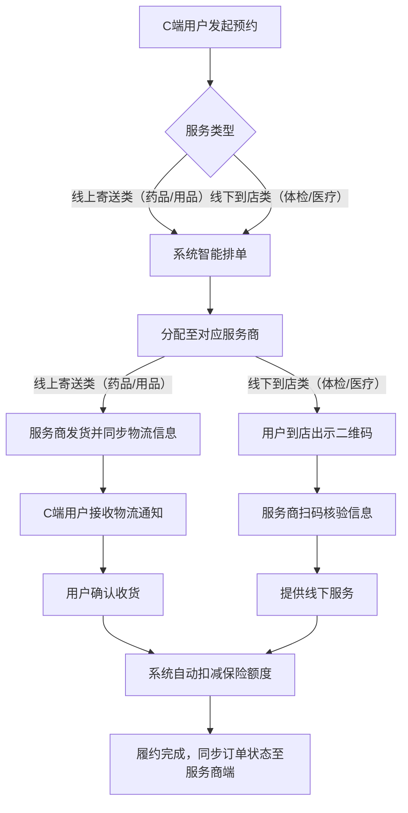
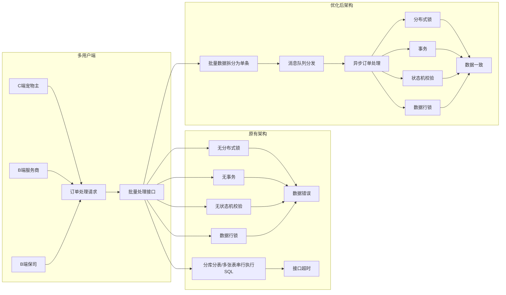

# 支付宝宠物保险

## 一、项目整体概述

项目整体围绕定位、痛点、实现、成果及架构展开，核心信息如下：

- 1. 项目定义：支付宝宠物保险项目是依托支付宝平台核心流量优势，为宠物主打造的集宠物健康保障、医疗服务预约、理赔履约于一体的综合性保障服务项目，是支付宝生态内的核心服务之一。

- 2. 解决痛点：精准攻克宠

- 物主在宠物医疗、健康管理中的核心难题，具体包括信息不一致（服务宣传与实际不符）、信息不透明（进度/价格/流程不明）、流程繁琐（预约理赔操作复杂耗时）。

- 3. 实现方式：通过“资源整合+技术体系搭建”双轮驱动实现服务闭环——整合优质服务商建立标准化体系，构建线上线下履约及多端协同系统打通全链路。

- 4. 项目成果：实现“投保-预约-履约-理赔”全流程闭环，用户端流程简化、透明度提升，市场端在支付宝生态内宠物保险细分领域占有率达80%，稳居行业前列。

- 5. 核心架构：以“线下场景覆盖+线上系统支撑+多方商业合作枢纽”为核心，涵盖线上线下全场景，搭建多端协同系统，履约环节为连接供需的关键枢纽。

- 6. 业务架构：清晰划分四大核心域，配套后台运营配置平台支撑全流程运转：

- 保险域：负责宠物保险产品设计、投保承保、理赔核算等核心保险业务；

- 商家域：管理宠物商家（医院、宠物店）入驻、资质审核、服务质量考核及奖惩等商家相关业务；

- 履约域：统筹订单分配、服务执行、物流追踪、额度扣减等履约全流程；

- 商品域：管控宠物药品、用品等商品的信息维护、库存管理、定价等商品相关业务；

- 后台运营配置平台：为四大域提供基础配置、数据监控、规则管理等运营支撑服务。

## 二、履约域核心定位

作为连接宠物主需求和服务商服务的关键环节，搭建顺畅的订单流转通道，确保宠物主预约的服务能准确、及时兑现，让供需双方高效匹配并完成整个服务流程。

### 核心能力

#### 1. 服务履约能力

制定统一的服务执行流程，明确服务标准与时效要求，既保障宠物主能按预约精准享受服务、合法权益不受损，又通过流程化管控确保业务领域数据实时同步一致，同时筑牢系统运行基础，保障整体稳定性。

#### 2. 智能分流派单能力

兼容服务商地域性限制场景（如某省份仅1家服务商则专属分配），结合满意度考核动态调整派单量，本地单优先区域服务商、全国单匹配全国服务商，避免资源浪费。

#### 3. 服务商管理能力

服务商入驻线上自动化流程，通过线上化审核等方式将入驻时间从14天压缩至2天，配套服务规范管理保障质量。

#### 4. 工单时效监控与度量能力

针对业务对时效要求高的特性，搭建服务商工单处理全生命周期监控体系，实时追踪每个服务商的订单处理时效及响应时间，通过多维度数据监控与定期报表输出,既保障用户服务体验,又为服务商提供可量化的绩效优化依据。

## 三、全场景履约流程

## 四、系统架构重构与性能优化

### 痛点与挑战

项目初期，承接的原有系统存在代码冗余、批量处理逻辑不合理等问题，频繁出现并发异常、数据一致性问题及性能瓶颈。我主导了核心模块的架构重构与优化工作。

### 架构对比

### 核心优化方案：从批量接口到单接口的架构重构

**1. 批量接口重构为单订单独立接口**

- 并发冲突：同一订单的多个处理请求相互干扰，出现状态不一致；

- 容错性差：批量处理中任一订单异常会阻塞全量流程；

- 性能瓶颈：单接口承载逻辑过多，响应时间随订单量线性增加。

为此，我们进行全链路重构，核心优化点及解决逻辑如下：

**（1）批量改单接口：拆解为单订单独立处理链路**

将原有的批量订单处理链路拆分为“单订单独立处理”，为每个订单分配唯一处理链路，配合消息队列实现异步化改造：

① 接收层：用户或系统发起的多订单请求先进入请求聚合层，按订单ID拆分为独立请求；

② 分发层：通过 SOFAMQ 消息队列将单订单请求异步分发至处理节点，实现请求的并行处理；

③ 执行层：每个处理节点仅专注于单个订单的“分配-核验-执行-状态同步”全流程，避免订单间的资源竞争。

此改造从根本上解决了批量处理的“牵一发而动全身”问题，订单处理的平均响应时间从3000ms压缩至500ms。

**（2）分布式锁：Redis前置控并发+DB行锁兜底**

针对多节点并发操作同一订单（如并发更新状态、重复取消预约）的核心问题，采用“Redis分布式锁前置控制+数据库行锁兜底”的双层防护方案，兼顾性能与容错性：

① 精准锁标识设计：采用“订单ID+业务模块Code”复合标识，确保同一订单的操作互斥，能拦截“同一用户对同一订单发起多类型并发请求”（如同时取消和修改），从锁粒度降低冲突。

② 固定时效无续期策略：结合业务实际（核心操作3秒内完成），设置10秒固定锁时效且不续期——既预留充足执行缓冲，又能避免节点故障导致锁长期占用，通过时效自动释放实现“故障自恢复”。获取锁失败时采用“100ms+200ms”阶梯重试，减少瞬时并发失败。

③ 双层锁兜底：极端场景（锁过期未完成）通过事务内“SELECT ... FOR UPDATE”行锁锁定订单并校验状态，拦截并发修改。

**（3）** **最终一致性分布式协同：业务状态优先** **+状态机校验**

为解决订单履约与下游资产系统额度扣减的协同问题，采用“预约单状态先行管控+异步通知扣减+重复预约拦截”的轻量方案，兼顾业务实际与数据一致性，核心逻辑如下：

① 预约单状态优先管控：聚焦预约单核心生命周期，明确“待预约-预约中-已预约-履约中-已履约”关键状态。用户核销后，系统先将预约单状态更新为“已履约”，确保业务层面履约结果明确——无论下游额度扣减是否成功，均以实际履约场景为准，避免状态与实际服务脱节。

② 有限状态机精准校验：基于实际业务定义状态流转规则（如“已履约”不可回退至“预约中”，“已预约”仅可流转至“履约中”或“已取消”），通过状态机拦截非法操作。例如用户已完成核销履约后，若误操作发起取消，状态机直接拦截并提示“服务已完成，不可取消”。

③ 异步通知扣减与重试机制：履约完成后，系统通过SOFAMQ消息队列异步发送消息至下游资产系统，触发保险额度扣减。若扣减失败（如超时、系统异常），由资产系统负责重试直至成功，重试失败则触发人工介入处理，避免履约系统耦合重试逻辑。

## 五、智能派单系统

### 业务背景与痛点

智能派单功能的研发落地，核心是为解决项目初期简单规则派单面临的多重业务痛点：

**痛点1：地域与业务范围限制**

不同服务商/商业机构的服务覆盖存在明确地域性划分，部分仅支持特定省份、城市，部分可覆盖全国，且各机构业务范围聚焦不同（如部分专攻药品配送、部分专注线下医疗），简单派单易出现"服务范围不匹配"问题。

**痛点2：接单能力差异显著**

各服务商的人员配置、仓储规模、配送团队等资源不同，导致接单承载量差异较大，部分小型服务商单量过载后履约质量下降，部分大型服务商却存在资源闲置，供需失衡问题突出。

**痛点3：合作关系层级区分**

平台与部分核心服务商、保司存在深度战略合作关系，需在保障服务质量的前提下，优先匹配合作资源，兼顾商业合作诉求与服务效率。

### 技术实现方案

**动态规则配置**

基于业务实际需求，联动后台运营配置平台构建多维度动态派单体系，核心通过“可视化配置+实时数据校验”实现，技术方案及流程如下：

**1. 技术规则配置实现：可视化+结构化存储**

采用“运营可视化界面+规则引擎+结构化存储”架构，支持非技术人员快速配置且保障规则落地准确性：

- **配置界面层**：开发低代码配置页面，运营可通过下拉选择、数值输入完成规则配置——地域配置支持“省份-城市-区县”三级联动选择服务商；流量占比配置支持输入百分比后实时校验总和（若输入后总和≠100%则弹窗提示）；权重配置支持滑块调整（0-10分）并同步显示核心合作保司关联关系。

- **规则存储层**：采用纯MySQL数据库表存储配置与计数数据，设计两张核心表实现职责分离——① 规则配置表：含“配置ID、地域编码、服务类型、服务商ID、流量占比、权重值、生效状态、更新时间”等字段，保障规则可追溯；② 实时计数表：按“日期+服务商ID”作为联合主键，每日0点自动初始化当日计数数据，分给服务商订单时通过MySQL“UPDATE 实时计数表 SET 匹配单量=匹配单量+1 WHERE 日期=? AND 服务商ID=?”语法实现“计数+1”的原子性操作。从业务特性出发，未引入事务与缓存——因派单规则为静态配置（变更频率低），实时计数允许秒级延迟，无需强一致性保障，简化架构同时满足需求。

- **派单判断流程：地域优先+策略递进+兜底保障**

- ① 地域专属匹配校验：派单时优先解析订单所属地域（精确到城市/区县），查询该地域是否存在“专属服务商”（即仅覆盖该地域且业务范围匹配的服务商）。若存在且唯一，直接分配给该专属服务商，无需进入后续流程；若存在多个地域服务商，则进入百分比匹配环节。

- ② 流量百分比计算与动态匹配：独立策略无匹配结果时，执行“实时占比校验+差额补充分配”机制。先获取当前地域+服务类型下所有适配服务商的预设占比（总和强制100%）及实时已匹配单量，计算实际占比并与预设值比对；对实际占比低于预设值且超出偏差阈值的服务商优先分配订单补足差额，多个偏差时按偏差率排序分配；无明显偏差时，按剩余可分配额度（当日目标单量×预设占比-已匹配单量）占比计算权重随机分配，确保最终占比趋近预设值。

- ③ 兜底机制：若上述流程均无匹配服务商（如偏远地区无合作商），系统自动将订单分配至“蚂蚁小二”人工运营团队，由人工对接宠物主完成服务安排，确保服务不中断，同时记录该地域服务缺口用于后续服务商拓展。

## 六、服务商入驻流程线上自动化

### 改造背景与痛点

项目初期，服务商及合作保司入驻依赖代码硬编码实现，核心痛点突出：

- **硬编码依赖严重**：将保司、服务商的专属机构Code直接写入代码，新增或变更合作方时需修改核心业务代码，开发成本高。

- **入驻周期极长**：从需求提报、代码开发、测试验证到上线配置全流程需14天，加上机构资质审核、线上灰度等环节，整体入驻周期长达1个月，严重影响业务拓展效率。

- **扩展性极差**：线下服务、线上服务等不同类型机构的入驻规则分散在代码中，新增服务类型或调整规则时需全量回归测试，易引发线上故障。

### 核心改造方案：全流程配置化+线上自动化

以“去硬编码、提效降本”为核心，构建“运营可视化配置+系统自动化校验”的入驻体系，实现合作方入驻全流程线上化、配置化，具体方案如下：

#### 1. 硬编码转配置化：构建规则配置平台

- **核心信息配置化**：开发专属配置平台，将机构Code、服务类型（线上寄送/线下到店）等关键信息剥离代码，支持运营人员通过可视化界面录入——保司端配置界面支持填写机构基础信息、绑定合作服务商；服务商端配置界面支持选择服务类型、划定服务地域、系统自动校验信息完整性。

#### 2. 全流程线上化闭环：从线下协议到生效上线

重构入驻全流程，串联“线下协议签订-账号配置-自主配置-审核生效”各环节，明确运营与合作方的权责分工，实现高效协同：

1. **步骤1：线下协议签订（前置环节）**：运营同学与合作方（保司/服务商）线下签订入驻合作协议，明确服务范围、合作期限、权责条款等核心内容，完成合作资质初步核验。

2. **步骤2：运营配置平台账号**：协议签订后，运营同学在配置平台为合作方创建专属登录账号，根据合作类型（保司/服务商）分配对应操作权限——保司账号具备“绑定服务商、配置服务规则”权限，服务商账号具备“配置服务地域、维护服务信息”权限。

3. **步骤3：合作方自主配置核心信息**：合作方登录平台账号后，自主完成关键信息配置：

    1. ① 保司：绑定合作服务商、配置服务类型（线上/线下）、设定合作区域等；

    2. ② 服务商：选择服务类型、划定服务地域、维护资质文件等，系统实时校验配置信息的完整性与合规性。

4. **步骤4：变更审核与生效规则**：区分“首次配置”与“后续变更”实行差异化审核机制：

    1. ① 首次配置：合作方提交后，运营同学审核配置内容与协议一致性；

    2. ② 后续变更：合作方发起信息修改（如调整服务地域、更换合作保司）时，需提交变更申请并注明原因，由运营同学审核通过后方可生效；

5. **步骤5：全流程可追溯**：配置提交/审核日志、变更历史等全量信息关联存储，支持按合作方名称、账号或申请单号回溯完整入驻及变更轨迹。

### 改造成效

- **周期大幅缩短**：入驻周期从 14 天压缩至2天，解放开发资源。

- **成本显著降低**：新增合作方无需开发改码，测试回归成本降低90%；运营协同效率提升。

- **扩展性提升**：新增服务类型或调整入驻规则时，运营人员通过配置平台即可完成，响应业务需求时间从1周缩短至4小时。

## 七、服务商工单时效监控体系

### 建设背景

服务商以人工处理为主，易出现时效延迟。依托蚂蚁内部大数据平台，搭建“埋点采集-分析计算-可视化监控”体系，沉淀时效数据支撑运营优化，保障服务质量。

### 7.1 实时监控核心能力

- **日志采集与数据沉淀**：在工单分配、接单、处理、完成等关键节点埋点，记录时间戳、订单ID、服务商ID等核心字段，T + H 同步至大数据平台；聚合为“工单时效事实表”，结构化存储全节点数据。

- **多维度时效计算**：通过大数据平台实现两类计算——① 实时计算：每半小时统计在途工单耗时、剩余时效；② 离线计算：每日批量核算昨日全链路时效（响应/处理/分段耗时），按服务商、区域等维度聚合。

- **可视化展示**：通过三类载体呈现——① 实时大屏：展示工单量、时效分布、预警数；② 明细查询：按订单/服务商追溯全节点时效；③ 经营报表：自动生成趋势图、排名表支撑复盘。

### 7.2 工单处理超时预警机制

**1. 关键节点配置**

基于工单处理全流程，在后台配置平台按“节点+服务类型”设置精细化SLA时效标准，支持多维度差异化配置：

- 核心节点时效：① 工单领取时效（如分配后30分钟内领取）；② 线下服务预约成功时效（领取后1小时内完成预约确认）；③ 线上商品发货时效（领取后2小时内同步物流）；④ 异常工单响应时效（发起异常后15分钟内介入）。

- 差异化配置：支持按“区域（偏远地区可放宽20%时效）、服务商级别（核心服务商时效标准提高10%）、服务类型”维度调整阈值，配置后系统自动校验合理性。

**2. 实时预警检测与钉钉推送机制**

- **首次推送（节点超时实时提醒）**：系统实时检测工单状态，当工单超过“领取/预约/发货”等核心节点SLA时效时，立即推送钉钉群消息至对应服务商运营群。消息含“订单ID、服务类型、超时节点、已耗时、SLA标准”关键信息，@服务商对接人实时提醒处理，确保及时响应。

- **二次推送（每日固定汇总推送）**：每日晚上10点，系统自动汇总当日所有未结束的工单（含超时未处理及处理中未完成的工单），生成清单后推送至“服务商运营群+平台运营对接群”。清单包含“工单ID、服务类型、当前节点、已耗时、负责人”等信息，便于服务商和运营人员集中梳理当日未结事项，规划次日处理优先级。