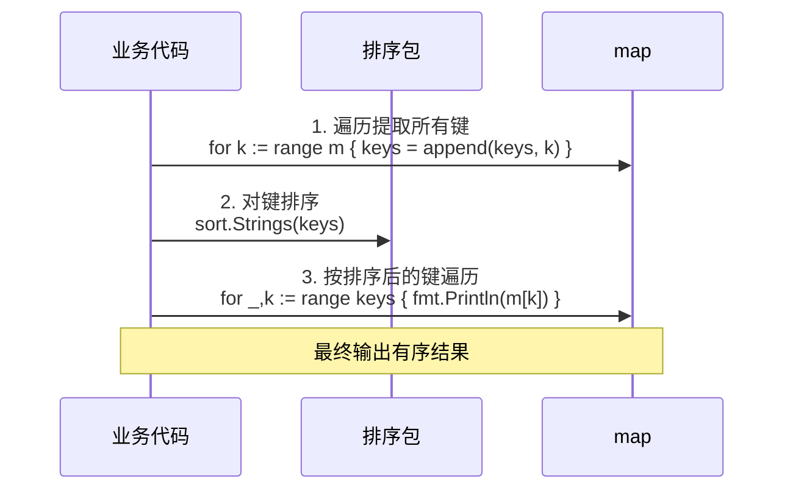

基于 Go `for` 关键字的核心逻辑（语法变体、执行流程、常见坑点），我设计了 **6 张核心 Mermaid 图表**，覆盖语法分类、for-range 底层转换、错误场景对比等，可直接渲染使用。

---

## 1. for 关键字语法变体分类（结构图）
清晰展示 Go for 循环的 4 种核心形式及适用场景：
```mermaid
graph TD
    A[Go for 循环（唯一循环关键字）] --> B[普通循环]
    A --> C[for-range 遍历]
    
    B --> B1[标准计数循环<br>for i:=0; i<N; i++]
    B --> B2[条件循环（替代 while）<br>for 条件]
    B --> B3[无限循环<br>for {}]
    
    C --> C1[切片/数组遍历<br>for i,v := range slice]
    C --> C2[字符串遍历<br>for i,c := range s]
    C --> C3[map 遍历<br>for k,v := range m]
    C --> C4[通道遍历<br>for v := range ch]
    
    B1 --> B11[适用：固定次数循环]
    B2 --> B21[适用：未知次数条件循环]
    B3 --> B31[适用：服务常驻/事件监听]
    
    C1 --> C11[特性：值拷贝、遍历原长度]
    C2 --> C21[特性：自动解析 Unicode]
    C3 --> C31[特性：遍历顺序随机]
    C4 --> C41[特性：阻塞等待/关闭退出]
    
    style A fill:#f9f,stroke:#333,stroke-width:2px
    style B fill:#eee,stroke:#333
    style C fill:#eee,stroke:#333
```

---

## 2. for-range 切片遍历底层转换（流程图）
拆解编译器将 for-range 转换为普通计数循环的核心步骤：
```mermaid
flowchart TD
    A[原始代码<br>for i,v := range slice] --> B[编译器预处理]
    B --> C[提前计算长度<br>n := len(slice)]
    C --> D[初始化索引<br>i := 0]
    D --> E[循环条件判断<br>i < n?]
    E -- 否 --> F[循环结束]
    E -- 是 --> G[值拷贝<br>v := slice[i]]
    G --> H[执行循环体逻辑]
    H --> I[索引自增<br>i++]
    I --> E
    
    style G fill:#f9f,stroke:#333,stroke-width:2px
    style C fill:#90EE90,stroke:#333
```

---

## 3. for-range 遍历值拷贝错误场景（对比图）
直观展示“错误修改值拷贝”与“正确修改原元素”的差异：
```mermaid
graph TD
    subgraph 错误用法：修改值拷贝（无效果）
        A[定义结构体切片<br>users := []User{{"Alice"}, {"Bob"}}] --> B[for _,v := range users]
        B --> C[修改 v.Name = "Tom"]
        C --> D[v 是栈上副本，原切片无变化]
        D --> E[输出：[{Alice}, {Bob}]]
    end
    
    subgraph 正确用法：通过索引修改原元素
        F[定义结构体切片<br>users := []User{{"Alice"}, {"Bob"}}] --> G[for i := range users]
        G --> H[修改 users[i].Name = "Tom"]
        H --> I[直接操作原切片内存]
        I --> J[输出：[{Tom}, {Tom}]]
    end
    
    style A fill:#ffcccc,stroke:#333
    style F fill:#ccffcc,stroke:#333
    style D fill:#ffcccc,stroke:#333
    style I fill:#ccffcc,stroke:#333
```

---

## 4. map 有序遍历流程（时序图）
展示“提取键→排序→遍历”的有序遍历核心步骤：


---

## 5. 循环内 goroutine 变量捕获错误（对比图）
展示“错误捕获引用”与“正确传参/重新声明”的差异：
```mermaid
graph TD
    subgraph 错误用法：捕获循环变量引用
        A[for i := 0; i < 5; i++] --> B[go func() { fmt.Println(i) }()]
        B --> C[所有 goroutine 捕获同一个 i 的地址]
        C --> D[最终输出：5,5,5,5,5]
    end
    
    subgraph 正确用法1：参数传递
        E[for i := 0; i < 5; i++] --> F[go func(n int) { fmt.Println(n) }(i)]
        F --> G[每次传递当前 i 的值拷贝]
        G --> H[输出：0,1,2,3,4（顺序不定）]
    end
    
    subgraph 正确用法2：循环内重新声明
        I[for i := 0; i < 5; i++] --> J[n := i<br>go func() { fmt.Println(n) }()]
        J --> K[每次创建新变量 n]
        K --> L[输出：0,1,2,3,4（顺序不定）]
    end
    
    style A fill:#ffcccc,stroke:#333
    style E fill:#ccffcc,stroke:#333
    style I fill:#ccffcc,stroke:#333
```

---

## 6. for 循环性能优化对比（流程图）
展示“未优化循环”与“优化后循环”的核心差异：
```mermaid
flowchart TD
    subgraph 未优化循环（性能差）
        A[for i := 0; i < len(slice); i++] --> B[循环内重复计算 len]
        A --> C[循环内频繁分配内存<br>tmp := make([]int, 0)]
        B --> D[冗余计算开销]
        C --> E[内存分配/GC 开销]
        D & E --> F[整体性能低]
    end
    
    subgraph 优化后循环（高性能）
        G[提前计算长度<br>n := len(slice)] --> H[for i := 0; i < n; i++]
        G --> I[预分配内存<br>tmp := make([]int, 0, n)]
        H --> J[无冗余 len 计算]
        I --> K[无频繁内存分配]
        J & K --> L[整体性能高]
    end
    
    style A fill:#ffcccc,stroke:#333
    style G fill:#ccffcc,stroke:#333
    style F fill:#ffcccc,stroke:#333
    style L fill:#ccffcc,stroke:#333
```

---

## 7. for 循环控制语句执行逻辑（状态图）
展示 break/continue/标签的执行流程：
```mermaid
stateDiagram-v2
    [*] --> 循环开始
    循环开始 --> 条件判断
    条件判断 --> 循环体执行: 条件为 true
    条件判断 --> 循环结束: 条件为 false
    
    循环体执行 --> 检查控制语句
    检查控制语句 --> 普通 continue: 触发 continue
    检查控制语句 --> 标签 continue: 触发 continue 标签
    检查控制语句 --> 普通 break: 触发 break
    检查控制语句 --> 标签 break: 触发 break 标签
    检查控制语句 --> 循环体结束: 无控制语句
    
    普通 continue --> 后置语句: 跳过当前迭代
    标签 continue --> 外层循环条件判断: 跳过外层迭代
    普通 break --> 循环结束: 退出当前循环
    标签 break --> 外层循环结束: 退出指定循环
    循环体结束 --> 后置语句
    
    后置语句 --> 条件判断
    外层循环条件判断 --> 外层循环体执行: 条件为 true
    外层循环条件判断 --> 外层循环结束: 条件为 false
    
    style 检查控制语句 fill:#f9f,stroke:#333,stroke-width:2px
```

---

### 渲染说明
1. 所有图表采用**分层/横向布局**，避免纵向过长，适配文档阅读；
2. 关键节点（如值拷贝、性能优化点）用高亮色标注，突出核心逻辑；
3. 可直接复制代码到 docsify、Markdown 编辑器（如 Typora）、Mermaid 在线编辑器等平台渲染，无需额外调整。

若需要补充某类场景的图表（如通道遍历阻塞逻辑、字符串 Unicode 解析流程），可告知具体需求，我会针对性补充。