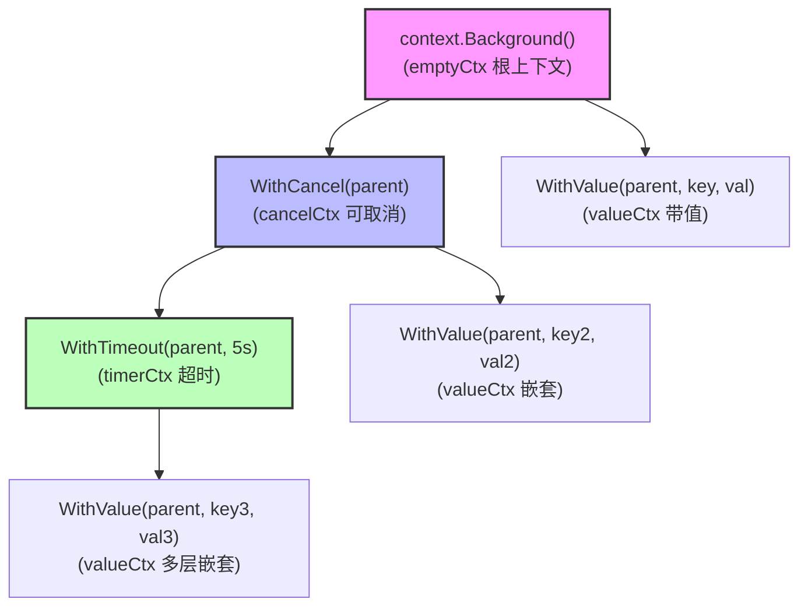
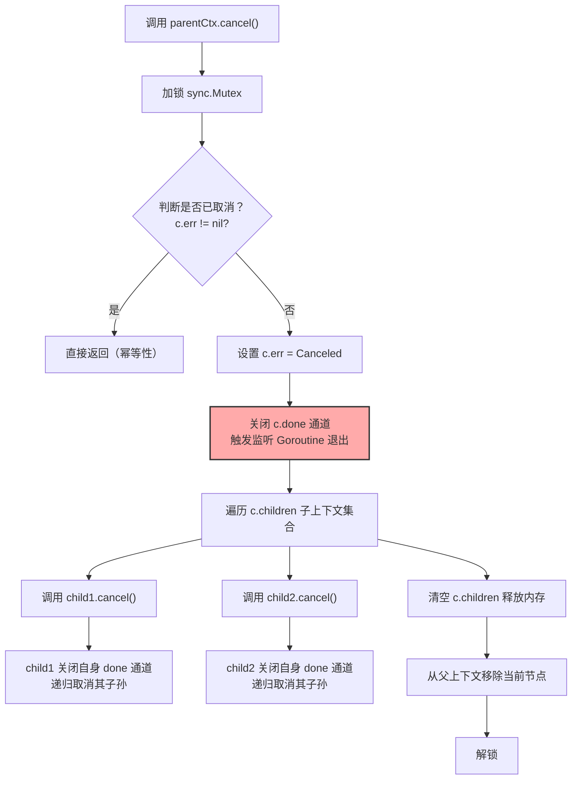
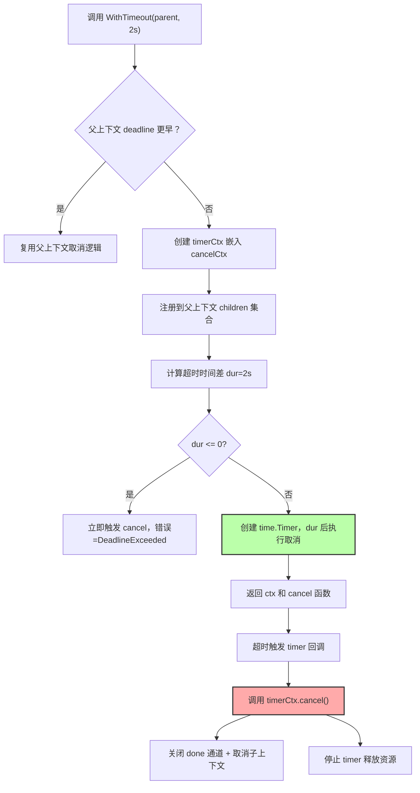
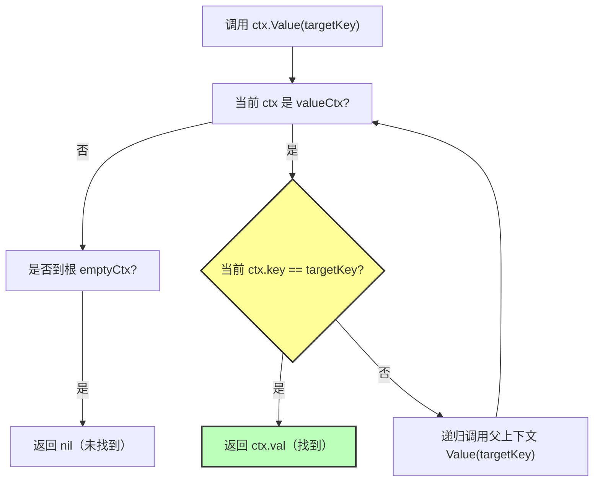
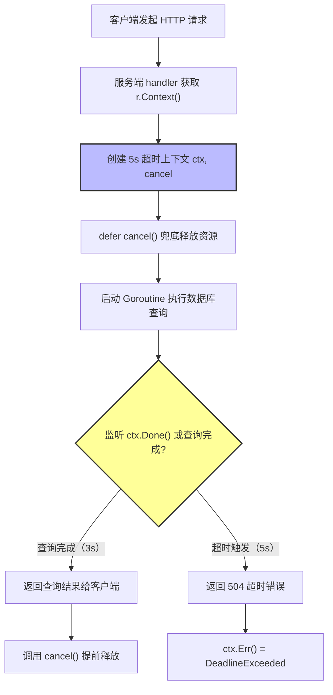

基于 `context` 的核心原理与使用流程，我设计了 **5 个关键 Mermaid 图**，覆盖**上下文层级结构**、**取消信号传播**、**超时机制流程**、**WithValue 查找链路**、**HTTP 服务超时控制** 场景，可直接在 Mermaid Live Editor 或 VS Code 插件中渲染。

### 1. Context 层级结构与派生关系
展示根上下文、可取消上下文、超时上下文、带值上下文的层级派生关系。

### 2. cancelCtx 取消信号传播流程
展示父上下文取消时，递归取消所有子上下文的核心逻辑。

### 3. timerCtx 超时机制执行流程
展示 `WithTimeout` 从创建到超时自动取消的完整步骤。

### 4. WithValue 键值对递归查找链路
展示多层 `valueCtx` 嵌套时，`Value(key)` 的查找流程。

### 5. HTTP 服务 Context 超时控制实战流程
展示实际业务中，HTTP 请求如何通过 `context` 实现超时控制。

### 渲染说明
1. 复制任意 Mermaid 代码，粘贴到 [Mermaid Live Editor](https://mermaid.live/)；
2. 点击 **Render** 按钮即可生成可视化图表；
3. 如需调整样式，可修改 `fill`（背景色）、`stroke`（边框色）等参数。

是否需要补充 **多 Goroutine 协同取消** 场景的 Mermaid 图？