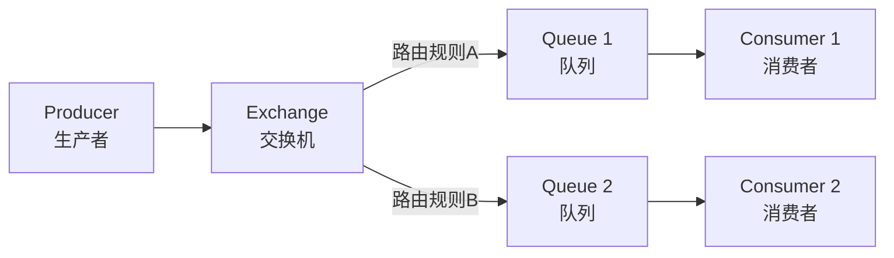
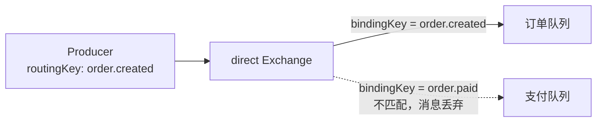
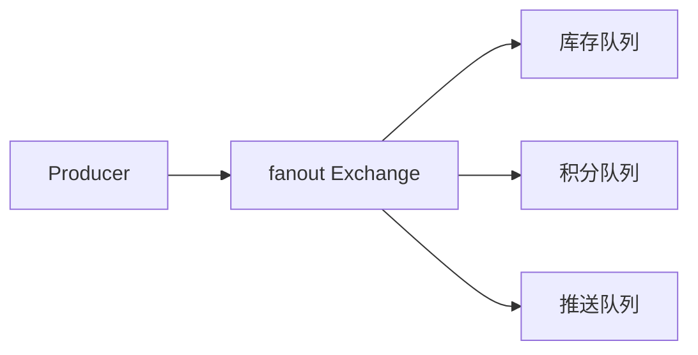
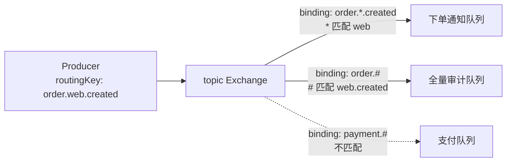

# RabbitMQ 入门与核心概念

## 什么是消息队列

想象一个电商系统：用户下单后，系统需要同时做很多事情——扣库存、发优惠券、推短信通知、记日志。如果这些事串行执行，用户要等很久才能看到"下单成功"。

**消息队列（MQ）就是系统之间的"快递中转站"**。下单系统把"扣库存"这个任务打包成一条消息，扔进 MQ，然后立刻返回给用户。库存系统从 MQ 里取出消息，慢慢处理。两边互不等待，互不干扰。

RabbitMQ 是最流行的开源消息中间件之一，基于 AMQP 协议，用 Erlang 语言开发。

---

## RabbitMQ 解决了什么问题

| 问题 | 没有 MQ 的后果 | 用了 RabbitMQ 之后 |
|---|---|---|
| 系统耦合 | A 系统直接调用 B 接口，B 挂了 A 也卡住 | A 发消息到 MQ 就返回，B 自己取消息处理，两边解耦 |
| 流量突增 | 秒杀时请求直接打到数据库，瞬间崩溃 | 请求先入 MQ，后端按自己的能力慢慢消费 |
| 可靠通知 | 调用第三方接口失败，消息就丢了 | 消息先存到 MQ，确保对方最终能收到 |
| 广播事件 | 一个事件要通知 5 个系统，写 5 次 HTTP 调用 | 发一次消息，5 个系统各自订阅消费 |

---

## RabbitMQ 的核心设计理念

**生产者不直接把消息发给消费者，甚至不直接发给队列**。消息先交给一个叫做 **Exchange（交换机）** 的角色，由它根据**路由规则**决定消息该进哪个队列。消费者再从队列里取消息。

这个过程就像寄快递：你（生产者）把包裹交给快递公司（Exchange），快递公司根据地址（Routing Key）和分拣规则（Binding），把包裹放到对应的仓库（Queue），收件人（消费者）再去仓库取。

---

## 四个核心角色

### Producer（生产者）

负责创建并发送消息。一条消息至少包含两部分：**消息体**（要传递的数据）和 **Routing Key**（路由标签，告诉 Exchange 这条消息应该去哪）。

### Exchange（交换机）

消息的中转站，**所有消息都必须先经过 Exchange**。Exchange 本身不存消息，它只做一件事：根据类型和绑定规则，把消息路由到一个或多个 Queue。

Exchange 有四种类型，后面会详细介绍。

### Queue（队列）

**消息真正存放的地方**。Queue 是 FIFO（先进先出）结构，消息在这里排队等待消费。一个 Queue 可以有多个消费者，但一条消息只会被一个消费者取走。

### Consumer（消费者）

从 Queue 中取消息并进行业务处理。处理完后需要给 RabbitMQ 一个确认（Ack），RabbitMQ 才会把消息从队列中删除。

---

## Exchange 的四种路由类型

Exchange 是 RabbitMQ 最灵活的设计。四种类型满足不同场景：

### Direct：精确匹配

Routing Key **完全等于** Binding Key 时才投递。适合点对点场景。

### Fanout：广播

**忽略 Routing Key**，把消息发给所有绑定的 Queue。适合事件通知场景，比如用户注册后同时发优惠券、推短信、记日志。

### Topic：灵活订阅（最常用）

Binding Key 支持两个通配符：

- `*`：匹配**一个**单词
- `#`：匹配**零个或多个**单词

### Headers：按消息头匹配

根据消息 Headers 中的键值对进行匹配。灵活性高但性能差，**生产环境很少用**。

---

## Binding 是什么

Binding 是 Exchange 和 Queue 之间的**绑定关系**，携带一个 `bindingKey`（绑定键）。

这里有两个容易混淆的概念：

- **Routing Key**：生产者发送消息时附带的路由标签，**跟着消息走**
- **Binding Key**：声明绑定关系时设置的匹配模式，**跟着绑定关系走**

Exchange 收到消息后，拿消息的 Routing Key 和所有 Binding 的 Binding Key 做匹配，匹配上的 Queue 就能收到消息。

---

## Connection 与 Channel

### Connection

应用和 RabbitMQ Broker 之间的 **TCP 长连接**。建立连接需要三次握手，开销较大，所以**一个应用通常只维持一个 Connection**，不要每条消息都新建连接。

### Channel

在 Connection 之上的**逻辑通道**。AMQP 的所有操作（声明 Exchange、发送消息、消费消息）都在 Channel 上进行。**Channel 的创建和销毁非常轻量**。

**重要：Channel 不是线程安全的**。同一个 Channel 不能跨线程并发使用。多线程场景下，每个线程应该使用独立的 Channel。

---

## 与 Kafka、RocketMQ 怎么选

| 维度 | RabbitMQ | Kafka | RocketMQ |
|---|---|---|---|
| 路由能力 | **极强**（Exchange + Routing Key） | 弱（仅 Topic-Partition） | 中等（Tag 过滤） |
| 延迟 | **微秒级** | 毫秒级 | 毫秒级 |
| 吞吐量 | 中等（万～十万级/秒） | **极高**（数十万/秒） | 高（十万级/秒） |
| 消息模型 | 队列 + 路由 | 分区日志 + 偏移量 | 队列 + Tag |
| 消息回溯 | 不支持 | **原生支持** | 支持 |
| 管理后台 | **自带 Web UI** | 无官方 UI | 有 |
| 典型场景 | 业务异步解耦、复杂路由 | 大数据、日志、流处理 | 金融、订单 |

**一句话总结**：如果你的业务需要复杂的路由规则（比如一条消息按不同条件发给不同的系统），或者对延迟很敏感，选 RabbitMQ。如果是海量日志采集、流处理，选 Kafka。

---

## 延伸阅读

- [RabbitMQ 进阶：存储原理与高可用](RabbitMQ进阶：存储原理与高可用)
- [RabbitMQ 进阶：消息可靠性与高级特性](RabbitMQ进阶：消息可靠性与高级特性)
