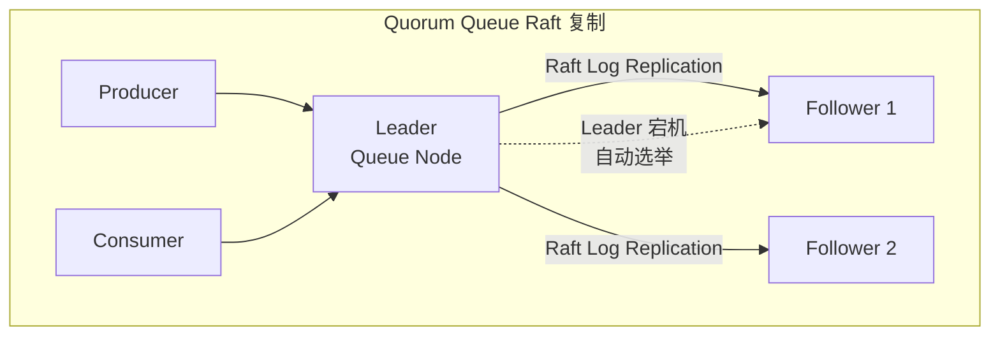

# RabbitMQ 进阶：存储原理与高可用

## 队列类型演进

RabbitMQ 的 Queue 不是单一的实现，而是有三种不同的队列类型，各有适用场景。

| 类型 | 存储方式 | 复制机制 | 适用场景 |
|---|---|---|---|
| `classic` | 内存为主，可选持久化到磁盘 | 单机或镜像队列（4.0 已移除镜像） | 简单场景，逐步淘汰 |
| `quorum` | 日志复制 | **Raft 共识**，多节点同步 | 高可靠生产环境，**推荐** |
| `stream` | 追加日志 | 多副本 | 流式消费，类似 Kafka |

### Classic Queue

最早期的队列实现，消息默认存在内存里，Broker 重启就丢。可以开启持久化把消息写到磁盘，但性能会下降。

旧版本支持**镜像队列**（Mirrored Queue），在多个节点间同步数据，但故障恢复慢、数据一致性弱。**RabbitMQ 4.0 已彻底移除镜像队列**。

### Quorum Queue（推荐）

RabbitMQ 3.8+ 引入，基于 **Raft 共识算法** 实现：

- 每个 Queue 有 **1 个 Leader + N 个 Follower**，分布在不同节点
- 写入需 **多数派确认**（比如 3 节点集群，至少 2 个确认）才返回成功
- Leader 宕机时，Follower 之间自动选举新 Leader，Consumer 自动重连

代价是写入延迟略高、吞吐量比 Classic 低一些，但换来了**强一致性**和**快速故障恢复**。

### Stream Queue

RabbitMQ 3.9+ 引入，采用**追加日志**的存储模型，多个 Consumer 可以从不同位置读取（类似 Kafka 的偏移量）。适合需要**消息回溯**或**流式处理**的场景。

---

## 消息持久化的"三要素"

消息在 Broker 重启后不丢失，需要**三者同时持久化**：

1. **Exchange** 声明为 `durable=true`
2. **Queue** 声明为 `durable=true`
3. **Message** 发送时设置 `deliveryMode=2`（PERSISTENT）

少任何一个，Broker 崩溃时消息都会丢失。这是"消息丢了"问题的头号排查点。

---

## 队列参数的不可变性

声明队列时如果参数与已存在队列不一致，会**直接报错 `PRECONDITION_FAILED`**。

常见的不变参数包括：

- `x-message-ttl`：消息在队列中的存活时间
- `x-max-length`：队列最大消息数
- `x-queue-type`：队列类型（classic / quorum / stream）

生产环境修改队列参数的正确流程：建一个新队列 → 切换消费者到新队列 → 排空旧队列里的消息 → 删除旧队列。

**前期设计要尽量考虑周全，避免后期改结构**。

---

## 集群与高可用：Quorum Queue 的 Raft 复制

Quorum Queue 是 RabbitMQ 当前推荐的集群方案，其核心是 Raft 共识算法：

- 每个 Queue 在集群中以 **Raft 日志** 的形式同步
- 写入请求先到 Leader，Leader 把日志条目复制给 Follower
- 超过半数（W > N/2）确认后，Leader 才向 Producer 返回成功
- Leader 宕机后，剩余节点在几秒内完成选举，Consumer 自动切换

相比旧版 Classic Mirrored Queue，Quorum Queue 的优势：

| 维度 | Classic Mirrored Queue | Quorum Queue |
|---|---|---|
| 故障恢复速度 | 慢（需同步全部数据） | 快（Raft 选举） |
| 数据一致性 | 弱（异步复制可能丢消息） | 强（多数派确认） |
| 资源占用 | 高（所有镜像存全量数据） | 低（仅日志复制） |

限制：Quorum Queue **不支持**独占队列（exclusive）和非持久化消息。

---

## vhost 逻辑隔离

vhost（Virtual Host）是 RabbitMQ 的**逻辑隔离单位**，类似数据库里的 schema：

- Exchange、Queue、用户权限都按 vhost 隔离
- 不同 vhost 里的 Queue 可以重名，互不干扰
- 默认 vhost 是 `/`，生产环境建议按业务或环境分 vhost（如 `/order-prod`、`/order-test`）

开发联调时如果连上去发现什么 Queue 都没有，先检查 `virtual-host` 配置是否正确。

---

## 管理后台的监控视角

RabbitMQ 自带 Web 管理界面（默认 15672 端口），是排查问题的神器。重点关注三个视图：

### Queues 视图

- **Ready**：队列中等待消费的消息数
- **Unacked**：已投递给消费者、但尚未确认的消息数
- **Consumers**：当前连接的消费者数量
- **入队/出队速率**：判断是否存在消费瓶颈

**消息堆积排查的第一站**。如果 Ready 数字持续增长，说明消费者处理速度跟不上生产速度。

### Connections / Channels 视图

- 排查连接泄漏：应用重启后旧连接是否还在
- 排查 Channel 滥用：一个 Connection 下的 Channel 数是否过多

### Exchanges 视图

- 验证 Binding 关系是否正确
- 检查是否有 Exchange 没有绑定任何 Queue（消息会变成"黑洞"）

---

## 延伸阅读

- [RabbitMQ 入门与核心概念](RabbitMQ入门与核心概念)
- [RabbitMQ 进阶：消息可靠性与高级特性](RabbitMQ进阶：消息可靠性与高级特性)
