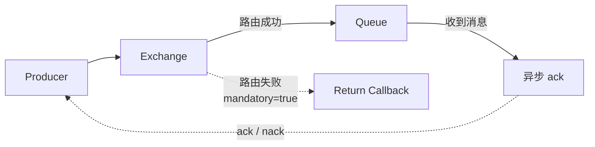
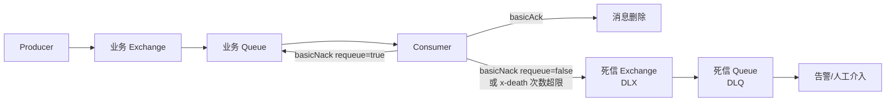
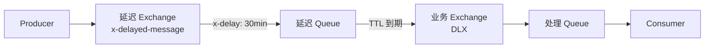
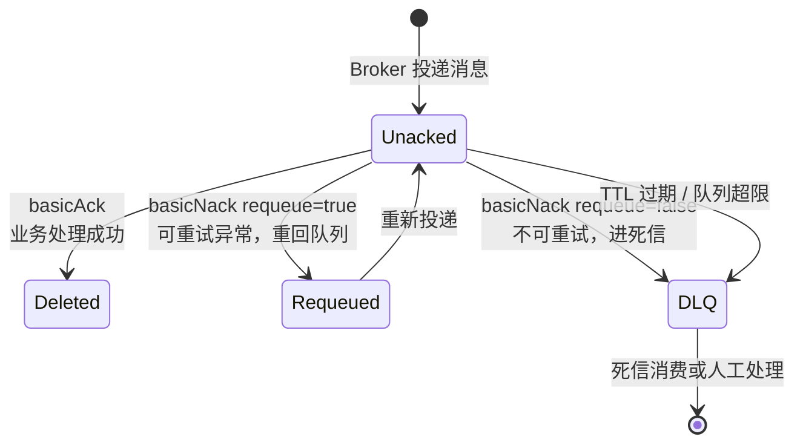

# RabbitMQ 进阶：消息可靠性与高级特性

## 消息可靠性三段保障

RabbitMQ 保证**至少一次投递**，但不保证消息不丢。要做到"消息不丢、不重复处理"，需要从**生产端、Broker、消费端**三段同时保障。

---

## 生产端：Confirm + Return

Producer 把消息发出去后，怎么确认 Broker 真的收到了？

### Publisher Confirm

开启 Confirm 模式后，Broker 收到消息会异步回调 `ack`；如果网络失败或 Broker 拒收，回调 `nack`。

Confirm 是**异步**的，不阻塞发送线程，性能影响很小。但 Confirm 只能确认消息到达了 Exchange，不能确认消息是否路由到了 Queue。

### Return Callback

设置 `mandatory=true` 后，如果消息路由不到任何 Queue，会触发 Return 回调，把消息原样退回给 Producer。



**没有 Confirm + Return，消息可能在"发送成功"的幻觉中丢失**。

如果业务需要强一致性，可以配合**本地消息表**（Outbox 模式）：先写业务数据库 + 消息记录表，异步任务扫描未确认记录重发。

---

## Broker 端：持久化 + Quorum Queue

Broker 是消息的临时存放点，它挂了消息不能丢。

- Exchange、Queue、Message **三者都持久化**（详见存储原理篇的"三要素"）
- 使用 **Quorum Queue**（多节点 Raft 复制），而非单机 Classic Queue
- 集群至少 3 节点，磁盘和内存水位需要监控。内存打满后（`vm_memory_high_watermark`），Broker 会拒绝接收新消息

---

## 消费端：Manual Ack + 幂等 + 死信

### Manual Ack

RabbitMQ 默认是**自动确认**（Auto Ack）：消息一发给 Consumer 就立刻从队列删除。如果 Consumer 处理到一半崩溃了，消息就丢了。

生产环境必须改为**手动确认**（Manual Ack）：Consumer 业务真正处理完成才发送 `basicAck`，处理失败发送 `basicNack`。

| 操作 | 效果 |
|---|---|
| `basicAck` | 业务处理成功，删除消息 |
| `basicNack requeue=true` | 处理失败，消息重回队列，稍后重新投递 |
| `basicNack requeue=false` | 处理失败，消息不再重回队列，进入死信队列 |

### 幂等去重

RabbitMQ 保证"至少一次投递"，网络重连、ack 丢失、消费者重启都会导致消息被重复投递。**幂等是消费者必须自己做的事**。

常用方案：基于业务唯一键（如订单号）查询处理记录表，或用 Redis `SETNX` 做分布式锁，防止重复消费。

RabbitMQ 不像 Kafka 有 exactly-once 事务语义，**业务端幂等 + MQ 至少一次投递 = 事实上的精确一次**。

### 死信队列（DLQ）

多次处理失败的消息如果一直重试，会阻塞正常队列。死信队列的作用是把"坏消息"隔离出来，避免影响正常业务。



**消息进入死信队列的三种情况**：

1. 消息被拒绝且不重回队列（`requeue=false`）
2. 消息 TTL 过期
3. 队列长度超限

### 无限重投陷阱

`basicNack(requeue=true)` 如果 Consumer 代码有 bug（比如反序列化异常），消息会不断重回队列再被投递，形成死循环，把队列打爆。

应限制重试次数：消息头里的 `x-death` 数组记录每次死信信息，超过 N 次直接进 DLQ。或用延迟队列做退避重试。

---

## 延迟队列原理

延迟队列是指消息发送后不会立即被消费，而是等待一段时间后再投递。典型场景：**订单 30 分钟未支付自动取消**。

| 方案 | 原理 | 推荐度 |
|---|---|---|
| **官方延迟插件** | 声明 `x-delayed-message` 类型 Exchange，发消息时指定 `x-delay` header | **推荐**，简单可靠 |
| **TTL + DLX** | 消息先进入设置了 TTL 的"延迟队列"，过期后由 DLX 转发到"处理队列" | 可用，但 TTL 只能整队列一致，不灵活 |



---

## 消费者模型与负载均衡

### Push 模型与背压控制

RabbitMQ 默认使用 **Push 模型**：Broker 主动把消息推送给 Consumer。这种方式效率高，Consumer 不用轮询。

但默认没有流量控制，一个 Consumer 可能一次性收到大量未 ack 消息，导致：

- 该 Consumer 内存溢出
- 其他 Consumer 没消息可消费（"饿死"）

**Prefetch（QoS）是生产环境必配项**。

```
prefetch = N 表示 Broker 最多给消费者推送 N 条未 ack 的消息
```

| 业务类型 | 推荐 prefetch |
|---|---|
| CPU 密集型 | 1 ~ 5 |
| IO 密集型 | 10 ~ 50 |
| 需要严格顺序 | 1 + 单消费者 |

Prefetch 的本质是**背压（backpressure）**：Consumer 处理能力下降时，未 ack 消息堆积达到 prefetch 上限，Broker 停止向该 Consumer 推送，消息自然流向其他空闲 Consumer。

### Ack / Nack / Reject 状态机

一条消息在 Consumer 端的生命周期：



---

## 延伸阅读

- [RabbitMQ 入门与核心概念](RabbitMQ入门与核心概念)
- [RabbitMQ 进阶：存储原理与高可用](RabbitMQ进阶：存储原理与高可用)
