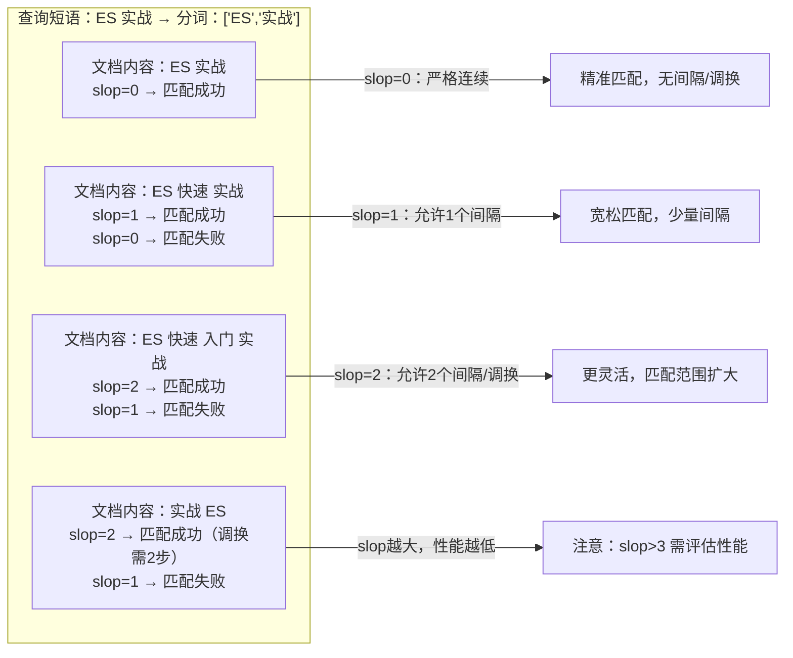
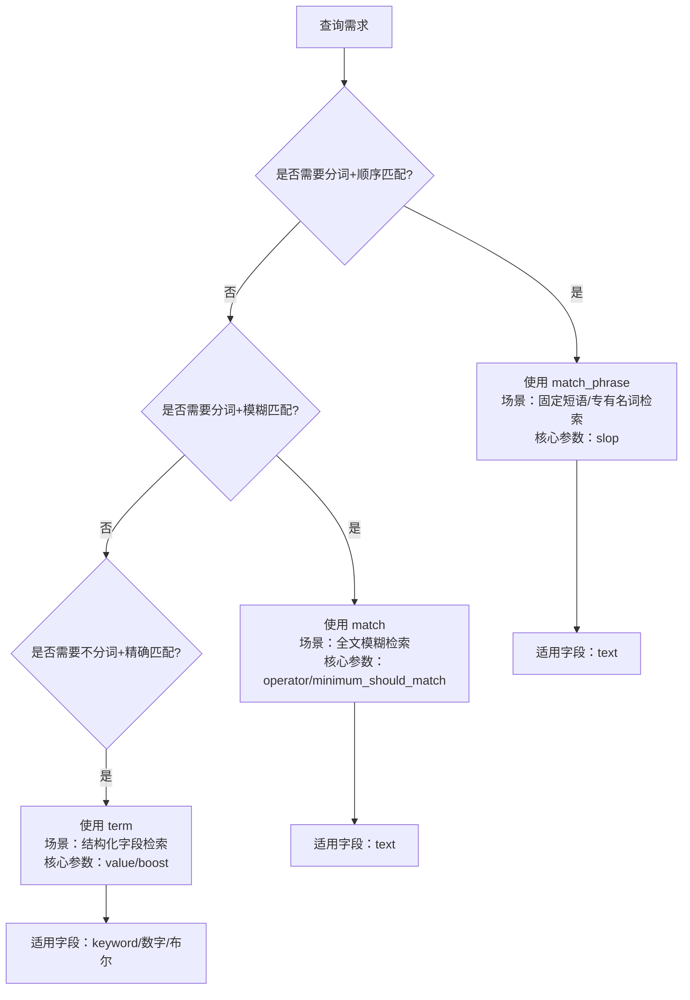
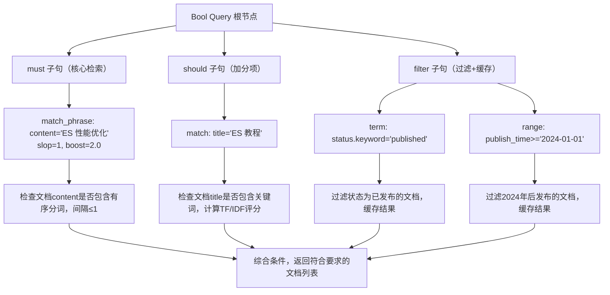
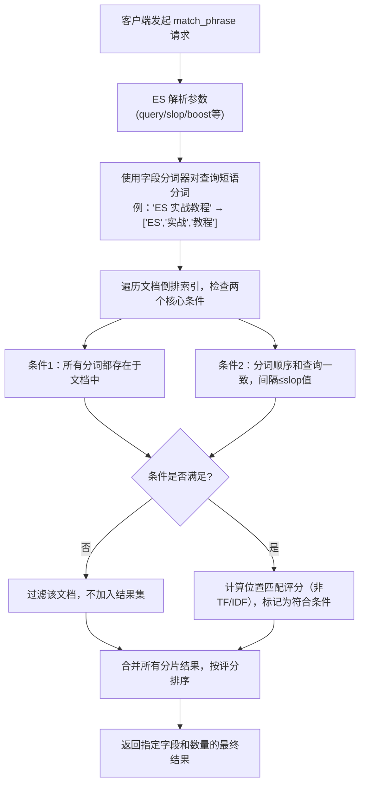

# Elasticsearch match_phrase 短语匹配详解

`match_phrase` 是 Elasticsearch 中实现精准短语检索的核心查询类型。本文从原理、语法、核心参数、使用场景到性能优化，全面解析 match_phrase 的用法和边界。

---

## 基础语法结构

### 最简格式（快速使用）

```json
{
  "query": {
    "match_phrase": {
      "字段名": "查询短语"
    }
  }
}
```

### 完整格式（自定义参数）

```json
{
  "query": {
    "match_phrase": {
      "字段名": {
        "query": "查询短语",
        "slop": 0,
        "boost": 1.0,
        "analyzer": "ik_max_word",
        "zero_terms_query": "none"
      }
    }
  }
}
```

---

## 核心参数详解

### `query`（必选）

要匹配的短语字符串，支持任意文本内容，会被分词器处理为有序分词列表。

- 示例：`"query": "ES 性能优化实战"` → 分词后为 `["ES", "性能优化", "实战"]`（取决于分词器）
- 注意：查询短语的分词逻辑必须和文档字段的分词逻辑一致（否则会匹配失败）

### `slop`（核心可选参数）

这是 `match_phrase` 最关键的参数。

- **作用**：允许查询分词在文档中存在的最大间隔/位置调换步数
- **默认值**：0（严格连续，分词必须无间隔、顺序一致）
- **步数计算规则**：
  - 插入1个词 → 消耗1步 slop
  - 调换2个相邻词的位置 → 消耗2步 slop（如 `A B` → `B A` 需要2步）

#### slop 示例

```json
{
  "match_phrase": {
    "content": {
      "query": "ES 实战",
      "slop": 1
    }
  }
}
```



### `boost`（可选）

权重提升参数，用于调整该查询在多条件组合（如 Bool Query）中的评分占比。

- 数值越大，匹配到该短语的文档评分越高
- 示例：`"boost": 3.0` → 该短语匹配的权重是默认值的3倍

### `analyzer`（可选）

指定处理查询短语的分词器，覆盖字段的默认分词器。

- 场景：字段默认用 `ik_smart`（粗粒度分词），但查询时需要 `ik_max_word`（细粒度分词）
- 示例：`"analyzer": "ik_max_word"`

### `zero_terms_query`（可选）

当查询短语分词后全是停用词（如的、了、吗）时的处理策略。

- `none`（默认）：返回空结果
- `all`：返回所有文档（等价于 `match_all`）
- 示例：`"zero_terms_query": "all"`

---

## match_phrase vs match vs term 对比

新手最易混淆这三个查询，下表清晰区分它们的核心差异：

| 特性 | match_phrase | match | term |
|------|--------------|-------|------|
| 分词处理 | 对查询词分词，要求顺序/间隔匹配 | 对查询词分词，无顺序/间隔要求 | 不对查询词分词，精确匹配完整值 |
| 词顺序 | 敏感（必须和查询顺序一致） | 不敏感（任意顺序均可） | 无分词，不存在顺序问题 |
| 核心参数 | slop（间隔容错） | operator/minimum_should_match | value/boost |
| 适用场景 | 精准短语检索（如固定搭配、专有名词） | 全文模糊检索（如文章内容搜索） | 结构化字段精确匹配（如状态/ID） |
| 示例 | 匹配 ES 实战教程（允许1个间隔） | 匹配包含 ES 或 实战 或 教程 | 匹配完整值 ES 实战教程（keyword字段） |



---

## 实战场景示例

### 场景1：严格短语匹配（slop=0）

需求：查询内容中严格包含 Elasticsearch 性能优化这个短语的文档（无间隔、顺序一致）。

```json
{
  "query": {
    "match_phrase": {
      "content": "Elasticsearch 性能优化"
    }
  },
  "size": 20,
  "_source": ["title", "content", "publish_time"]
}
```

#### 匹配结果

- 成功：`"content": "Elasticsearch 性能优化的核心是分片配置"`
- 失败：`"content": "性能优化 Elasticsearch 的核心是分片配置"`（顺序颠倒）
- 失败：`"content": "Elasticsearch 快速 性能优化的核心是分片配置"`（有间隔）

---

### 场景2：宽松短语匹配（slop=1）

需求：允许短语中词之间有1个间隔，适配更灵活的场景。

```json
{
  "query": {
    "match_phrase": {
      "content": {
        "query": "Elasticsearch 性能优化",
        "slop": 1
      }
    }
  }
}
```

#### 匹配结果

- 成功：`"content": "Elasticsearch 快速 性能优化的核心是分片配置"`（间隔1个词）
- 成功：`"content": "Elasticsearch 性能优化的核心是分片配置"`（无间隔）
- 失败：`"content": "Elasticsearch 快速 入门 性能优化"`（间隔2个词，slop=1不够）

---

### 场景3：结合 Bool Query 组合查询

需求：查询标题包含 ES 教程且内容包含 Elasticsearch 性能优化（允许1个间隔）且状态为已发布的文档。

```json
{
  "query": {
    "bool": {
      "must": [
        {"match": {"title": "ES 教程"}},
        {"match_phrase": {
          "content": {
            "query": "Elasticsearch 性能优化",
            "slop": 1,
            "boost": 2.0
          }
        }}
      ],
      "filter": [
        {"term": {"status.keyword": "published"}}
      ]
    }
  }
}
```



---

## 核心原理

`match_phrase` 是 `match` 查询的精准版，专为短语级别的精准匹配设计。其执行流程如下：

1. 对查询字符串进行**分词**（使用字段指定的分词器），得到有序的分词列表（如 `"Elasticsearch 实战教程"` → `["Elasticsearch", "实战", "教程"]`）
2. 在倒排索引中查找包含这些分词的文档，且要求：
   - 所有分词必须都出现在文档中
   - 分词的**顺序必须和查询字符串一致**
   - 分词在文档中是连续的（或按 `slop` 参数允许的间隔）
3. 不计算复杂的 TF/IDF 评分（仅基于词的位置匹配度），匹配成功则返回文档

### 核心特点

- 区分词的顺序（`"ES 教程"` ≠ `"教程 ES"`）
- 支持有限的间隔容错（通过 `slop` 参数）
- 比 `match` 精准，比 `term` 灵活（允许少量间隔）
- 仅适用于 `text` 类型字段（`keyword` 字段用 `term` 更高效）



---

## 性能优化最佳实践

### 控制 slop 数值

- `slop` 越大，ES 需要检查的词位置组合越多，性能越低
- 建议：业务场景中 slop 不超过 3，避免过大导致性能下降

### 合理选择字段类型

- 仅对 `text` 类型字段使用 `match_phrase`
- 若需对 `keyword` 字段做短语匹配，优先用 `term`（性能更高）

### 避免超长短语查询

- 查询短语分词后数量越多，匹配逻辑越复杂
- 建议：短语长度控制在 5 个分词以内（如 ES 性能优化 实战）

### 结合 filter 提升性能

- 若 `match_phrase` 仅用于过滤（不关心评分），放入 Bool Query 的 `filter` 子句

```json
{
  "query": {
    "bool": {
      "filter": [{"match_phrase": {"content": "ES 实战教程"}}]
    }
  }
}
```

`filter` 会缓存结果，后续相同查询直接复用。

---

## 常见避坑点

### 分词器不一致导致匹配失败

- 文档字段用 `ik_max_word` 分词，查询时用默认 `standard` 分词 → 分词结果不一致，匹配失败
- 解决方案：查询时指定和字段一致的分词器（`analyzer` 参数）

### 忽略大小写导致匹配失败

- 文档中是 Elasticsearch，查询时是 elasticsearch → 若分词器不转小写，会匹配失败
- 解决方案：使用支持小写转换的分词器（如 `ik` 分词器默认转小写）

### 对 keyword 字段使用 match_phrase

- `keyword` 字段的倒排索引是完整字符串，`match_phrase` 分词后无法匹配
- 解决方案：改用 `term` 查询（`"term": {"content.keyword": "ES 实战教程"}`）

---

## 总结

1. `match_phrase` 是 ES 精准短语检索的核心，分词后按顺序匹配，通过 `slop` 控制间隔容错，比 `match` 精准、比 `term` 灵活

2. 核心参数 `slop` 决定匹配宽松度，数值越大匹配范围越广但性能越低，建议设置 0-3

3. 实战中需注意分词器一致性、字段类型适配，结合 `filter` 子句可提升性能

4. 对比 `match`（模糊分词）和 `term`（精确无分词），`match_phrase` 适用于固定短语、专有名词等需要顺序+精准的检索场景
