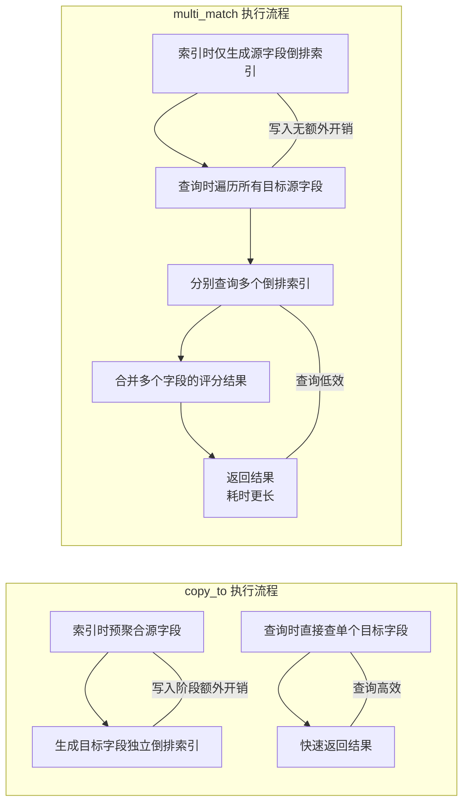

# copy_to 字段参数

`copy_to` 是 Elasticsearch 映射（Mapping）中字段的一个参数，作用是将一个或多个字段的内容复制到一个目标字段中，这个目标字段不会出现在文档的 `_source` 中（仅用于搜索），可以让你基于多个字段的组合内容做聚合、搜索，而无需使用 `multi_match` 等复杂查询。

简单来说，你可以把它理解成"字段内容合并器"——比如把 `first_name` 和 `last_name` 复制到 `full_name`，搜索时只需查 `full_name` 就能匹配到姓名相关的所有内容。

## 基础用法

### 创建映射

```json
PUT /my_index
{
  "mappings": {
    "properties": {
      "first_name": {
        "type": "text",
        "copy_to": "full_name"
      },
      "last_name": {
        "type": "text",
        "copy_to": "full_name"
      },
      "age": {
        "type": "integer"
      },
      "full_name": {
        "type": "text"
      }
    }
  }
}
```

### 写入文档

```json
PUT /my_index/_doc/1
{
  "first_name": "Zhang",
  "last_name": "San",
  "age": 25
}
```

查看文档 `_source`，`full_name` 不会出现在这里：

```json
GET /my_index/_doc/1

{
  "_source": {
    "first_name": "Zhang",
    "last_name": "San",
    "age": 25
  }
}
```

搜索 `full_name`，可以匹配到合并后的内容：

```json
GET /my_index/_search
{
  "query": {
    "match": {
      "full_name": "Zhang San"
    }
  }
}
```

### 进阶用法

**复制到多个目标字段**

```json
"first_name": {
  "type": "text",
  "copy_to": ["full_name", "name_search"]
}
```

**分词规则**：目标字段的分词规则由自身的映射决定，和源字段无关。比如 `first_name` 用 `ik_smart` 分词，`full_name` 用 `standard` 分词，复制后会按 `full_name` 的规则分词。

## 使用场景

| 场景 | 说明 |
|------|------|
| 多字段聚合搜索 | 电商场景，把 `title`、`description`、`tags` 复制到 `all_content`，搜索时只需查 `all_content` |
| 隐藏聚合字段 | 目标字段不显示在 `_source` 中，避免返回冗余数据 |
| 简化查询逻辑 | 无需在查询中组合多个字段，减少查询语句的复杂度 |

## 注意事项

- **目标字段不存储**：默认情况下，`copy_to` 的目标字段不会出现在 `_source` 中，若要存储需显式设置 `"store": true`（不推荐，会增加存储开销）
- **不复制空值**：如果源字段的值为 `null`、空字符串或数组为空，`copy_to` 不会复制这些内容
- **数组字段处理**：如果源字段是数组（比如 `tags: ["a", "b"]`），会把数组所有元素拼接后复制到目标字段
- **性能影响**：大量字段使用 `copy_to` 会增加索引写入的开销（因为要额外复制内容），需平衡搜索效率和写入性能

## 底层原理

`copy_to` 并非在文档存储（`_source`）阶段做内容复制，而是在**字段内容被解析、分词并写入倒排索引的过程中**，将源字段的内容"定向转发"到目标字段的倒排索引中。

简单来说：`_source` 只保留原始文档（源字段），而倒排索引层面，目标字段会额外存储源字段的分词结果——这也是为什么目标字段默认不出现在 `_source`，但能被搜索到的核心原因。

### 执行流程

```mermaid
graph TD
    A[写入文档<br>{first_name:Zhang, last_name:San}] --> B[解析源字段<br>过滤 null/空值]
    B --> C[聚合源字段内容<br>Zhang + San → Zhang San]
    C --> D1[源字段生成倒排索引<br>Zhang→Doc1, San→Doc1]
    C --> D2[目标字段full_name<br>按自身分词规则处理→zhang/san<br>生成独立倒排索引]
    D2 --> E[倒排索引存储完成<br>_source仅保留源字段]

    F[发起查询<br>match: {full_name: "Zhang San"}] --> G[按full_name分词规则<br>拆解查询词→zhang/san]
    G --> H[查询full_name倒排索引<br>匹配 zhang→Doc1 & san→Doc1]
    H --> I[返回匹配文档<br>_source不含full_name]
```

### 索引构建阶段

ES 会按以下步骤处理 `copy_to` 配置：

1. **解析原始文档**：ES 先解析 `_source` 中的所有字段，提取每个源字段的原始值
2. **过滤无效值**：跳过 `null`、空字符串、空数组等无效值
3. **内容聚合**：将所有配置了 `copy_to: 目标字段` 的源字段值做"拼接"（数组字段则拼接所有元素），生成目标字段的原始内容
4. **独立解析目标字段**：对聚合后的目标字段内容，按照**目标字段自身的映射规则**（分词器、数据类型、是否索引等）重新解析

ES 的核心是倒排索引（单词 → 文档 ID 的映射），`copy_to` 的核心作用就体现在这一步：

- **源字段倒排索引**：源字段按自身映射生成倒排索引
- **目标字段倒排索引**：聚合后的目标字段内容按自身映射生成独立的倒排索引
- **存储隔离**：源字段的倒排索引和目标字段的倒排索引是**完全独立**的

### 倒排索引构建细节

```mermaid
graph TD
    S[源字段集合<br>first_name/text, last_name/text] --> F1[过滤无效值<br>仅保留非空内容]
    F1 --> AG[内容聚合<br>拼接为字符串："Zhang San"]
    AG --> M[目标字段映射规则<br>full_name/text + standard分词器]
    M --> T[分词处理<br>"Zhang San" → "zhang", "san"]
    T --> I[生成倒排索引<br>zhang → DocID列表<br>san → DocID列表]
    I --> ST[倒排索引存储<br>与源字段索引完全隔离]
```

### 查询匹配阶段

当你查询目标字段时：

1. ES 先按目标字段的分词规则解析查询词
2. 去目标字段的倒排索引中匹配这些分词，找到对应的文档 ID
3. 返回匹配的文档（`_source` 仍只显示原始源字段，无目标字段）

## 与 multi_match 对比

| 特性 | copy_to | multi_match |
|------|---------|-------------|
| 处理阶段 | 索引写入时（预聚合） | 查询时（实时聚合） |
| 倒排索引 | 目标字段有独立倒排索引 | 无独立索引，查询时遍历多个字段 |
| 搜索性能 | 快（单字段查询） | 慢（多字段遍历+评分合并） |
| 写入性能 | 稍慢（额外生成倒排索引） | 快（无额外开销） |

`copy_to` 是"空间换时间"——写入时多花一点开销生成目标字段的倒排索引，查询时只需查一个字段，大幅提升搜索效率；而 `multi_match` 是"时间换空间"——写入无开销，但查询时要遍历多个字段的倒排索引，还要合并评分，效率更低。



## 与 store: true 的区别

- `store: true`：会将字段内容**额外存储**一份（独立于 `_source`），可通过 `fields` 参数返回，增加存储开销
- `copy_to`：目标字段默认**仅生成倒排索引**，不存储原始内容，因此不出现在 `_source`，也无需额外存储开销（这是 ES 推荐的设计）

## 数组和嵌套字段处理

- **数组字段**：源字段是数组（如 `tags: ["java", "elasticsearch"]`）时，ES 会先将数组元素拼接为字符串（`java elasticsearch`），再复制到目标字段
- **嵌套字段（nested）**：`copy_to` 无法跨嵌套文档复制——嵌套字段的内容只能复制到嵌套文档内部的目标字段，无法复制到根级字段（因为嵌套文档是独立的索引片段）
