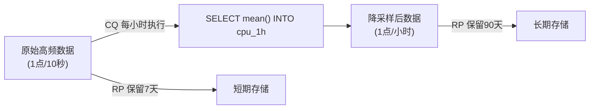
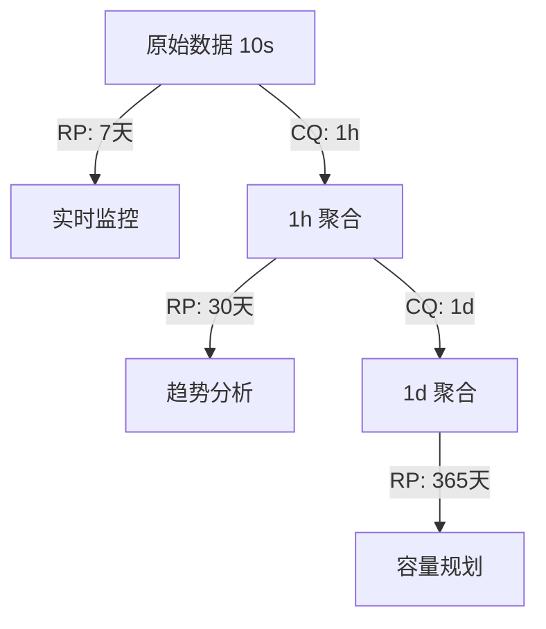

# InfluxDB InfluxQL 回顾：类 SQL 查询、连续查询与保留策略

InfluxQL 是 InfluxDB 1.x 的原生查询语言，语法接近 SQL，但针对时序场景做了专门设计。在 2.x 中 InfluxQL 作为兼容层保留，3.x 中更是成为主推查询接口。掌握 InfluxQL 意味着你的查询技能可以跨越 InfluxDB 的三个大版本。

---

## InfluxQL 的定位与演进

| 版本 | InfluxQL 地位 | 说明 |
|------|-------------|------|
| **1.x** | **唯一查询语言** | 原生支持，功能完整 |
| **2.x** | **兼容保留** | 与 Flux 并存，简单查询推荐 InfluxQL |
| **3.x** | **主推回归** | 官方推荐，同时支持标准 SQL |

> **学习建议**：InfluxQL 是跨版本的"通用货币"，投资学习它的回报率最高。

---

## SELECT 语句

### 基础查询

```sql
-- 查询所有字段
SELECT * FROM "cpu"

-- 查询指定字段
SELECT "usage_user", "usage_system" FROM "cpu"

-- 使用正则匹配 measurement
SELECT * FROM /^cpu.*/

-- 查询时指定数据库和保留策略
SELECT * FROM "mydb"."autogen"."cpu"
```

### 时间范围过滤（必需）

```sql
-- 最近1小时
SELECT * FROM "cpu" WHERE time > now() - 1h

-- 绝对时间范围
SELECT * FROM "cpu" WHERE time >= '2024-01-01T00:00:00Z' AND time <= '2024-01-02T00:00:00Z'

-- 注意：没有 WHERE time 的查询会扫描全表，性能极差
```

> **铁律**：InfluxQL 查询必须包含 `WHERE time` 条件，否则会导致全表扫描。

---

## WHERE 子句

### Tag 过滤（走索引，高效）

```sql
-- 等值匹配
SELECT * FROM "cpu" WHERE "host" = 'server01' AND time > now() - 1h

-- 多值匹配
SELECT * FROM "cpu" WHERE "host" IN ('server01', 'server02') AND time > now() - 1h

-- 正则匹配
SELECT * FROM "cpu" WHERE "host" =~ /^server[0-9]+$/ AND time > now() - 1h

-- 排除匹配
SELECT * FROM "cpu" WHERE "host" !~ /^test-/ AND time > now() - 1h
```

### Field 过滤（不走索引，需全表扫描）

```sql
-- 可以按 field 值过滤，但性能差
SELECT * FROM "cpu" WHERE "usage_user" > 80.0 AND time > now() - 1h

-- 推荐做法：先用 tag 缩小范围，再过滤 field
SELECT * FROM "cpu"
WHERE "host" = 'server01'
  AND "usage_user" > 80.0
  AND time > now() - 1h
```

### 时间函数

| 函数 | 说明 | 示例 |
|------|------|------|
| `now()` | 当前时间 | `time > now() - 1h` |
| `time()` | 时间点 | `time() - 1h` |

---

## GROUP BY 子句

### 按时间窗口聚合

```sql
-- 每5分钟计算平均 CPU 使用率
SELECT mean("usage_user") FROM "cpu"
WHERE time > now() - 6h
GROUP BY time(5m)

-- 每1小时计算最大值、最小值、平均值
SELECT max("usage_user"), min("usage_user"), mean("usage_user") FROM "cpu"
WHERE time > now() - 24h
GROUP BY time(1h)
```

```mermaid
timeline
    title GROUP BY time(5m) 示意
    section 原始数据
        10:00 : 10%
        10:01 : 20%
        10:02 : 30%
        10:03 : 40%
        10:04 : 50%
        10:05 : 60%
        10:06 : 70%
    section 聚合结果
        10:00 : mean=30%
        10:05 : mean=65%
```

### 按 Tag 分组

```sql
-- 按 host 分组，查看每个服务器的平均 CPU
SELECT mean("usage_user") FROM "cpu"
WHERE time > now() - 1h
GROUP BY "host"

-- 按多个 tag 分组
SELECT mean("usage_user") FROM "cpu"
WHERE time > now() - 1h
GROUP BY "host", "region"
```

### 时间窗口 + Tag 组合分组

```sql
-- 每5分钟，按 host 分组计算平均 CPU（最常用）
SELECT mean("usage_user") FROM "cpu"
WHERE time > now() - 1h
GROUP BY time(5m), "host"

-- 结果列：time | mean | host
--         ---- | ---- | -----
--         10:00| 45.2 | server01
--         10:00| 38.7 | server02
--         10:05| 52.1 | server01
--         10:05| 41.3 | server02
```

### FILL 选项（处理空窗口）

```sql
-- 空窗口填充为0
SELECT mean("usage_user") FROM "cpu"
WHERE time > now() - 1h
GROUP BY time(5m) FILL(0)

-- 空窗口使用前值填充
SELECT mean("usage_user") FROM "cpu"
WHERE time > now() - 1h
GROUP BY time(5m) FILL(previous)

-- 不填充（默认）
SELECT mean("usage_user") FROM "cpu"
WHERE time > now() - 1h
GROUP BY time(5m) FILL(none)
```

| FILL 选项 | 行为 |
|-----------|------|
| `none` | 不填充，空窗口无记录（默认） |
| `null` | 填充 NULL |
| `0` | 填充 0 |
| `previous` | 使用前一个非空值 |
| `linear` | 线性插值 |

---

## INTO 子句：数据迁移与降采样

`INTO` 将查询结果写入新的 measurement，是数据降采样和迁移的核心工具。

### 基础降采样

```sql
-- 将高频 CPU 数据聚合为每小时平均值，存入新 measurement
SELECT mean("usage_user") AS "mean_user"
INTO "cpu_hourly"
FROM "cpu"
WHERE time > now() - 7d
GROUP BY time(1h), "host"
```

### 跨保留策略迁移

```sql
-- 将 7 天前的数据从默认 RP 移到长期 RP
SELECT * INTO "mydb"."long_term"."cpu"
FROM "mydb"."autogen"."cpu"
WHERE time > now() - 30d AND time <= now() - 7d
```

### 跨数据库迁移

```sql
-- 将生产数据复制到测试库
SELECT * INTO "testdb".."cpu"
FROM "proddb".."cpu"
WHERE time > now() - 1h
```

---

## 连续查询（Continuous Query, CQ）

CQ 是 InfluxDB 的**自动降采样机制**，按固定周期执行查询并将结果写入新 measurement。

### CQ 工作原理



### 创建 CQ

```sql
-- 每小时计算 CPU 平均值，存入 cpu_1h
CREATE CONTINUOUS QUERY "cq_cpu_1h" ON "mydb"
BEGIN
  SELECT mean("usage_user") AS "mean_user",
         max("usage_user") AS "max_user",
         min("usage_user") AS "min_user"
  INTO "cpu_1h"
  FROM "cpu"
  GROUP BY time(1h), "host"
END;

-- 查看所有 CQ
SHOW CONTINUOUS QUERIES

-- 删除 CQ
DROP CONTINUOUS QUERY "cq_cpu_1h" ON "mydb"
```

### CQ 执行周期

CQ 的执行周期由 `GROUP BY time()` 决定：

| `GROUP BY time()` | 执行周期 | 适用场景 |
|-------------------|---------|---------|
| `time(1m)` | 每分钟 | 极高频数据 |
| `time(1h)` | 每小时 | 标准监控 |
| `time(1d)` | 每天 | 日志类数据 |

### CQ 与 RP 的配合策略

```sql
-- 创建分层 RP
CREATE RETENTION POLICY "short" ON "mydb" DURATION 7d REPLICATION 1 DEFAULT;
CREATE RETENTION POLICY "medium" ON "mydb" DURATION 30d REPLICATION 1;
CREATE RETENTION POLICY "long" ON "mydb" DURATION 365d REPLICATION 1;

-- 创建分层 CQ
CREATE CONTINUOUS QUERY "cq_cpu_1h" ON "mydb"
BEGIN
  SELECT mean("usage_user") INTO "medium"."cpu_1h" FROM "cpu"
  GROUP BY time(1h), "host"
END;

CREATE CONTINUOUS QUERY "cq_cpu_1d" ON "mydb"
BEGIN
  SELECT mean("usage_user") INTO "long"."cpu_1d" FROM "medium"."cpu_1h"
  GROUP BY time(1d), "host"
END;
```

**数据分层架构**：

| 层级 | 粒度 | 保留时长 | 用途 |
|------|------|---------|------|
| 原始数据 | 10秒 | 7天 | 实时监控、告警 |
| 1小时聚合 | 1小时 | 30天 | 趋势分析、日报 |
| 1天聚合 | 1天 | 1年 | 容量规划、年报 |



> **2.x 变化**：2.x 中 CQ 被 **Task** 替代，使用 Flux 语法实现相同功能。3.x 中 CQ 再次被弃用，推荐使用外部调度 + SQL。

---

## 保留策略在查询中的使用

### 完全限定名

```sql
-- 格式："database"."retention_policy"."measurement"
SELECT * FROM "mydb"."autogen"."cpu"
SELECT * FROM "mydb"."one_week"."cpu_1h"
```

### 默认 RP 简写

```sql
-- 使用默认 RP 时可省略 RP 名
SELECT * FROM "mydb".."cpu"       -- 等价于 mydb.autogen.cpu
SELECT * FROM "cpu"               -- 使用当前数据库的默认 RP
```

---

## InfluxQL vs Flux vs SQL 对比

| 维度 | InfluxQL | Flux | 标准 SQL |
|------|----------|------|---------|
| **语法风格** | 类 SQL | 函数式管道 | 声明式 |
| **时间过滤** | `WHERE time > now() - 1h` | `range(start: -1h)` | `WHERE ts > NOW() - INTERVAL '1h'` |
| **时间聚合** | `GROUP BY time(5m)` | `aggregateWindow(every: 5m, fn: mean)` | `GROUP BY time_bucket('5m', ts)` |
| **跨表 Join** | ❌ 不支持 | ✅ `join()` | ✅ 标准 JOIN |
| **子查询** | ✅ 支持 | ✅ 管道即子查询 | ✅ 支持 |
| **数据写入** | `INTO` | `to()` | `INSERT` |
| **窗口函数** | 有限 | 丰富 | 极丰富 |
| **生态工具** | Grafana、Chronograf | Grafana（2.x）、2.x UI | 通用 BI 工具 |

### 同一查询的三种写法

**目标**：查询最近 1 小时 CPU 使用率的 5 分钟平均值。

```sql
-- InfluxQL
SELECT mean("usage_user") FROM "cpu"
WHERE time > now() - 1h
GROUP BY time(5m), "host"
```

```flux
-- Flux
from(bucket: "metrics")
  |> range(start: -1h)
  |> filter(fn: (r) => r._measurement == "cpu")
  |> filter(fn: (r) => r._field == "usage_user")
  |> aggregateWindow(every: 5m, fn: mean)
  |> group(columns: ["host"])
```

```sql
-- 标准 SQL（PostgreSQL + TimescaleDB）
SELECT time_bucket('5 minutes', time) AS bucket,
       host,
       avg(usage_user)
FROM cpu
WHERE time > NOW() - INTERVAL '1 hour'
GROUP BY bucket, host;
```

---

## InfluxQL 在 3.x 中的兼容性

InfluxDB 3.x 对 InfluxQL 的支持情况：

| 特性 | 3.x 支持 | 备注 |
|------|---------|------|
| `SELECT` / `WHERE` / `GROUP BY` | ✅ 完整 | 核心语法不变 |
| `INTO` | ✅ 支持 | 数据迁移可用 |
| `CREATE CONTINUOUS QUERY` | ❌ 弃用 | 使用外部调度 |
| `SHOW` 系列命令 | ⚠️ 部分 | `SHOW MEASUREMENTS` 可用，部分命令调整 |
| `DELETE` / `DROP` | ⚠️ 调整 | 语法可能微调 |
| 标准 SQL | ✅ 新增 | 3.x 支持标准 SQL 查询 |

### 迁移建议

1. **简单查询**（SELECT + WHERE + GROUP BY）：无需改动，1.x/2.x/3.x 通用
2. **CQ 降采样**：2.x 迁移到 Flux Task，3.x 使用外部调度工具（如 Airflow / Cron + SQL）
3. **管理命令**（SHOW/DROP）：3.x 中部分命令被替换为 SQL 风格或系统表查询

---

## 完整查询示例

### 示例1：查询所有服务器的最新内存使用率

```sql
SELECT last("used_percent") AS "latest_mem"
FROM "memory"
WHERE time > now() - 5m
GROUP BY "host"
```

### 示例2：CPU 使用率的 1 小时趋势

```sql
SELECT mean("usage_user") AS "avg_cpu"
FROM "cpu"
WHERE time > now() - 1h
GROUP BY time(5m), "host"
```

### 示例3：网络流量 Top 5 的服务器

```sql
SELECT sum("bytes_recv") AS "total_in"
FROM "net"
WHERE time > now() - 1h
GROUP BY "host"
ORDER BY "total_in" DESC
LIMIT 5
```

### 示例4：磁盘 IO 读写差值

```sql
SELECT mean("read_bytes") AS "avg_read",
       mean("write_bytes") AS "avg_write",
       mean("write_bytes") - mean("read_bytes") AS "net_write"
FROM "diskio"
WHERE time > now() - 1h
GROUP BY time(5m), "host"
```

### 示例5：通过 CQ 实现自动降采样

```sql
-- 创建保留策略
CREATE RETENTION POLICY "one_week" ON "mydb" DURATION 7d REPLICATION 1 DEFAULT;
CREATE RETENTION POLICY "one_month" ON "mydb" DURATION 30d REPLICATION 1;

-- 创建 CQ：每小时聚合，存入长期 RP
CREATE CONTINUOUS QUERY "cq_cpu_1h" ON "mydb"
BEGIN
  SELECT mean("usage_user") AS "mean_user",
         max("usage_user") AS "max_user",
         min("usage_user") AS "min_user"
  INTO "one_month"."cpu_1h"
  FROM "cpu"
  GROUP BY time(1h), "host"
END;
```

### 示例6：查找峰值（最大值及发生时间）

```sql
SELECT max("usage_user") AS "peak_cpu"
FROM "cpu"
WHERE time > now() - 24h
GROUP BY "host"
```

### 示例7：跨 RP 联合查询

```sql
-- 查询原始数据（最近7天）
SELECT mean("usage_user") FROM "mydb"."one_week"."cpu"
WHERE time > now() - 1h
GROUP BY time(5m)

-- UNION 查询多天聚合数据（如果存储在不同 RP）
SELECT * FROM "mydb"."one_week"."cpu"
WHERE time > now() - 1d
UNION ALL
SELECT * FROM "mydb"."one_month"."cpu_1h"
WHERE time <= now() - 1d AND time > now() - 7d
```

---

## 容量规划参考

| 数据规模 | 原始精度保留 | 降采样策略 | CQ 频率 |
|----------|-----------|-----------|---------|
| < 100 台服务器 | 30天 | 1h 保留 90天 | 每小时 |
| 100 ~ 1000 台 | 7天 | 1h 保留 30天，1d 保留 1年 | 每小时 + 每天 |
| 1000 ~ 10000 台 | 1天 | 5m 保留 7天，1h 保留 30天 | 每 5 分钟 |
| > 10000 台 | 6小时 | 1h 保留 7天，1d 保留 90天 | 每小时 |

> 规模越大，原始数据保留时间越短，降采样粒度越粗。CQ 是控制存储成本的核心手段。
