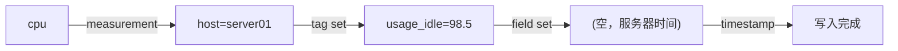
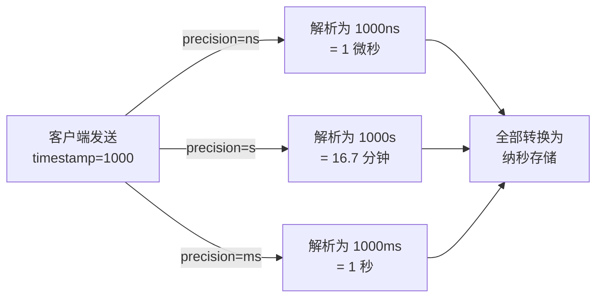
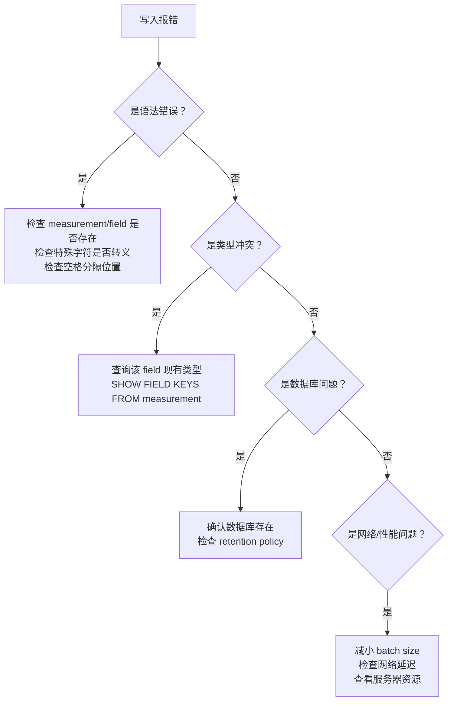

# InfluxDB Line Protocol 详解

InfluxDB 的 Line Protocol 是一种**纯文本格式**，设计目标只有一个：让时序数据以最快的速度从客户端进入数据库。它看起来简单——一行一条数据——但魔鬼藏在细节里。特殊字符怎么转义？数字是整数还是浮点？写入时精度参数到底影响什么？本文从语法到实战，逐层拆解。

---

## 1. 语法结构

一条 Line Protocol 记录由四个部分组成，全部在同一行内，用空格分隔：

```
measurement[,tag_key=tag_value...] field_key=field_value[,field_key=field_value...] [timestamp]
```

| 部分 | 必需 | 说明 |
|------|------|------|
| **measurement** | 是 | 表名，类似 SQL 中的表 |
| **tag set** | 否 | 键值对，用于索引和分组，逗号分隔 |
| **field set** | 是 | 键值对，存储实际数据，逗号分隔 |
| **timestamp** | 否 | Unix 时间戳，省略则使用服务器接收时间 |

### 最小示例

```text
cpu,host=server01 usage_idle=98.5
```

对应结构化表示：



### 完整示例

```text
weather,location=us-midwest temperature=82,humidity=71 1465839830100400200
```

拆解：

| 成分 | 值 |
|------|-----|
| measurement | `weather` |
| tag | `location=us-midwest` |
| field 1 | `temperature=82`（默认浮点） |
| field 2 | `humidity=71`（默认浮点） |
| timestamp | `1465839830100400200`（纳秒级 Unix 时间） |

---

## 2. 特殊字符与转义规则

这是 Line Protocol 最容易踩坑的地方。不同位置的字符有不同的转义规则。

### 2.1 measurement 中的特殊字符

| 字符 | 处理方式 | 示例 |
|------|----------|------|
| 逗号 `,` | **必须转义**（前加 `\`） | `my\,measurement` |
| 空格 ` ` | **必须转义** | `my\ measurement` |

```text
# ✅ 正确：measurement 名包含逗号
my\,app,env=prod cpu=0.64

# ❌ 错误：未转义逗号会被解析为 tag 分隔符
my,app,env=prod cpu=0.64   # 解析为 measurement="my", tag="app", tag="env=prod" —— 结构全乱
```

### 2.2 tag key / tag value 中的特殊字符

| 字符 | 处理方式 | 说明 |
|------|----------|------|
| 逗号 `,` | 必须转义（前加 `\`） | 否则会被当作下一个 tag 的分隔符 |
| 等号 `=` | 必须转义 | 否则会被当作 key/value 分隔符 |
| 空格 ` ` | 必须转义 | 否则会被当作 tag set 和 field set 的分隔符 |

```text
# ✅ 正确：tag value 包含等号
disk,path=\=etc\=fstab free=1024000

# ✅ 正确：tag value 包含逗号
disk,types=ext4\,xfs used_percent=45.2
```

### 2.3 field key 中的特殊字符

| 字符 | 处理方式 |
|------|----------|
| 逗号 `,` | 必须转义 |
| 等号 `=` | 必须转义 |
| 空格 ` ` | 必须转义 |

### 2.4 field value 中的特殊字符（按类型区分）

**字符串类型：**

| 字符 | 处理方式 | 示例 |
|------|----------|------|
| 双引号 `"` | 必须转义为 `\"` | `"she said \"hello\""` |
| 反斜杠 `\` | 必须转义为 `\\` | `"C:\\Users\\Admin"` |

```text
# ✅ 正确：字符串 field
logs,service=api message="Error: connection refused" 1710000000000000000

# ✅ 正确：包含双引号的字符串
logs,service=api message="She said \"It is broken\"" 1710000000000000000

# ❌ 错误：字符串未加引号
logs,service=api message=Error: connection refused    # 冒号和空格会导致解析失败
```

**整数、浮点、布尔类型：** 不需要对 field value 本身做字符转义，但数值后缀有严格语法。

### 2.5 不需要转义的字符

以下字符在对应位置出现时**不需要转义**，但建议避免使用以保持清晰：

| 位置 | 字符 | 说明 |
|------|------|------|
| measurement/tag/field key | 句号 `.` | 允许，常用于层级命名如 `cpu.usage` |
| measurement/tag/field key | 斜杠 `/` | 允许 |
| tag value | 句号 `.` | 允许 |
| field value（字符串） | 单引号 `'` | 不需要转义，原样保留在引号内即可 |

---

## 3. 数据类型与后缀推断

Line Protocol 中，**field value 的类型由后缀决定**，而不是由值的内容推断。

### 3.1 类型后缀速查表

| 类型 | 后缀 | 示例 | 存储精度 |
|------|------|------|----------|
| **浮点** | 无（默认） | `value=1.0` 或 `value=1` | 64-bit IEEE-754 |
| **整数** | `i` | `value=1i` | 64-bit signed int |
| **无符号整数** | `u` | `value=1u` | 64-bit unsigned int（仅 InfluxDB v2） |
| **字符串** | 双引号包裹 | `value="hello"` | UTF-8 |
| **布尔** | 无后缀 | `value=true` | 实际存储为 boolean |

### 3.2 布尔值合法写法

```text
# ✅ 以下全部为 true
bool_val=t, bool_val=T, bool_val=true, bool_val=TRUE, bool_val=True

# ✅ 以下全部为 false
bool_val=f, bool_val=F, bool_val=false, bool_val=FALSE, bool_val=False

# ❌ 非法（会被解析为字符串）
bool_val=1        # 这是整数 1，不是布尔 true
bool_val=yes      # 非法布尔字面量，写入会报错
```

### 3.3 类型推断的陷阱

```text
# 写入
sensor,temp=25.0 value=1

# InfluxDB 存储为：value = 1.0（浮点）
# 如果你之后写入：
sensor,temp=25.0 value=1i

# ❌ 报错：field type conflict，同一 field 不能混用浮点和整数
```

> **黄金法则**：一个 measurement 中同一 field_key 的类型一旦确定，后续写入必须保持一致。要存储整型，**永远加 `i` 后缀**。

### 3.4 类型转换实战

```text
# 场景：计数器必须从 0 开始用整数
requests,path=/api counter=0i

# 场景：温度传感器输出浮点
temperature,room=101 value=23.5

# 场景：状态码用整数
http,status=200 code=200i

# 场景：错误信息用字符串
error,service=db message="timeout waiting for lock"
```

---

## 4. 时间戳精度参数

Line Protocol 支持的时间戳精度有五种：`ns`（纳秒）、`us`（微秒）、`ms`（毫秒）、`s`（秒）、`ns` 是默认值。

### 4.1 精度参数的作用

精度参数**只影响 HTTP API 写入时对时间戳字符串的解析方式**，不影响存储精度（InfluxDB 内部始终用纳秒存储）。



### 4.2 precision 参数用法

**InfluxDB v1 HTTP API：**

```bash
# 时间戳是毫秒级（如 JavaScript Date.now() 返回值）
curl -X POST "http://localhost:8086/write?db=mydb&precision=ms"   --data-binary "cpu,host=server01 usage_idle=98.5 1710000000000"
```

**InfluxDB v2 / v3 API：**

```bash
# v2 使用 precision 查询参数，与 v1 相同
curl -X POST "http://localhost:8086/api/v2/write?bucket=mydb&precision=ms&org=myorg"   -H "Authorization: Token mytoken"   --data-binary "cpu,host=server01 usage_idle=98.5 1710000000000"
```

### 4.3 常见精度踩坑

| 场景 | 问题 | 结果 |
|------|------|------|
| 发送毫秒时间戳，但 precision 默认 ns | 时间戳被放大 10⁶ 倍 | 数据被写入到未来百万秒 |
| 发送纳秒时间戳，但 precision=s | 时间戳被缩小 10⁹ 倍 | 所有数据集中在 1970 年附近 |
| 省略时间戳且未指定 precision | 使用服务器接收时间 | 跨时区部署时可能出现偏差 |

### 4.4 精度选择建议

```text
# 来源                 典型精度        推荐 precision
# ─────────────────────────────────────────────────────
# 系统时钟 / Date.now()   ms           precision=ms
# Java Instant.now()      ns           precision=ns (或省略，默认 ns)
# Python time.time()      s            precision=s
# 手动秒级打点            s            precision=s
```

---

## 5. 常见写入错误排查

### 5.1 错误速查表

| 错误信息 | 原因 | 修复 |
|----------|------|------|
| `unable to parse points` | 语法格式错误 | 检查空格、逗号位置，确认 measurement 和 field 存在 |
| `partial write: field type conflict` | 同一 field 混用不同类型 | 统一 field 类型，或更换 field_key |
| `database not found` | 数据库/ bucket 不存在 | 先创建数据库 |
| `points beyond retention policy` | 时间戳超出保留策略 | 检查时间戳精度或调整 retention policy |
| `write failed: hinted handoff queue not empty` | 节点间复制队列阻塞 | 检查集群网络，或临时增加 queue 容量 |
| `timeout` | 批量太大或并发太高 | 减小 batch size，或增加超时时间 |

### 5.2 逐条排查流程



### 5.3 可验证的诊断命令

**查看某 measurement 的 field 类型：**

```bash
# InfluxDB v1
influx -database 'mydb' -execute 'SHOW FIELD KEYS FROM cpu'

# 输出示例：
# name: cpu
# fieldKey    fieldType
# --------    ---------
# usage_idle  float
# temperature float
# counter     integer
```

**验证一条记录语法是否正确（离线验证）：**

```python
# Python 快速验证脚本
import re

def validate_line(line):
    # 基本格式：measurement[tags] fields [timestamp]
    pattern = r'^[^\s]+(?:,[^\s]+)*\s+[^\s]+(?:,[^\s]+)*(?:\s+\d+)?$'
    if not re.match(pattern, line):
        return False, "格式不匹配：需要 measurement [tags] fields [timestamp]"

    # 检查 field set 存在（至少有一个 key=value）
    parts = line.split()
    if len(parts) < 2:
        return False, "缺少 field set"

    # 检查 timestamp 是否为纯数字
    if len(parts) >= 3:
        if not parts[-1].isdigit():
            return False, "timestamp 必须是纯数字"

    return True, "格式合法"

# 测试
print(validate_line("cpu,host=a usage=1.0 1000"))      # ✅
print(validate_line("cpu,host=a usage=1.0"))           # ✅（无时戳）
print(validate_line("cpu usage"))                      # ❌ 缺少等号
print(validate_line("cpu,host=a"))                   # ❌ 缺少 field
```

**批量写入时的部分失败检测：**

```bash
# v1 API 返回 400 时，响应体包含失败行号
curl -w "
HTTP %{http_code}
" -X POST   "http://localhost:8086/write?db=mydb"   --data-binary $'cpu,host=a usage=1.0
cpu,host=b usage=1.0
cpu,host=c badfield
mem,host=a used=100'

# 400 响应中会指出第 3 行解析失败，第 1/2/4 行成功写入
# → 需要用幂等写入 + 重试机制处理部分失败
```

---

## 6. Line Protocol vs JSON vs CSV

InfluxDB 为什么选择自定义的纯文本格式，而不是更通用的 JSON 或 CSV？核心原因是**写入性能**和**解析效率**。

| 维度 | Line Protocol | JSON | CSV |
|------|-------------|------|-----|
| **序列化开销** | 极低（纯文本，无结构包装） | 高（大量引号、括号、键名重复） | 中（无键名重复，但有分隔符） |
| **解析速度** | 最快（按空格/逗号/等号切割） | 慢（需 JSON 解析器，递归处理嵌套） | 中等（需处理转义和引号） |
| **类型歧义** | 无（通过后缀 `i`/`u`/`"` 显式声明） | 有（数字 vs 字符串歧义，需 Schema） | 有（所有值均为字符串，需推断） |
| **Schema 要求** | 无 Schema（schemaless） | 需要 Schema（字段名重复携带） | 需要 Schema（首行 Header） |
| **批量效率** | 一行一点，换行分隔，极紧凑 | 对象数组包裹，冗余键名 | 每行重复 header 或依赖外部 header |
| **典型体积** | 1x（基准） | 2x ~ 4x | 1.2x ~ 1.5x |

**性能对比示例**（10,000 条数据点）：

```text
# Line Protocol（约 480KB）
cpu,host=server01,region=beijing usage_user=23.5,usage_system=4.2 1710000000000000000
cpu,host=server02,region=shanghai usage_user=45.8,usage_system=8.1 1710000000000000001
... (10000 行)

# JSON（约 1.8MB）
{
  "points": [
    {"measurement": "cpu", "tags": {"host": "server01", "region": "beijing"},
     "fields": {"usage_user": 23.5, "usage_system": 4.2}, "timestamp": 1710000000000000000},
    ...
  ]
}

# CSV（约 650KB，需外部 schema 说明每列含义）
measurement,host,region,usage_user,usage_system,timestamp
cpu,server01,beijing,23.5,4.2,1710000000000000000
cpu,server02,shanghai,45.8,8.1,1710000000000000001
```

> **结论**：Line Protocol 是时序写入的最优解——它用最小的体积、最直观的格式、最快的解析速度，专为高频批量写入而生。JSON 适合人类可读性和复杂嵌套结构，CSV 适合表格分析工具导入，但两者都不适合 InfluxDB 的百万级点/秒写入场景。

---

## 7. 语法完整性检查清单

在发送数据前，逐条核对：

- [ ] measurement 非空
- [ ] 至少有一个 field（`key=value` 格式）
- [ ] tag 和 field 之间有空格分隔
- [ ] 特殊字符（`,` `=` ` `）已用 `\` 转义
- [ ] 字符串 field value 用双引号包裹
- [ ] 整数加了 `i` 后缀
- [ ] 时间戳精度与 `precision` 参数一致
- [ ] 同一 field 的类型与历史数据一致

---

## 8. 总结

Line Protocol 的简洁性是它的最大优势，也是最大陷阱。记住三条铁律：

1. **特殊字符必须转义** —— 逗号、等号、空格在 key/value 中从不"友好"
2. **整数永远加 `i`** —— 不写后缀就是浮点，后续改类型会引发冲突
3. **精度参数必须与时间戳匹配** —— 默认值是纳秒，发送毫秒时务必声明 `precision=ms`

掌握这三条，90% 的写入异常都可以避免。剩下的 10%，用 `SHOW FIELD KEYS` 和日志排查即可。
