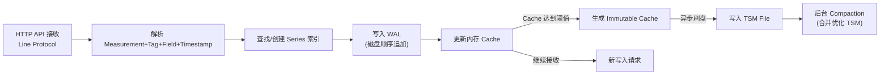
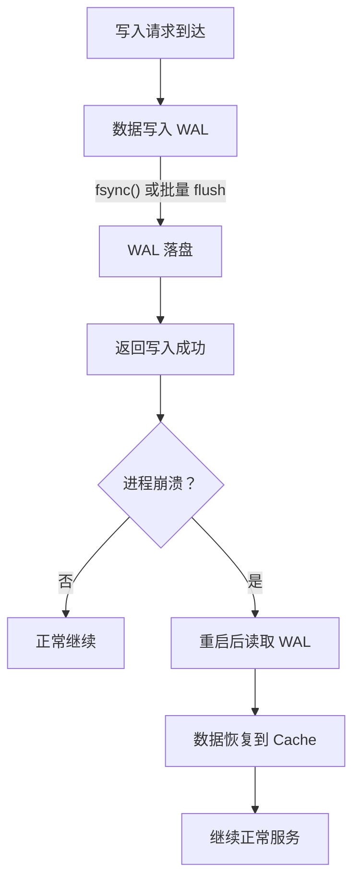
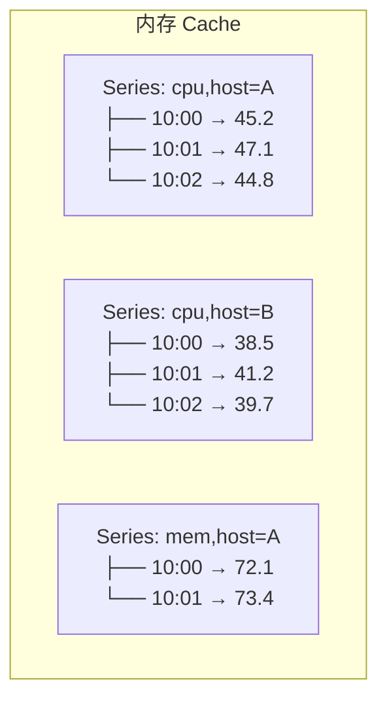
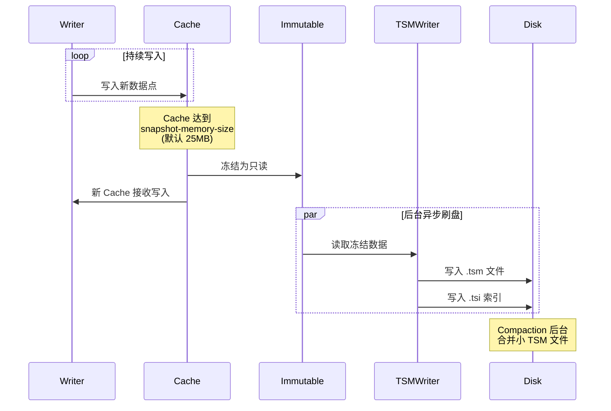
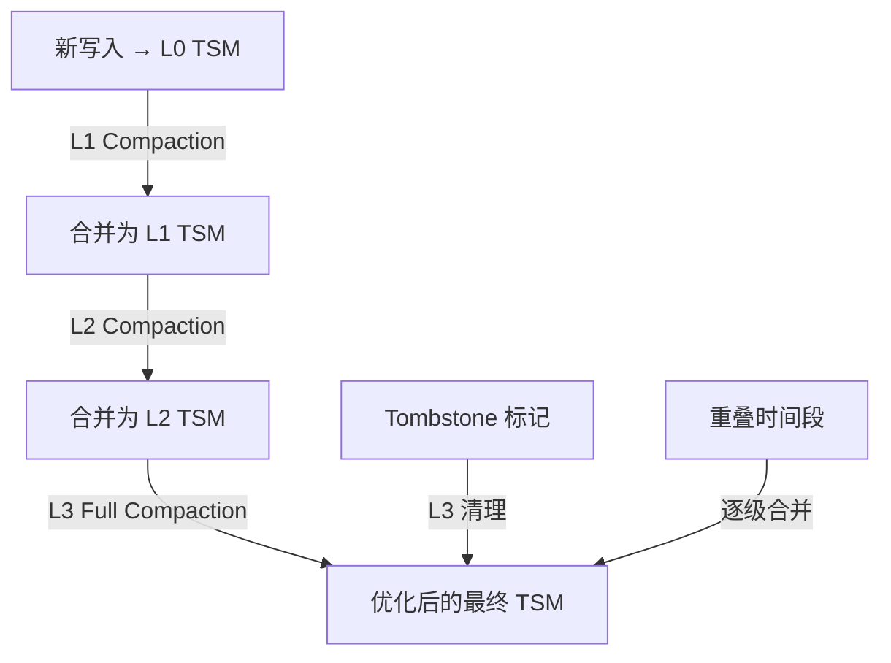

# InfluxDB TSM 存储引擎核心解析：WAL、Cache、Compaction 与文件结构

TSM（Time-Structured Merge Tree）是 InfluxDB 1.x 和 2.x 的核心存储引擎。理解 TSM 的写入路径、文件组织和压缩机制，是诊断写入性能问题和进行容量规划的基础。

---

## TSM 的设计目标

TSM 针对时序数据的三个核心特征做了专门优化：

| 特征 | 传统数据库处理 | TSM 优化策略 |
|------|---------------|-------------|
| **时间有序写入** | 随机插入 B+ 树 | 追加写入 + 时间分片 |
| **批量到达** | 逐行事务 | WAL 批量顺序追加 |
| **极少更新删除** | 原地更新 | 只读 TSM 文件 + 标记删除 |

---

## 写入路径完整流程



### 各阶段详解

| 阶段 | 存储介质 | 数据格式 | 作用 |
|------|---------|---------|------|
| **WAL** | 磁盘 | 纯文本/二进制日志 | 崩溃恢复，保证写入不丢失 |
| **Cache** | 内存 | 跳表/有序 map | 近期数据快速查询 |
| **Immutable Cache** | 内存（只读） | 冻结的 Cache | 刷盘前的快照 |
| **TSM File** | 磁盘 | 列式压缩块 | 长期存储 |

---

## WAL（Write-Ahead Log）

### WAL 的作用

WAL 是写入路径的第一个落盘点，核心职责：**保证数据持久性**。即使 InfluxDB 进程崩溃，重启后也能从 WAL 恢复未刷盘的数据。



### WAL 文件组织

```
/var/lib/influxdb/wal/
├── mydb/
│   └── autogen/
│       ├── 1/              # Shard ID
│       │   └── _00001.wal  # WAL 段文件
│       └── 2/
│           └── _00002.wal
```

| 参数 | 说明 | 默认值 |
|------|------|--------|
| `wal-fsync-delay` | WAL flush 延迟 | `0`（每次写入都 fsync） |
| `wal-dir` | WAL 存储目录 | 与数据目录相同 |

> **调优提示**：高吞吐场景可适当增加 `wal-fsync-delay`（如 `100ms`），将多次小写入合并为一次 fsync，降低 I/O 压力。

---

## Cache（内存缓存）

### Cache 的结构

Cache 是内存中的有序数据结构，存储**尚未刷盘到 TSM 的最新数据**。查询时优先查 Cache，未命中再查 TSM 文件。



### Cache → Immutable → TSM 的转换



### Cache 关键参数

```toml
[data]
  cache-max-memory-size = "1g"           # Cache 内存上限
  cache-snapshot-memory-size = "25m"     # 触发刷盘的 Cache 大小
  cache-snapshot-write-cold-duration = "10m"  # 强制刷盘间隔
```

| 参数 | 调大效果 | 调小效果 |
|------|----------|----------|
| `cache-max-memory-size` | 更多热数据在内存，查询更快 | 更早刷盘，内存压力小 |
| `cache-snapshot-memory-size` | 更少 WAL 文件，碎片少 | 更频繁刷盘，恢复快 |
| `cache-snapshot-write-cold-duration` | 旧数据更久在内存 | 更频繁刷盘 |

---

## TSM File 结构

TSM 文件是只读的列式存储文件，采用**分块压缩**策略。

### 文件布局

```
┌─────────────────────────────────────────────────────────────┐
│  Header (Magic Number + Version)                            │
├─────────────────────────────────────────────────────────────┤
│  Blocks:                                                    │
│  ┌─────────────┐ ┌─────────────┐ ┌─────────────┐          │
│  │ Series 1    │ │ Series 2    │ │ Series 3    │          │
│  │ Time Chunk  │ │ Time Chunk  │ │ Time Chunk  │          │
│  │ Value Chunk │ │ Value Chunk │ │ Value Chunk │          │
│  │ (压缩)      │ │ (压缩)      │ │ (压缩)      │          │
│  └─────────────┘ └─────────────┘ └─────────────┘          │
├─────────────────────────────────────────────────────────────┤
│  Index: Series → [Block Offset, Min Time, Max Time]        │
├─────────────────────────────────────────────────────────────┤
│  Footer (Index Offset)                                      │
└─────────────────────────────────────────────────────────────┘
```

### Block 压缩机制

每个 Block 存储一个 Series 在一个时间范围内的数据：

| 数据类型 | 压缩算法 | 压缩效果 |
|---------|---------|---------|
| **时间戳** | Delta-of-Delta + ZigZag | 典型 10:1 |
| **浮点数** | Gorilla XOR | 典型 5:1 ~ 10:1 |
| **整数** | ZigZag + RLE | 典型 3:1 ~ 8:1 |
| **字符串** | Snappy | 典型 2:1 ~ 4:1 |
| **布尔** | Bit packing | 典型 8:1 |

---

## Compaction（合并压缩）

### 为什么需要 Compaction

随着时间推移，TSM 文件会呈现以下问题：

1. **文件碎片化**：频繁的小批量刷盘产生大量小文件
2. **重叠时间范围**：不同文件的相同 Series 可能有重叠的时间段
3. **空间膨胀**：更新和删除只是写入 tombstone，旧数据仍占空间

### Compaction 级别

| 级别 | 触发条件 | 行为 | 影响 |
|------|---------|------|------|
| **Level 1** | Cache 刷盘后 | 将新 TSM 与现有 L1 合并 | I/O 小 |
| **Level 2** | L1 文件过多 | 合并多个 L1 为更大文件 | I/O 中等 |
| **Level 3** | 全量优化 | 重写所有文件，清理 tombstone | I/O 大 |



### Compaction 参数

```toml
[data]
  max-concurrent-compactions = 3      # 并发 compaction 数
  compact-full-write-cold-duration = "4h"  # 全量 compaction 间隔
  compact-throughput = "48m"          # 限速（字节/秒）
  compact-throughput-burst = "48m"    # 突发限速
```

> **SSD vs HDD**：SSD 上可以提高 `max-concurrent-compactions`（3~4），HDD 上建议降低（1~2），避免随机 I/O 拖垮写入性能。

---

## 内存管理

### TSM 的内存消耗来源

| 来源 | 大约占比 | 可控性 |
|------|---------|--------|
| **Series 索引（TSI）** | 30 ~ 50% | 通过 cardinality 控制 |
| **Cache** | 20 ~ 40% | 通过 cache-max-memory-size |
| **WAL 缓冲** | 5 ~ 10% | 通过 wal-fsync-delay |
| **Compaction 缓冲** | 5 ~ 15% | 通过 max-concurrent-compactions |
| **查询工作内存** | 5 ~ 20% | 通过并发查询数控制 |

### 内存告警阈值

```toml
# 当 Series 数量超过阈值时触发告警
[data]
  max-series-per-database = 1000000
  max-values-per-tag = 100000
```

| 场景 | 建议 max-series-per-database |
|------|---------------------------|
| 开发测试 | 100,000 |
| 中小型生产 | 500,000 |
| 大型生产 | 1,000,000+ |

---

## TSM 与 IOx 的对比

InfluxDB 3.x 用 IOx 引擎全面替代了 TSM：

| 维度 | TSM | IOx |
|------|-----|-----|
| **存储格式** | 自定义 TSM 文件 | Apache Parquet（列式） |
| **内存索引** | TSI（内存 + 磁盘） | 无内存索引（直接查 Parquet） |
| **基数限制** | 受内存索引限制 | 理论上无限 |
| **压缩算法** | Delta-of-Delta、Gorilla | Parquet 原生 + Zstd |
| **查询引擎** | 自定义 | Apache Arrow DataFusion |
| **云存储** | 不支持 | 直接读写 S3 |
| **SQL 支持** | 不支持 | 原生标准 SQL |

> **迁移注意**：TSM 数据文件不能直接迁移到 IOx，需要通过导出/导入或升级工具转换。
