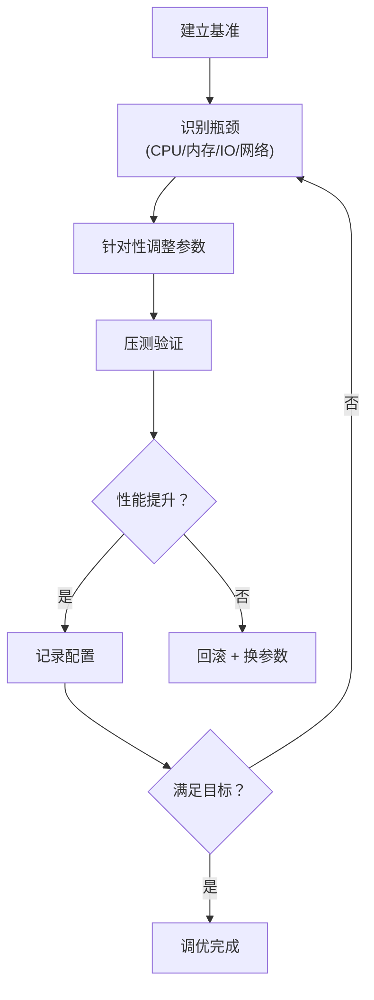
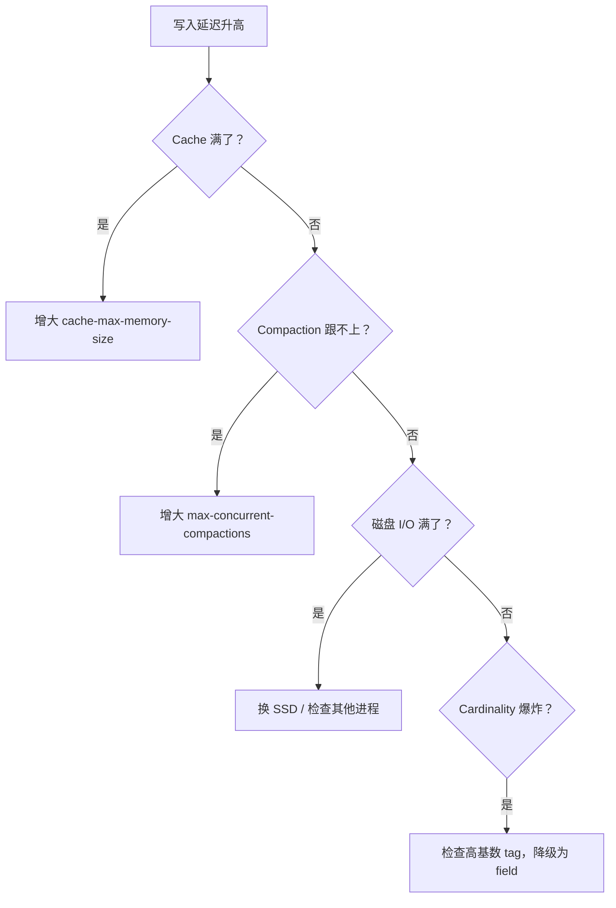
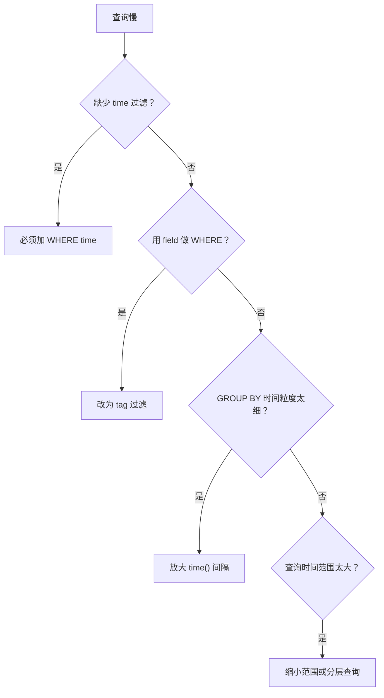
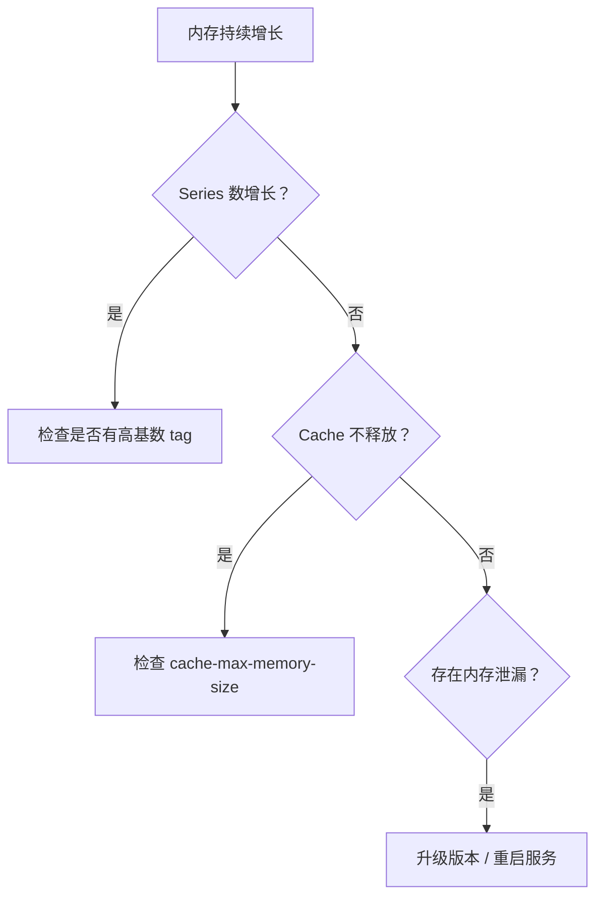

# InfluxDB 内存与性能调优核心解析：缓存配置、并发参数与硬件建议

InfluxDB 的性能调优是一门平衡艺术——在写入吞吐、查询延迟、内存占用和磁盘 I/O 之间找到最优配置。本文提供系统性的调优方法论和可落地的参数建议。

---

## 性能调优方法论

### 调优原则

| 原则 | 说明 |
|------|------|
| **先测量，后调优** | 没有基准数据的调优是盲目猜测 |
| **一次只改一个参数** | 多变量同时调整无法归因 |
| **关注瓶颈指标** | CPU / 内存 / 磁盘 I/O / 网络，找到真正的瓶颈 |
| **保留安全边际** | 生产配置留 20% 余量，避免峰值时崩溃 |

### 调优流程



---

## 硬件建议

### CPU

| 场景 | 建议 | 说明 |
|------|------|------|
| 写入密集型 | 4+ 核 | Compaction 和 WAL 是 CPU 密集型 |
| 查询密集型 | 8+ 核 | 聚合查询和大量并发需要 CPU |
| 混合场景 | 8+ 核 | 写入和查询争抢 CPU |

> Compaction 是后台 CPU 消耗大户，高写入场景下可能占用 30~50% CPU。

### 内存

| 数据规模 | 建议内存 | 说明 |
|----------|---------|------|
| Cardinality < 100K | 4~8 GB | Series 索引可全部放入内存 |
| Cardinality < 1M | 16~32 GB | TSI 缓存 + Cache 需要大量内存 |
| Cardinality < 10M | 64~128 GB | 大内存优化索引和查询 |
| Cardinality > 10M | 128+ GB | 考虑 3.x IOx 或集群方案 |

**内存分配公式**：
```
总内存 = TSI 索引缓存 + Cache + WAL 缓冲 + 查询工作区 + OS 缓冲

建议：
  cache-max-memory-size = 总内存 × 30%
  预留 OS + 查询 = 总内存 × 20%
  TSI 索引 = 剩余部分
```

### 磁盘

| 磁盘类型 | 适用场景 | 建议 |
|----------|---------|------|
| **NVMe SSD** | 所有生产环境 | 首选，随机 I/O 性能最佳 |
| **SATA SSD** | 中小型生产 | 性价比高 |
| **HDD** | 仅测试/归档 | 仅低写入低频查询场景 |

> **RAID 注意**：RAID 0 提升写入速度但无冗余；RAID 10 兼顾速度和冗余。避免 RAID 5/6 的写惩罚。

### 网络

| 场景 | 建议 |
|------|------|
| 本机采集 | 无特殊要求 |
| 跨可用区写入 | 启用 gzip 压缩，带宽 > 100Mbps |
| 跨地域复制 | 专线或高带宽，考虑边缘写入节点 |

---

## 核心参数调优

### 写入路径参数

```toml
[data]
  # Cache 内存上限（未刷盘数据）
  cache-max-memory-size = "1g"

  # 触发刷盘的 Cache 大小阈值
  cache-snapshot-memory-size = "25m"

  # 强制刷盘时间间隔（即使未达内存阈值）
  cache-snapshot-write-cold-duration = "10m"

  # 最大并发 compaction（后台压缩）
  max-concurrent-compactions = 3

  # Compaction 速度限制
  compact-throughput = "48m"

  # 单数据库最大 Series 数
  max-series-per-database = 1000000

  # 单 tag 最大唯一值数
  max-values-per-tag = 100000
```

| 参数 | 小型环境 | 中型环境 | 大型环境 |
|------|---------|---------|---------|
| `cache-max-memory-size` | 512m | 2g | 8g+ |
| `cache-snapshot-memory-size` | 25m | 50m | 100m |
| `max-concurrent-compactions` | 1 | 3 | 4 |
| `max-series-per-database` | 100K | 500K | 1M+ |

### WAL 参数

```toml
[data]
  wal-fsync-delay = "0"           # 每次写入 fsync（最安全）
  wal-dir = "/var/lib/influxdb/wal"  # WAL 目录（可放 SSD）
```

| 场景 | `wal-fsync-delay` 建议 | 说明 |
|------|----------------------|------|
| 极致安全 | `0` | 每次写入都 fsync，延迟最大 |
| 平衡 | `100ms` | 100ms 内批量 fsync，推荐 |
| 极致吞吐 | `1s` | 1秒批量 fsync，崩溃可能丢 1s 数据 |

### 查询路径参数

```toml
[coordinator]
  # 最大并发查询数
  max-concurrent-queries = 10

  # 查询超时
  query-timeout = "60s"

  # 查询日志
  log-queries-after = "10s"
```

| 参数 | 说明 |
|------|------|
| `max-concurrent-queries` | 超过此值的查询排队，保护服务器 |
| `query-timeout` | 超时查询强制终止 |
| `log-queries-after` | 慢查询日志阈值 |

---

## 监控指标解读

### 内置 `_internal` 数据库

InfluxDB 自带监控数据库 `_internal`，存储关键性能指标：

```sql
-- 查看可用 measurement
SHOW MEASUREMENTS ON "_internal"
-- 输出：database, httpd, queryExecutor, runtime, shard, subscriber, tsm1_cache, tsm1_engine, tsm1_filestore, tsm1_wal, write
```

### 关键监控查询

**1. 写入速率**

```sql
-- InfluxQL
SELECT non_negative_derivative(mean(pointReq), 1s)
FROM "write"
WHERE time > now() - 1h

-- Flux
from(bucket: "_internal")
  |> range(start: -1h)
  |> filter(fn: (r) => r._measurement == "write")
  |> filter(fn: (r) => r._field == "pointReq")
  |> derivative(unit: 1s, nonNegative: true)
```

**2. Cache 使用率**

```sql
-- InfluxQL
SELECT mean("cacheBytes") / 1024 / 1024 / 1024 AS "cache_gb"
FROM "tsm1_cache"
WHERE time > now() - 1h

-- 健康阈值: < cache-max-memory-size × 80%
```

**3. WAL 堆积情况**

```sql
SELECT mean("walSize") / 1024 / 1024 AS "wal_mb"
FROM "tsm1_wal"
WHERE time > now() - 1h

-- 健康阈值: 不应持续增长
```

**4. Compaction 压力**

```sql
SELECT mean("compactionDuration") / 1000000000 AS "compaction_sec"
FROM "tsm1_engine"
WHERE time > now() - 1h

-- 健康阈值: < 60 秒
```

**5. Series Cardinality**

```sql
-- InfluxQL
SELECT mean("numSeries")
FROM "database"
WHERE time > now() - 1h

-- Flux
from(bucket: "_internal")
  |> range(start: -1h)
  |> filter(fn: (r) => r._measurement == "database")
  |> filter(fn: (r) => r._field == "numSeries")
```

### 告警阈值速查表

| 指标 | 警告阈值 | 严重阈值 | 处理建议 |
|------|---------|---------|---------|
| Cache 使用率 | > 70% | > 90% | 增大 cache-max-memory-size 或降低写入 |
| WAL 大小 | > 100MB | > 500MB | 检查磁盘 I/O，降低 wal-fsync-delay |
| Compaction 耗时 | > 30s | > 120s | 增加 max-concurrent-compactions |
| Series 数量 | > 80% 预算 | > 100% 预算 | 检查高基数 tag，降级为 field |
| 查询延迟 P99 | > 500ms | > 2s | 增加索引，优化查询范围 |
| HTTP 错误率 | > 1% | > 5% | 检查写入格式，降低并发 |

---

## 常见问题诊断

### 场景1：写入延迟突然升高



### 场景2：查询缓慢



### 场景3：内存持续增长



---

## 调优配置模板

### 小型环境（开发/测试）

```toml
[data]
  cache-max-memory-size = "512m"
  cache-snapshot-memory-size = "25m"
  max-concurrent-compactions = 1
  max-series-per-database = 100000
  wal-fsync-delay = "100ms"

[coordinator]
  max-concurrent-queries = 5
  query-timeout = "30s"
```

### 中型生产环境

```toml
[data]
  cache-max-memory-size = "2g"
  cache-snapshot-memory-size = "50m"
  max-concurrent-compactions = 3
  max-series-per-database = 500000
  wal-fsync-delay = "100ms"
  compact-throughput = "48m"

[coordinator]
  max-concurrent-queries = 10
  query-timeout = "60s"
```

### 大型生产环境

```toml
[data]
  cache-max-memory-size = "8g"
  cache-snapshot-memory-size = "100m"
  max-concurrent-compactions = 4
  max-series-per-database = 1000000
  wal-fsync-delay = "100ms"
  compact-throughput = "96m"

[coordinator]
  max-concurrent-queries = 20
  query-timeout = "120s"
```

---

## 总结

性能调优的优先级：

| 优先级 | 调优项 | 投入产出比 |
|--------|--------|-----------|
| 1 | 控制 Tag Cardinality | 极高（防止性能断崖） |
| 2 | 调整 Cache 参数 | 高（直接影响读写性能） |
| 3 | 优化 Compaction | 高（影响磁盘和查询） |
| 4 | 硬件升级（SSD / 内存） | 中（成本较高但效果显著） |
| 5 | WAL 参数微调 | 中（写入延迟 vs 安全性） |
| 6 | 查询并发限制 | 中（保护稳定性） |
