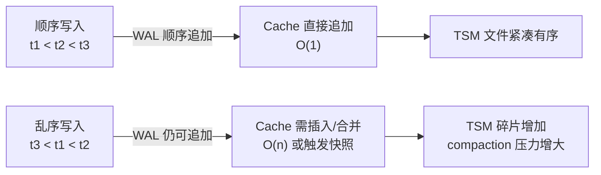

# InfluxDB 写入优化与最佳实践

InfluxDB 的写入性能在时序数据库中属于第一梯队，但默认配置远非最优。真正跑满磁盘和网络带宽，需要在批量大小、并发连接、标签基数、内存缓冲等维度做系统性调优。本文从客户端到服务端，逐层展开可落地的优化策略。

---

## 1. 批量写入策略

单条发送是写入性能的头号杀手。HTTP 请求的建立、TLS 握手、服务端解析 overhead，会让吞吐量暴跌两个数量级。

### 1.1 批量大小的黄金区间

| batch size | 适用场景 | 效果 |
|------------|----------|------|
| 1 ~ 100 | 调试、低频率指标 | 延迟最低，吞吐量极差 |
| 500 ~ 5,000 | 通用生产环境 | 延迟与吞吐的平衡点 |
| 10,000 ~ 50,000 | 高吞吐场景（IoT、APM） | 吞吐最大化，延迟可接受 |
| 100,000+ | 极限压测、数据迁移 | 吞吐最高，但失败重传代价大 |

### 1.2 推荐的 batch 配置

**Telegraf：**

```toml
[agent]
  # 每批次收集的最大点数
  metric_batch_size = 5000

  # 缓冲区满时的刷新间隔（秒）
  metric_buffer_limit = 10000
  flush_interval = "10s"
```

**InfluxDB v1 客户端（Go / Java / Python）：**

```python
from influxdb_client import InfluxDBClient, Point
from influxdb_client.client.write_api import SYNCHRONOUS, ASYNCHRONOUS

client = InfluxDBClient(url="http://localhost:8086", token="my-token", org="my-org")

# 异步写入 + 批量缓冲（推荐）
write_api = client.write_api(
    write_options=WriteOptions(
        batch_size=5000,       # 每批 5000 条
        flush_interval=10_000,  # 或每 10 秒刷新
        retry_interval=5_000,   # 重试间隔 5 秒
    )
)

# 写入点会被自动聚合到批次中
point = Point("cpu").tag("host", "server01").field("usage", 0.64)
write_api.write(bucket="mydb", record=point)

# 关闭时确保缓冲区刷盘
write_api.close()
```

**InfluxDB v1 直接 HTTP：**

```bash
# 将多条记录用换行符拼接，一次性发送
cat > batch.txt <<'EOF'
cpu,host=server01 usage=0.64 1710000000000000000
cpu,host=server02 usage=0.71 1710000000000000000
mem,host=server01 used=4194304 1710000000000000000
mem,host=server02 used=3670016 1710000000000000000
EOF

curl -X POST "http://localhost:8086/write?db=mydb&precision=ns"   --data-binary @batch.txt
```

### 1.3 批量失败的回退策略

**Telegraf：**

```toml
[agent]
  # 失败时的重试配置
  metric_batch_size = 5000
  metric_buffer_limit = 100000
  flush_interval = "10s"

  # 重试次数
  [[outputs.influxdb_v2]]
    urls = ["http://localhost:8086"]
    bucket = "mydb"
    token = "${INFLUX_TOKEN}"
    timeout = "5s"
    # Telegraf 内置指数退避，无需手动配置
```

**Python 中的指数退避重试示例：**

```python
import time
import random

def write_with_backoff(client, batch, max_retries=5):
    for attempt in range(max_retries):
        try:
            client.write(batch)
            return True
        except Exception as e:
            if "timeout" in str(e).lower() or "connection" in str(e).lower():
                sleep = (2 ** attempt) + random.uniform(0, 1)
                time.sleep(sleep)
            else:
                # 不可重试错误，直接拆批处理
                return write_individual(client, batch)
    return False

def write_individual(client, batch):
    """逐条写入，隔离脏数据"""
    failed = []
    for line in batch:
        try:
            client.write([line])
        except Exception:
            failed.append(line)
    return failed  # 返回死信
```

---

## 2. 并发控制

批量解决的是"每次请求带多少数据"，并发解决的是"同时发多少个请求"。两者乘积决定了理论峰值吞吐。

### 2.1 并发连接数的选择

| 并发数 | 适用场景 | 注意点 |
|--------|----------|--------|
| 1 | 低频写入、顺序保证 | 最简单，吞吐有上限 |
| 2 ~ 8 | 大多数生产环境 | 平衡了吞吐和服务器压力 |
| 10 ~ 32 | 高吞吐集群写入 | 需要 InfluxDB 集群或 SSD |
| 50+ | 极限压测 | 容易触发服务端反压或 OOM |

### 2.2 客户端并发配置

**Telegraf：**

```toml
[[outputs.influxdb_v2]]
  urls = ["http://localhost:8086"]
  bucket = "mydb"

  # 每个输出插件的并发连接数
  # Telegraf 默认使用内部协程池，一般不需要手动调
```

**Go 客户端：**

```go
import (
    "github.com/influxdata/influxdb-client-go/v2"
)

func main() {
    client := influxdb2.NewClient("http://localhost:8086", "my-token")

    writeAPI := client.WriteAPI("my-org", "mydb")
    // WriteAPI 内部已使用缓冲 + 异步 goroutine
    // 默认并发由 Go runtime 调度，通常无需额外控制

    // 如需限制并发，手动加 semaphore
    writeAPI.Close()
}
```

**Python + aiohttp（手动并发控制）：**

```python
import asyncio
import aiohttp

async def write_batch(session, url, payload):
    async with session.post(url, data=payload) as resp:
        return resp.status

async def controlled_write(batches, max_concurrent=4):
    semaphore = asyncio.Semaphore(max_concurrent)

    async def bounded_write(batch):
        async with semaphore:
            async with aiohttp.ClientSession() as session:
                return await write_batch(session, "http://localhost:8086/write?db=mydb", batch)

    results = await asyncio.gather(*[bounded_write(b) for b in batches])
    return results

# 使用
batches = ["cpu,host=a usage=1
mem,host=a used=100"] * 100
asyncio.run(controlled_write(batches, max_concurrent=4))
```

### 2.3 服务端并发限制

InfluxDB v1 可以通过配置限制最大并发写入，防止过载：

```toml
# /etc/influxdb/influxdb.conf
[http]
  # 最大并发连接数
  max-connection-limit = 0  # 0 = 不限制

  # 每个连接的读取超时
  read-timeout = "10s"

  # 写入超时
  write-timeout = "10s"

[data]
  # 最大并发压缩/刷盘 goroutine
  max-concurrent-compactions = 3
```

### 2.4 反压与背压

当服务端负载过高时，健康的系统应该**减速而不是崩溃**。

```python
# 客户端反压逻辑
class AdaptiveWriter:
    def __init__(self, initial_batch=5000, initial_concurrent=4):
        self.batch_size = initial_batch
        self.concurrent = initial_concurrent
        self.error_count = 0

    def on_success(self):
        # 成功后缓慢提升 batch size
        if self.error_count == 0 and self.batch_size < 50000:
            self.batch_size = min(int(self.batch_size * 1.1), 50000)

    def on_error(self, status):
        if status in (503, 429):  # 服务端过载
            self.error_count += 1
            # 降低并发和批次
            self.concurrent = max(1, self.concurrent // 2)
            self.batch_size = max(100, self.batch_size // 2)
            time.sleep(2 ** min(self.error_count, 5))
        else:
            # 其他错误立即重试单条
            pass
```

---

## 3. gzip 压缩传输

在批量写入场景中，启用 gzip 压缩可以显著降低网络带宽占用，尤其在跨可用区或跨地域部署时收益明显。

### 3.1 压缩效果

| 数据特征 | 原始体积 | gzip 压缩后 | 压缩率 |
|----------|---------|------------|--------|
| 高重复度指标（如心跳包） | 100KB | 8 ~ 12KB | 85 ~ 90% |
| 随机浮点值（如 CPU 使用率） | 100KB | 40 ~ 55KB | 45 ~ 60% |
| 长字符串日志 | 100KB | 25 ~ 35KB | 65 ~ 75% |

### 3.2 客户端启用 gzip

**HTTP API + curl：**

```bash
# 发送前用 gzip 压缩数据
cat batch.txt | gzip > batch.txt.gz

curl -X POST "http://localhost:8086/write?db=mydb&precision=ns"   -H "Content-Encoding: gzip"   -H "Content-Type: text/plain; charset=utf-8"   --data-binary @batch.txt.gz
```

**Python 客户端：**

```python
import gzip
import requests

def write_gzipped(url, payload_lines):
    # 将多条 Line Protocol 压缩
    payload = "
".join(payload_lines).encode('utf-8')
    compressed = gzip.compress(payload)

    headers = {
        "Authorization": "Token my-token",
        "Content-Encoding": "gzip",
        "Content-Type": "text/plain; charset=utf-8"
    }

    resp = requests.post(url, data=compressed, headers=headers)
    return resp.status_code
```

**Telegraf 自动启用：**

```toml
[[outputs.influxdb_v2]]
  urls = ["http://localhost:8086"]
  bucket = "mydb"
  token = "${INFLUX_TOKEN}"
  # Telegraf 默认自动检测并启用 gzip
  # 如需显式控制：
  content_encoding = "gzip"
```

### 3.3 压缩的权衡

| 场景 | 建议 | 原因 |
|------|------|------|
| 本机 / 同机房 | 不启用 | gzip CPU 开销 > 网络收益 |
| 跨可用区 | 启用 | 带宽节省明显 |
| 公网 / 跨地域 | 必须启用 | 带宽是瓶颈 |
| 单批次 < 1000 条 | 不启用 | 压缩 overhead 不划算 |
| 单批次 > 5000 条 | 启用 | 压缩率随数据量增加而提升 |

> **服务端默认支持**：InfluxDB 的 HTTP 层自动识别 `Content-Encoding: gzip` 并解压，无需额外配置。

---

## 4. 按时间顺序写入

InfluxDB 对**乱序写入**（out-of-order writes）的处理代价远高于顺序写入。理解这一点并优化客户端行为，能显著降低 WAL 和 TSM 层的开销。

### 4.1 为什么乱序写入更慢

InfluxDB 的写入路径假设数据按时间戳升序到达：



| 写入模式 | WAL 开销 | Cache 开销 | TSM 开销 | 整体影响 |
|----------|----------|------------|----------|----------|
| 严格升序 | 顺序追加，最优 | 追加到末尾 | 顺序生成 | 基准性能 |
| 轻微乱序（±几秒） | 几乎无差别 | 轻微插入 | 轻微碎片 | < 10% 下降 |
| 中度乱序（±几分钟） | 无差别 | 需要合并 | 碎片增加 | 20 ~ 50% 下降 |
| 严重乱序（±几小时） | 无差别 | 强制快照 | 大量碎片 | 2x ~ 5x 下降 |

### 4.2 乱序写入的典型来源

| 来源 | 原因 | 解决方案 |
|------|------|----------|
| 分布式采集器时钟不同步 | NTP 未同步或漂移 | 统一 NTP，或在客户端校准时间戳 |
| 消息队列消费顺序错乱 | Kafka partition 重平衡 | 按时间分片 topic，消费端排序缓冲 |
| 批量补录历史数据 | 数据修复、迁移 | 分时段批量写入，避免与实时数据混排 |
| 网络延迟导致重传 | TCP 重排序 | 应用层加序列号，写入前本地排序 |
| 多线程并发写入 | 线程间竞争 | 单线程排序后写入，或用时间窗口聚合 |

### 4.3 客户端排序策略

**写入前本地排序（推荐）：**

```python
from collections import defaultdict

def sort_and_write(lines):
    """将 Line Protocol 按时间戳排序后批量写入"""
    parsed = []
    for line in lines:
        parts = line.rsplit(' ', 1)  # measurement[tags] fields timestamp
        if len(parts) == 2 and parts[-1].isdigit():
            ts = int(parts[-1])
            parsed.append((ts, line))
        else:
            parsed.append((float('inf'), line))  # 无时戳的放最后

    parsed.sort(key=lambda x: x[0])
    sorted_lines = [line for _, line in parsed]

    # 现在按顺序发送
    return "
".join(sorted_lines)

# 示例
lines = [
    "cpu,host=a usage=1 1000000003",
    "cpu,host=a usage=2 1000000001",
    "cpu,host=a usage=3 1000000002",
]
sorted_payload = sort_and_write(lines)
# 输出按 t1, t2, t3 排序
```

**Telegraf 的排序选项：**

```toml
# Telegraf 默认不排序，但可以结合 processor 实现
[[processors.starlark]]
  source = 