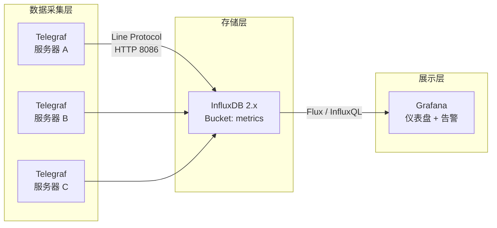
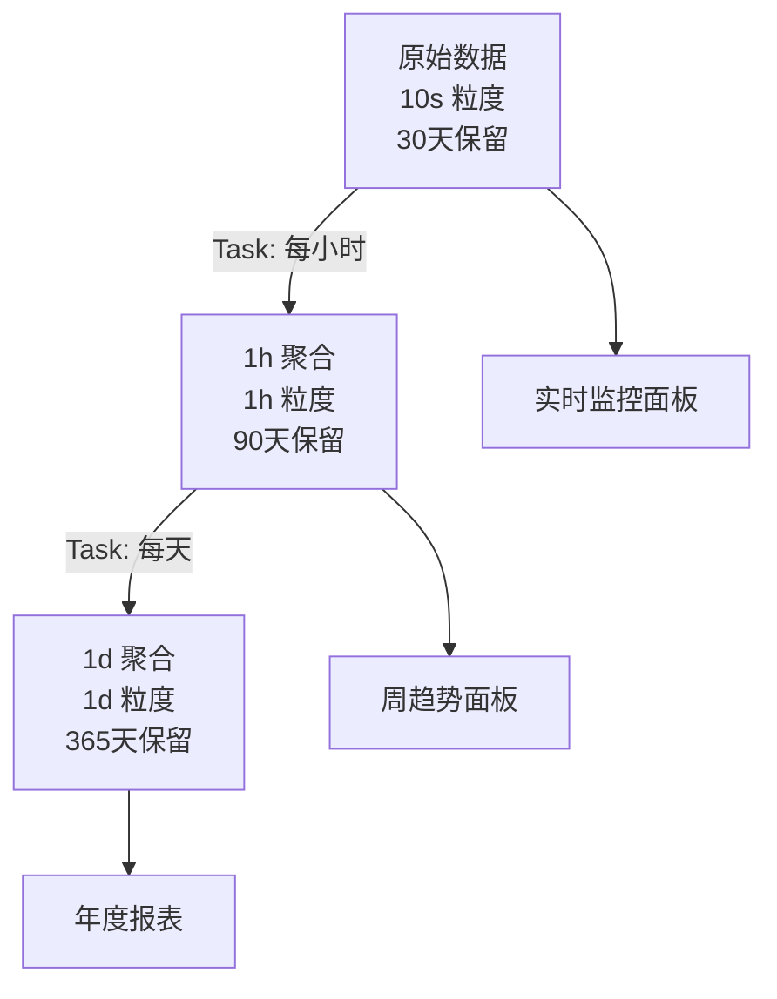

# InfluxDB 实战案例：指标监控平台搭建（Telegraf → InfluxDB → Grafana）

本文通过一个完整的指标监控平台案例，展示从数据采集到存储再到可视化的端到端链路。这是 InfluxDB 最典型的生产落地场景。

---

## 架构概览



---

## 第一步：部署 InfluxDB

### Docker 部署

```bash
docker run -d \
  --name influxdb \
  -p 8086:8086 \
  -v influxdb_data:/var/lib/influxdb2 \
  -e DOCKER_INFLUXDB_INIT_MODE=setup \
  -e DOCKER_INFLUXDB_INIT_USERNAME=admin \
  -e DOCKER_INFLUXDB_INIT_PASSWORD=StrongPassword123 \
  -e DOCKER_INFLUXDB_INIT_ORG=monitoring \
  -e DOCKER_INFLUXDB_INIT_BUCKET=metrics \
  -e DOCKER_INFLUXDB_INIT_RETENTION=30d \
  influxdb:2.7
```

### 获取 Token

```bash
ADMIN_TOKEN=$(docker logs influxdb 2>&1 | grep "token=" | head -1 | sed 's/.*token=//')
echo "Token: $ADMIN_TOKEN"
```

---

## 第二步：配置 Telegraf 采集

### 服务器端安装

```bash
# Ubuntu/Debian
wget -q https://repos.influxdata.com/influxdata-archive_compat.key -O /dev/null | \
  gpg --dearmor | sudo tee /etc/apt/trusted.gpg.d/influxdata-archive_compat.gpg > /dev/null
echo "deb [signed-by=/etc/apt/trusted.gpg.d/influxdata-archive_compat.gpg] \
  https://repos.influxdata.com/debian stable main" | \
  sudo tee /etc/apt/sources.list.d/influxdata.list
sudo apt update && sudo apt install telegraf

# macOS
brew install telegraf
```

### Telegraf 配置

```toml
# /etc/telegraf/telegraf.conf

[global_tags]
  datacenter = "beijing"
  env = "production"
  project = "monitoring-demo"

[agent]
  interval = "10s"
  metric_batch_size = 5000
  metric_buffer_limit = 10000
  flush_interval = "10s"
  flush_jitter = "5s"

# ===== 系统指标 =====
[[inputs.cpu]]
  percpu = true
  totalcpu = true
  fielddrop = ["time_*"]

[[inputs.mem]]

[[inputs.disk]]
  ignore_fs = ["tmpfs", "devtmpfs", "devfs", "iso9660", "overlay", "aufs", "squashfs"]

[[inputs.diskio]]

[[inputs.net]]
  interfaces = ["eth*", "ens*", "enp*"]

[[inputs.processes]]

[[inputs.system]]

# ===== 输出到 InfluxDB =====
[[outputs.influxdb_v2]]
  urls = ["http://influxdb-server:8086"]
  bucket = "metrics"
  token = "${INFLUX_TOKEN}"  # 环境变量注入
  organization = "monitoring"
  timeout = "5s"
```

### 启动 Telegraf

```bash
export INFLUX_TOKEN="your-admin-token"
sudo systemctl enable --now telegraf
# 或前台测试：telegraf --config /etc/telegraf/telegraf.conf --test
```

---

## 第三步：验证数据写入

### 检查数据是否到达

```bash
# 查询最近写入的数据
influx query '
from(bucket: "metrics")
  |> range(start: -5m)
  |> filter(fn: (r) => r._measurement == "cpu")
  |> limit(n: 5)
' --org monitoring

# 或查看 bucket 统计
influx bucket list --org monitoring
```

### 预期数据结构

```
cpu,datacenter=beijing,env=production,host=server-a,project=monitoring-demo,cpu=cpu-total
  usage_user=12.5
  usage_system=8.3
  usage_idle=79.2
  usage_iowait=0.1
  ...

mem,datacenter=beijing,env=production,host=server-a,project=monitoring-demo
  used_percent=72.5
  available=8589934592
  total=17179869184
  ...
```

---

## 第四步：Grafana 仪表盘

### 安装 Grafana

```bash
docker run -d \
  --name grafana \
  -p 3000:3000 \
  -e GF_SECURITY_ADMIN_PASSWORD=admin123 \
  grafana/grafana:latest
```

### 配置数据源

1. 打开 `http://grafana-server:3000`
2. Configuration → Data Sources → Add data source
3. 选择 **InfluxDB**
4. 配置：

| 参数 | 值 |
|------|-----|
| URL | `http://influxdb-server:8086` |
| Auth | Token |
| Token | `your-admin-token` |
| Bucket | `metrics` |
| Organization | `monitoring` |
| Query Language | Flux |

### 面板1：CPU 使用率趋势

```flux
from(bucket: "metrics")
  |> range(start: v.timeRangeStart, stop: v.timeRangeStop)
  |> filter(fn: (r) => r._measurement == "cpu")
  |> filter(fn: (r) => r._field == "usage_user" or r._field == "usage_system" or r._field == "usage_idle")
  |> filter(fn: (r) => r.cpu == "cpu-total")
  |> aggregateWindow(every: v.windowPeriod, fn: mean)
  |> group(columns: ["_field"])
```

### 面板2：内存使用率

```flux
from(bucket: "metrics")
  |> range(start: v.timeRangeStart, stop: v.timeRangeStop)
  |> filter(fn: (r) => r._measurement == "mem")
  |> filter(fn: (r) => r._field == "used_percent")
  |> aggregateWindow(every: v.windowPeriod, fn: mean)
  |> group(columns: ["host"])
```

### 面板3：磁盘 IO

```flux
from(bucket: "metrics")
  |> range(start: v.timeRangeStart, stop: v.timeRangeStop)
  |> filter(fn: (r) => r._measurement == "diskio")
  |> filter(fn: (r) => r._field == "read_bytes" or r._field == "write_bytes")
  |> aggregateWindow(every: v.windowPeriod, fn: sum)
  |> map(fn: (r) => ({r with _value: r._value / 1024.0 / 1024.0}))
  |> group(columns: ["_field"])
```

### 面板4：服务器列表（表格）

```flux
from(bucket: "metrics")
  |> range(start: -5m)
  |> filter(fn: (r) => r._measurement == "cpu")
  |> filter(fn: (r) => r._field == "usage_user")
  |> filter(fn: (r) => r.cpu == "cpu-total")
  |> group(columns: ["host"])
  |> last()
  |> map(fn: (r) => ({r with severity: if r._value > 80.0 then "CRITICAL" else if r._value > 60.0 then "WARNING" else "OK"}))
```

---

## 第五步：告警规则

### Grafana 告警（推荐）

Grafana 8+ 内置告警系统，直接对接 InfluxDB 数据：

```yaml
# 告警规则配置（Grafana UI 配置）
- name: "CPU 使用率告警"
  condition: "usage_user > 80"
  for: "5m"
  severity: "warning"

- name: "内存使用率告警"
  condition: "used_percent > 90"
  for: "2m"
  severity: "critical"

- name: "磁盘空间告警"
  condition: "used_percent > 85"
  for: "10m"
  severity: "warning"
```

### InfluxDB 2.x Task 告警

```flux
option task = {
    name: "cpu_alert",
    every: 1m,
}

from(bucket: "metrics")
  |> range(start: -1m)
  |> filter(fn: (r) => r._measurement == "cpu")
  |> filter(fn: (r) => r._field == "usage_user")
  |> filter(fn: (r) => r.cpu == "cpu-total")
  |> filter(fn: (r) => r._value > 80.0)
  |> map(fn: (r) => ({
      r with
      _measurement: "alerts",
      _field: "cpu_high",
      message: "CPU ${r._value}% on ${r.host}"
  }))
  |> to(bucket: "alerts")
```

---

## 第六步：分层存储与降采样

### 创建分层 RP / Bucket

```bash
# 原始数据 bucket（已存在）
# metrics: retention=30d

# 创建降采样后的 bucket
influx bucket create \
  --name metrics_1h \
  --retention 90d \
  --org monitoring

influx bucket create \
  --name metrics_1d \
  --retention 365d \
  --org monitoring
```

### 创建降采样 Task

```flux
option task = {
    name: "downsample_cpu_1h",
    every: 1h,
}

from(bucket: "metrics")
  |> range(start: -task.every)
  |> filter(fn: (r) => r._measurement == "cpu")
  |> filter(fn: (r) => r._field == "usage_user")
  |> aggregateWindow(every: 1h, fn: mean)
  |> to(bucket: "metrics_1h")
```

```flux
option task = {
    name: "downsample_cpu_1d",
    every: 1d,
}

from(bucket: "metrics_1h")
  |> range(start: -task.every)
  |> filter(fn: (r) => r._measurement == "cpu")
  |> aggregateWindow(every: 1d, fn: mean)
  |> to(bucket: "metrics_1d")
```

### 数据分层架构



---

## 第七步：生产加固

### 安全清单

| 检查项 | 操作 |
|--------|------|
| Token 权限最小化 | Telegraf 用只写 Token，Grafana 用只读 Token |
| HTTPS 传输 | 配置 TLS 证书 |
| 防火墙限制 | 仅允许 Telegraf 和 Grafana 访问 8086 |
| 定期备份 | 每天 influx backup + 异地存储 |
| 监控告警 | 监控 InfluxDB 自身健康度 |

### 性能清单

| 检查项 | 操作 |
|--------|------|
| Cardinality 监控 | 设置告警阈值 80% |
| Cache 参数 | 不超过容器内存的 30% |
| Compaction 监控 | 耗时 > 60s 告警 |
| 查询超时 | 设置 30s 上限 |
| 分层存储 | 原始 30d + 1h 90d + 1d 365d |

---

## 完整配置文件汇总

```yaml
# docker-compose.yml
version: '3.8'
services:
  influxdb:
    image: influxdb:2.7
    ports:
      - "8086:8086"
    volumes:
      - influxdb_data:/var/lib/influxdb2
    environment:
      - DOCKER_INFLUXDB_INIT_MODE=setup
      - DOCKER_INFLUXDB_INIT_USERNAME=admin
      - DOCKER_INFLUXDB_INIT_PASSWORD=StrongPassword123
      - DOCKER_INFLUXDB_INIT_ORG=monitoring
      - DOCKER_INFLUXDB_INIT_BUCKET=metrics
      - DOCKER_INFLUXDB_INIT_RETENTION=30d
    restart: unless-stopped

  grafana:
    image: grafana/grafana:latest
    ports:
      - "3000:3000"
    environment:
      - GF_SECURITY_ADMIN_PASSWORD=admin123
    depends_on:
      - influxdb
    restart: unless-stopped

volumes:
  influxdb_data:
```

---

## 效果展示

部署完成后，你将获得：

| 能力 | 状态 |
|------|------|
| 实时系统监控 | CPU / 内存 / 磁盘 / 网络 |
| 历史趋势分析 | 30天原始 + 90天小时级 + 365天天级 |
| 告警通知 | CPU > 80% / 内存 > 90% / 磁盘 > 85% |
| 可视化仪表盘 | Grafana 多面板 |
| 自动降采样 | Task 每小时/每天执行 |
| 数据备份 | 每日备份 + 异地存储 |

这是一个可投入生产的最小可用监控平台，后续可按需扩展：
- 增加应用指标（JVM / Go pprof / Node.js）
- 接入日志数据（Loki / 直接写入）
- 接入业务指标（订单量 / QPS / 响应时间）
- 增加告警渠道（钉钉 / 微信 / PagerDuty）
