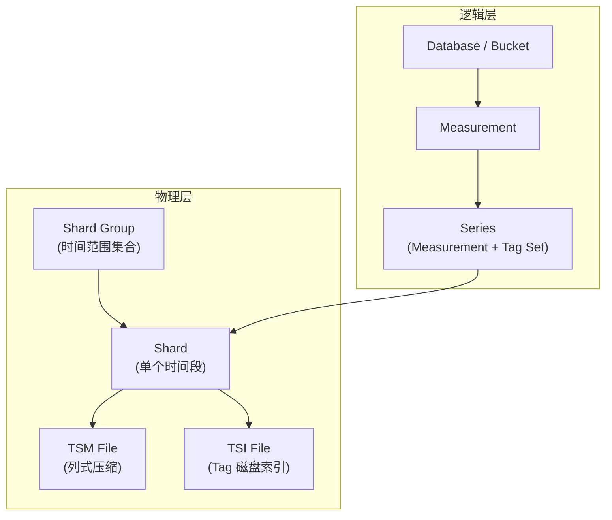
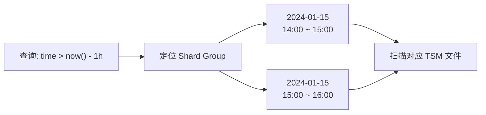
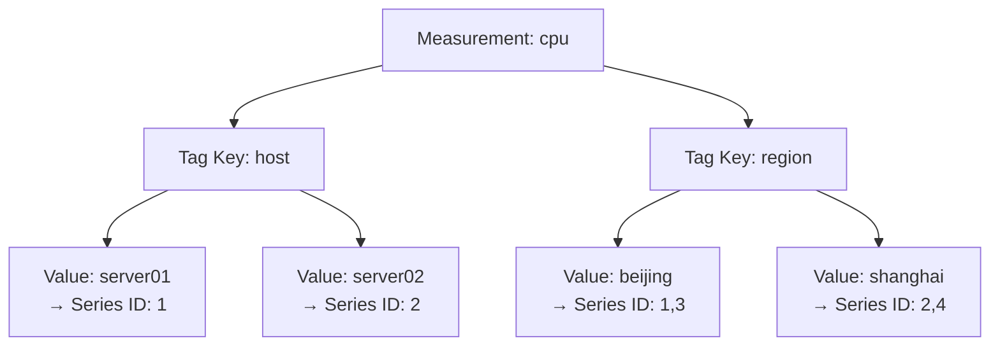
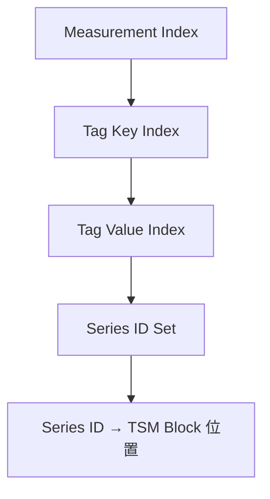
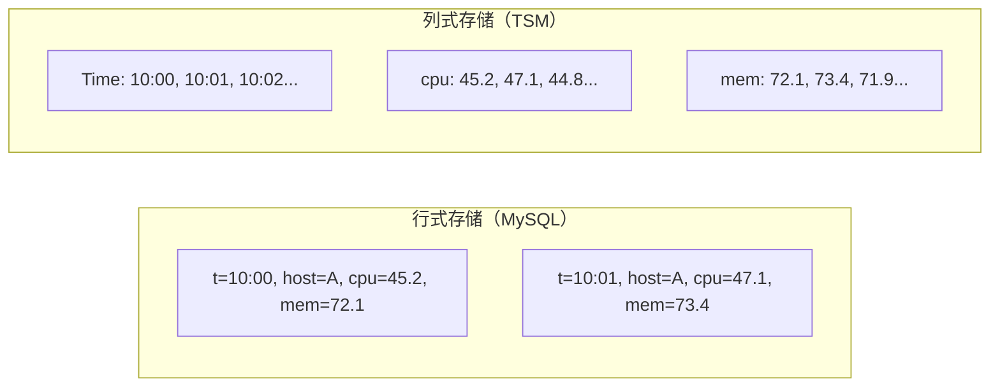

# InfluxDB 数据存储与索引核心解析：时间分片、Tag 索引与压缩算法

InfluxDB 的存储层围绕"时间分片 + 标签索引 + 列式压缩"三大核心机制设计。理解这些机制，才能做出合理的容量规划和性能调优决策。

---

## 存储架构概览



---

## Shard（时间分片）

### 为什么需要时间分片

时序数据天然按时间有序，按时间范围分片带来三个核心优势：

| 优势 | 说明 |
|------|------|
| **过期数据高效清理** | 整个 Shard 到期后直接删除，无需逐条扫描 |
| **查询范围裁剪** | 根据时间范围快速定位到少量 Shard，避免全量扫描 |
| **独立压缩优化** | 不同时间段的 Shard 可以独立执行 compaction |

### Shard Duration 配置

Shard Duration 由 Retention Policy 的 `SHARD DURATION` 决定：

| RP Duration | 推荐 Shard Duration | 说明 |
|-------------|---------------------|------|
| < 2 天 | 1 小时 | 短周期数据，精细清理 |
| 2 天 ~ 6 个月 | 1 天 | 标准监控场景 |
| > 6 个月 | 7 天 | 长期存储，减少文件数 |

```sql
-- 创建 RP 时指定 Shard Duration
CREATE RETENTION POLICY "one_week" ON "mydb"
DURATION 7d REPLICATION 1
SHARD DURATION 1d
DEFAULT;
```

### Shard Group

Shard Group 是同一时间段内所有 Shard 的集合。一个 Shard Group 包含多个 Shard（通常是按 Series Hash 分布的）：

```mermaid
timeline
    title Shard Group 与 Shard 关系
    section Shard Group: 2024-01-01
        Shard 1 : Series hash 0-32767
        Shard 2 : Series hash 32768-65535
```

---

## 索引机制

### 时间范围索引

InfluxDB 的**一级索引是时间**。数据按时间排序存储，查询时首先通过时间范围定位到目标 Shard：



### Tag 索引（TSI）

Tag 索引用于快速定位包含特定 tag 的 Series。TSI（Time Series Index）是 InfluxDB 的核心索引结构。

#### 内存索引（v1.x 早期）



**问题**：所有索引在内存中，Series 数量（cardinality）受内存限制。

#### 磁盘索引 TSI（v1.3+ 改进）

```
/var/lib/influxdb/data/mydb/autogen/
├── 1/
│   ├── 000000001-000000001.tsm
│   └── 000000001-000000001.tsi    # TSI 磁盘索引文件
```

| 版本 | 索引方式 | Cardinality 上限 |
|------|---------|-----------------|
| v1.0 ~ v1.2 | 纯内存索引 | ~100 万（受内存限制） |
| v1.3+ | TSI 磁盘索引 | ~1000 万（磁盘 + 内存缓存） |
| v2.x | TSI（默认）| 同 v1.3+ |
| v3.x (IOx) | 无专用索引 | 理论上无限（直接查 Parquet） |

### TSI 文件结构

TSI 文件使用 **Log-Structured Merge Tree** 组织：



| 层级 | 内容 | 查询作用 |
|------|------|---------|
| Measurement Index | 所有 measurement 列表 | 定位 measurement |
| Tag Key Index | 每个 measurement 的 tag key | 定位 tag key |
| Tag Value Index | 每个 tag key 的所有 value | 定位 tag value |
| Series ID Set | 匹配条件的 Series ID 集合 | 得到目标 Series |
| Series Offset | Series ID → TSM Block 偏移 | 读取实际数据 |

---

## Field 存储

### 列式存储

TSM 文件内部按**列式**组织数据——同一 Series 的同一 Field 连续存储：



**列式优势**：
- 同一列数据类型相同，压缩率更高
- 聚合查询只需读取目标列
- 时间列天然有序，delta 编码效率极高

### Field 类型与存储

| Field 类型 | 存储格式 | 压缩方式 |
|-----------|---------|---------|
| **Float** | IEEE-754 双精度 | Gorilla XOR |
| **Integer** | 64-bit 有符号 | ZigZag + RLE |
| **Unsigned** | 64-bit 无符号 | ZigZag + RLE |
| **String** | UTF-8 变长 | Snappy |
| **Boolean** | 1 bit | Bit packing |

---

## 压缩算法详解

### 时间戳压缩：Delta-of-Delta

时序数据的时间戳通常等间隔到达，利用这一特征实现极高压缩率：

```
原始时间戳:     1000, 1010, 1020, 1030, 1040, 1050
一级差分:       10,   10,   10,   10,   10
二级差分:       0,    0,    0,    0

存储: 基准值 1000 + 一级差分 10 + 二级差分 [0,0,0,0]
压缩率: 6×64bit → 64bit + 8bit + 4×1bit ≈ 10:1
```

### 浮点数压缩：Gorilla XOR

相邻浮点值的二进制表示通常相似，XOR 后大量前导零：

```
值1: 45.2  → IEEE: 01000001001100100110011001100110
值2: 45.3  → IEEE: 01000001001100100110011001100111
XOR:         00000000000000000000000000000001

存储: 值1完整 + 后续值只存 XOR 结果的有效位
压缩率: 典型 5:1 ~ 10:1
```

### 整数压缩：ZigZag + RLE

- **ZigZag 编码**：将正负整数映射为无符号整数，便于变长编码
- **RLE（Run-Length Encoding）**：连续相同值只存一个值 + 重复次数

```
原始: -2, -1, 0, 1, 2, 2, 2, 2
ZigZag: 3, 1, 0, 2, 4, 4, 4, 4
RLE: 3, 1, 0, 2, 4×4
```

---

## Shard 策略与容量规划

### Shard 数量估算

```
Shard 数量 = RP Duration / Shard Duration

例如：
- RP = 30 天，Shard Duration = 1 天 → 30 个活跃 Shard
- RP = 7 天，Shard Duration = 1 小时 → 168 个活跃 Shard
```

### 文件数量估算

```
TSM 文件数 ≈ Shard 数量 × Series 数量 / Series-per-file

例如：
- 30 个 Shard × 100,000 Series / 32,768 Series-per-file ≈ 92 个 TSM 文件
```

### 存储容量估算

| 场景 | 参数 | 估算公式 | 结果 |
|------|------|---------|------|
| 单点大小 | 1 Point | Tag + Field + Timestamp | ~50 ~ 200 字节（原始） |
| 100 台服务器 | 10 指标 × 10 秒间隔 | 100 × 10 × 8640 × 50B | ~432 MB/天（压缩前） |
| 压缩后 | 典型压缩率 5:1 ~ 10:1 | 432MB / 7 | ~60 MB/天 |
| 30 天保留 | — | 60MB × 30 | ~1.8 GB |

### 容量规划速查表

| 规模 | 数据点/秒 | 日原始数据 | 日压缩后 | 30天存储 |
|------|----------|-----------|---------|---------|
| 小型（10 台）| 100 | 43 MB | 6 MB | 180 MB |
| 中型（100 台）| 10,000 | 4.3 GB | 600 MB | 18 GB |
| 大型（1000 台）| 100,000 | 43 GB | 6 GB | 180 GB |
| 超大型（10k 台）| 1,000,000 | 430 GB | 60 GB | 1.8 TB |

> 实际容量取决于 tag 数量、field 大小和压缩率，上表按典型值估算。
