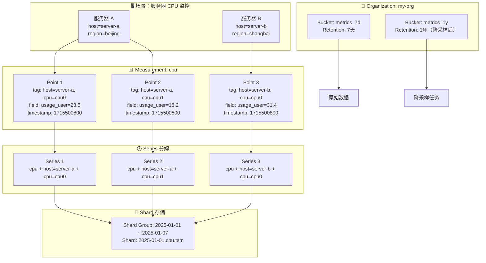

# InfluxDB 核心概念与数据模型全面解析

理解了 InfluxDB 是什么以及它的演进脉络之后，下一步是建立对其核心抽象的数据模型直觉。InfluxDB 的数据模型与传统关系型数据库截然不同——它不是为了灵活查询而设计，而是为了**高速写入**和**时间范围聚合**而优化。本文将逐一拆解 **Bucket、Measurement、Tag、Field、Timestamp、Series、Retention Policy、Shard、Organization** 等核心概念，并通过 Line Protocol 和数据模型对比表，帮助你将这些抽象落地为可操作的认知。

---

## 数据模型的顶层结构：Organization 与 Bucket

### Organization（组织）

**Organization** 是 InfluxDB 2.x 引入的多租户隔离单位。一个 Organization 可以包含多个 **Bucket**，每个 Organization 拥有独立的用户、权限、Dashboard 和 Task。

- 在单租户场景下，通常只创建一个 Organization（如 `my-org`）。
- 在多团队共享实例的场景下，可以为每个团队分配独立的 Organization，实现数据和配置的完全隔离。

> 1.x 中没有 Organization 概念，数据隔离通过 Database + Retention Policy 的组合实现。

### Bucket（存储桶）

**Bucket** 是 2.x 中数据存储的顶层容器，等价于 1.x 中的 **Database + Retention Policy** 的组合。

一个 Bucket 定义了：

- **名称**：如 `metrics`、`logs`、`sensor_data`
- **保留规则（Retention Rule）**：数据自动过期的时间，如 7 天、30 天、永不删除
- **Schema Type**：2.x 默认无 Schema（schemaless），3.x 支持显式 Schema 约束

与关系型数据库的 Database 不同，Bucket 不仅是命名空间，还直接绑定了数据生命周期策略。

```
# 2.x 中创建 Bucket 的示例
influx bucket create --name metrics --org my-org --retention 168h
```

---

## 数据模型的核心四元组

InfluxDB 中的一条数据（称为一个 **Point**）由四个核心部分构成：

```
measurement,tag_set field_set timestamp
```

即：**Measurement（测量）+ Tag Set（标签集）+ Field Set（字段集）+ Timestamp（时间戳）**。

### Measurement（测量）

**Measurement** 是数据的逻辑分组单位，类似于关系型数据库中的"表"，但比表更轻量。

- Measurement 只负责命名，不定义字段类型或约束。
- 同一 Measurement 下的数据点可以拥有不同的 Field 组合。
- 命名建议：使用小写、下划线分隔的语义化名称，如 `cpu_usage`、`temperature`、`http_requests`。

示例：所有与 CPU 相关的指标都写入 `cpu` 这个 Measurement。

### Tag（标签）

**Tag** 是键值对形式的元数据维度，由 **tag key** 和 **tag value** 组成，如 `host=server01`、`region=beijing`。

Tag 的核心特征：

| 特征 | 说明 |
|------|------|
| **索引** | Tag 被索引存储，查询时可以通过 `WHERE host='server01'` 快速过滤 |
| **低基数** | Tag value 的重复度高，不同取值数量有限（如主机名几十到几千个） |
| **分组依据** | `GROUP BY host` 按 Tag 分组是常用操作 |
| **存储在 Series Key 中** | Tag 组合决定了数据属于哪个 Series |

**高基数问题**：如果某个 Tag 的取值数量过大（如 user_id、trace_id，可能达到百万级），会导致 **Series Cardinality** 爆炸，内存索引无法承载，写入和查询性能急剧下降。这是 InfluxDB 使用中最常见的"踩坑"场景。

### Field（字段）

**Field** 是实际存储的测量值，由 **field key** 和 **field value** 组成，如 `usage_user=23.5`、`temperature=25.6`。

Field 的核心特征：

| 特征 | 说明 |
|------|------|
| **非索引** | Field value 不被索引，不能用于 `WHERE` 条件过滤（除非全表扫描） |
| **高基数容忍** | Field value 可以高度离散，不会影响索引性能 |
| **数据类型** | 支持 Float、Integer、String、Boolean、Unsigned Integer |
| **存储主体** | 时序数据的真正"载荷"，占用绝大部分存储空间 |

**Tag vs Field 的选型原则**：

- 需要用于过滤或分组的数据 → **用 Tag**（如 `host`、`region`、`device_id`）
- 只需要存储和聚合的数值 → **用 Field**（如 `temperature`、`latency`、`bytes_sent`）
- 不确定时 → **先用 Tag，监控 cardinality，过高时迁移为 Field**

### Timestamp（时间戳）

**Timestamp** 是时序数据的灵魂。InfluxDB 支持 **纳秒精度** 的时间戳，是数据排序、分区、查询裁剪的核心依据。

- 默认时间戳为 UTC，写入时自动使用服务端当前时间（可通过 `precision` 参数指定精度）。
- 时间戳是数据的主键组成部分——相同 Measurement + Tag Set + Timestamp 的第二次写入会覆盖第一次（更新语义）。

---

## Series：InfluxDB 的核心读写单位

**Series** 是 InfluxDB 中最重要的概念之一，定义为：

> **Series = Measurement + Tag Set（所有标签键值对的有序组合）**

换言之，相同的 Measurement 和完全相同的 Tag 组合，构成一个 Series。所有属于同一 Series 的数据点按时间戳排序存储。

### Series 的物理意义

想象你在监控 100 台服务器的 CPU 使用率，每台服务器有 4 个 CPU 核心：

- Measurement：`cpu`
- Tags：`host`（主机名）、`cpu`（核心编号）
- Fields：`usage_user`、`usage_system`、`usage_idle`

则 Series 数量为：

```
100 台主机 × 4 个核心 = 400 个 Series
```

每个 Series 是一条独立的时间线，在存储层对应独立的索引条目和数据块。

### Series Cardinality（时间线基数）

**Series Cardinality** 指数据库中活跃的（未过期的）Series 总数，是衡量 InfluxDB 负载压力的核心指标。

| Cardinality 等级 | 影响 | 应对策略 |
|-----------------|------|---------|
| 1K–10K | 轻量级，单节点轻松承载 | 无需特殊优化 |
| 10K–100K | 中等，需关注内存使用 | 监控 `numSeries`，合理设置 RP |
| 100K–1M | 重载，索引内存压力大 | 使用 TSI（1.x）、3.x IOx 引擎、或降低 Tag 基数 |
| >1M | 极高，传统 TSM 难以承受 | 考虑 3.x IOx、或重构数据模型减少 Tag 维度 |

> Cardinality 是 InfluxDB 的"阿喀琉斯之踵"。设计数据模型时，控制 Tag 的取值数量比任何调优都重要。

---

## 数据生命周期：Retention Policy 与 Shard

### Retention Policy（保留策略）

**Retention Policy（RP）** 定义了数据的自动过期规则，是时序数据库"数据价值随时间衰减"这一本质的映射。

- **Duration**：数据保留时长，如 `7d`、`30d`、`INF`（永不删除）
- **Shard Group Duration**：每个 Shard Group 覆盖的时间窗口，如 `1d`、`7d`
- **Replication Factor**：副本数（仅企业版集群有效，开源版固定为 1）

在 2.x 中，RP 被整合进 Bucket 的 **Retention Rule**：

```bash
# 创建一个保留 30 天的 Bucket
influx bucket create --name metrics_30d --retention 720h
```

### Shard Group 与 Shard

为了高效管理时间序列数据，InfluxDB 将数据按时间划分为 **Shard Group**，每个 Shard Group 内部包含一个或多个 **Shard**。

```
Shard Group  =  一个时间窗口（如 2025-01-01 00:00:00 ~ 2025-01-07 23:59:59）
Shard        =  Shard Group 内的物理存储单元（TSM 文件集合）
```

**Shard 策略的设计逻辑**：

- **时间分片**：查询 `time > now() - 1h` 时，只需打开最近 1～2 个 Shard，而非全量数据。
- **过期即删除**：整个 Shard 过期后可直接删除目录，无需逐条清理，效率极高。
- **并发控制**：不同 Shard 的写入互不干扰，避免全局锁。

Shard Group Duration 的默认值与数据保留时长相关：

| 保留时长 | 默认 Shard Group Duration |
|---------|--------------------------|
| < 2 天 | 1 小时 |
| 2 天 – 6 个月 | 1 天 |
| > 6 个月 | 7 天 |

---

## 数据模型对比：InfluxDB vs 关系型数据库 vs Prometheus

理解 InfluxDB 的最佳方式是将其与你已熟悉的数据模型对比：

| 概念 | InfluxDB | 关系型数据库（MySQL） | Prometheus |
|------|---------|---------------------|-----------|
| **数据容器** | Bucket / Database | Database | 无（直接暴露端点） |
| **逻辑分组** | Measurement | Table | Metric Name |
| **维度/元数据** | Tag（键值对，索引） | 列 + 二级索引 | Label（键值对，索引） |
| **测量值** | Field（键值对，非索引） | 列（主数据） | Sample Value（浮点） |
| **时间戳** | 纳秒精度，核心排序键 | 普通列 | 毫秒精度，隐式主键 |
| **Schema** | Schemaless（动态字段） | 强 Schema（需预先定义） | 无 Schema |
| **数据类型** | Float / Int / String / Bool | 任意 SQL 类型 | Float64 为主 |
| **更新语义** | 同 Series + Timestamp 覆盖 | UPDATE / DELETE | 追加为主 |
| **多值支持** | 单 Point 可含多个 Field | 单行多列天然支持 | 单 Metric 单 Value |
| **典型查询** | 时间范围 + Tag 过滤 + 聚合 | 点查 + JOIN + 复杂条件 | 向量运算 + 范围查询 |

### 关键差异解读

1. **InfluxDB 的 Tag 相当于 MySQL 的索引列 + Prometheus 的 Label**：Tag 是元数据维度，被索引，用于过滤和分组。
2. **InfluxDB 的 Field 相当于 MySQL 的普通数据列**：Field 是实际测量值，不被索引，只能用于聚合计算。
3. **InfluxDB 支持多值模型，Prometheus 是单值模型**：一个 InfluxDB Point 可以同时包含 `usage_user`、`usage_system`、`usage_idle` 等多个 Field，而 Prometheus 每个时间线只能存储一个数值。
4. **InfluxDB 支持 String 类型，Prometheus 以 Float64 为主**：这使得 InfluxDB 更适合存储状态码、日志级别等离散文本数据。

---

## Line Protocol：数据写入的具象语法

**Line Protocol** 是 InfluxDB 的专用数据写入格式，简洁、高效、无需 Schema 预定义。

### 语法格式

```
measurement,tag1=value1,tag2=value2 field1=value1,field2=value2 timestamp
```

各部分的规则：

| 部分 | 分隔符 | 是否必需 | 说明 |
|------|--------|---------|------|
| Measurement | 无 | 必需 | 首个字符串，逗号前结束 |
| Tag Set | `,` 分隔 | 可选 | 键值对，逗号分隔 |
| Field Set | 空格后 | 必需 | 键值对，逗号分隔 |
| Timestamp | 空格后 | 可选 | 省略时使用服务器当前时间 |

### 实际示例

```
# 一条 CPU 监控数据
cpu,host=server01,cpu=cpu0,region=beijing usage_user=23.5,usage_system=4.2,usage_idle=72.3 1715500800000000000

# 一条温度传感器数据（无 Tag）
temperature value=25.6

# 多条数据批量写入（换行分隔）
cpu,host=server01,cpu=cpu0 usage_user=23.5 1715500800000000000
cpu,host=server01,cpu=cpu1 usage_user=18.2 1715500800000000000
cpu,host=server02,cpu=cpu0 usage_user=31.4 1715500800000000000
```

### 通过 curl 写入

```bash
# 单条写入
curl -i -X POST 'http://localhost:8086/api/v2/write?org=my-org&bucket=metrics' \
  -H 'Authorization: Token YOUR_TOKEN' \
  -H 'Content-Type: text/plain; charset=utf-8' \
  --data-raw 'cpu,host=server01 usage_user=23.5'

# 批量写入（推荐）
curl -i -X POST 'http://localhost:8086/api/v2/write?org=my-org&bucket=metrics' \
  -H 'Authorization: Token YOUR_TOKEN' \
  --data-binary @metrics.txt
```

### 特殊字符转义规则

| 场景 | 处理方式 |
|------|---------|
| Tag/Field key 含逗号、空格、等号 | 用反斜杠转义 `\,` `\ ` `\=` |
| String Field value | 用双引号包裹 `"value"` |
| String value 内含双引号 | 用反斜杠转义 `\"` |

---

## 场景化数据模型映射

下面通过一个完整的"服务器 CPU 监控"场景，展示所有核心概念如何协同工作：



### 场景解读

1. **Organization `my-org`** 是顶层容器，包含所有资源。
2. **Bucket `metrics_7d`** 存储原始高频数据（10 秒精度），7 天后自动过期。
3. **Measurement `cpu`** 是逻辑分组，所有 CPU 相关指标写入此处。
4. **Tags `host` 和 `cpu`** 描述数据的维度，`region` 可用于机房级分组查询。
5. **Field `usage_user`** 是实际测量值，后续可用 `MEAN(usage_user)` 计算平均值。
6. **3 个 Series** 对应 3 条独立时间线（server-a/cpu0、server-a/cpu1、server-b/cpu0）。如果有 100 台服务器 × 4 核心，Series 数为 400。
7. **Shard Group** 按周划分，过期后整个 Shard 被删除，无需逐条清理。
8. **Task** 将 7 天 Bucket 的数据每小时降采样，存入 `metrics_1y` Bucket 用于长期趋势分析。

---

## Cardinality 计算实战

理解 Series 数量的计算方式，是设计健康数据模型的关键。

### 公式

```
Series Cardinality = Measurement 数量 × (Tag_A 基数 × Tag_B 基数 × ... × Tag_N 基数)
```

### 案例 1：健康的设计

监控 50 台服务器，每台 4 核心，按机房分组：

- Tags：`host`（50 个值）、`cpu`（4 个值）、`region`（2 个值）
- Series = 1 × 50 × 4 × 2 = **400**

这是一个非常健康的基数。

### 案例 2：危险的设计

在上述基础上，为每个请求记录 `trace_id`：

- Tags：`host`（50）、`cpu`（4）、`region`（2）、`trace_id`（100,000/天）
- Series = 1 × 50 × 4 × 2 × 100,000 = **40,000,000**

** Cardinality 爆炸！** 内存索引无法承载，写入性能崩溃。

### 案例 3：修复方案

将 `trace_id` 从 Tag 改为 Field：

- Tags：`host`（50）、`cpu`（4）、`region`（2）→ Series = **400**
- Fields：`usage_user`、`trace_id`（作为字符串 Field 存储）

查询时无法通过 `trace_id='xxx'` 快速定位，但可以通过 `host` + 时间范围先缩小范围，再在结果中过滤。这是合理的权衡。

---

## 小结

InfluxDB 的数据模型看似简单——Measurement + Tag + Field + Timestamp——但**Tag 与 Field 的选型**、**Series 基数的控制**、**Retention Policy 的设置**，决定了生产环境中系统的稳定性和成本。

核心记忆点：

- **Tag 用于过滤和分组，Field 用于存储数值**
- **Series = Measurement + Tag Set，是性能的核心变量**
- **Cardinality 超过 100K 是红线，设计数据模型时先算 Series 数**
- **Shard 让时间范围查询高效，Retention Policy 让存储成本可控**

掌握这些概念后，你就可以设计出既能承载高吞吐写入、又能支持毫秒级查询的时序数据 schema。

---

**延伸阅读**：
- [InfluxDB 概览]() — 了解 InfluxDB 的产品定位、版本演进和竞品对比
- [InfluxDB 安装与快速上手]() — 10 分钟在本地跑起来，用真实数据验证这些概念
