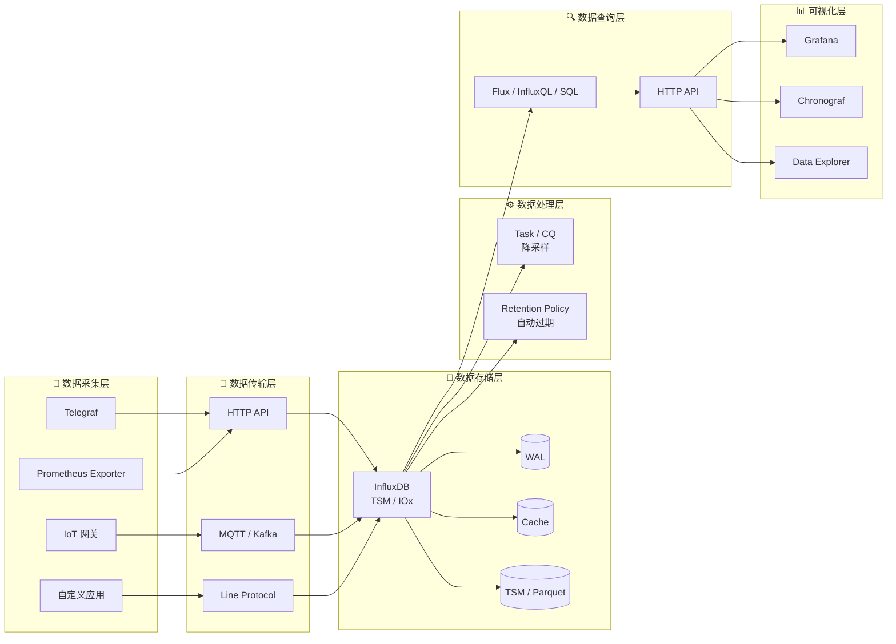

# InfluxDB 概览核心解析

InfluxDB 是业界最广为人知的时序数据库（Time Series Database，TSDB）之一。如果你正在处理按时间顺序产生的大量数据——无论是服务器指标、传感器读数还是金融行情——InfluxDB 几乎一定会出现在你的技术选型清单上。本文将从"什么是时序数据库"讲起，梳理 InfluxDB 的产品定位、版本演进、核心特性、适用场景，以及与同类产品的对比，帮助你在 5 分钟内建立对 InfluxDB 的完整认知。

---

## 什么是时序数据库

**时序数据库（Time Series Database，TSDB）** 是一种专门为存储和查询时间序列数据而设计的数据库系统。

**时间序列数据** 指按时间顺序排列的数据点，每个数据点至少包含一个时间戳和一个测量值。典型的例子包括：

- 服务器 CPU 使用率每 10 秒采集一次
- 智能电表每小时上报一次用电量
- 股票交易所每秒推送的行情数据
- 应用服务每 5 秒上报一次请求延迟

### 与传统关系型数据库的核心差异

传统关系型数据库（如 MySQL、PostgreSQL）的设计目标是支持通用的事务处理（OLTP），强调 ACID 事务、复杂 JOIN 查询和灵活的 Schema 变更。而时序数据库面对的是截然不同的 workload：

| 维度 | 关系型数据库（如 MySQL） | 时序数据库（如 InfluxDB） |
|------|----------------------|------------------------|
| **写入模式** | 随机写入、低频次、需事务保障 | 顺序追加写入、高频次、批量写入 |
| **查询模式** | 点查、范围扫描、多表 JOIN | 时间范围查询、聚合计算、降采样 |
| **数据特征** | 更新频繁、行级修改常见 | 几乎不更新、写入后只读或删除 |
| **时间维度** | 普通字段之一 | 核心排序键、天然分区依据 |
| **Schema** | 强 Schema，需预先定义 | 弱 Schema 或无 Schema，动态字段 |
| **存储优化** | B+ 树索引、行存为主 | 时间分区、列存或专用时序格式、高压缩 |
| **典型 QPS** | 数千 TPS | 数十万至数百万 points/秒 |

关系型数据库并非不能存储时序数据，但当数据规模达到百万级时间线、每秒百万数据点时，B+ 树索引的维护成本和 JOIN 查询的性能开销会让系统迅速崩溃。时序数据库通过**时间分区**、**列式存储**、**专用压缩算法**和**预聚合机制**，将写入吞吐和查询效率提升一到两个数量级。

### 时序数据库的核心设计原则

所有成熟的时序数据库都遵循以下几条设计公理：

1. **时间即主键**：时间戳不是普通字段，而是数据排序、分区、裁剪的第一依据。
2. **写入远大于读取**：典型场景下写入 QPS 是查询的 10～100 倍，优化重点在写入路径。
3. **近期数据优先访问**：80% 的查询集中在最近 24 小时的数据上，冷热分离成为标配。
4. **聚合先于明细**：监控场景不关心单条原始数据，关心的是"最近 5 分钟的平均值"。
5. **数据生命周期管理**：时序数据价值随时间衰减，自动过期机制不可或缺。

---

## InfluxDB 的产品定位

InfluxDB 由 **InfluxData** 公司开发，采用 Go 语言编写，于 2013 年首次开源发布。它是 InfluxData 技术栈（简称 **TICK 栈**）的核心组件：

| 组件 | 角色 | 功能 |
|------|------|------|
| **Telegraf** | 数据采集 | 插件式数据收集代理，支持数百种输入源 |
| **InfluxDB** | 数据存储 | 时序数据的核心存储与查询引擎 |
| **Chronograf** | 可视化 | 官方仪表盘与数据探索工具 |
| **Kapacitor** | 数据处理 | 流处理、告警触发、数据转换 |

> 注：在 InfluxDB 2.x 中，Chronograf 和 Kapacitor 的功能被合并进内置的 **Tasks** 和 **Alerting** 模块，TICK 栈的概念逐渐弱化，但 Telegraf 仍是独立且活跃的项目。

InfluxDB 的产品定位可以概括为一句话：**"为开发者设计的时序数据平台"**。它的设计哲学强调：

- **开箱即用**：单个二进制文件即可运行，无需外部依赖（如 ZooKeeper、HBase）。
- **HTTP API 优先**：所有操作都可通过 RESTful API 完成，便于与各种编程语言和工具集成。
- **类 SQL 查询**：InfluxQL（1.x）和 Flux（2.x）降低了学习门槛，3.x 回归标准 SQL。
- **生态丰富**：与 Grafana、Prometheus、Kafka、Pulsar 等主流工具无缝集成。

---

## 版本演进：1.x → 2.x → 3.x

InfluxDB 的发展历程是理解其当前能力和未来方向的关键。三个大版本代表了存储引擎和查询范式的三次重大变革：

### InfluxDB 1.x（2013–2020）：TSM 引擎奠基

1.x 系列是 InfluxDB 的开源成名作，核心贡献在于 **TSM（Time-Structured Merge Tree）存储引擎**：

- **WAL + Cache + TSM File**：写入先进入 WAL（预写日志），再批量写入内存 Cache，最后压缩为只读的 TSM 文件。
- **高压缩比**：对时间戳采用 delta-of-delta 编码，对浮点数采用 Gorilla 压缩，典型压缩比可达 10:1。
- **Tag 索引（TSI）**：1.3 版本引入 TSI（Time Series Index），解决了高基数标签的内存索引爆炸问题。
- **InfluxQL 查询语言**：类 SQL 语法，支持 `SELECT`、`WHERE`、`GROUP BY`、`INTO` 等标准操作，并扩展了时间窗口聚合函数。

1.x 的局限也很明显：

- **集群闭源**：开源版本仅支持单节点，高可用和集群功能是企业版独占。
- **查询能力有限**：InfluxQL 不支持 JOIN 和嵌套子查询，复杂分析需借助 Kapacitor。
- **数据类型单一**：早期版本仅支持 float64，后续才扩展至 int、string、bool。

### InfluxDB 2.x（2020–至今）：Flux 与统一平台

2.x 是 InfluxData 对"平台化"的一次大胆尝试，核心变化包括：

- **Bucket 替代 Database + Retention Policy**：将数据库和数据保留策略合并为单一的 **Bucket** 概念，简化数据组织。
- **Flux 查询语言**：全新的函数式管道查询语言，支持数据源连接、复杂转换、跨库 JOIN。语法示例：

```flux
from(bucket: "metrics")
  |> range(start: -1h)
  |> filter(fn: (r) => r._measurement == "cpu")
  |> aggregateWindow(every: 5m, fn: mean)
```

- **内置任务与告警**：用 Flux 脚本定义定时任务（Task）和告警规则（Alert），替代外部 Kapacitor。
- **Token 认证体系**：引入基于 API Token 的权限管理，支持 Org 级别的多租户隔离。
- **统一 UI**：Data Explorer、Notebook、Dashboard 全部集成在单一 Web 界面中。

2.x 的争议点在于 **Flux 的学习曲线**——虽然功能强大，但函数式管道语法对习惯了 SQL 的用户并不友好。这也是 3.x 回归 SQL 的重要背景。

### InfluxDB 3.x（2023–至今）：IOx 引擎与云原生架构

3.x 代号为 **IOx**，是 InfluxDB 的"涅槃重生"。2021 年 InfluxData 宣布重写存储引擎，采用 **Apache Arrow + Apache Parquet + DataFusion** 的技术栈：

| 维度 | 1.x/2.x（TSM） | 3.x（IOx） |
|------|---------------|-----------|
| **存储格式** | 自研 TSM 文件 | Apache Parquet（列存） |
| **内存模型** | 自研 Cache | Apache Arrow（列式内存） |
| **查询引擎** | 自研 InfluxQL/Flux | Apache DataFusion（基于 Arrow） |
| **查询语言** | InfluxQL / Flux | 标准 SQL + InfluxQL 兼容 |
| **对象存储** | 本地磁盘 / EBS | S3、MinIO 等对象存储原生支持 |
| **压缩比** | ~10:1 | ~45:1（官方数据） |
| **查询性能** | 中等 | 2.5x–45x 提升（视查询类型） |
| **架构模式** | 单体 / 企业集群 | 存算分离、无状态查询节点 |

**IOx 的核心优势**：

- **云原生**：数据持久化到对象存储，查询节点无状态，可独立扩缩容。
- **生态兼容**：Parquet 格式可以被 Spark、DuckDB、Pandas 等工具直接读取，打破数据孤岛。
- **SQL 回归**：支持标准 SQL 查询，大幅降低迁移和学习成本。
- **无限水平扩展**：通过增加查询节点即可提升并发查询能力，存储层由对象存储的弹性保障。

> 当前状态（截至 2025 年）：InfluxDB 3.x 核心引擎已开源（influxdb_iox 仓库），但完整的 InfluxDB 3.0 发行版仍在积极开发中。2.x 是当前生产环境的主流稳定版本，1.x 已进入维护模式。

---

## 核心特性概览

### 1. 高写入吞吐

InfluxDB 针对顺序追加写入进行了深度优化。单节点场景下，2.x 版本可达 **数十万 points/秒** 的写入性能。优化手段包括：

- **批量写入**：Line Protocol 支持一次请求携带数千个数据点。
- **WAL 顺序写**：磁盘顺序 I/O 的性能远高于随机 I/O。
- **内存缓冲**：热数据先在内存中组织为 Cache，异步刷盘。
- **时间分片（Shard）**：数据按时间窗口分片存储，避免全局锁竞争。

### 2. 高效时间范围查询

时序数据库的查询 90% 以上都包含时间范围过滤。InfluxDB 通过以下机制保证查询效率：

- **时间分片裁剪**：查询 `WHERE time > now() - 1h` 时，只需扫描最近几个 shard，而非全表。
- **Tag 索引**：标签键值对被索引，支持快速等值过滤和分组。
- **列式存储（3.x）**：Parquet 格式下，只读取查询涉及的列，大幅减少 I/O。
- **预聚合（Continuous Query / Task）**：1.x 的 Continuous Query 和 2.x 的 Task 可以在数据写入时或定时执行聚合，将高频原始数据降采样为低频汇总数据。

### 3. 数据保留策略（Retention Policy）

**Retention Policy（RP）** 是 InfluxDB 的自动数据生命周期管理机制。你可以定义：

- 数据保留时长（如 7 天、30 天、1 年）
- 数据分片精度（如每个 shard 覆盖 1 天或 7 天）
- 是否启用自动复制（仅企业版）

到达保留期限的数据会被自动删除，无需人工干预。在 2.x 中，这一概念被整合进 **Bucket 的 Retention Rule**。

### 4. 连续查询与任务（Continuous Query / Task）

对于高频采集的原始数据，直接查询全量数据既慢又浪费资源。InfluxDB 提供了定时聚合机制：

- **1.x Continuous Query**：在数据写入时自动触发预定义聚合，将 10 秒精度的原始数据实时汇总为 5 分钟精度。
- **2.x Task**：用 Flux 脚本定义定时任务，功能更灵活，支持告警、数据转换、跨库操作。

示例：将 `cpu` measurement 的 10 秒数据降采样为 1 小时平均值：

```flux
option task = {
  name: "cpu_1h_downsample",
  every: 1h,
}

from(bucket: "metrics")
  |> range(start: -task.every)
  |> filter(fn: (r) => r._measurement == "cpu")
  |> aggregateWindow(every: 1h, fn: mean)
  |> to(bucket: "metrics_1h")
```

---

## 适用场景

InfluxDB 在以下领域已被广泛验证：

| 场景 | 典型数据 | 规模示例 | 核心价值 |
|------|---------|---------|---------|
| **DevOps 监控** | CPU、内存、磁盘、网络、请求延迟 | 5 万台服务器 × 50 指标/10s | 实时告警、历史趋势分析 |
| **IoT 传感器数据** | 温度、湿度、压力、GPS 坐标 | 100 万设备 × 10 指标/分钟 | 海量设备接入、边缘到云端聚合 |
| **金融实时指标** | 股票 Tick、风控指标、交易延迟 | 10 万笔/秒 | 毫秒级查询、合规审计 |
| **应用性能监控（APM）** | 调用链延迟、错误率、吞吐量 | 微服务 1000+ 节点 | 全链路追踪、异常定位 |
| **能源管理** | 光伏逆变器发电功率、电网负荷 | 10 万监测点/5 秒 | 预测性维护、能耗优化 |
| **智慧城市** | 环境监测、交通流量、灯杆数据 | 30 万设备/5 秒 | 城市级实时仪表盘 |

### 不适合的场景

InfluxDB 并非万能。以下场景可能需要其他方案：

- **复杂事务处理**：需要 ACID 事务、多行原子更新的场景，应使用关系型数据库。
- **全文检索**：日志文本搜索应使用 Elasticsearch 或 Loki。
- **图关系分析**：社交网络、知识图谱应使用 Neo4j 等图数据库。
- **超高基数时间线**（数千万级唯一标签组合）：TSM 引擎的索引内存消耗会变得不可控，3.x 的 IOx 引擎对此有改善但仍需谨慎评估。

---

## 竞品对比：InfluxDB vs Prometheus vs TimescaleDB vs OpenTSDB

| 维度 | InfluxDB | Prometheus | TimescaleDB | OpenTSDB |
|------|----------|-----------|-------------|----------|
| **数据模型** | Measurement + Tag + Field + Timestamp | Metric + Label（键值对） | 标准关系表 + Hypertable | Metric + Tag + Timestamp |
| **查询语言** | InfluxQL / Flux / SQL（3.x） | PromQL | 标准 SQL + 时序扩展 | HTTP DSL / Java API |
| **存储引擎** | TSM（1.x/2.x）/ Parquet（3.x） | 自研 TSDB（LevelDB 索引 + 自定义存储） | PostgreSQL + Hypertable 扩展 | HBase（依赖 Hadoop 生态） |
| **架构模式** | 单节点（开源）/ 集群（企业/3.x） | 单体、多节点联邦 | PostgreSQL 主从 / 分区 | HBase RegionServer 集群 |
| **部署复杂度** | 低（单二进制） | 低（单二进制） | 中（需 PostgreSQL 基础） | 高（HBase + ZooKeeper + HDFS） |
| **写入方式** | Push（主动推送） | Pull（主动拉取）+ Push Gateway | Push（标准 SQL INSERT） | Push（HTTP API） |
| **生态集成** | Telegraf / Grafana / Kafka / Pulsar | Grafana / AlertManager / Thanos / Cortex | Grafana / PostgreSQL 全生态 | Grafana / OpenTelemetry |
| **数据类型** | Float / Int / String / Bool / Unsigned | Float64（主）+ 少量扩展 | 全部 PostgreSQL 类型 | Float / Int / String |
| **水平扩展** | 3.x 云原生支持 | 联邦 + Remote Write + Thanos/Cortex | 分区表 + 读写分离 | HBase 原生支持 |
| **典型场景** | 通用时序平台、IoT、APM | K8s 监控、服务指标 | 混合负载（时序+关系） | 超大规模指标（PB 级） |

### 选型建议

- **选择 InfluxDB**：如果你需要一个功能全面、生态丰富、对 SQL 有回归趋势的通用时序平台，且希望单节点即可起步。
- **选择 Prometheus**：如果你专注于 Kubernetes 和服务指标监控，且偏好 pull 模式的采集架构。
- **选择 TimescaleDB**：如果你已有 PostgreSQL 基础设施，或需要在同一数据库中混合处理时序数据和关系型业务数据。
- **选择 OpenTSDB**：如果你已有 Hadoop 生态，且需要存储 PB 级历史指标数据（新项目不建议）。

---

## 完整数据链路架构

下图展示了从数据采集到可视化的完整链路，InfluxDB 处于存储和查询的核心位置：



---

## 小结

InfluxDB 从 2013 年诞生至今，经历了 TSM 引擎奠基（1.x）、Flux 平台化尝试（2.x）到 IOx 云原生重构（3.x）的三次蜕变。它以**高写入吞吐**、**高效时间查询**、**自动数据生命周期管理**为核心竞争力，在 DevOps 监控、IoT、金融和 APM 等场景中被广泛采用。

对于新项目，**2.x 是当前最稳妥的选择**——文档成熟、生态完善、社区活跃。如果你追求云原生架构和 SQL 兼容性，可以密切关注 3.x 的发展。无论选择哪个版本，理解 InfluxDB 的数据模型（Measurement、Tag、Field、Timestamp）和存储原理（时间分片、列存、压缩），都是用好它的前提。

---

**延伸阅读预告**：
- [InfluxDB 核心概念与数据模型]() — 深入理解 Bucket、Measurement、Tag、Field、Series、Shard 等核心抽象
- [InfluxDB 安装与快速上手]() — 10 分钟在本地跑起来，完成第一条数据的写入和查询
