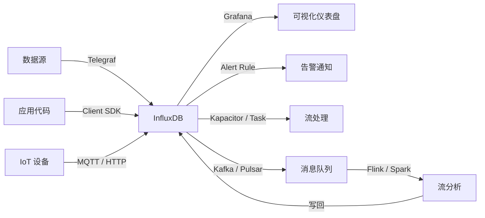
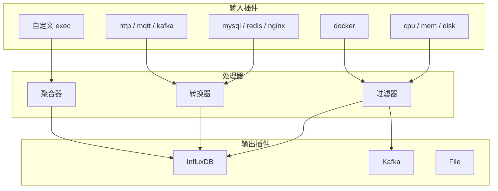

# InfluxDB 生态集成核心解析：Telegraf 采集、Grafana 可视化与主流中间件对接

InfluxDB 的强大不仅来自自身，更来自丰富的生态集成能力。本文覆盖最常用的集成场景：数据采集、可视化、消息队列、流处理。

---

## 生态全景



---

## Telegraf 数据采集

Telegraf 是 InfluxData 官方的数据采集代理，插件式架构支持数百种输入源。

### 架构



### 基础配置

```toml
[global_tags]
  dc = "beijing"
  env = "production"

[agent]
  interval = "10s"
  metric_batch_size = 5000
  metric_buffer_limit = 10000
  flush_interval = "10s"
  flush_jitter = "5s"

# 输入：系统指标
[[inputs.cpu]]
  percpu = true
  totalcpu = true

[[inputs.mem]]

[[inputs.disk]]
  ignore_fs = ["tmpfs", "devtmpfs"]

# 输出：InfluxDB
[[outputs.influxdb_v2]]
  urls = ["http://influxdb:8086"]
  bucket = "metrics"
  token = "${INFLUX_TOKEN}"
  organization = "my-org"
```

### 常用输入插件

| 插件 | 用途 | 配置复杂度 |
|------|------|-----------|
| `cpu` | CPU 使用率 | 无 |
| `mem` | 内存使用 | 无 |
| `disk` | 磁盘 IO | 低 |
| `net` | 网络流量 | 无 |
| `docker` | 容器指标 | 中 |
| `mysql` | 数据库性能 | 中 |
| `redis` | 缓存指标 | 低 |
| `nginx` | Web 服务器 | 低 |
| `kafka` | 消息队列 | 中 |
| `http` | 自定义 HTTP 端点 | 中 |
| `exec` | 自定义脚本 | 中 |

---

## Grafana 可视化

Grafana 是 InfluxDB 最常用的可视化工具，原生支持 Flux 和 InfluxQL。

### 数据源配置

| 参数 | 值 |
|------|-----|
| URL | `http://influxdb:8086` |
| Auth | Token（2.x）或 Basic Auth（1.x） |
| Bucket / DB | `metrics` |
| Flux / InfluxQL | 根据版本选择 |

### 常用面板查询

**CPU 使用率趋势（Flux）：**

```flux
from(bucket: "metrics")
  |> range(start: v.timeRangeStart, stop: v.timeRangeStop)
  |> filter(fn: (r) => r._measurement == "cpu")
  |> filter(fn: (r) => r._field == "usage_user")
  |> aggregateWindow(every: v.windowPeriod, fn: mean)
  |> group(columns: ["host"])
```

**内存使用率（InfluxQL）：**

```sql
SELECT mean("used_percent") FROM "memory"
WHERE $timeFilter
GROUP BY time($__interval), "host"
```

### Grafana 变量

```sql
-- 主机选择变量
SHOW TAG VALUES FROM "cpu" WITH KEY = "host"

-- 区域选择变量
SHOW TAG VALUES FROM "cpu" WITH KEY = "region"
```

| 变量 | 用途 | 查询示例 |
|------|------|---------|
| `$timeFilter` | 面板时间范围 | 自动替换 |
| `$__interval` | 自适应聚合间隔 | 自动计算 |
| `$host` | 主机筛选 | `WHERE "host" =~ /^$host$/` |
| `$region` | 区域筛选 | `WHERE "region" = '$region'` |

---

## 与 Kafka 集成

### 架构：InfluxDB → Kafka → 消费者


### 从 Kafka 写入 InfluxDB

```toml
# Telegraf 从 Kafka 消费写入 InfluxDB
[[inputs.kafka_consumer]]
  brokers = ["kafka:9092"]
  topics = ["metrics"]
  consumer_group = "telegraf-influxdb"
  data_format = "influx"

[[outputs.influxdb_v2]]
  urls = ["http://influxdb:8086"]
  bucket = "metrics"
  token = "${INFLUX_TOKEN}"
```

---

## 与 Prometheus 集成

### 场景1：Prometheus 远程写入 InfluxDB

```yaml
# prometheus.yml
remote_write:
  - url: "http://influxdb:8086/api/v1/prom/write?db=prometheus&u=user&p=pass"
    queue_config:
      capacity: 10000
      max_samples_per_send: 5000
```

### 场景2：Telegraf 替代 Prometheus Node Exporter

Telegraf 的 `prometheus` 输入插件可以直接抓取 Prometheus 指标：

```toml
[[inputs.prometheus]]
  urls = ["http://app:9090/metrics"]
  metric_version = 2
```

| 对比 | Prometheus | InfluxDB + Telegraf |
|------|-----------|---------------------|
| **数据模型** | Label-based | Tag-based（兼容） |
| **存储** | 本地 TSDB | 独立时序数据库 |
| **查询** | PromQL | Flux / InfluxQL |
| **告警** | Alertmanager | Kapacitor / Task |
| **扩展** | Federation | 单实例/集群 |

---

## 与 Flink 流处理集成

```java
// Flink 读取 InfluxDB 数据
InfluxDBSource<Point> source = InfluxDBSource.builder()
    .url("http://influxdb:8086")
    .token("my-token")
    .bucket("metrics")
    .measurement("cpu")
    .build();

env.addSource(source)
    .keyBy(point -> point.getTag("host"))
    .window(TumblingProcessingTimeWindows.of(Time.minutes(5)))
    .aggregate(new AverageAggregate())
    .addSink(new InfluxDBSink<>());
```

---

## 集成速查表

| 集成目标 | 方式 | 关键配置 |
|----------|------|---------|
| **Grafana** | 数据源插件 | URL + Token + Bucket |
| **Telegraf** | 输出插件 | `outputs.influxdb_v2` |
| **Kafka** | HTTP 推送 / Telegraf 消费 | `inputs.kafka_consumer` |
| **Prometheus** | Remote Write | `remote_write` endpoint |
| **Flink** | 自定义 Source/Sink | Apache Arrow Flight |
| **Pulsar** | Telegraf 输出 | `outputs.pulsar` |
| **OpenTelemetry** | OTLP 接收 | InfluxDB 原生支持 |
| **Zabbix** | HTTP API 推送 | 自定义脚本 |
