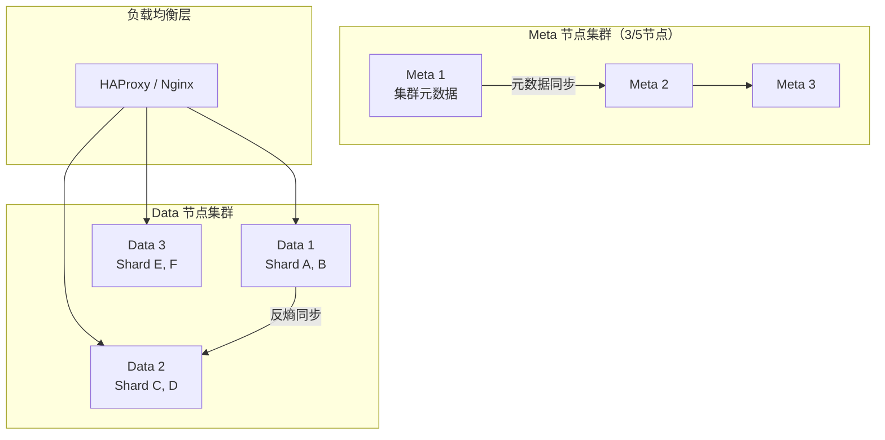
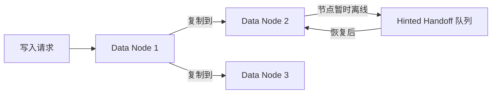
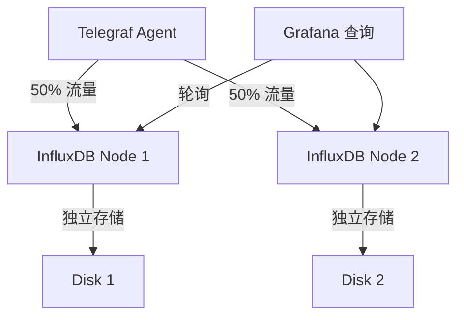
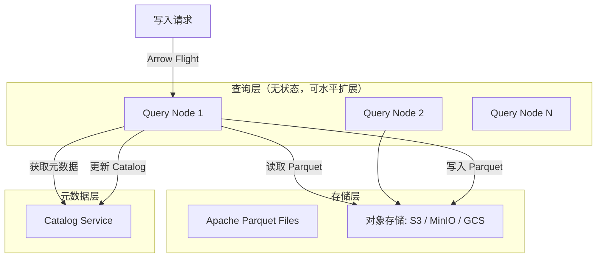
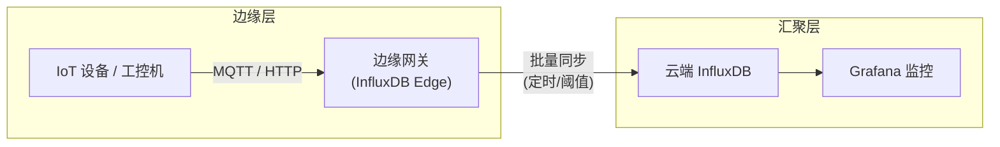
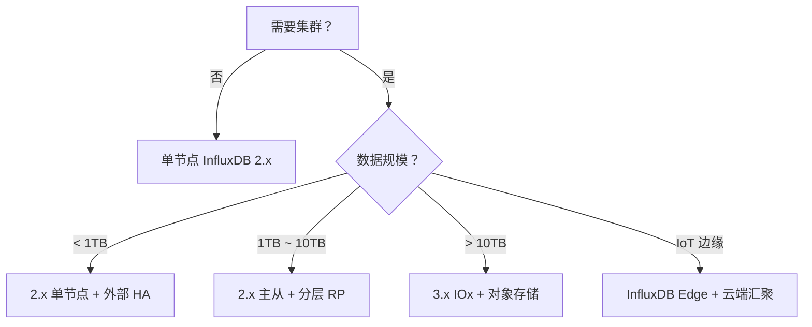

# InfluxDB 高可用与集群架构核心解析：单节点、企业集群与 3.x 云原生方案

InfluxDB 的高可用方案随着版本演进发生了显著变化。从 1.x 的闭源企业集群到 2.x 的开源高可用再到 3.x 的 IOx 云原生架构，理解各代的集群方案是生产部署的基础。

---

## 版本演进与高可用策略

| 版本 | 集群方案 | 开源状态 | 推荐场景 |
|------|---------|---------|---------|
| **1.x OSS** | 单节点，无集群 | 完全开源 | 开发、测试、小型单节点 |
| **1.x Enterprise** | Meta + Data 节点集群 | 闭源付费 | 中大型生产（已逐步淘汰） |
| **2.x OSS** | 单节点 + 外部 HA | 完全开源 | 中小生产，依赖外部方案 |
| **3.x (IOx)** | 无状态查询节点 + 对象存储 | 开源 | 云原生、大规模 |
| **InfluxDB Edge** | 边缘采集 + 云端汇聚 | 开源 | IoT、边缘计算 |

---

## 1.x 企业版集群架构

### Meta 节点 + Data 节点

1.x Enterprise 采用分层架构：



| 节点类型 | 职责 | 数量要求 |
|----------|------|---------|
| **Meta 节点** | 存储集群元数据（database、RP、用户、Shard 分配） | 3 或 5（奇数） |
| **Data 节点** | 存储实际 TSM 数据 | 2+ |

### 数据复制与一致性

Enterprise 集群通过 **Hinted Handoff** 机制实现数据复制：



| 复制因子 | 可容忍故障 | 存储开销 |
|----------|-----------|---------|
| 1 | 0 节点 | 1x |
| 2 | 1 节点 | 2x |
| 3 | 2 节点 | 3x |

> **1.x Enterprise 现状**：InfluxData 已将企业版功能全部开源到 2.x，不再销售 1.x Enterprise 新授权。

---

## 2.x 高可用方案

### 官方架构限制

InfluxDB 2.x **开源版本身不提供集群功能**，单节点是唯一的官方支持部署方式。生产环境高可用需借助外部方案。

### 外部高可用方案

| 方案 | 架构 | RPO | RTO | 复杂度 |
|------|------|-----|-----|--------|
| **主从复制** | 主节点 + 从节点 + 手动切换 | 取决于同步间隔 | 分钟级 | 低 |
| **双主负载** | 两个独立实例 + 客户端分发 | 无（数据分片） | 秒级 | 中 |
| **对象存储备份** | 主节点 + S3 备份 + 快速重建 | 取决于备份间隔 | 分钟级 | 低 |
| **Kubernetes StatefulSet** | 单 Pod + PVC + 自动重建 | 取决于存储 | 分钟级 | 中 |

### 主从复制实现

```bash
# 主节点配置：启用备份 + 复制用户
# 从节点：定期从主节点恢复备份

# 主节点执行备份脚本（cron 每分钟）
influx backup /backup/$(date +%Y%m%d%H%M)

# 从节点同步（rsync / S3）
rsync -avz --delete root@master:/backup/ /backup/

# 从节点恢复（需要时）
influx restore /backup/latest/
```

### 双主负载分发



> **注意**：双主方案中两个节点数据不共享，查询聚合时需要客户端合并或只查单个节点。

---

## 3.x IOx 云原生架构

### 架构变革

InfluxDB 3.x 基于 IOx 引擎，采用**无状态查询节点 + 对象存储**的完全云原生架构：



### 3.x 架构优势

| 特性 | 2.x TSM | 3.x IOx |
|------|---------|---------|
| **节点状态** | 有状态 | 无状态 |
| **水平扩展** | 不支持 | 查询层可无限扩展 |
| **存储分离** | 本地磁盘 | S3 / 对象存储 |
| **计算成本** | 固定 | 按需扩展 |
| **运维复杂度** | 中 | 低（容器化） |
| **容灾恢复** | 备份恢复 | 对象存储天然多副本 |

---

## InfluxDB Edge（边缘方案）

### 边缘到云端的数据流



### 边缘层配置

```toml
# 边缘 InfluxDB 配置：轻量 + 压缩 + 定时上传
[data]
  cache-max-memory-size = "128m"
  max-series-per-database = 50000

[edge]
  # 数据保留时长（边缘只存近期）
  retention = "24h"

  # 上传触发条件
  upload-trigger-size = "10mb"
  upload-trigger-interval = "1h"
```

---

## 选型决策树



---

## 高可用检查清单

| 检查项 | 要求 |
|--------|------|
| 定期备份 | 至少每天一次完整备份 |
| 备份验证 | 每月至少一次恢复演练 |
| 监控告警 | 节点离线、磁盘满、内存告警 |
| 故障切换 | 有明确的切换手册，RTO < 30 分钟 |
| 数据冗余 | 关键数据复制因子 ≥ 2 |
| 跨可用区 | 生产环境至少双 AZ 部署 |
