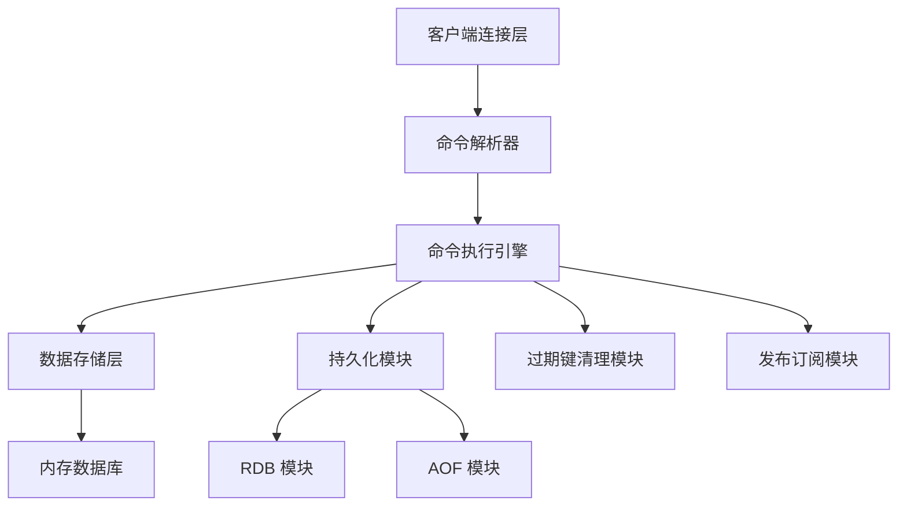
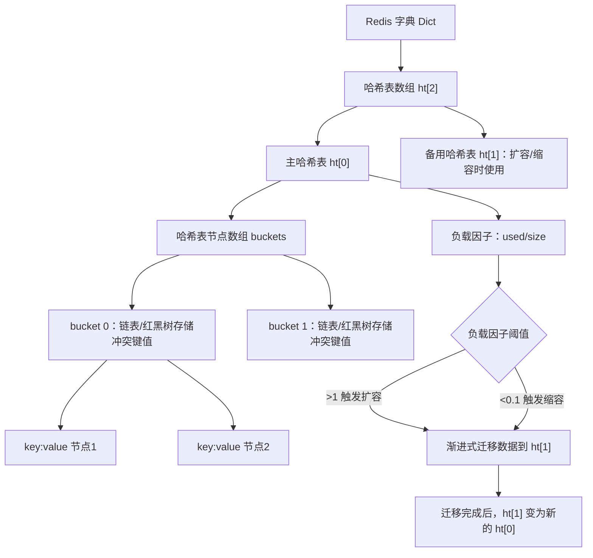
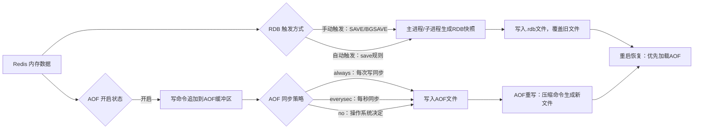
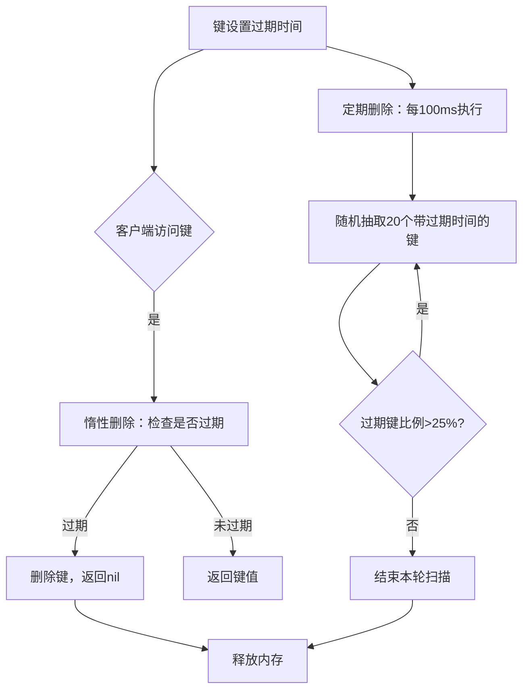
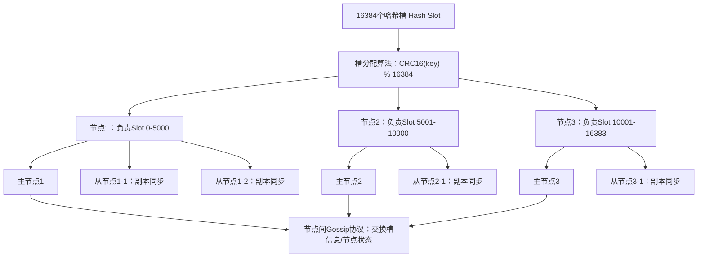

# Redis 核心解析：定义、架构与实现原理

Redis（Remote Dictionary Server）是一款开源的、高性能的键值对（Key-Value）内存数据库，同时支持数据持久化、多种数据结构、集群扩展等能力，被广泛用于缓存、会话存储、消息队列、排行榜等场景。它的核心特点是基于内存操作，因此读写速度极快，并且兼具灵活性与可扩展性。

## Redis 核心定位与特性

Redis 数据默认存储在内存中，这是它高性能的核心原因；同时提供两种持久化机制（RDB、AOF），可以将内存数据落地到磁盘，避免重启后数据丢失。

不同于传统的 Key-Value 数据库（仅支持字符串），Redis 支持字符串（String）、哈希（Hash）、列表（List）、集合（Set）、有序集合（Sorted Set）等多种原生数据结构，还支持位图（Bitmap）、地理空间（GEO）、流（Stream）等扩展结构。

Redis 采用单线程处理命令请求，避免了多线程的上下文切换开销；同时通过 I/O 多路复用技术（epoll/kqueue/select）处理大量并发连接，兼顾了高性能与并发能力。

提供主从复制、哨兵（Sentinel）、集群（Cluster）三种分布式方案，满足高可用、高并发、海量数据存储的需求。

所有命令都是原子性的，支持简单的事务（MULTI/EXEC/DISCARD），可以保证一组命令的顺序执行；同时支持 Lua 脚本，实现复杂的原子逻辑。

---

## 单机架构

单机 Redis 是一个单进程单线程的程序，核心组件包括客户端连接层、命令解析器、命令执行引擎、数据存储层、持久化模块、过期键清理模块和发布订阅模块。

客户端连接层负责处理 TCP 连接，支持多种客户端协议（RESP 协议），提供连接池管理。命令解析器将客户端发送的命令解析为 Redis 可执行的指令。命令执行引擎是核心单线程模块，负责执行所有命令，保证原子性。

数据存储层是内存中的键值对数据库，采用哈希表（Dict）作为核心存储结构，支持动态扩容/缩容。持久化模块包含 RDB 和 AOF 两个子模块，负责内存数据的磁盘持久化。过期键清理模块采用惰性删除 + 定期删除的策略，清理过期的键值对，释放内存。发布订阅模块实现 Pub/Sub 模式，支持消息的发布与订阅。

## 分布式架构

为了解决单机的性能瓶颈和单点故障问题，Redis 提供了三种分布式方案：

| 架构方案 | 核心原理 | 适用场景 |
|----------|----------|----------|
| 主从复制 | 一台主节点（Master）写数据，多台从节点（Slave）同步主节点数据并提供读服务 | 读写分离、提升读并发 |
| 哨兵（Sentinel） | 监控主从节点的健康状态，主节点故障时自动将从节点提升为主节点 | 高可用、自动故障转移 |
| 集群（Cluster） | 采用哈希槽（Hash Slot）分片，将 16384 个槽分配到不同节点，每个节点负责部分槽的读写 | 海量数据存储、水平扩展 |

---

## 数据存储

Redis 的核心存储结构是字典（Dict），类似于 Go 语言中的 `map[string]interface{}`，由两个哈希表组成：

- 主哈希表：用于正常读写数据
- 备用哈希表：用于哈希表扩容/缩容时的数据迁移

当哈希表的负载因子（used / size）超过阈值（默认 1）时，会触发扩容；当负载因子低于阈值（默认 0.1）时，会触发缩容。扩容/缩容过程是渐进式的，每次处理一个桶（bucket）的数据，避免阻塞主线程。

不同数据结构（如 List、Hash、Sorted Set）有各自的底层实现：

- List：小数据量时用压缩列表（ziplist），大数据量时用双向链表（linkedlist）
- Hash：小数据量时用 ziplist，大数据量时用 Dict
- Sorted Set：小数据量时用 ziplist，大数据量时用跳表（skiplist）+ Dict

## 单线程与多路 I/O 复用

Redis 的单线程指的是命令执行线程是单线程的，而持久化、异步删除等操作是通过后台线程（BIO）完成的，不会阻塞主线程。

多路 I/O 复用的核心是：一个线程监听多个 TCP 连接的事件（如可读、可写），当某个连接有事件发生时，才会进行对应的读写操作。Redis 会根据操作系统选择最优的 I/O 复用模型：

- Linux：epoll
- macOS/FreeBSD：kqueue
- Windows：select

这种模型的优势是：避免了多线程的上下文切换开销，同时能高效处理大量并发连接。

## RDB 持久化

- 原理：在指定时间间隔内，将内存中的数据快照（Snapshot）写入磁盘，生成 `.rdb` 文件
- 触发方式：手动触发（`SAVE`/`BGSAVE`）、自动触发（配置文件中的 `save` 规则）
- 优缺点：文件体积小、恢复速度快；但可能丢失最后一次快照后的修改数据

## AOF 持久化

- 原理：将所有写命令（如 `SET`/`HSET`）以协议格式追加到 `.aof` 文件中，重启时通过重放命令恢复数据
- 触发方式：实时追加（默认），支持三种同步策略：`always`（每次写都同步）、`everysec`（每秒同步，默认）、`no`（由操作系统决定）
- 优缺点：数据一致性更高（默认每秒同步，最多丢失 1 秒数据）；但文件体积大，恢复速度比 RDB 慢

## 过期键清理

Redis 中键可以设置过期时间，过期键的清理采用惰性删除 + 定期删除的混合策略：

- 惰性删除：当客户端访问某个键时，检查该键是否过期，若过期则删除并返回 `nil`
- 定期删除：Redis 每隔 100ms 随机抽取一定数量的键（默认 20 个），检查是否过期，若过期则删除；如果过期键比例超过 25%，则继续抽取，避免长时间阻塞主线程

这种策略平衡了内存占用和 CPU 开销，既不会让过期键长期占用内存，也不会因频繁扫描影响性能。

## Redis Cluster 哈希槽分片

Redis Cluster 采用哈希槽（Hash Slot）机制进行分片，将 16384 个槽分配到不同节点：

---

## 与传统数据库的区别

| 特性 | Redis | MySQL（传统关系型数据库） |
|------|-------|--------------------------|
| 存储介质 | 内存优先，支持持久化 | 磁盘优先，支持内存缓存 |
| 数据模型 | 键值对，支持多种数据结构 | 关系型，基于表和行 |
| 事务支持 | 弱事务（保证顺序执行，不支持回滚） | 强事务（ACID 特性） |
| 查询能力 | 支持简单的键查询和数据结构操作 | 支持复杂的 SQL 查询、联表查询 |
| 性能 | 极高（读 QPS 可达 10 万+） | 中等（依赖索引优化） |
