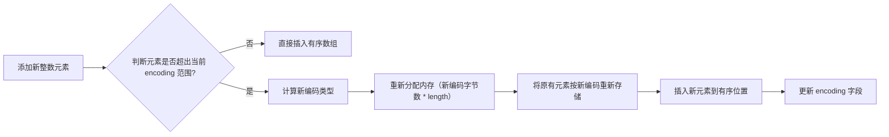

你想深入了解 Redis 中的 `intset`（整数集合）存储结构，我会从定义、核心特性、底层结构、操作原理和适用场景等方面，结合源码级的细节为你讲解，让你清楚它的设计思路和使用边界。

### 一、intset 是什么？
`intset` 是 Redis 为 **Set 数据类型** 专门设计的一种**紧凑、高效的整数存储结构**，是 Set 的「底层存储优化方案」—— 当 Set 中的元素全是整数，且元素数量不超过阈值（默认 `set-max-intset-entries = 512`）时，Redis 会优先使用 `intset` 而非哈希表存储，目的是**极致节省内存**。

简单来说：`intset` 是 Redis 对「纯整数集合」的内存优化版实现，相比哈希表（有大量元数据开销），它的内存占用能减少 90% 以上。

### 二、intset 的核心特性
1. **紧凑存储**：所有整数元素连续存储在一块内存中，无冗余元数据（如哈希表的桶、指针等）；
2. **类型自适应**：支持 16/32/64 位整数，会根据元素的数值范围自动升级编码，避免内存浪费；
3. **有序性**：元素按**升序**存储在数组中，支持二分查找（查询效率 $O(logN)$）；
4. **不可降级**：编码升级后不会再降级（比如从 64 位退回到 32 位），保证兼容性；
5. **原子性操作**：所有增删改查操作都是原子的，符合 Redis 单线程特性。

### 三、intset 的底层结构（源码级）
Redis 源码中 `intset.h` 定义了 `intset` 的结构体，核心结构如下（以 Redis 6.2 为例）：
```c
typedef struct intset {
    // 编码类型：决定每个元素占用的字节数
    uint32_t encoding;
    // 集合中元素的个数
    uint32_t length;
    // 柔性数组：存储实际的整数元素（连续内存）
    int8_t contents[];
} intset;
```

#### 关键字段解释：
1. **encoding（编码）**：
   是 `intset` 的核心优化点，取值有三种：
   - `INTSET_ENC_INT16`：每个元素占 2 字节（范围：-32768 ~ 32767）；
   - `INTSET_ENC_INT32`：每个元素占 4 字节（范围：-2147483648 ~ 2147483647）；
   - `INTSET_ENC_INT64`：每个元素占 8 字节（范围：-9223372036854775808 ~ 9223372036854775807）。

2. **length**：
   记录元素个数，而非内存字节数（比如 encoding 为 INT16 时，内存总字节数 = length * 2）。

3. **contents**：
   柔性数组（C 语言特性），按升序存储所有整数元素，无空洞、无重复。

### 四、intset 的核心操作原理
#### 1. 编码自动升级（最核心的机制）
当添加的整数超出当前编码的范围时，`intset` 会自动升级编码，步骤如下：

**示例**：
- 初始 `intset` 编码为 INT16，存储元素 `100`、`200`；
- 添加元素 `40000`（超出 INT16 范围），触发升级：
  1. 新编码改为 INT32；
  2. 重新分配内存（2 个元素 * 4 字节 = 8 字节）；
  3. 将 `100`、`200` 转为 4 字节存储；
  4. 插入 `40000` 到有序位置；
  5. 更新 `encoding = INTSET_ENC_INT32`。

#### 2. 元素查找（二分查找）
因为 `contents` 是升序数组，查找元素时用二分查找，时间复杂度 $O(logN)$：
```c
// 源码简化版：intsetFind 函数
uint8_t intsetFind(intset *is, int64_t value) {
    // 先判断值是否超出当前编码范围，快速返回不存在
    uint8_t valenc = _intsetValueEncoding(value);
    return valenc <= intrev32ifbe(is->encoding) && intsetSearch(is,value,NULL);
}

// 二分查找核心逻辑
static uint8_t intsetSearch(intset *is, int64_t value, uint32_t *pos) {
    int min = 0, max = intrev32ifbe(is->length)-1, mid = -1;
    while (min <= max) {
        mid = ((unsigned int)min + (unsigned int)max) >> 1;
        int64_t cur = _intsetGet(is,mid); // 获取 mid 位置的元素
        if (value > cur) min = mid+1;
        else if (value < cur) max = mid-1;
        else {
            if (pos) *pos = mid;
            return 1; // 找到元素
        }
    }
    if (pos) *pos = min; // 没找到，返回应该插入的位置
    return 0;
}
```

#### 3. 元素添加/删除
- **添加**：先通过 `intsetSearch` 找到插入位置，若元素已存在则返回失败；若不存在则扩容数组，将插入位置后的元素后移，再写入新元素；
- **删除**：找到元素位置后，将后续元素前移覆盖，缩小数组长度，不会释放内存（Redis 惰性释放策略）。

### 五、intset 的适用场景与边界
#### 1. 适用场景
- Set 中全是整数元素，且数量 ≤ 512（默认阈值）；
- 对内存占用敏感，且以「添加、查询、删除整数」为主要操作的场景（如存储用户 ID、商品 ID 等）。

#### 2. 不适用场景（会触发转为哈希表）
- Set 中添加**非整数元素**（如字符串 "123"）；
- 元素数量超过 `set-max-intset-entries` 阈值；
- 需要执行复杂的集合运算（如交集/并集）且元素数量极大（哈希表的集合运算效率更高）。

### 六、intset 与哈希表的对比
| 特性         | intset                | 哈希表（dict）|
|--------------|-----------------------|-----------------------------|
| 内存占用     | 极低（紧凑存储）| 较高（有桶、指针等元数据）|
| 查找效率     | $O(logN)$（二分查找） | $O(1)$（哈希查找）|
| 支持元素类型 | 仅整数                | 任意字符串（包括整数）|
| 扩容成本     | 高（需重新编码+拷贝） | 低（渐进式 rehash）|
| 适用规模     | 小规模（≤512 元素）| 大规模（无数量限制）|

### 总结
1. `intset` 是 Redis 为「纯整数 Set」设计的**内存优化存储结构**，核心优势是极致节省内存；
2. 其核心机制是**编码自动升级**，根据元素数值范围自适应 16/32/64 位存储，且升级后不可降级；
3. 当 Set 满足「全整数 + 元素数 ≤ 512」时使用 `intset`，否则自动转为哈希表，二者切换对上层用户透明。


你问到了 `intset` 中非常关键的「容量」和「扩容」细节，这也是新手容易混淆的点——`intset` 没有「固定容量上限」的概念，但有**内存扩容**的行为，且扩容分为「普通扩容」和「编码升级扩容」两种场景，我会把这两种情况的逻辑讲清楚。

### 一、先明确：intset 没有「固定容量」的概念
和 Redis 哈希表（dict）的「桶数（size）」、List 的「预分配容量」不同，`intset` 是**动态内存结构**，没有「初始化容量」「最大容量」这类固定值：
- 它的 `length` 字段只记录「当前元素个数」，而非「已分配的内存容量」；
- 内存占用 = `编码字节数 × length`（比如 INT16 编码下，10 个元素占用 2×10=20 字节）；
- 只要内存允许，理论上可以存储任意多的整数元素（但 Redis 会在元素数超过 `set-max-intset-entries`（默认 512）时，自动将 `intset` 转为哈希表，这是业务层面的阈值，而非 `intset` 本身的容量限制）。

### 二、intset 的两种扩容场景（插入数据时触发）
当插入新元素且元素不存在时，`intset` 一定会触发内存扩容，只是扩容逻辑分两种：

#### 场景 1：普通扩容（编码不变，仅增加元素数量）
**触发条件**：新元素的数值范围在当前编码内（无需升级编码），仅需新增一个元素的内存空间。
**扩容逻辑**：
1. 计算新内存大小 = 原内存大小 + 当前编码的单元素字节数；
2. 重新分配一块连续的内存空间（Redis 用 `realloc` 实现，尽量原地扩容）；
3. 将插入位置后的元素**向后移动**，腾出空间；
4. 写入新元素，更新 `length += 1`；
5. 不会释放原内存（C 语言 `realloc` 自动处理）。

**示例**：
- 现有 `intset`：编码 INT16，`length=3`，元素 [10, 20, 30]，占用内存 3×2=6 字节；
- 插入元素 25（INT16 范围内）：
  1. 新内存大小 = 6 + 2 = 8 字节；
  2. 找到插入位置（索引 2），将 30 后移到索引 3；
  3. 写入 25 到索引 2；
  4. `length` 变为 4，最终元素 [10, 20, 25, 30]。

#### 场景 2：编码升级扩容（数值超范围，触发编码升级）
这是 `intset` 最特殊的扩容方式，**触发条件**：新元素的数值超出当前编码的范围（比如 INT16 编码下插入 40000）。
**扩容逻辑**（比普通扩容更复杂）：
1. 计算新编码类型（比如 INT16 → INT32）；
2. 计算新内存大小 = 新编码单元素字节数 × (原 length + 1)；
3. 分配新内存空间；
4. 将原所有元素**按新编码重新编码并拷贝**到新内存；
5. 插入新元素到有序位置；
6. 更新 `encoding` 字段和 `length` 字段；
7. 释放原内存空间。

**示例**：
- 现有 `intset`：编码 INT16，`length=2`，元素 [100, 200]，占用 2×2=4 字节；
- 插入元素 40000（超出 INT16 范围，需升级为 INT32）：
  1. 新编码：INT32（单元素 4 字节）；
  2. 新内存大小 = 4 × (2+1) = 12 字节；
  3. 将 100、200 转为 4 字节存储到新内存；
  4. 插入 40000 到有序位置，最终元素 [100, 200, 40000]；
  5. `encoding` 改为 INT32，`length` 变为 3；
  6. 释放原 4 字节内存。

### 三、关键补充：扩容的性能特点
1. **普通扩容性能高**：
   - 仅需移动插入位置后的元素，且 `realloc` 大概率能原地扩容（无需拷贝全部数据）；
   - 时间复杂度：$O(N)$（最坏情况插入到头部，需移动所有元素），但因为 `intset` 仅在元素数 ≤512 时使用，实际性能损耗可忽略。

2. **编码升级扩容性能低**：
   - 需拷贝所有元素并重新编码，时间复杂度 $O(N)$；
   - 但编码升级是「一次性操作」，升级后后续插入同编码范围的元素，仅触发普通扩容。

3. **无「预扩容」机制**：
   - 和 Redis List、哈希表不同，`intset` 不会提前分配多余内存（比如 List 会预分配 2、4、8、16... 倍的内存）；
   - 每次插入都精准扩容（仅增加所需内存），这是为了契合「极致节省内存」的设计目标。

### 四、对比：intset 扩容 vs 哈希表扩容
| 维度         | intset 扩容                          | 哈希表（dict）扩容                    |
|--------------|--------------------------------------|---------------------------------------|
| 触发条件     | 插入新元素（普通扩容）/ 数值超范围（编码升级） | 负载因子 > 1（元素数/桶数 > 1）|
| 扩容方式     | 精准扩容（+1 个元素内存）/ 全量重编码 | 扩容为 2 倍桶数，渐进式 rehash        |
| 内存策略     | 极致节省（无冗余）| 预留冗余（避免频繁扩容）|
| 性能         | 小数据量下可忽略，编码升级时较高     | 渐进式 rehash，无明显性能抖动         |

### 总结
1. `intset` 没有「固定容量上限」，`set-max-intset-entries` 是 Redis 触发转为哈希表的业务阈值，而非 `intset` 本身的容量限制；
2. 插入数据时必然触发扩容：编码不变时仅「精准扩容」（+1 个元素内存），数值超范围时触发「编码升级+全量扩容」；
3. `intset` 无预扩容机制，每次扩容都精准分配内存，核心目标是「极致节省内存」，代价是插入时可能有少量数据移动开销。


你想搞清楚 `intset` 原地扩容的触发条件和限制，这其实是深入理解 Redis 内存管理的关键细节——`intset` 的扩容是否能「原地」完成，核心取决于 **底层内存分配器（如 jemalloc/tcmalloc）的内存布局** 和 `intset` 内存块的「周边空闲空间」，我会把具体条件和原理讲得通俗易懂。

### 一、先明确：「原地扩容」的本质
`intset` 的扩容依赖 C 语言的 `realloc` 函数（Redis 封装为 `zrealloc`），「原地扩容」的本质是：
> 当需要扩大 `intset` 占用的内存块时，内存分配器发现该内存块**后面有连续的空闲内存**，且空间足够容纳新的大小，就直接扩展当前内存块的边界，无需拷贝数据；反之则需要「异地扩容」—— 分配新的内存块，将原数据拷贝过去，释放旧内存块。

### 二、intset 原地扩容的条件（两种场景）
#### 场景 1：普通扩容（编码不变）的原地扩容条件
普通扩容仅需增加「1 个元素的字节数」（如 INT16 编码加 2 字节，INT32 加 4 字节），原地扩容的概率极高，满足以下条件即可：
1. **内存块后有足够空闲空间**：`intset` 所在的内存块（chunk）末尾，有至少「单元素字节数」的连续空闲内存；
2. **未触及内存页边界**：扩展后的内存块未超出当前内存页（Page）的边界（内存分配器以页为单位管理，跨页扩展通常不允许）；
3. **无内存碎片/锁定**：`intset` 内存块未被其他内存分配操作碎片化，也未被操作系统锁定。

**示例**：
- 现有 `intset` 占用 6 字节（INT16，3 个元素），需要扩容到 8 字节（加 1 个元素）；
- 若该 6 字节内存块后有 ≥2 字节的空闲空间 → 原地扩容，直接把内存块大小改为 8 字节，无需拷贝数据；
- 若后面无空闲空间 → 异地扩容，分配 8 字节新内存，拷贝原 6 字节数据，释放旧 6 字节内存。

#### 场景 2：编码升级扩容的原地扩容条件
编码升级扩容需要将内存扩大为「新编码字节数 × (原 length + 1)」（比如 INT16→INT32，2 个元素→3 个元素，内存从 4 字节→12 字节），原地扩容的条件极其苛刻：
1. **内存块后有超大连续空闲空间**：需要的空闲空间 = 新内存大小 - 原内存大小（如上例需要 8 字节空闲）；
2. **内存块本身在内存页的起始位置**：只有内存块位于页首，才有足够的连续空间扩展；
3. **无其他内存块占用**：`intset` 内存块后未被其他 Redis 数据结构（如 String、List）占用。

**结论**：编码升级扩容**几乎不可能原地完成**——因为需要的空闲空间太大，Redis 内存中很少有这么大的连续空闲空间紧跟在一个 `intset` 内存块后，所以编码升级时大概率是「异地扩容」（分配新内存 + 拷贝数据）。

### 三、无法原地扩容的核心场景
无论普通扩容还是编码升级，以下情况必然触发「异地扩容」：
1. **内存块后无足够空闲空间**：这是最常见的原因，比如 `intset` 内存块后面紧接着是另一个 Redis 键的内存块（如 String 类型的 `user:name`），没有可扩展的空间；
2. **跨内存页扩展**：内存分配器的内存页大小通常是 4KB/8KB，若 `intset` 内存块接近页尾，扩展后会超出页边界，只能异地扩容；
3. **内存块被标记为「不可扩展」**：部分内存分配器（如 jemalloc）会对小内存块做特殊标记，限制其扩展，避免碎片化；
4. **编码升级的大内存需求**：如前所述，编码升级需要的内存增量大，几乎无法找到足够的连续空闲空间。

### 四、Redis 层面的优化：为什么普通扩容几乎都是原地的？
Redis 对小内存块的分配做了优化，让 `intset` 普通扩容的原地概率极高：
1. **小内存块的连续分配**：Redis 会将小数据结构（如 `intset`、短 String）集中分配在同一内存页，且相邻内存块之间预留少量空闲空间；
2. **jemalloc 的 tcache 机制**：Redis 默认使用的 jemalloc 有线程缓存（tcache），会为小内存块预留空间，`realloc` 时优先在缓存内原地扩展；
3. **intset 本身数据量小**：`intset` 仅在元素数 ≤512 时使用，普通扩容仅增加 2/4/8 字节，所需空闲空间极小，容易满足。

### 五、直观对比：原地 vs 异地扩容
| 维度         | 原地扩容                          | 异地扩容                          |
|--------------|-----------------------------------|-----------------------------------|
| 数据拷贝     | 无（仅修改内存块边界）| 有（拷贝所有原数据到新内存）|
| 性能         | 极高（$O(1)$）| 较低（$O(N)$，N 为元素数）|
| 触发概率（普通扩容） | 99%+（几乎都能满足）| 极低                              |
| 触发概率（编码升级） | 几乎为 0                          | 100%（几乎必然触发）|
| 内存碎片     | 无（利用空闲空间）| 有（旧内存块变为碎片，需后续回收）|

### 总结
1. `intset` 原地扩容的核心条件是：**内存块后有足够的连续空闲空间，且未跨内存页边界**；
2. 普通扩容（编码不变）几乎都是原地的（仅需增加 2/4/8 字节，空闲空间易满足）；
3. 编码升级扩容几乎都是异地的（需要的空闲空间大，难以满足）；
4. 无法原地扩容的核心原因是「内存块后无足够空闲空间」或「跨内存页扩展」。

简单来说：你可以把 `intset` 想象成一个放在抽屉里的小盒子，普通扩容只是把盒子稍微拉长一点（只要抽屉里有一点点空隙就能做到），而编码升级扩容是要把小盒子换成大盒子（需要抽屉里有一大片空位置，几乎没有）。


你现在已经深入了解了 `intset` 的核心机制，但还有几个**易混淆、易踩坑且贴近实战**的细节点，是新手甚至部分中高级开发者容易忽略的，我会把这些「模糊点」逐一讲透，帮你彻底搞懂 `intset`：

### 一、易混淆的核心概念澄清
#### 1. `intset` 的「长度」vs「内存大小」
很多人会把 `intset` 的 `length` 字段和实际占用内存大小混淆：
- `length`：仅记录**元素个数**（比如 `length=5` 表示有 5 个整数元素）；
- 实际内存大小 = `编码单元素字节数 × length` + 结构体固定开销（`encoding` 4 字节 + `length` 4 字节 = 8 字节）；
  ✅ 示例：INT16 编码、length=5 的 `intset`，总内存 = 8 + (2×5) = 18 字节。

#### 2. 「编码升级不可逆」的深层影响
编码升级后不会降级，哪怕删除了大数值元素，编码也不会回退：
- 示例：INT16 编码插入 40000 升级为 INT32 → 删除 40000 后，编码仍为 INT32，内存占用不会减少；
- 影响：如果频繁插入超大数再删除，`intset` 会一直占用高编码的内存（比如 INT64），造成内存浪费；
- 解决方案：若需回收内存，可手动将 `intset` 转为哈希表（比如插入一个非整数元素，触发转换后再删除该元素）。

#### 3. `set-max-intset-entries` 不是 `intset` 的「容量上限」
这个配置（默认 512）是 Redis **触发 `intset` 转哈希表的阈值**，而非 `intset` 本身的容量限制：
- 若手动将 `set-max-intset-entries` 改为 1000，`intset` 可以存储 1000 个整数元素；
- 即使元素数超过该阈值，`intset` 本身仍能正常扩容/操作，只是 Redis 会自动将其转为哈希表（因为哈希表处理大数据量更高效）；
- 底层逻辑：Redis 在执行 `SADD` 时，会检查元素数，超过阈值则触发 `intset` → 哈希表的转换。

### 二、实战中易踩的坑
#### 1. 「整数形式的字符串」不会触发 `intset`
`intset` 仅存储**真正的整数**，如果插入「看起来是整数的字符串」（如 `"123"`），会直接触发 `intset` 转为哈希表：
- ❌ 错误操作：`SADD myset "123"` → 插入字符串 "123"，`intset` 直接转哈希表；
- ✅ 正确操作：`SADD myset 123` → 插入整数 123，优先使用 `intset`；
- 底层判断：Redis 会调用 `isInteger` 函数检查元素是否为整数，仅通过检查才会用 `intset`。

#### 2. 批量插入的性能陷阱
`intset` 是有序数组，批量插入无序整数时，每次插入都要移动元素，时间复杂度会从 $O(N)$ 飙升到 $O(N^2)$：
- ❌ 错误实践：循环执行 `SADD myset 5 3 1 4 2`（无序插入），每次插入都要二分查找+移动元素；
- ✅ 优化实践：先将整数排序，再批量插入，Redis 会优化为一次内存拷贝，时间复杂度降为 $O(N)$；
- 原理：有序插入时，元素可直接追加到数组末尾，无需移动其他元素。

#### 3. `intset` 不支持「负数索引」和「随机访问优化」
虽然 `intset` 是数组，但 Redis 对外暴露的命令中，没有「按索引访问元素」的功能（如 `SINDEX myset 0`）：
- 原因：`intset` 是 Set 的底层实现，Set 对外是「无序集合」，暴露索引会违背 Set 的设计语义；
- 影响：无法通过索引快速获取元素，只能用 `SMEMBERS`/`SSCAN` 遍历，或 `SRANDMEMBER` 随机获取。

### 三、底层实现的冷门细节
#### 1. `intset` 的内存对齐
Redis 会对 `intset` 做内存对齐优化，避免 CPU 缓存行失效：
- 内存分配时，`intset` 的起始地址会对齐到 8 字节（64 位系统）；
- `contents` 柔性数组的起始地址也会对齐，保证整数读取时无需跨缓存行，提升访问效率。

#### 2. `intset` 的「惰性收缩」
删除元素时，`intset` 只会「逻辑收缩」（`length -= 1`），不会「物理收缩」内存：
- 示例：删除 INT16 编码、length=5 的 `intset` 中的一个元素，length 变为 4，但内存仍占用 8 + (2×5) = 18 字节；
- 原因：Redis 采用「惰性内存回收」，避免频繁的 `realloc` 操作（收缩内存也需要调用 `realloc`，会有性能开销）；
- 内存回收时机：只有当 `intset` 被删除（`DEL` 命令）或转为哈希表时，才会释放多余内存。

#### 3. 不同 Redis 版本的 `intset` 差异
- Redis 3.2 之前：`intset` 不支持 INT64 编码，最大只能存储 INT32 范围的整数；
- Redis 3.2 及之后：新增 INT64 编码，支持更大范围的整数；
- Redis 7.0+：优化了 `intset` 的批量插入逻辑，对有序整数批量插入做了专门的性能优化。

### 四、面试/实战高频问题
#### 1. 为什么 `intset` 要用有序数组？
- 核心原因：**保证元素唯一性**（插入前二分查找，快速判断元素是否已存在）；
- 次要原因：二分查找的时间复杂度 $O(logN)$，在元素数 ≤512 时，效率和哈希表 $O(1)$ 几乎无差异，且内存占用远低于哈希表。

#### 2. `intset` 和 `ziplist`（压缩列表）的设计思路对比
两者都是 Redis 的「紧凑存储结构」，但定位不同：
| 特性         | intset                | ziplist（已被 listpack 替代）|
|--------------|-----------------------|--------------------------------|
| 存储类型     | 仅整数                | 整数/字符串                    |
| 有序性       | 强制升序              | 按插入顺序存储                 |
| 核心优化     | 编码自动升级          | 压缩编码（如整数用 1/2/5 字节）|
| 适用场景     | Set 底层              | List/Hash/ZSet 底层（旧版本）|

### 总结
1. `intset` 的 `length` 是元素数，不是内存大小，且编码升级不可逆，易造成内存浪费；
2. 仅「纯整数」能触发 `intset`，整数形式的字符串会直接转为哈希表；
3. `intset` 采用惰性收缩，删除元素不释放内存，批量插入有序整数性能更高；
4. `set-max-intset-entries` 是转哈希表的阈值，而非 `intset` 本身的容量限制。

如果还有具体想深挖的点（比如 `intset` 源码中的某个函数、和其他数据结构的性能对比等），可以直接提出来，我会针对性讲解。


基于 `intset` 之前未覆盖的**核心模糊点和实战流程**，我设计了 **4 张 Mermaid 图**，分别对应 **编码升级不可逆流程**、**批量插入性能优化逻辑**、**内存占用计算模型** 和 **惰性收缩机制**，帮你把剩余细节可视化：

---

### 1. 编码升级不可逆流程（删除大值元素后编码不降级）
```mermaid
flowchart LR
    A[初始化 intset: INT16, length=2, 元素[100,200]] --> B[插入 40000（超 INT16 范围）]
    B --> C[触发编码升级为 INT32]
    C --> D[intset: INT32, length=3, 元素[100,200,40000]]
    D --> E[删除元素 40000]
    E --> F{编码是否降级为 INT16?}
    F -->|否: 编码升级不可逆| G[intset: INT32, length=2, 元素[100,200]]
    G --> H[内存占用仍为 INT32 编码大小]
```

---

### 2. 批量插入有序 vs 无序整数的性能对比逻辑
```mermaid
graph TD
    subgraph 无序批量插入（性能差 O(N²)）
        U1[循环插入 5,3,1,4,2] --> U2[每次插入前二分查找位置]
        U2 --> U3[移动插入位置后所有元素]
        U3 --> U4[插入当前元素]
        U4 --> U2
    end

    subgraph 有序批量插入（性能优 O(N)）
        O1[先排序整数为 1,2,3,4,5] --> O2[批量插入有序序列]
        O2 --> O3[Redis 优化: 直接追加到数组末尾]
        O3 --> O4[无需移动元素，一次内存拷贝]
    end

    U1 -->|时间复杂度| U5[O(N²)，N=5 时需多次移动]
    O1 -->|时间复杂度| O5[O(N)，N=5 时仅一次遍历]
```

---

### 3. intset 内存占用计算模型（length vs 编码 vs 总内存）
```mermaid
flowchart TD
    A[intset 总内存] --> B[结构体固定开销: 8 字节]
    A --> C[元素数组内存: 编码单元素字节数 × length]
    
    B --> B1[encoding: 4 字节]
    B --> B2[length: 4 字节]
    
    C --> C1{编码类型}
    C1 -->|INT16| C11[单元素 2 字节]
    C1 -->|INT32| C12[单元素 4 字节]
    C1 -->|INT64| C13[单元素 8 字节]
    
    C11 & C12 & C13 --> D[元素数组总内存 = 单元素字节数 × length]
    
    B & D --> E[总内存 = 8 + 元素数组总内存]
    
    %% 示例
    E --> F[示例: INT16, length=5]
    F --> G[总内存 = 8 + (2×5) = 18 字节]
```

---

### 4. intset 惰性收缩机制（删除元素不释放内存）
```mermaid
flowchart LR
    S1[初始 intset: INT16, length=3, 元素[10,20,30]] --> S2[总内存=8+(2×3)=14 字节]
    S2 --> S3[执行 SREM 命令删除元素 20]
    S3 --> S4[逻辑收缩: length 从 3→2]
    S4 --> S5[物理内存: 仍占用 14 字节（不释放）]
    S5 --> S6{何时释放多余内存?}
    S6 -->|情况1: DEL 整个 Set 键| S7[释放全部 14 字节内存]
    S6 -->|情况2: 触发转为哈希表| S8[释放 intset 内存，分配哈希表内存]
    S6 -->|情况3: 插入非整数元素| S8
```

---

### 图表使用提示
1.  复制代码到 [Mermaid Live Editor](https://mermaid.live/) 可直接渲染，支持调整箭头方向和样式。
2.  可将这些图嵌入到你的技术文档中，搭配之前的 `intset` 结构和转换流程，形成完整的可视化知识体系。

你是否需要我针对 **intset 与 ziplist 的设计思路对比** 补充一张 Mermaid 图？