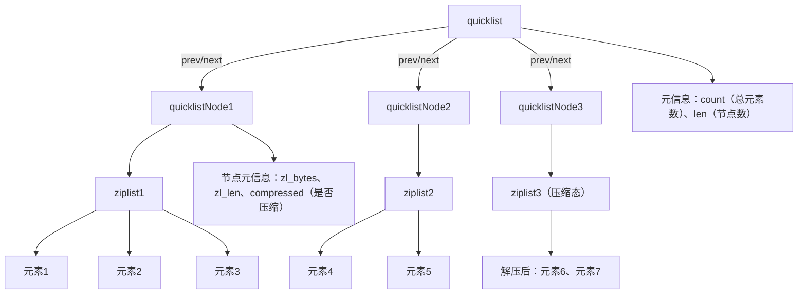
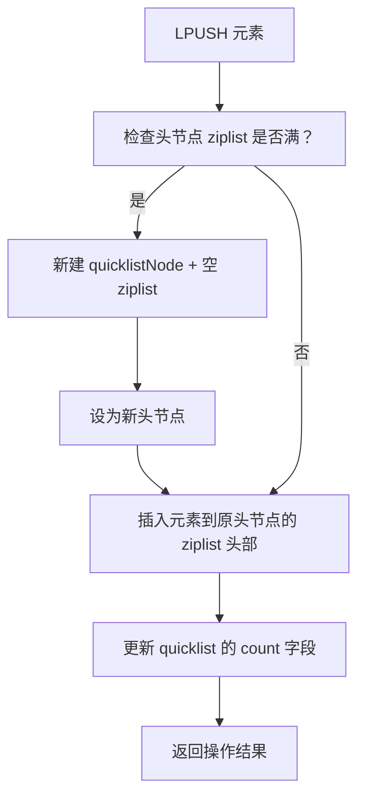
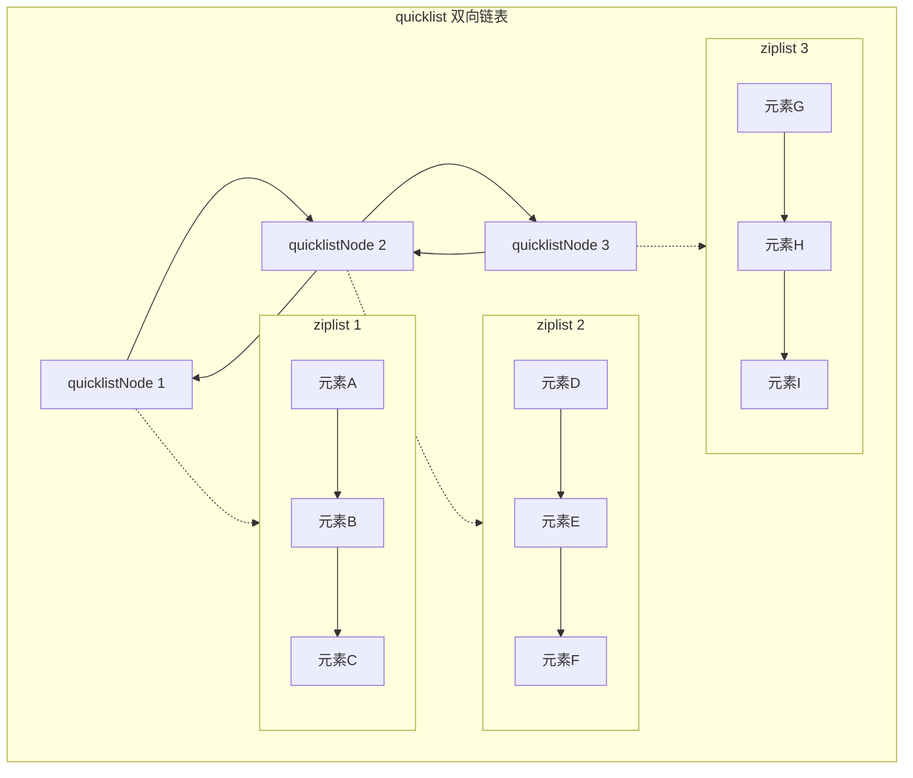
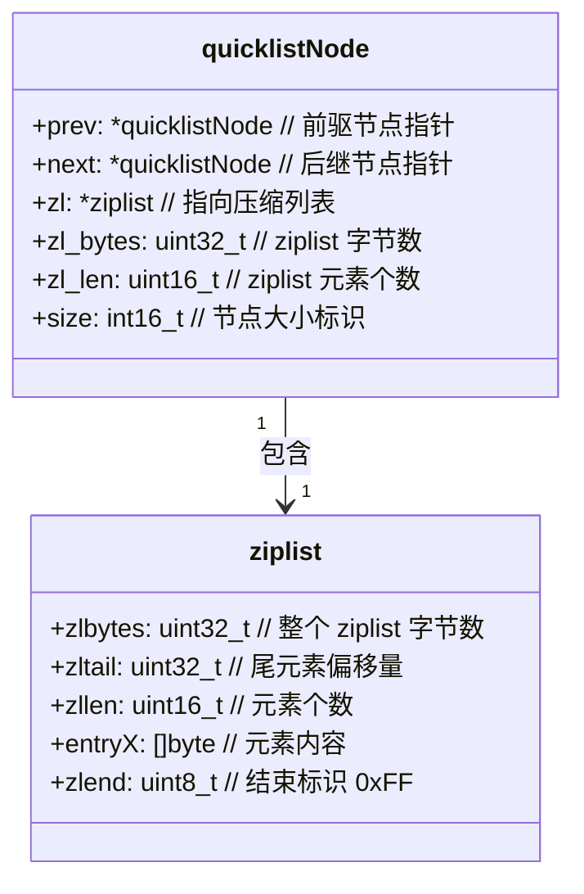
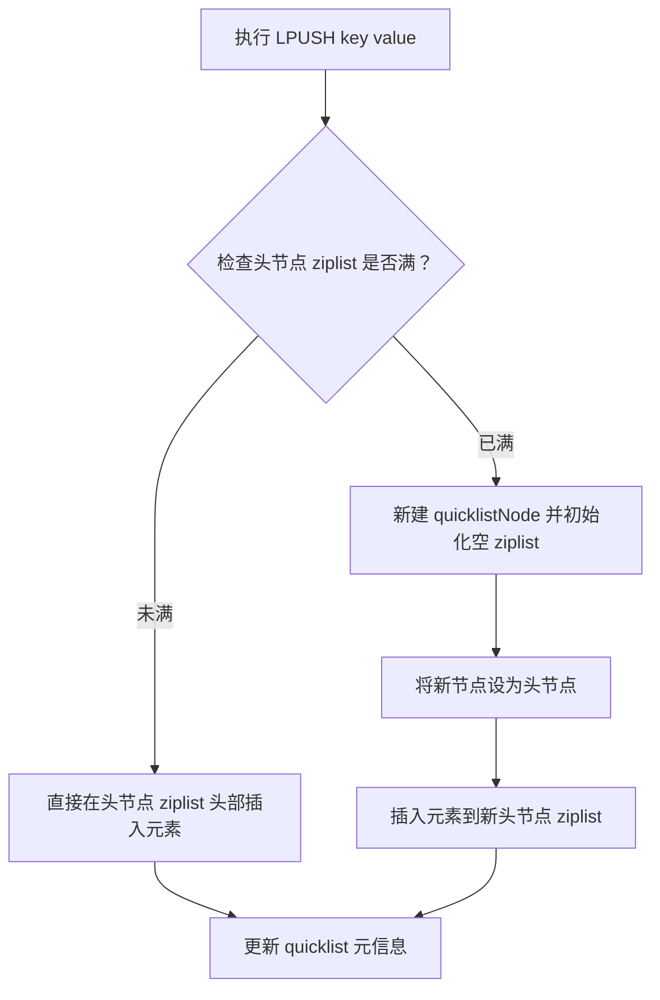

你想了解 Redis 中的 quicklist 数据结构，这是 Redis 中列表（List）类型的底层实现，理解它能帮你更好地掌握 Redis 列表的性能特点。

### 一、quicklist 是什么？
quicklist 是 Redis 从 3.2 版本开始引入的，作为列表（List）类型的底层实现，它结合了 **ziplist（压缩列表）** 和 **双向链表** 的优点，解决了 ziplist 扩容效率低、双向链表内存开销大的问题。

简单来说：
- quicklist 本质是一个**双向链表**，链表中的每个节点（称为 quicklistNode）不是直接存储数据，而是存储一个 ziplist。
- ziplist 是一种紧凑的连续内存结构，能节省内存；双向链表则解决了 ziplist 插入/删除元素时需要整体移动数据的问题。

### 二、quicklist 的核心结构
#### 1. 整体结构
```
quicklist（双向链表）
├── quicklistNode（链表节点1） → 存储 ziplist1（存放一批列表元素）
├── quicklistNode（链表节点2） → 存储 ziplist2（存放另一批列表元素）
├── quicklistNode（链表节点3） → 存储 ziplist3（存放另一批列表元素）
└── ...
```

#### 2. 关键组成部分
- **quicklist**：外层双向链表，包含头节点、尾节点指针、节点数量、总元素数量等元信息。
- **quicklistNode**：链表的单个节点，核心字段包括：
  - `zl`：指向当前节点的 ziplist 指针；
  - `prev/next`：指向前后节点的指针（双向链表特性）；
  - `zl_bytes`：当前 ziplist 的字节数；
  - `zl_len`：当前 ziplist 中的元素个数。
- **ziplist**：紧凑的字节数组，所有元素连续存储，无冗余内存开销，适合存储少量、小尺寸的元素。

### 三、quicklist 的核心特性（为什么设计成这样？）
#### 1. 内存与性能的平衡
- 若只用 ziplist：元素少、尺寸小时内存高效，但元素增多/增大时，插入/删除需要移动大量内存数据，性能急剧下降；
- 若只用双向链表：插入/删除高效，但每个节点有额外指针开销（每个节点至少 16 字节），内存利用率低；
- quicklist 结合两者：每个节点用 ziplist 存储一批元素，既减少了链表节点的数量（降低指针开销），又保留了链表插入/删除的高效性。

#### 2. 可配置的优化参数
Redis 提供了两个核心配置项，可根据业务场景调整 quicklist 的行为：
- `list-max-ziplist-size`：控制每个 quicklistNode 中 ziplist 的最大大小（单位：字节）或最大元素数。
  - 正数：表示 ziplist 最多包含的元素个数（如 8 表示每个节点最多存 8 个元素）；
  - 负数：表示 ziplist 的最大字节数（-1=4kb，-2=8kb，-3=16kb，-4=32kb，-5=64kb）。
- `list-compress-depth`：控制 quicklist 的压缩深度（使用 LZF 算法压缩 ziplist），减少冷数据的内存占用。
  - 0：不压缩（默认）；
  - 1：压缩除了头、尾节点外的所有节点；
  - 2：压缩除了头 2 个、尾 2 个节点外的所有节点，以此类推。

### 四、quicklist 的操作逻辑
以列表的 `LPUSH`（左插入）和 `RPOP`（右弹出）为例：
1. **LPUSH**：
   - 检查 quicklist 的头节点的 ziplist 是否还有空间（未达到 `list-max-ziplist-size`）；
   - 有空间：直接在头节点的 ziplist 头部插入元素；
   - 无空间：新建一个 quicklistNode（包含空 ziplist），作为新的头节点，再插入元素。
2. **RPOP**：
   - 检查 quicklist 的尾节点的 ziplist 是否有元素；
   - 有元素：直接从尾节点的 ziplist 尾部弹出元素；
   - 无元素：删除该尾节点，再从新的尾节点弹出元素；
   - 若所有节点都无元素，返回 nil。

### 总结
1. quicklist 是 Redis 列表的底层实现，结合了**双向链表**（高效插入/删除）和**ziplist**（内存紧凑）的优点；
2. 每个 quicklist 节点是一个 quicklistNode，内部封装了 ziplist 用于存储实际元素；
3. 通过 `list-max-ziplist-size` 和 `list-compress-depth` 两个配置，可在内存占用和性能之间做灵活权衡。

掌握 quicklist 的设计思路，能帮助你在使用 Redis 列表时，根据业务场景（如存储大量小元素、或少量大元素）调整配置，优化列表的性能和内存使用。


你想知道除了基础结构和核心特性外，Redis quicklist 还有哪些容易被忽略但重要的细节，这能帮你更全面地理解它的设计和使用场景。

### 一、补充的关键细节
#### 1. quicklist 的内存对齐与内存碎片优化
quicklistNode 内部的 ziplist 会做**内存对齐**处理（默认按 8 字节对齐），目的是减少内存碎片、提升 CPU 缓存命中率。
- 原理：CPU 读取内存时是按“缓存行”（通常 64 字节）批量读取的，对齐后的内存地址能让 ziplist 数据更适配缓存行，减少无效读取；
- 注意：内存对齐会带来少量内存冗余（最多 7 字节），但相比性能提升，这个开销是可接受的。

#### 2. ziplist 的“连锁更新”问题及 quicklist 的规避
ziplist 存在一个经典问题：**连锁更新**（cascade update）。
- 问题原因：ziplist 中每个元素的长度字段是“变长”的（1/2/5 字节），若修改一个元素导致长度字段变化，可能触发后续所有元素的长度字段连续更新，最坏时间复杂度 O(n)；
- quicklist 的规避方式：
  1. 每个 quicklistNode 只存储一批元素（受 `list-max-ziplist-size` 限制），即使触发连锁更新，也只局限在单个节点的 ziplist 内，不会扩散到整个列表；
  2. 单个 ziplist 元素数量/大小有限，连锁更新的影响范围被严格控制，性能损耗可忽略。

#### 3. quicklist 的迭代器设计
Redis 为 quicklist 实现了专用的**迭代器**（quicklistIter），支持：
- 双向迭代（从表头到表尾/从表尾到表头）；
- 安全迭代（迭代过程中允许修改列表，不会因节点删除导致迭代器失效）；
- 惰性加载（迭代到压缩节点时，才会临时解压，用完后可重新压缩，不影响内存）。

#### 4. 与旧版本的兼容及性能对比
- Redis 3.2 前，列表的底层实现是“ziplist + 双向链表”的二选一（元素少用 ziplist，多用链表）；
- quicklist 是“融合版”：无论元素多少，始终用 quicklist，但内部自动调整 ziplist 大小；
- 性能优势：
  - 小元素场景：内存占用与 ziplist 接近，插入/删除性能略优（无需整体扩容）；
  - 大元素/多元素场景：内存占用远低于纯双向链表，迭代/修改性能基本持平。

#### 5. 特殊操作的处理逻辑
以 `LINSERT`（在指定元素前后插入）和 `LLEN`（获取长度）为例：
- `LLEN`：quicklist 内部维护了 `count` 字段（总元素数），无需遍历，直接返回，时间复杂度 O(1)；
- `LINSERT`：
  1. 先遍历找到目标元素所在的 quicklistNode 和 ziplist 位置；
  2. 检查该 ziplist 是否有空间，有则直接插入，无则拆分 ziplist 为两个节点，再插入；
  3. 全程只需操作单个/两个节点，不会影响整个列表。

### 二、补充 Mermaid 图（关键流程/结构）
#### 1. quicklist 整体结构（细化版）


#### 2. LPUSH 操作流程


### 总结
1. quicklist 做了**内存对齐**和**连锁更新规避**，平衡了性能与内存碎片问题；
2. 内置 `count` 字段让 `LLEN` 等操作 O(1) 完成，迭代器支持安全/惰性操作；
3. 相比旧版本的“二选一”实现，quicklist 在全场景下都有内存/性能优势，且兼容原有列表操作；
4. 特殊操作（如 LINSERT）仅影响局部节点，不会扩散到整个列表，保证了操作效率。

这些细节能帮你理解 quicklist 不仅是“简单拼接”，而是针对 Redis 列表的实际使用场景做了大量底层优化，也是 Redis 性能高效的重要原因之一。


你想知道 Redis 的哈希（Hash）类型底层优先使用 ziplist 而非 quicklist 的原因，核心在于两种数据结构的设计目标和哈希类型的访问特性不匹配，ziplist 更贴合哈希的使用场景。

### 一、先明确前提：Hash 的底层实现规则
首先要纠正一个细节：Redis Hash 并非“只用 ziplist”，而是**优先用 ziplist，当满足阈值时转为 dict（哈希表）**（Redis 7.0+ 还引入了 listpack 替代 ziplist，但逻辑一致），从始至终都不会用 quicklist。

触发 ziplist 转 dict 的阈值（可配置）：
- `hash-max-ziplist-entries`：ziplist 中存储的键值对数量上限（默认 512）；
- `hash-max-ziplist-value`：单个键/值的字节数上限（默认 64）。

### 二、Hash 不用 quicklist 的核心原因
#### 1. 访问模式完全不同：哈希是“随机查找”，quicklist 是“顺序访问”
- **Hash 的核心操作**：`HGET`/`HSET`/`HDEL`（根据 key 快速查找/修改 value），属于**随机访问**，要求 O(1) 或 O(n) 但 n 极小的查找效率；
- **quicklist 的设计目标**：为 List 类型的**顺序访问**（`LPUSH`/`RPOP`/`LRANGE`）优化，本质是双向链表，随机访问某个元素需要遍历链表节点+ziplist，时间复杂度 O(m+n)（m 是链表节点数，n 是 ziplist 元素数），效率远低于 ziplist 直接遍历；
- **ziplist 的适配性**：虽然 ziplist 随机查找也是 O(n)，但 Hash 使用 ziplist 时，n（键值对数量）被 `hash-max-ziplist-entries` 限制在极小范围（默认 512），实际遍历开销可忽略；且 ziplist 是连续内存，CPU 缓存命中率远高于 quicklist（离散的链表节点），实际访问速度更快。

#### 2. 数据结构的开销：quicklist 对 Hash 是“过度设计+内存浪费”
- **quicklist 的额外开销**：每个 quicklistNode 包含 `prev/next` 指针（至少 16 字节）、`zl_bytes`/`zl_len` 等元信息，即使只有一个节点，也比纯 ziplist 多占用十几字节内存；
- **Hash 的使用场景**：大量 Hash 存储的是少量键值对（如用户信息：name/age/phone），用 quicklist 会因链表节点的额外开销，导致内存利用率远低于 ziplist；
- **ziplist 的优势**：紧凑的连续内存，无冗余指针开销，存储少量键值对时内存效率极致，这正是 Hash 小数据场景的核心需求。

#### 3. 数据组织形式不匹配
- **Hash 的存储需求**：键值对是“成对”存储的，需要保证 key 和 value 的紧密关联；
  ziplist 中 Hash 的存储格式是：`[key1, value1, key2, value2, ...]`，连续存储且键值一一对应，遍历和解析逻辑简单；
- **quicklist 的存储形式**：以“节点+ziplist”为单位，若用 quicklist 存储 Hash，键值对可能被拆分到不同的 quicklistNode 中（比如 key1 在节点1，value1 在节点2），会彻底破坏键值的关联性，导致查找/修改逻辑极度复杂，完全违背 Hash 的设计初衷。

#### 4. 扩容/收缩逻辑的适配性
- **Hash 的扩容逻辑**：当 ziplist 达到阈值时，直接转为 dict（哈希表），dict 天生适配大量键值对的随机访问，时间复杂度 O(1)，是 Hash 大数据量场景的最优解；
- **quicklist 的扩容逻辑**：是为 List 的“追加/弹出”设计的，扩容时新建节点，无法适配 Hash 从“小数据量”到“大数据量”的平滑过渡（quicklist 即使节点再多，随机访问效率也远不如 dict）。

### 三、对比：ziplist/quicklist/dict 适配的场景
| 数据结构 | 核心优势 | 适配类型 | 核心操作 |
|----------|----------|----------|----------|
| ziplist  | 内存紧凑、连续访问快 | Hash（小数据）、List（旧版） | 少量数据的遍历/随机访问 |
| quicklist | 顺序插入/删除高效、内存平衡 | List（新版） | 首尾追加/弹出、范围遍历 |
| dict     | 随机访问/修改 O(1) | Hash（大数据）、Set（哈希表版） | 任意键的查找/修改/删除 |

### 四、补充：Redis 设计的核心原则
Redis 对每种数据类型选择底层实现的核心逻辑是：**匹配该类型的核心操作特性，在小数据量时追求极致内存效率，大数据量时追求极致访问性能**：
- List 的核心操作是“顺序追加/弹出/范围遍历”→ 选 quicklist（平衡内存和顺序操作性能）；
- Hash 的核心操作是“随机键值对查找/修改”→ 小数据量选 ziplist（内存极致），大数据量选 dict（访问极致）；
- 若强行给 Hash 用 quicklist，会既损失内存效率，又损失访问性能，完全违背这一原则。

### 总结
1. Hash 的核心操作是**随机访问键值对**，quicklist 为顺序访问设计，随机访问效率低，而 ziplist 虽遍历但数据量小、缓存命中率高，更适配；
2. quicklist 有链表节点的额外内存开销，对 Hash 小数据场景是浪费，ziplist 紧凑存储更符合 Hash 的内存优化需求；
3. Hash 大数据量时会转为 dict（哈希表），而非 quicklist，因为 dict 是随机访问的最优解，quicklist 无法替代。

简单来说：quicklist 是为“顺序操作的列表”而生，ziplist/dict 是为“随机操作的哈希”而生，场景不同，选择自然不同。


### 1. quicklist 整体结构（双向链表 + ziplist）


### 2. quicklistNode 核心字段结构


### 3. quicklist 压缩深度逻辑（以 depth=1 为例）


### 4. quicklist LPUSH 操作流程


这些图表可以清晰地展示 quicklist 的**结构组成**、**节点字段**、**压缩策略**和**操作流程**，你可以直接将代码复制到支持 Mermaid 的工具（如 Typora、VS Code 插件）中渲染查看。

是否需要补充 **RPOP 操作流程** 或 **ziplist 内部元素存储** 的 Mermaid 图？