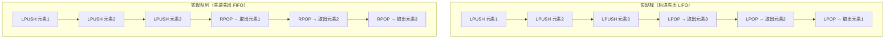
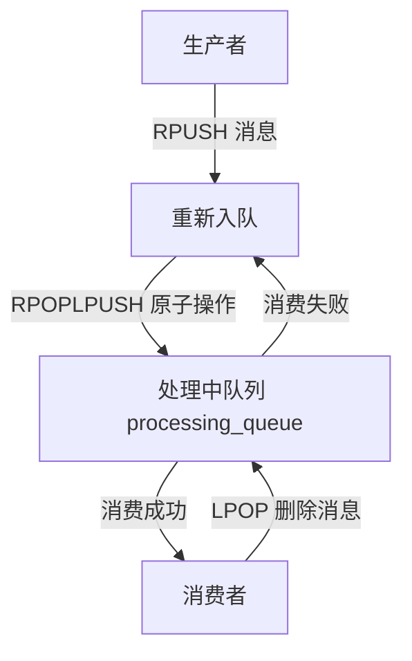
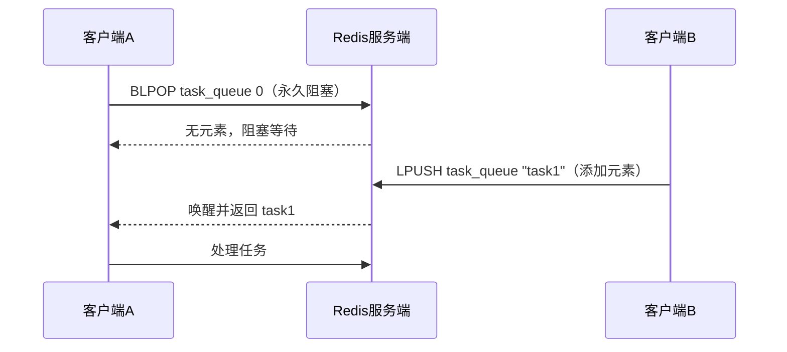
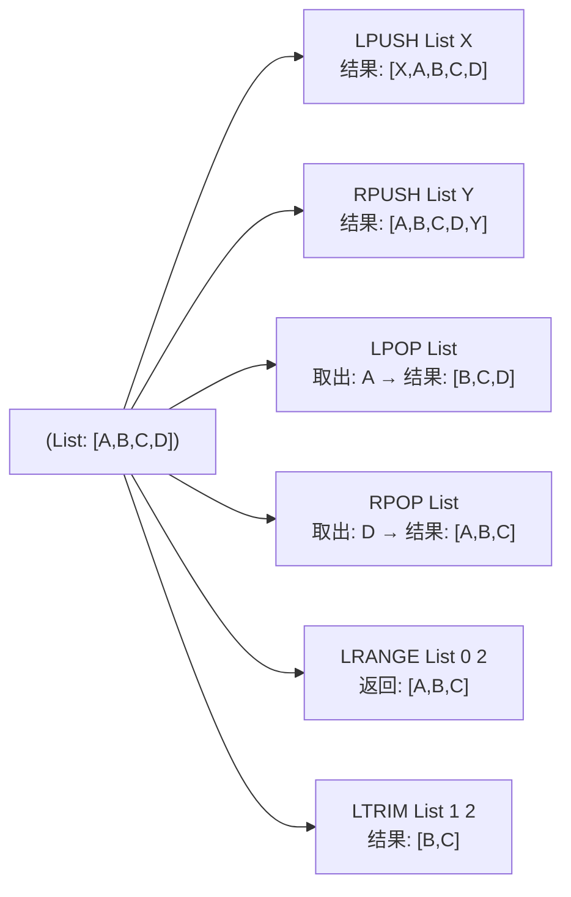

# Redis List 数据类型详解

## 基本概念与特性

Redis List 是一种**有序、可重复**的字符串元素集合，底层实现主要是快速链表（Redis 3.2+），结合了双向链表和压缩列表的优势，既高效又节省内存。

**核心特性**

- **有序性**：元素按插入顺序排列，不会自动排序
- **可重复性**：同一个字符串可以多次出现在列表中
- **双端操作**：支持从表头（LPUSH/LPOP）、表尾（RPUSH/RPOP）快速操作，时间复杂度 O(1)
- **范围访问**：支持按索引范围获取元素（LRANGE），适合分页场景
- **长度限制**：理论上最多可存储 2^32 - 1 个元素（约 42 亿）

Redis List 可以想象成一个**双向队列**，支持从头部或尾部添加/删除元素，也可以当作栈或普通链表使用。元素按插入顺序排列，有索引（从 0 开始），可通过索引访问元素。

---

## 核心命令

**基础操作命令**

| 命令 | 作用 | 示例 |
|------|------|------|
| `LPUSH key value` | 从列表**头部**添加一个/多个元素 | `LPUSH mylist "apple"` |
| `RPUSH key value` | 从列表**尾部**添加一个/多个元素 | `RPUSH mylist "banana"` |
| `LPOP key` | 从列表**头部**删除并返回一个元素 | `LPOP mylist` |
| `RPOP key` | 从列表**尾部**删除并返回一个元素 | `RPOP mylist` |
| `LRANGE key start end` | 获取列表中 `start` 到 `end` 索引的元素（`end=-1` 表示最后一个） | `LRANGE mylist 0 -1` |
| `LLEN key` | 获取列表长度 | `LLEN mylist` |
| `LINDEX key index` | 获取指定索引的元素（索引从 0 开始，负数表示倒数） | `LINDEX mylist 1` |
| `LTRIM key start end` | 修剪列表，只保留 `start` 到 `end` 的元素（删除其他元素） | `LTRIM mylist 0 2` |

**实用示例**

```bash
# 初始化列表：从尾部添加3个元素
RPUSH fruits apple banana orange
# 返回：3（列表长度）

# 从头部添加1个元素
LPUSH fruits grape
# 返回：4

# 查看所有元素（0到-1表示全部）
LRANGE fruits 0 -1
# 返回：1) "grape" 2) "apple" 3) "banana" 4) "orange"

# 获取列表长度
LLEN fruits
# 返回：4

# 获取索引为2的元素（第三个）
LINDEX fruits 2
# 返回："banana"

# 从尾部删除一个元素
RPOP fruits
# 返回："orange"

# 修剪列表，只保留前2个元素
LTRIM fruits 0 1
LRANGE fruits 0 -1
# 返回：1) "grape" 2) "apple"
```

**进阶操作命令**

| 命令 | 作用 | 适用场景 |
|------|------|----------|
| `BLPOP/BRPOP key timeout` | **阻塞式删除**：从列表头/尾删除元素，若列表为空则阻塞，直到有元素或超时 | 消息队列（避免空轮询） |
| `RPOPLPUSH source dest` | 从 `source` 列表尾部删除元素，并添加到 `dest` 列表头部（原子操作） | 可靠消息队列、任务转移 |
| `BRPOPLPUSH source dest timeout` | 阻塞版的 `RPOPLPUSH`，列表为空时阻塞 | 高可靠的阻塞消息队列 |
| `LINSERT key BEFORE/AFTER pivot value` | 在指定元素 `pivot` 之前/之后插入 `value` | 精准插入元素（非索引） |
| `LSET key index value` | 修改指定索引的元素（索引必须存在，否则报错） | 修改特定位置的元素 |
| `LPUSHX/RPUSHX` | 仅当列表**已存在**时，才从头部/尾部添加元素 | 避免创建空列表 |

**阻塞队列示例**

```bash
# 开两个终端，终端1执行（阻塞等待，timeout=0表示永久）
BLPOP task_queue 0
# 终端2往task_queue添加元素
LPUSH task_queue "task1"
# 终端1立即返回：1) "task_queue" 2) "task1"
```

**可靠消息队列示例**

```bash
# 生产消息到待处理队列
RPUSH todo_queue "order_1001" "order_1002"

# 消费消息：将todo_queue的消息移到processing_queue（处理中），避免消息丢失
RPOPLPUSH todo_queue processing_queue
# 返回："order_1002"

# 查看两个队列
LRANGE todo_queue 0 -1    # 返回：1) "order_1001"
LRANGE processing_queue 0 -1  # 返回：1) "order_1002"

# 处理完成后，从processing_queue删除该消息
LPOP processing_queue
```

---

## 底层实现原理

Redis 3.2+ 用 `quicklist` 替代双向链表+压缩列表，本质是**压缩列表（ziplist）组成的双向链表**，兼顾内存效率和操作性能。


quicklist 的核心设计：

- 每个 quicklist 节点是一个 ziplist，存储连续的元素
- ziplist 是一块连续的内存空间，存储多个字符串元素，节省内存
- quicklist 通过双向指针连接各个 ziplist 节点
- 头尾操作时间复杂度 O(1)，中间操作需要遍历节点，时间复杂度 O(n)

---

## 应用场景

**消息队列**

使用 `RPUSH` 生产消息，`LPOP` 消费消息（简单场景）。如果需要阻塞等待消息，可用 `BLPOP/BRPOP`（避免轮询空列表）。

**最新列表**

比如「最新评论」「最新商品」，用 `LPUSH` 添加新内容，`LTRIM` 限制列表长度（如只保留100条），`LRANGE` 分页展示。

**栈/队列实现**

- 栈：`LPUSH` 入栈 + `LPOP` 出栈
- 队列：`LPUSH` 入队 + `RPOP` 出队

List 支持头尾快速操作，可灵活实现栈、队列两种数据结构。



**可靠消息队列**

`RPOPLPUSH` 是原子操作，用于实现**不丢失消息**的队列，核心是「待处理队列→处理中队列」的转移。



**阻塞队列**

阻塞弹出解决「空轮询」问题，列表为空时客户端阻塞，直到有元素或超时。



---

## 进阶特性

**阻塞操作**

`BLPOP/BRPOP` 是 List 做消息队列的关键，比普通 POP/LPUSH 更实用。当列表为空时，客户端会阻塞等待，直到有元素或超时，避免了空轮询带来的性能损耗。

**可靠消息传递**

`RPOPLPUSH` 是一个原子操作，将一个元素从一个列表的尾部弹出，并插入到另一个列表的头部。这个特性非常适合实现可靠的消息队列：

- 消息从待处理队列移动到处理中队列
- 如果处理失败，可以重新将消息移回待处理队列
- 如果处理成功，直接从处理中队列删除
- 避免了消息丢失的问题

**索引操作**

List 支持通过索引访问和修改元素，索引从 0 开始，负数表示倒数位置（-1 表示最后一个元素）。但需要注意性能问题，中间操作的时间复杂度是 O(n)，大列表应避免频繁的中间操作。



---

## 注意事项

**索引越界处理**

- 使用 `LINDEX` 访问不存在的索引（比如列表长度为3，访问索引5），返回 `nil`，不会报错
- `LTRIM` 若 `start` > `end`（且列表非空），会清空整个列表（比如 `LTRIM mylist 5 10`）

**性能注意点**

- 头尾操作（LPUSH/RPOP/BLPOP）是 O(1)，极快
- 中间操作（LINSERT、根据索引修改元素 LSET）是 O(n)，列表很长时会慢，**避免对大列表做中间插入/修改**
- `LRANGE` 虽然是 O(k)（k是返回元素数），但只要k不大（比如分页取100条），性能依然很好

**与其他数据类型的区别**

- List vs Set：List 有序可重复，Set 无序唯一
- List vs Sorted Set：Sorted Set 是按分数排序，List 是按插入顺序，且 List 双端操作更轻量

**细节注意**

- 对不存在的列表执行 `LLEN`，返回 0，不会报错
- `LPUSHX/RPUSHX` 仅当列表已存在时才添加元素，避免创建空列表
- `LSET` 修改元素时索引必须存在，否则报错

---

## 性能优化

**内存优化**

Redis 3.2+ 的 quicklist 会自动压缩列表的节点（默认压缩深度0，即不压缩头尾节点），可通过配置 `list-compress-depth` 调整。比如设为2，表示压缩除了头尾2个节点外的所有节点，节省内存。

**大列表处理**

- 大列表避免中间操作（LINSERT/LSET），优先头尾操作
- 使用 `LTRIM` 限制列表长度，避免内存溢出
- 分页查询时使用 `LRANGE` 指定范围，避免一次性加载过多数据

**命令选择**

- 简单场景使用 `LPUSH/RPOP` 实现队列
- 需要阻塞等待使用 `BLPOP/BRPOP`
- 需要可靠消息传递使用 `RPOPLPUSH`
- 仅对已存在列表操作使用 `LPUSHX/RPUSHX`

---

## 总结

Redis List 是**有序、可重复、双端操作**的字符串集合，底层是快速链表，兼顾性能和内存。

**核心优势**

- 头尾操作 O(1) 效率，适合高频的增删和范围查询场景
- 支持阻塞操作和可靠消息传递，适合实现消息队列
- 双端操作灵活，可实现栈、队列等多种数据结构

**最常用场景**

- 消息队列（配合 `BLPOP/BRPOP` 实现阻塞队列）
- 最新数据列表（配合 `LTRIM` 限制长度）
- 栈/队列实现（灵活的头尾操作）

**关键注意事项**

- 大列表避免中间操作，优先头尾操作
- 索引越界返回 nil、LTRIM 可清空列表
- 使用 `LPUSHX/RPUSHX` 避免创建空列表
- 合理配置 `list-compress-depth` 优化内存使用
