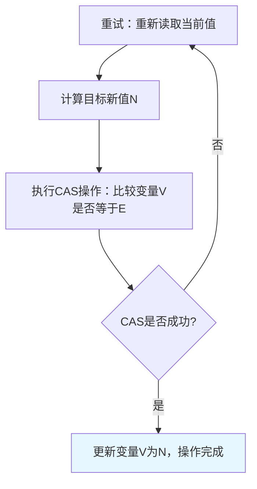
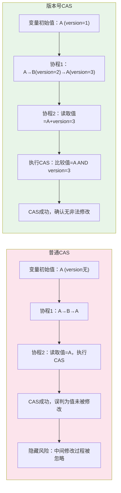
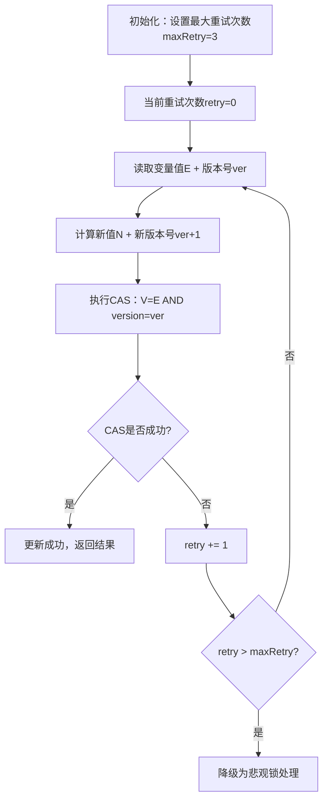
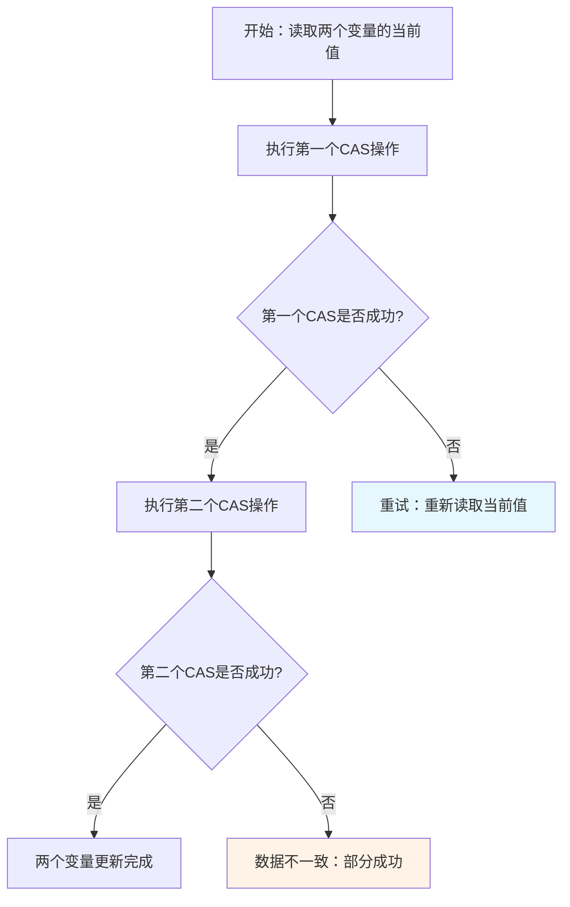

# 乐观锁

**乐观锁**是一种**非阻塞**的并发控制机制，核心思想是**假设多线程并发操作时不会发生冲突**，因此不会主动加锁，而是在**更新数据时检查数据是否被其他线程修改过**，若未被修改则更新成功，若已被修改则放弃更新或重试。

它适用于**读多写少**的场景，能有效减少锁竞争带来的性能开销，与悲观锁（假设冲突一定会发生，主动加锁阻塞其他线程）形成互补。

## 核心原理

乐观锁的实现依赖 **版本号机制** 或 **CAS（Compare-And-Swap）算法**，两者本质都是先检查、后更新。

### 版本号机制（数据库场景常用）

**核心思路**：为数据记录添加一个 `version` 版本号字段，每次更新时：
1. 读取数据时，同时读取当前版本号；
2. 更新数据时，对比当前版本号与读取时的版本号是否一致；
3. 若一致，说明数据未被修改，更新数据并将版本号 `+1`；
4. 若不一致，说明数据已被其他线程修改，更新失败。

**数据库 SQL 示例**
```sql
-- 1. 读取数据及版本号
SELECT id, value, version FROM product WHERE id = 1;

-- 2. 更新时检查版本号（假设读取的version=1）
UPDATE product 
SET value = 'new_value', version = version + 1 
WHERE id = 1 AND version = 1;

-- 3. 检查受影响的行数，若为0则更新失败（版本不匹配）
```

### CAS 算法（编程语言/内存场景常用）

**核心思路**：针对内存中的变量，操作时包含 3 个核心参数：
- `V`：要更新的变量（内存地址）；
- `E`：预期值（操作前读取的变量值）；
- `N`：新值（要写入的变量值）。

**执行逻辑**：
1. 比较变量当前值 `V` 是否等于预期值 `E`；
2. 若相等，将 `V` 设为 `N`，返回成功；
3. 若不相等，说明变量已被其他线程修改，返回失败，不做任何操作。

**关键特性**：CAS 是**原子操作**，由 CPU 指令级支持（如 `cmpxchg` 指令），能保证比较-交换的不可分割性，避免竞态条件。



## Go 语言中的乐观锁实现（基于 CAS）

Go 标准库的 `sync/atomic` 包提供了 CAS 相关的原子操作函数，是实现乐观锁的核心工具，常见函数如下：

| 函数签名 | 作用 |
|----------|------|
| `atomic.CompareAndSwapInt32(addr *int32, old, new int32) (swapped bool)` | 比较并交换 int32 类型变量 |
| `atomic.CompareAndSwapInt64(addr *int64, old, new int64) (swapped bool)` | 比较并交换 int64 类型变量 |
| `atomic.CompareAndSwapPointer(addr *unsafe.Pointer, old, new unsafe.Pointer) (swapped bool)` | 比较并交换指针类型变量 |

### Go 乐观锁示例（实现并发安全的计数器）

```go
package main

import (
    "fmt"
    "sync"
    "sync/atomic"
)

type OptimisticCounter struct {
    count int64
}

func (c *OptimisticCounter) Inc() {
    for {
        old := atomic.LoadInt64(&c.count)
        new := old + 1
        if atomic.CompareAndSwapInt64(&c.count, old, new) {
            return
        }
    }
}

func (c *OptimisticCounter) Get() int64 {
    return atomic.LoadInt64(&c.count)
}

func main() {
    var wg sync.WaitGroup
    counter := &OptimisticCounter{}

    wg.Add(1000)
    for i := 0; i < 1000; i++ {
        go func() {
            defer wg.Done()
            counter.Inc()
        }()
    }

    wg.Wait()
    fmt.Println("最终计数：", counter.Get())
}
```

## 乐观锁的优缺点

### 优点

1. **非阻塞**：不会阻塞其他线程的操作，减少线程上下文切换的开销，在**读多写少**场景下性能远高于悲观锁。
2. **无死锁风险**：乐观锁基于检查-重试机制，没有加锁/解锁的过程，不会出现死锁问题。
3. **适用于分布式场景**：版本号机制可天然适配分布式系统（如分布式数据库、分布式缓存），避免分布式锁的复杂性。

### 缺点

1. **重试开销**：在**写多读少**场景下，冲突概率高，会导致大量重试，反而降低性能。
2. **ABA 问题**：
   - **问题描述**：变量值从 `A` 被修改为 `B`，又被改回 `A`，此时 CAS 会认为值未被修改，但实际已发生两次变化。
   - **解决方案**：引入**版本号**或**时间戳**，不仅比较值，还比较版本号（如 `atomic` 包的 `Value` 类型底层结合了版本号）。
3. **只能保证单个变量的原子性**：CAS 仅能针对单个变量进行原子操作，若涉及多个变量的联动更新，无法直接使用乐观锁。



## 乐观锁 vs 悲观锁

| 特性 | 乐观锁 | 悲观锁 |
|------|--------|--------|
| **核心思想** | 假设无冲突，更新时检查 | 假设必有冲突，操作前加锁 |
| **实现方式** | 版本号、CAS 算法 | 互斥锁（如 `sync.Mutex`）、读写锁（如 `sync.RWMutex`） |
| **阻塞性** | 非阻塞，冲突时重试 | 阻塞，其他线程需等待锁释放 |
| **适用场景** | 读多写少，冲突概率低 | 写多读少，冲突概率高 |
| **开销** | 低（无锁竞争），冲突时重试开销 | 高（加锁、上下文切换） |
| **死锁风险** | 无 | 有（锁顺序不当可能导致死锁） |

## 最佳实践

### 场景匹配：读多写少才用乐观锁

**核心原则**：乐观锁的优势是非阻塞、低开销，但冲突时会重试，因此仅适用于**冲突概率低**的场景。
- ✅ 适用场景：商品库存查询、用户资料读取、排行榜数据更新（读多写少）；
- ❌ 不适用场景：高频下单、金融交易扣减（写多读少，冲突率高，重试开销大）。

**实践示例（Go 场景）**：
```go
type PageViewCounter struct {
    count int64
}

func (c *PageViewCounter) Add() {
    maxRetry := 3
    retry := 0
    for retry < maxRetry {
        old := atomic.LoadInt64(&c.count)
        new := old + 1
        if atomic.CompareAndSwapInt64(&c.count, old, new) {
            return
        }
        retry++
        time.Sleep(10 * time.Millisecond)
    }
    var mu sync.Mutex
    mu.Lock()
    c.count++
    mu.Unlock()
}
```

### 解决 ABA 问题：引入版本号/时间戳

**核心原则**：仅比较值的 CAS 会有 ABA 风险，需结合版本号/时间戳，让值+版本号成为唯一判断依据。

**数据库场景实践**：
```sql
CREATE TABLE product (
    id INT PRIMARY KEY,
    stock INT,
    version INT DEFAULT 0
);

UPDATE product 
SET stock = stock - 1, version = version + 1 
WHERE id = 1 AND stock >= 1 AND version = 5;
```

**Go 场景实践**：
```go
type SafeValue struct {
    value   int64
    version uint64
}

func (sv *SafeValue) Update(newValue int64) bool {
    for {
        oldValue := atomic.LoadInt64(&sv.value)
        oldVersion := atomic.LoadUint64(&sv.version)
        
        if atomic.CompareAndSwapUint64(&sv.version, oldVersion, oldVersion+1) {
            atomic.StoreInt64(&sv.value, newValue)
            return true
        }
    }
}
```

### 限制重试次数：避免无限循环

**核心原则**：乐观锁冲突时会重试，但不能无限重试（否则会耗尽 CPU 或导致请求超时），需设置最大重试次数，失败后降级处理。

**实践示例（数据库场景）**：
```go
func reduceStock(db *sql.DB, productID int, retryMax int) error {
    for retry := 0; retry < retryMax; retry++ {
        var stock, version int
        err := db.QueryRow("SELECT stock, version FROM product WHERE id = ?", productID).Scan(&stock, &version)
        if err != nil {
            return err
        }
        if stock <= 0 {
            return fmt.Errorf("库存不足")
        }

        res, err := db.Exec(
            "UPDATE product SET stock = stock - 1, version = version + 1 WHERE id = ? AND version = ?",
            productID, version,
        )
        if err != nil {
            return err
        }

        rowsAffected, _ := res.RowsAffected()
        if rowsAffected > 0 {
            return nil
        }

        time.Sleep(time.Millisecond * 50)
    }
    return fmt.Errorf("重试%d次后仍更新失败，建议稍后重试", retryMax)
}
```



### 数据库场景：仅在必要字段上加乐观锁

**核心原则**：乐观锁的 WHERE 条件仅包含主键+版本号（或待校验字段），避免多余条件导致更新失败。
- ✅ 正确：`WHERE id = 1 AND version = 5`（主键+版本号，精准匹配）；
- ❌ 错误：`WHERE name = "商品A" AND version = 5`（name 非主键，可能匹配多条，或被其他操作修改）。

### Go 场景：优先使用标准库原子操作

**核心原则**：避免手动实现 CAS 逻辑，直接使用 `sync/atomic` 包的原子函数（由 CPU 指令保证原子性），或 `sync.Map`（底层结合乐观锁和悲观锁）。

**实践示例（sync.Map 替代手动 CAS）**：
```go
func main() {
    var m sync.Map
    var wg sync.WaitGroup

    wg.Add(1000)
    for i := 0; i < 1000; i++ {
        go func() {
            defer wg.Done()
            if v, ok := m.Load("count"); ok {
                m.Store("count", v.(int)+1)
            } else {
                m.Store("count", 1)
            }
        }()
    }
    wg.Wait()
    fmt.Println(m.Load("count"))
}
```

## 常见错误场景

### 写多读少场景滥用乐观锁

**错误表现**：在高频写场景（如秒杀下单）使用乐观锁，导致大量重试，CPU 飙升、响应延迟。

**错误代码（Go CAS 示例）**：
```go
func seckill(counter *int64) {
    for {
        old := atomic.LoadInt64(counter)
        if old <= 0 {
            fmt.Println("库存不足")
            return
        }
        if atomic.CompareAndSwapInt64(counter, old, old-1) {
            fmt.Println("秒杀成功")
            return
        }
    }
}
```

**问题根源**：写多读少场景下，CAS 冲突率接近 100%，无限重试会耗尽 CPU 资源。

**修复方案**：改用悲观锁（如 `sync.Mutex`），或分布式锁（如 Redis 锁），减少重试开销。

### 忽略 ABA 问题

**错误表现**：仅比较值而不校验版本号，导致变量被多次修改后误判为未修改。

**错误代码（Go CAS 示例）**：
```go
func abaProblem() {
    var val int64 = 1

    go func() {
        atomic.CompareAndSwapInt64(&val, 1, 2)
        atomic.CompareAndSwapInt64(&val, 2, 1)
    }()

    time.Sleep(100 * time.Millisecond)

    old := atomic.LoadInt64(&val)
    if atomic.CompareAndSwapInt64(&val, old, 3) {
        fmt.Println("更新成功，但实际值已被修改过（ABA）")
    }
}
```

**问题根源**：CAS 仅比较值，无法感知值被修改后又改回的中间过程，可能导致业务逻辑错误（如资金转账、库存扣减）。

**修复方案**：引入版本号，比较值+版本号。

### 数据库乐观锁未校验主键

**错误表现**：更新语句的 WHERE 条件仅包含版本号，无主键，导致批量更新错误。

**错误 SQL**：
```sql
UPDATE product SET stock = stock - 1, version = 6 WHERE version = 5;
```

**问题根源**：版本号仅用于校验是否被修改，无主键会导致匹配多条记录，引发批量错误更新。

**修复方案**：WHERE 条件必须包含主键+版本号：
```sql
UPDATE product SET stock = stock - 1, version = 6 WHERE id = 1 AND version = 5;
```

### 无限重试导致请求超时/CPU 耗尽

**错误表现**：乐观锁重试无上限，冲突时一直循环，导致请求超时或服务 CPU 使用率 100%。

**错误代码（Go 示例）**：
```go
func infiniteRetry(counter *int64) {
    for {
        old := atomic.LoadInt64(&counter)
        new := old + 1
        if atomic.CompareAndSwapInt64(&counter, old, new) {
            return
        }
    }
}
```

**问题根源**：无限重试会让 goroutine 一直占用 CPU，高并发下导致服务不可用。

**修复方案**：设置最大重试次数+每次重试短暂休眠：
```go
func limitedRetry(counter *int64) {
    maxRetry := 5
    retry := 0
    for retry < maxRetry {
        old := atomic.LoadInt64(&counter)
        new := old + 1
        if atomic.CompareAndSwapInt64(&counter, old, new) {
            return
        }
        retry++
        time.Sleep(50 * time.Millisecond)
    }
    fmt.Println("重试失败，降级为悲观锁")
    var mu sync.Mutex
    mu.Lock()
    *counter++
    mu.Unlock()
}
```

### 多变量更新误用乐观锁

**错误表现**：试图用乐观锁（CAS）更新多个关联变量，导致数据不一致。

**错误代码（Go 示例）**：
```go
type Account struct {
    balance int64
    freeze  int64
}

func (a *Account) Freeze(amount int64) {
    for {
        oldBalance := atomic.LoadInt64(&a.balance)
        oldFreeze := atomic.LoadInt64(&a.freeze)
        if oldBalance < amount {
            return
        }
        if atomic.CompareAndSwapInt64(&a.balance, oldBalance, oldBalance-amount) {
            atomic.CompareAndSwapInt64(&a.freeze, oldFreeze, oldFreeze+amount)
            return
        }
    }
}
```

**问题根源**：CAS 仅能保证单个变量的原子操作，多个变量更新时可能出现部分成功，导致数据不一致。

**修复方案**：改用悲观锁（`sync.Mutex`）保证多变量更新的原子性：
```go
func (a *Account) Freeze(amount int64) {
    var mu sync.Mutex
    mu.Lock()
    defer mu.Unlock()
    if a.balance >= amount {
        a.balance -= amount
        a.freeze += amount
    }
}
```



## 总结

### 最佳实践核心

1. 仅在**读多写少**场景用乐观锁，写多读少用悲观锁；
2. 解决 ABA 问题：值+版本号/时间戳；
3. 限制重试次数+休眠，避免无限循环；
4. 数据库乐观锁必须加主键，Go 优先用标准库原子操作。

### 常见错误根源

1. 场景不匹配（写多读少用乐观锁）；
2. 忽略 ABA 问题、无限重试、多变量更新误用；
3. 数据库乐观锁未加主键，导致批量错误。

### 兜底方案

乐观锁重试失败时，降级为悲观锁，保证业务可用性。
