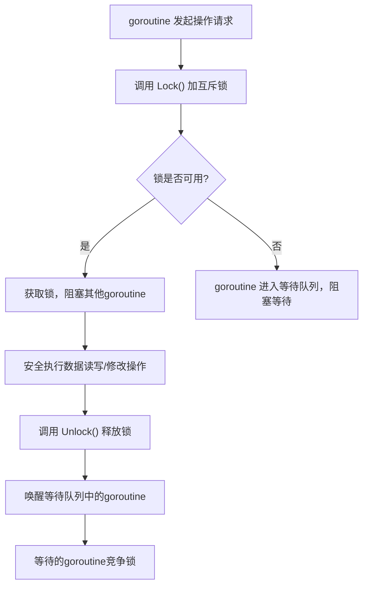
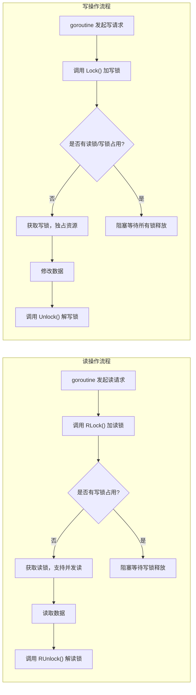
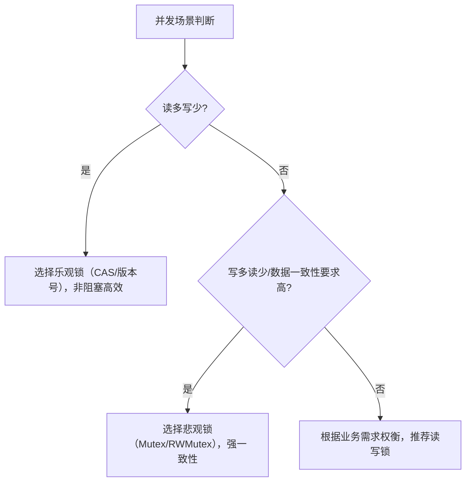

# 悲观锁

悲观锁是一种阻塞式的并发控制机制，核心思想是假设多线程并发操作一定会发生冲突，因此在操作数据前会主动加锁，阻塞其他线程对该数据的访问，直到当前线程操作完成并释放锁，以此保证数据的一致性。

它与乐观锁的先操作、后检查逻辑相反，适用于写多读少的场景（如高频交易、库存扣减），能有效避免大量重试带来的性能损耗。

## 核心原理

悲观锁的核心是加锁、操作、解锁的三步流程，锁的作用是保证同一时间只有一个线程能操作目标数据：

1. **加锁**：线程在访问数据前，获取对应的锁（如互斥锁、读写锁），此时其他线程会被阻塞，等待锁释放
2. **操作数据**：当前线程安全地读取、修改数据，期间不会被其他线程打断
3. **解锁**：线程操作完成后，主动释放锁，唤醒等待队列中的其他线程



根据应用场景，悲观锁可分为单机悲观锁和分布式悲观锁：

| 类型 | 适用场景 | 实现方式 |
|------|----------|----------|
| 单机悲观锁 | 单进程内多线程并发 | 编程语言内置锁（如 Go `sync.Mutex`、Java `synchronized`） |
| 分布式悲观锁 | 多进程/多服务器并发 | 第三方中间件（如 Redis 分布式锁、ZooKeeper 分布式锁） |

## Go 语言中的悲观锁实现（单机场景）

Go 标准库 `sync` 包提供了两种核心悲观锁：互斥锁（`sync.Mutex`）和读写锁（`sync.RWMutex`）。

### 互斥锁（`sync.Mutex`）

最基础的悲观锁，同一时间只允许一个线程加锁，适用于读写频率相当或写多读少的场景。

#### 核心方法

| 方法 | 作用 |
|------|------|
| `Lock()` | 加锁：如果锁已被占用，当前 goroutine 会阻塞，直到锁被释放 |
| `Unlock()` | 解锁：释放锁，唤醒等待的 goroutine |

#### 实战示例：并发安全的库存扣减

```go
package main

import (
    "fmt"
    "sync"
)

type Inventory struct {
    mu    sync.Mutex
    stock int
}

func (inv *Inventory) Deduct(num int) bool {
    inv.mu.Lock()
    defer inv.mu.Unlock()

    if inv.stock < num {
        return false
    }
    inv.stock -= num
    return true
}

func (inv *Inventory) GetStock() int {
    inv.mu.Lock()
    defer inv.mu.Unlock()
    return inv.stock
}

func main() {
    var wg sync.WaitGroup
    inv := &Inventory{stock: 100}

    wg.Add(50)
    for i := 0; i < 50; i++ {
        go func() {
            defer wg.Done()
            success := inv.Deduct(2)
            if !success {
                fmt.Println("库存不足，扣减失败")
            }
        }()
    }

    wg.Wait()
    fmt.Println("最终库存：", inv.GetStock())
}
```

### 读写锁（`sync.RWMutex`）

对互斥锁的优化，区分读锁和写锁，适用于读多写少的场景，能提升读操作的并发性能。

#### 核心特性

- **读锁共享**：多个 goroutine 可以同时获取读锁，互不阻塞
- **写锁独占**：只有一个 goroutine 能获取写锁，获取写锁时会阻塞所有读锁和写锁
- **读写互斥**：持有读锁时，无法获取写锁；持有写锁时，无法获取读锁



#### 核心方法

| 方法 | 作用 |
|------|------|
| `RLock()` | 加读锁 |
| `RUnlock()` | 解读锁 |
| `Lock()` | 加写锁 |
| `Unlock()` | 解写锁 |

#### 实战示例：高并发读场景优化

```go
package main

import (
    "fmt"
    "sync"
    "time"
)

type Cache struct {
    mu   sync.RWMutex
    data map[string]string
}

func (c *Cache) Get(key string) (string, bool) {
    c.mu.RLock()
    defer c.mu.RUnlock()
    val, ok := c.data[key]
    return val, ok
}

func (c *Cache) Set(key, val string) {
    c.mu.Lock()
    defer c.mu.Unlock()
    c.data[key] = val
}

func main() {
    var wg sync.WaitGroup
    cache := &Cache{data: make(map[string]string)}
    cache.Set("name", "golang")

    wg.Add(100)
    for i := 0; i < 100; i++ {
        go func() {
            defer wg.Done()
            val, ok := cache.Get("name")
            if ok {
                fmt.Printf("读取到：%s\n", val)
            }
        }()
    }

    wg.Add(1)
    go func() {
        defer wg.Done()
        time.Sleep(100 * time.Millisecond)
        cache.Set("name", "pessimistic lock")
        fmt.Println("更新缓存完成")
    }()

    wg.Wait()
}
```

## 分布式悲观锁（以 Redis 为例）

在微服务场景中，单机锁无法跨进程生效，需要使用分布式悲观锁。以 Redis 为例，核心是利用 `SETNX` 命令（不存在则设置）实现加锁，`DEL` 命令实现解锁。

### 核心逻辑

1. **加锁**：`SET key value NX PX expire_time`，其中 `NX` 表示 key 不存在时才设置，`PX` 表示设置过期时间（防止死锁）
2. **操作数据**：加锁成功后，执行业务逻辑
3. **解锁**：通过 Lua 脚本原子性删除 key（避免误删其他线程的锁）

### Go 示例（简化版 Redis 分布式锁）

```go
package main

import (
    "context"
    "fmt"
    "github.com/redis/go-redis/v9"
    "sync"
    "time"
)

var rdb = redis.NewClient(&redis.Options{
    Addr: "localhost:6379",
})
var ctx = context.Background()

type RedisLock struct {
    key    string
    value  string
    expire time.Duration
}

func (rl *RedisLock) Lock() bool {
    ok, err := rdb.SetNX(ctx, rl.key, rl.value, rl.expire).Result()
    if err != nil || !ok {
        return false
    }
    return true
}

func (rl *RedisLock) Unlock() bool {
    script := `if redis.call('get', KEYS[1]) == ARGV[1] then return redis.call('del', KEYS[1]) else return 0 end`
    res, err := rdb.Eval(ctx, script, []string{rl.key}, rl.value).Result()
    if err != nil {
        return false
    }
    return res.(int64) == 1
}

func main() {
    var wg sync.WaitGroup
    lock := &RedisLock{
        key:    "dist_lock",
        value:  "unique_value_123",
        expire: 5 * time.Second,
    }

    wg.Add(2)
    go func() {
        defer wg.Done()
        if lock.Lock() {
            defer lock.Unlock()
            fmt.Println("协程1获取锁，执行业务逻辑")
            time.Sleep(2 * time.Second)
        } else {
            fmt.Println("协程1获取锁失败")
        }
    }()

    go func() {
        defer wg.Done()
        time.Sleep(100 * time.Millisecond)
        if lock.Lock() {
            defer lock.Unlock()
            fmt.Println("协程2获取锁，执行业务逻辑")
        } else {
            fmt.Println("协程2获取锁失败")
        }
    }()

    wg.Wait()
}
```

## 悲观锁的优缺点

### 优点

1. **数据一致性强**：加锁后独占资源，完全避免了并发冲突，适合对数据一致性要求高的场景（如金融交易）
2. **无需重试**：操作前加锁，不会出现乐观锁的更新失败-重试循环，降低业务复杂度
3. **支持多变量操作**：可以保证多个变量的联动更新（如转账时的扣款+加款）的原子性

### 缺点

1. **性能开销大**：加锁、解锁会带来线程上下文切换的开销；阻塞等待会降低并发吞吐量
2. **死锁风险**：如果锁的顺序不当（如 A 等 B，B 等 A），或忘记解锁，会导致死锁
3. **分布式场景复杂**：分布式锁需要考虑过期时间、锁重入、脑裂等问题，实现成本高

## 悲观锁 vs 乐观锁 核心对比

| 特性 | 悲观锁 | 乐观锁 |
|------|--------|--------|
| 核心思想 | 假设冲突必然发生，主动加锁 | 假设冲突不会发生，更新时检查 |
| 实现方式 | 互斥锁、读写锁、分布式锁 | 版本号机制、CAS 算法 |
| 阻塞性 | 阻塞式，其他线程需等待 | 非阻塞式，冲突时重试 |
| 适用场景 | 写多读少、数据一致性要求高 | 读多写少、冲突概率低 |
| 性能开销 | 加锁/解锁、上下文切换开销 | 重试开销（冲突时） |
| 死锁风险 | 有（锁顺序不当） | 无 |



## 最佳实践

### 锁粒度最小化

只对需要保护的数据加锁，避免大锁导致并发性能下降。

```go
type OrderService struct {
    mu     sync.Mutex
    orders map[string]int
}

func (s *OrderService) AddOrder(orderID string, amount int) {
    if orderID == "" {
        return
    }

    s.mu.Lock()
    s.orders[orderID] = amount
    s.mu.Unlock()

    log.Printf("订单 %s 添加成功", orderID)
}
```

### 用 defer 保证解锁

加锁后立即用 `defer Unlock()`，确保函数无论正常退出还是 panic 都能释放锁。

```go
func (s *OrderService) GetOrder(orderID string) (int, bool) {
    s.mu.Lock()
    defer s.mu.Unlock()
    amount, ok := s.orders[orderID]
    return amount, ok
}
```

### 读写场景优先用 sync.RWMutex

读多写少场景下，RWMutex 比 Mutex 性能高 5~10 倍。

```go
type Cache struct {
    mu   sync.RWMutex
    data map[string]string
}

func (c *Cache) Get(key string) (string, bool) {
    c.mu.RLock()
    defer c.mu.RUnlock()
    val, ok := c.data[key]
    return val, ok
}

func (c *Cache) Set(key, val string) {
    c.mu.Lock()
    defer c.mu.Unlock()
    c.data[key] = val
}
```

### 分布式锁必须设置过期时间

避免服务宕机导致锁无法释放，引发跨服务死锁。

```go
func RedisLock(ctx context.Context, key, uniqueVal string, expire time.Duration) bool {
    return rdb.SetNX(ctx, key, uniqueVal, expire).Val()
}

func RedisUnlock(ctx context.Context, key, uniqueVal string) bool {
    script := `if redis.call('get', KEYS[1]) == ARGV[1] then return redis.call('del', KEYS[1]) else return 0 end`
    res, _ := rdb.Eval(ctx, script, []string{key}, uniqueVal).Result()
    return res.(int64) == 1
}
```

### 避免锁嵌套

尽量不要在持有一个锁的情况下获取另一个锁，如果必须嵌套，需保证所有 goroutine 加锁顺序一致。

```go
var (
    orderMu sync.Mutex
    stockMu sync.Mutex
)

func CreateOrder() {
    orderMu.Lock()
    defer orderMu.Unlock()

    stockMu.Lock()
    defer stockMu.Unlock()
}
```

### 高并发场景：锁分离/分段锁

对大型共享数据（如大 map），将其拆分为多个小数据块，每个块加独立的锁，减少锁竞争。

```go
const segmentCount = 8

type SegmentMap struct {
    segments [segmentCount]struct {
        mu sync.Mutex
        m  map[string]int
    }
}

func (sm *SegmentMap) Set(key string, val int) {
    idx := hash(key) % segmentCount
    seg := &sm.segments[idx]
    seg.mu.Lock()
    defer seg.mu.Unlock()
    seg.m[key] = val
}
```

## 常见错误场景

### 错误场景 1：锁粒度太大，阻塞无关逻辑

```go
func (s *OrderService) BadAddOrder(orderID string) {
    s.mu.Lock()
    defer s.mu.Unlock()

    resp, err := http.Get("https://xxx/check-stock")
    if err != nil {
        return
    }
    s.orders[orderID] = 100
}
```

**问题**：IO 操作可能耗时数百毫秒，期间锁一直被占用，其他 goroutine 全部阻塞，并发性能暴跌。

### 错误场景 2：忘记解锁或分支中遗漏解锁

```go
func (s *OrderService) BadGetOrder(orderID string) (int, bool) {
    s.mu.Lock()
    if orderID == "" {
        return 0, false
    }
    amount, ok := s.orders[orderID]
    s.mu.Unlock()
    return amount, ok
}
```

**问题**：当 `orderID == ""` 时，函数提前返回，锁未释放，其他 goroutine 永久阻塞。

### 错误场景 3：锁嵌套顺序不一致，导致死锁

```go
func Goroutine1() {
    orderMu.Lock()
    defer orderMu.Unlock()
    time.Sleep(time.Second)
    stockMu.Lock()
    defer stockMu.Unlock()
}

func Goroutine2() {
    stockMu.Lock()
    defer stockMu.Unlock()
    time.Sleep(time.Second)
    orderMu.Lock()
    defer orderMu.Unlock()
}
```

**问题**：两个 goroutine 互相持有对方需要的锁，陷入永久等待。

### 错误场景 4：分布式锁未设置过期时间

```go
func BadRedisLock(ctx context.Context, key string) bool {
    return rdb.SetNX(ctx, key, "val", 0).Val()
}
```

**问题**：如果服务加锁后宕机，锁永远不会释放。

### 错误场景 5：误用 RWMutex 高频写场景

```go
func HighFreqWrite() {
    var rwMu sync.RWMutex
    var count int

    var wg sync.WaitGroup
    wg.Add(1000)
    for i := 0; i < 1000; i++ {
        go func() {
            defer wg.Done()
            rwMu.Lock()
            count++
            rwMu.Unlock()
        }()
    }
    wg.Wait()
}
```

**问题**：高频写场景下，RWMutex 的写锁会频繁阻塞所有操作，性能比 Mutex 更差。

### 错误场景 6：拷贝已加锁的 sync.Mutex

```go
func CopyLock() {
    var mu sync.Mutex
    mu.Lock()
    mu2 := mu
    mu2.Unlock()
}
```

**问题**：sync.Mutex 是值类型，拷贝会复制其内部锁状态，导致副本的锁操作完全失效。